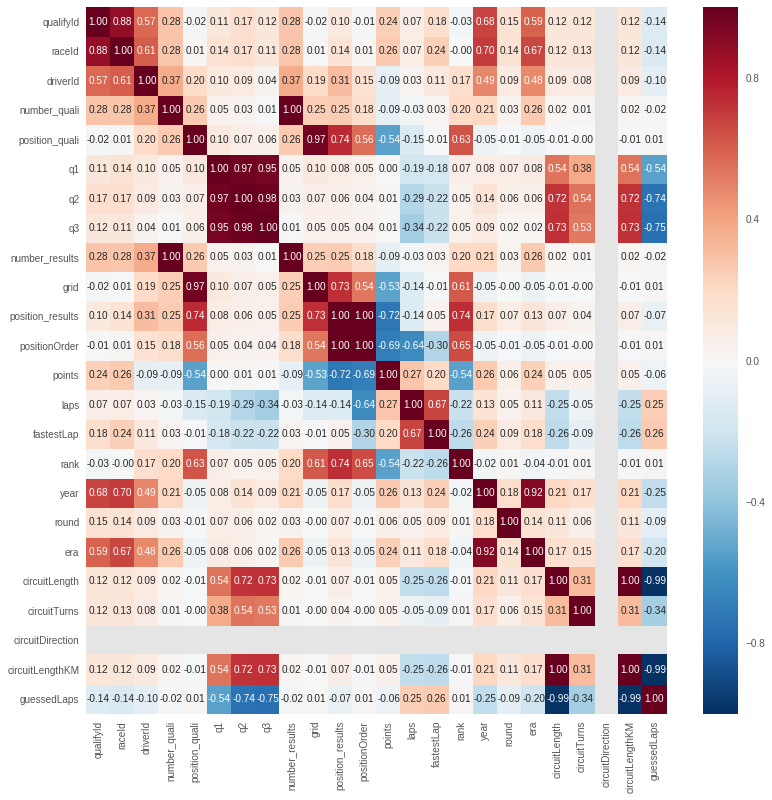

# TO-DO:

## Feature engineering:
### Race/Championship winners
1. race win count per driver plot
2. team wins per era
3. percentage of positions gained 
  a. 


Regression analysis:
1. Driver stats vs results (position)
2. Driver/team results vs circuit stats
3. 


### Qualification results

1. set times to milliseconds (This is hard. df.to_datetime converts to date included. But we only want the Time component.)
2. descriptive analysis on these results --> 3 descriptives each
2. found out how to rank --> predict every qualification round
3. features:
  1. Driver:
    1. driver age --> Done
    2. driver name
    3. driver years in formula 1 --> Ben
    4. qualification position for this circuit last season
    4. qualification time for this circuit last season
    5. Percentage difference in qualifying time from pole position * 100
    6. ending position last year
    7. DNF percentage
    8. starting position last year. 
  2. Circuit:
    1. turns 
    2. length 
    3. altitude
  3. Constructor:
    1. Name
    2. championship won 
    3. races won 
    4. average qualification position last time
  4. Other: 
    1. qualifying round


## Machine learning

* Build model that predicts positions 1-20 (ANN?)
*
*
*


## To do in Latex:
- plots and descriptive analysis after introduction to show the hhistory of the formula one
- plots after feature engineering with the experiment evaluation
- correlation matrix in the experiment evaluation. 
- explanation of the research question --> qualification results are known plus answers of subquestions.
- elaboration of the problem definition

# Data explanation
## Race Results
The value of the position attribute in the Result element is always an integer, giving the finishing order of all drivers. The value of the positionText attribute is either an integer (finishing position), “R” (retired), “D” (disqualified), “E” (excluded), “W” (withdrawn), “F” (failed to qualify) or “N” (not classified). Further information is given by the status element. A grid position value of ‘0’ indicates the driver started from the pit lane.


```python
!pip install --upgrade -q gspread
!pip install -U -q PyDrive
```


```python
import numpy as np #numpy
import pandas as pd #pandas
import re as re #regex

import math
import time
import datetime
from datetime import timedelta

import seaborn as sns

import matplotlib.pyplot as plt
import matplotlib
matplotlib.style.use('ggplot') #use style

from sklearn.tree import DecisionTreeRegressor
from sklearn.linear_model import LinearRegression, Lasso
from sklearn.linear_model import Ridge
from sklearn.model_selection import cross_val_score

# Using Spreadsheets from Google
from google.colab import auth
auth.authenticate_user()

import gspread
from oauth2client.client import GoogleCredentials

gc = gspread.authorize(GoogleCredentials.get_application_default())
```

# Data import


```python
USENEWDATA = True
from pydrive.auth import GoogleAuth
from pydrive.drive import GoogleDrive
from oauth2client.client import GoogleCredentials

gauth = GoogleAuth()
gauth.credentials = GoogleCredentials.get_application_default()
drive = GoogleDrive(gauth)
import sys
if sys.version_info[0] < 3: 
    from StringIO import StringIO
else:
    from io import StringIO

file_list = drive.ListFile({'q': "'1R_mO-WkW0yubFayXpU7dKFOP-Y8b5Trm' in parents and trashed=false"}).GetList()
for item in range(0,len(file_list)):
  print("Item {} is {} with id: {}".format(item,file_list[item].get('title'),file_list[item].get('id')))
print(USENEWDATA)
```

    Item 0 is status.csv with id: 1hP3dIVOLbQODXqGNk1KJMVcq8_emKGF0
    Item 1 is qualifying.csv with id: 1rfOJW_Xm52-7FdRByMo8qjn-peDyzso5
    Item 2 is races.csv with id: 1veE0hw1SjIrcCELO7n5p-bjkAPzBmjtY
    Item 3 is driver_standings.csv with id: 1-Nc_9J-nPzrLU1WMbfnZq1Bs4RPsV8yc
    Item 4 is driver.csv with id: 1BNNGxhQE8jyC-1-NmJ63iO5uI9UgDi6x
    Item 5 is seasons.csv with id: 1CNDq774Z6ob86IArk9YM5IBGPom7KzPE
    Item 6 is pit_stops.csv with id: 1Oa0ylyHKbBWfG7Z44Yu0BturyeystMMF
    Item 7 is constructor_standings.csv with id: 1u_O0h2K7_OWi_o9J0mmR0WH8fXDYXxUa
    Item 8 is results.csv with id: 1YYeqyF-D3rDiHlwG3wqabvu0SKlm6dEV
    Item 9 is lap_times.csv with id: 1moGNkEU9mPaoN5UqwYmmz2XE_lZYgOwy
    Item 10 is constructor_results.csv with id: 1YbquZhagomMKUrt0foGsfvBSKlaRbxmd
    Item 11 is constructors.csv with id: 1-zcKIFF7c_vwXWn4ZB-SAEmTwCGfWwOT
    Item 12 is circuits.csv with id: 13Q3cW6k8DP7o6fFcr3pad5AlhSDt8aCQ
    True


```python
try:
  del races
except:
  print('no races')
# Open our new sheet and read some data.
worksheet = gc.open('races.csv').sheet1
# get_all_values gives a list of rows.
rows = worksheet.get_all_values()
# Convert to a DataFrame and render.
races = pd.DataFrame.from_records(rows[1:], columns=rows[0])
# below we add new data to the old data
newraces = pd.read_csv(StringIO(drive.CreateFile({'id': file_list[2].get('id')}).GetContentString()), sep=",", header=None)
newraces.columns = rows[0]
newraces = newraces[~newraces.isin(races)].dropna()
# newraces = newraces.loc[newraces['year'] >= 2018]
if(USENEWDATA):                                  
  races = pd.concat([races,newraces]).drop_duplicates()
print("New data used: ",USENEWDATA)
races[['raceId','year','round','circuitId']] = races[['raceId','year','round','circuitId']].apply(pd.to_numeric)
# races = races.set_index('raceId')
print(list(races))
races['datetime'] = races[['date', 'time']].apply(lambda x: ''.join(" " + x), axis=1)
races['datetime'] = races['datetime'].apply(pd.to_datetime)

races.sort_values('year', ascending=False).head(50) #showing that it works.
# print("")
```

    New data used:  True
    ['raceId', 'year', 'round', 'circuitId', 'name', 'date', 'time', 'url']


<div>
<style scoped>
    .dataframe tbody tr th:only-of-type {
        vertical-align: middle;
    }

    .dataframe tbody tr th {
        vertical-align: top;
    }

    .dataframe thead th {
        text-align: right;
    }
</style>
<table border="1" class="dataframe">
  <thead>
    <tr style="text-align: right;">
      <th></th>
      <th>raceId</th>
      <th>year</th>
      <th>round</th>
      <th>circuitId</th>
      <th>name</th>
      <th>date</th>
      <th>time</th>
      <th>url</th>
      <th>datetime</th>
    </tr>
  </thead>
  <tbody>
    <tr>
      <th>996</th>
      <td>1009</td>
      <td>2018</td>
      <td>21</td>
      <td>24</td>
      <td>Abu Dhabi Grand Prix</td>
      <td>2018-11-25</td>
      <td>13:00:00</td>
      <td>http://en.wikipedia.org/wiki/2018_Abu_Dhabi_Gr...</td>
      <td>2018-11-25 13:00:00</td>
    </tr>
    <tr>
      <th>986</th>
      <td>999</td>
      <td>2018</td>
      <td>11</td>
      <td>10</td>
      <td>German Grand Prix</td>
      <td>2018-07-22</td>
      <td>12:00:00</td>
      <td>http://en.wikipedia.org/wiki/2018_German_Grand...</td>
      <td>2018-07-22 12:00:00</td>
    </tr>
    <tr>
      <th>976</th>
      <td>989</td>
      <td>2018</td>
      <td>1</td>
      <td>1</td>
      <td>Australian Grand Prix</td>
      <td>2018-03-25</td>
      <td>5:00:00</td>
      <td>http://en.wikipedia.org/wiki/2018_Australian_G...</td>
      <td>2018-03-25 05:00:00</td>
    </tr>
    <tr>
      <th>977</th>
      <td>990</td>
      <td>2018</td>
      <td>2</td>
      <td>3</td>
      <td>Bahrain Grand Prix</td>
      <td>2018-04-08</td>
      <td>15:00:00</td>
      <td>http://en.wikipedia.org/wiki/2018_Bahrain_Gran...</td>
      <td>2018-04-08 15:00:00</td>
    </tr>
    <tr>
      <th>978</th>
      <td>991</td>
      <td>2018</td>
      <td>3</td>
      <td>17</td>
      <td>Chinese Grand Prix</td>
      <td>2018-05-15</td>
      <td>6:00:00</td>
      <td>http://en.wikipedia.org/wiki/2018_Chinese_Gran...</td>
      <td>2018-05-15 06:00:00</td>
    </tr>
    <tr>
      <th>979</th>
      <td>992</td>
      <td>2018</td>
      <td>4</td>
      <td>73</td>
      <td>Azerbaijan Grand Prix</td>
      <td>2018-04-29</td>
      <td>13:00:00</td>
      <td>http://en.wikipedia.org/wiki/2018_Azerbaijan_G...</td>
      <td>2018-04-29 13:00:00</td>
    </tr>
    <tr>
      <th>980</th>
      <td>993</td>
      <td>2018</td>
      <td>5</td>
      <td>4</td>
      <td>Spanish Grand Prix</td>
      <td>2018-05-13</td>
      <td>12:00:00</td>
      <td>http://en.wikipedia.org/wiki/2018_Spanish_Gran...</td>
      <td>2018-05-13 12:00:00</td>
    </tr>
    <tr>
      <th>981</th>
      <td>994</td>
      <td>2018</td>
      <td>6</td>
      <td>6</td>
      <td>Monaco Grand Prix</td>
      <td>2018-05-27</td>
      <td>12:00:00</td>
      <td>http://en.wikipedia.org/wiki/2018_Monaco_Grand...</td>
      <td>2018-05-27 12:00:00</td>
    </tr>
    <tr>
      <th>983</th>
      <td>996</td>
      <td>2018</td>
      <td>8</td>
      <td>34</td>
      <td>French Grand Prix</td>
      <td>2018-06-24</td>
      <td>12:00:00</td>
      <td>http://en.wikipedia.org/wiki/2018_French_Grand...</td>
      <td>2018-06-24 12:00:00</td>
    </tr>
    <tr>
      <th>984</th>
      <td>997</td>
      <td>2018</td>
      <td>9</td>
      <td>70</td>
      <td>Austrian Grand Prix</td>
      <td>2018-07-01</td>
      <td>12:00:00</td>
      <td>http://en.wikipedia.org/wiki/2018_Austrian_Gra...</td>
      <td>2018-07-01 12:00:00</td>
    </tr>
    <tr>
      <th>985</th>
      <td>998</td>
      <td>2018</td>
      <td>10</td>
      <td>9</td>
      <td>British Grand Prix</td>
      <td>2018-07-08</td>
      <td>12:00:00</td>
      <td>http://en.wikipedia.org/wiki/2018_British_Gran...</td>
      <td>2018-07-08 12:00:00</td>
    </tr>
    <tr>
      <th>982</th>
      <td>995</td>
      <td>2018</td>
      <td>7</td>
      <td>7</td>
      <td>Canadian Grand Prix</td>
      <td>2018-06-10</td>
      <td>18:00:00</td>
      <td>http://en.wikipedia.org/wiki/2018_Canadian_Gra...</td>
      <td>2018-06-10 18:00:00</td>
    </tr>
    <tr>
      <th>987</th>
      <td>1000</td>
      <td>2018</td>
      <td>12</td>
      <td>11</td>
      <td>Hungarian Grand Prix</td>
      <td>2018-07-29</td>
      <td>12:00:00</td>
      <td>http://en.wikipedia.org/wiki/2018_Hungarian_Gr...</td>
      <td>2018-07-29 12:00:00</td>
    </tr>
    <tr>
      <th>992</th>
      <td>1005</td>
      <td>2018</td>
      <td>17</td>
      <td>22</td>
      <td>Japanese Grand Prix</td>
      <td>2018-10-07</td>
      <td>5:00:00</td>
      <td>http://en.wikipedia.org/wiki/2018_Japanese_Gra...</td>
      <td>2018-10-07 05:00:00</td>
    </tr>
    <tr>
      <th>988</th>
      <td>1001</td>
      <td>2018</td>
      <td>13</td>
      <td>13</td>
      <td>Belgian Grand Prix</td>
      <td>2018-08-26</td>
      <td>12:00:00</td>
      <td>http://en.wikipedia.org/wiki/2018_Belgian_Gran...</td>
      <td>2018-08-26 12:00:00</td>
    </tr>
    <tr>
      <th>994</th>
      <td>1007</td>
      <td>2018</td>
      <td>19</td>
      <td>32</td>
      <td>Mexican Grand Prix</td>
      <td>2018-10-28</td>
      <td>19:00:00</td>
      <td>http://en.wikipedia.org/wiki/2018_Mexican_Gran...</td>
      <td>2018-10-28 19:00:00</td>
    </tr>
    <tr>
      <th>993</th>
      <td>1006</td>
      <td>2018</td>
      <td>18</td>
      <td>69</td>
      <td>United States Grand Prix</td>
      <td>2018-10-21</td>
      <td>19:00:00</td>
      <td>http://en.wikipedia.org/wiki/2018_United_State...</td>
      <td>2018-10-21 19:00:00</td>
    </tr>
    <tr>
      <th>995</th>
      <td>1008</td>
      <td>2018</td>
      <td>20</td>
      <td>18</td>
      <td>Brazilian Grand Prix</td>
      <td>2018-11-11</td>
      <td>16:00:00</td>
      <td>http://en.wikipedia.org/wiki/2018_Brazilian_Gr...</td>
      <td>2018-11-11 16:00:00</td>
    </tr>
    <tr>
      <th>991</th>
      <td>1004</td>
      <td>2018</td>
      <td>16</td>
      <td>71</td>
      <td>Russian Grand Prix</td>
      <td>2018-09-30</td>
      <td>12:00:00</td>
      <td>http://en.wikipedia.org/wiki/2018_Russian_Gran...</td>
      <td>2018-09-30 12:00:00</td>
    </tr>
    <tr>
      <th>990</th>
      <td>1003</td>
      <td>2018</td>
      <td>15</td>
      <td>15</td>
      <td>Singapore Grand Prix</td>
      <td>2018-09-16</td>
      <td>12:00:00</td>
      <td>http://en.wikipedia.org/wiki/2018_Singapore_Gr...</td>
      <td>2018-09-16 12:00:00</td>
    </tr>
    <tr>
      <th>989</th>
      <td>1002</td>
      <td>2018</td>
      <td>14</td>
      <td>14</td>
      <td>Italian Grand Prix</td>
      <td>2018-09-02</td>
      <td>12:00:00</td>
      <td>http://en.wikipedia.org/wiki/2018_Italian_Gran...</td>
      <td>2018-09-02 12:00:00</td>
    </tr>
    <tr>
      <th>965</th>
      <td>978</td>
      <td>2017</td>
      <td>10</td>
      <td>9</td>
      <td>British Grand Prix</td>
      <td>2017-07-16</td>
      <td>12:00:00</td>
      <td>https://en.wikipedia.org/wiki/2017_British_Gra...</td>
      <td>2017-07-16 12:00:00</td>
    </tr>
    <tr>
      <th>956</th>
      <td>969</td>
      <td>2017</td>
      <td>1</td>
      <td>1</td>
      <td>Australian Grand Prix</td>
      <td>2017-03-26</td>
      <td>5:00:00</td>
      <td>https://en.wikipedia.org/wiki/2017_Australian_...</td>
      <td>2017-03-26 05:00:00</td>
    </tr>
    <tr>
      <th>957</th>
      <td>970</td>
      <td>2017</td>
      <td>2</td>
      <td>17</td>
      <td>Chinese Grand Prix</td>
      <td>2017-04-09</td>
      <td>6:00:00</td>
      <td>https://en.wikipedia.org/wiki/2017_Chinese_Gra...</td>
      <td>2017-04-09 06:00:00</td>
    </tr>
    <tr>
      <th>958</th>
      <td>971</td>
      <td>2017</td>
      <td>3</td>
      <td>3</td>
      <td>Bahrain Grand Prix</td>
      <td>2017-04-16</td>
      <td>15:00:00</td>
      <td>https://en.wikipedia.org/wiki/2017_Bahrain_Gra...</td>
      <td>2017-04-16 15:00:00</td>
    </tr>
    <tr>
      <th>959</th>
      <td>972</td>
      <td>2017</td>
      <td>4</td>
      <td>71</td>
      <td>Russian Grand Prix</td>
      <td>2017-04-30</td>
      <td>12:00:00</td>
      <td>https://en.wikipedia.org/wiki/2017_Russian_Gra...</td>
      <td>2017-04-30 12:00:00</td>
    </tr>
    <tr>
      <th>960</th>
      <td>973</td>
      <td>2017</td>
      <td>5</td>
      <td>4</td>
      <td>Spanish Grand Prix</td>
      <td>2017-05-14</td>
      <td>12:00:00</td>
      <td>https://en.wikipedia.org/wiki/2017_Spanish_Gra...</td>
      <td>2017-05-14 12:00:00</td>
    </tr>
    <tr>
      <th>961</th>
      <td>974</td>
      <td>2017</td>
      <td>6</td>
      <td>6</td>
      <td>Monaco Grand Prix</td>
      <td>2017-05-28</td>
      <td>12:00:00</td>
      <td>https://en.wikipedia.org/wiki/2017_Monaco_Gran...</td>
      <td>2017-05-28 12:00:00</td>
    </tr>
    <tr>
      <th>962</th>
      <td>975</td>
      <td>2017</td>
      <td>7</td>
      <td>7</td>
      <td>Canadian Grand Prix</td>
      <td>2017-06-11</td>
      <td>18:00:00</td>
      <td>https://en.wikipedia.org/wiki/2017_Canadian_Gr...</td>
      <td>2017-06-11 18:00:00</td>
    </tr>
    <tr>
      <th>963</th>
      <td>976</td>
      <td>2017</td>
      <td>8</td>
      <td>73</td>
      <td>Azerbaijan Grand Prix</td>
      <td>2017-06-25</td>
      <td>13:00:00</td>
      <td>https://en.wikipedia.org/wiki/2017_Azerbaijan_...</td>
      <td>2017-06-25 13:00:00</td>
    </tr>
    <tr>
      <th>964</th>
      <td>977</td>
      <td>2017</td>
      <td>9</td>
      <td>70</td>
      <td>Austrian Grand Prix</td>
      <td>2017-07-09</td>
      <td>12:00:00</td>
      <td>https://en.wikipedia.org/wiki/2017_Austrian_Gr...</td>
      <td>2017-07-09 12:00:00</td>
    </tr>
    <tr>
      <th>971</th>
      <td>984</td>
      <td>2017</td>
      <td>16</td>
      <td>22</td>
      <td>Japanese Grand Prix</td>
      <td>2017-10-08</td>
      <td>5:00:00</td>
      <td>https://en.wikipedia.org/wiki/2017_Japanese_Gr...</td>
      <td>2017-10-08 05:00:00</td>
    </tr>
    <tr>
      <th>966</th>
      <td>979</td>
      <td>2017</td>
      <td>11</td>
      <td>11</td>
      <td>Hungarian Grand Prix</td>
      <td>2017-07-30</td>
      <td>12:00:00</td>
      <td>https://en.wikipedia.org/wiki/2017_Hungarian_G...</td>
      <td>2017-07-30 12:00:00</td>
    </tr>
    <tr>
      <th>968</th>
      <td>981</td>
      <td>2017</td>
      <td>13</td>
      <td>14</td>
      <td>Italian Grand Prix</td>
      <td>2017-09-03</td>
      <td>12:00:00</td>
      <td>https://en.wikipedia.org/wiki/2017_Italian_Gra...</td>
      <td>2017-09-03 12:00:00</td>
    </tr>
    <tr>
      <th>969</th>
      <td>982</td>
      <td>2017</td>
      <td>14</td>
      <td>15</td>
      <td>Singapore Grand Prix</td>
      <td>2017-09-17</td>
      <td>12:00:00</td>
      <td>https://en.wikipedia.org/wiki/2017_Singapore_G...</td>
      <td>2017-09-17 12:00:00</td>
    </tr>
    <tr>
      <th>970</th>
      <td>983</td>
      <td>2017</td>
      <td>15</td>
      <td>2</td>
      <td>Malaysian Grand Prix</td>
      <td>2017-10-01</td>
      <td>7:00:00</td>
      <td>https://en.wikipedia.org/wiki/2017_Malaysian_G...</td>
      <td>2017-10-01 07:00:00</td>
    </tr>
    <tr>
      <th>972</th>
      <td>985</td>
      <td>2017</td>
      <td>17</td>
      <td>69</td>
      <td>United States Grand Prix</td>
      <td>2017-10-22</td>
      <td>19:00:00</td>
      <td>https://en.wikipedia.org/wiki/2017_United_Stat...</td>
      <td>2017-10-22 19:00:00</td>
    </tr>
    <tr>
      <th>973</th>
      <td>986</td>
      <td>2017</td>
      <td>18</td>
      <td>32</td>
      <td>Mexican Grand Prix</td>
      <td>2017-10-29</td>
      <td>19:00:00</td>
      <td>https://en.wikipedia.org/wiki/2017_Mexican_Gra...</td>
      <td>2017-10-29 19:00:00</td>
    </tr>
    <tr>
      <th>974</th>
      <td>987</td>
      <td>2017</td>
      <td>19</td>
      <td>18</td>
      <td>Brazilian Grand Prix</td>
      <td>2017-11-12</td>
      <td>16:00:00</td>
      <td>https://en.wikipedia.org/wiki/2017_Brazilian_G...</td>
      <td>2017-11-12 16:00:00</td>
    </tr>
    <tr>
      <th>975</th>
      <td>988</td>
      <td>2017</td>
      <td>20</td>
      <td>24</td>
      <td>Abu Dhabi Grand Prix</td>
      <td>2017-11-26</td>
      <td>13:00:00</td>
      <td>https://en.wikipedia.org/wiki/2017_Abu_Dhabi_G...</td>
      <td>2017-11-26 13:00:00</td>
    </tr>
    <tr>
      <th>967</th>
      <td>980</td>
      <td>2017</td>
      <td>12</td>
      <td>13</td>
      <td>Belgian Grand Prix</td>
      <td>2017-08-27</td>
      <td>12:00:00</td>
      <td>https://en.wikipedia.org/wiki/2017_Belgian_Gra...</td>
      <td>2017-08-27 12:00:00</td>
    </tr>
    <tr>
      <th>939</th>
      <td>952</td>
      <td>2016</td>
      <td>5</td>
      <td>4</td>
      <td>Spanish Grand Prix</td>
      <td>2016-05-15</td>
      <td>12:00:00</td>
      <td>https://en.wikipedia.org/wiki/2016_Spanish_Gra...</td>
      <td>2016-05-15 12:00:00</td>
    </tr>
    <tr>
      <th>943</th>
      <td>956</td>
      <td>2016</td>
      <td>9</td>
      <td>70</td>
      <td>Austrian Grand Prix</td>
      <td>2016-07-03</td>
      <td>12:00:00</td>
      <td>https://en.wikipedia.org/wiki/2016_Austrian_Gr...</td>
      <td>2016-07-03 12:00:00</td>
    </tr>
    <tr>
      <th>942</th>
      <td>955</td>
      <td>2016</td>
      <td>8</td>
      <td>73</td>
      <td>European Grand Prix</td>
      <td>2016-06-19</td>
      <td>13:00:00</td>
      <td>https://en.wikipedia.org/wiki/2016_European_Gr...</td>
      <td>2016-06-19 13:00:00</td>
    </tr>
    <tr>
      <th>941</th>
      <td>954</td>
      <td>2016</td>
      <td>7</td>
      <td>7</td>
      <td>Canadian Grand Prix</td>
      <td>2016-06-12</td>
      <td>18:00:00</td>
      <td>https://en.wikipedia.org/wiki/2016_Canadian_Gr...</td>
      <td>2016-06-12 18:00:00</td>
    </tr>
    <tr>
      <th>940</th>
      <td>953</td>
      <td>2016</td>
      <td>6</td>
      <td>6</td>
      <td>Monaco Grand Prix</td>
      <td>2016-05-29</td>
      <td>12:00:00</td>
      <td>https://en.wikipedia.org/wiki/2016_Monaco_Gran...</td>
      <td>2016-05-29 12:00:00</td>
    </tr>
    <tr>
      <th>935</th>
      <td>948</td>
      <td>2016</td>
      <td>1</td>
      <td>1</td>
      <td>Australian Grand Prix</td>
      <td>2016-03-20</td>
      <td>5:00:00</td>
      <td>https://en.wikipedia.org/wiki/2016_Australian_...</td>
      <td>2016-03-20 05:00:00</td>
    </tr>
    <tr>
      <th>938</th>
      <td>951</td>
      <td>2016</td>
      <td>4</td>
      <td>71</td>
      <td>Russian Grand Prix</td>
      <td>2016-05-01</td>
      <td>12:00:00</td>
      <td>https://en.wikipedia.org/wiki/2016_Russian_Gra...</td>
      <td>2016-05-01 12:00:00</td>
    </tr>
    <tr>
      <th>937</th>
      <td>950</td>
      <td>2016</td>
      <td>3</td>
      <td>17</td>
      <td>Chinese Grand Prix</td>
      <td>2016-04-17</td>
      <td>6:00:00</td>
      <td>https://en.wikipedia.org/wiki/2016_Chinese_Gra...</td>
      <td>2016-04-17 06:00:00</td>
    </tr>
    <tr>
      <th>936</th>
      <td>949</td>
      <td>2016</td>
      <td>2</td>
      <td>3</td>
      <td>Bahrain Grand Prix</td>
      <td>2016-04-03</td>
      <td>15:00:00</td>
      <td>https://en.wikipedia.org/wiki/2016_Bahrain_Gra...</td>
      <td>2016-04-03 15:00:00</td>
    </tr>
  </tbody>
</table>
</div>


```python
hour_0 = datetime.time(0,0)
hour_6 = datetime.time(6,0)
hour_12 = datetime.time(12,0)
hour_18 = datetime.time(18,0)


def convert_time_race(time):
  time = time.time()
  if time >= hour_0 and time < hour_6:
    return 'night'
  elif time >= hour_6 and time < hour_12:
    return 'morning'
  elif time >= hour_12 and time < hour_18:
    return 'afternoon'
  elif time >= hour_18:
    return 'evening'


races['time'] = races.apply(lambda row: convert_time_race(row['datetime']), axis=1)

races.head()
```


<div>
<style scoped>
    .dataframe tbody tr th:only-of-type {
        vertical-align: middle;
    }

    .dataframe tbody tr th {
        vertical-align: top;
    }

    .dataframe thead th {
        text-align: right;
    }
</style>
<table border="1" class="dataframe">
  <thead>
    <tr style="text-align: right;">
      <th></th>
      <th>raceId</th>
      <th>year</th>
      <th>round</th>
      <th>circuitId</th>
      <th>name</th>
      <th>date</th>
      <th>time</th>
      <th>url</th>
      <th>datetime</th>
    </tr>
  </thead>
  <tbody>
    <tr>
      <th>0</th>
      <td>1</td>
      <td>2009</td>
      <td>1</td>
      <td>1</td>
      <td>Australian Grand Prix</td>
      <td>2009-03-29</td>
      <td>morning</td>
      <td>http://en.wikipedia.org/wiki/2009_Australian_G...</td>
      <td>2009-03-29 06:00:00</td>
    </tr>
    <tr>
      <th>1</th>
      <td>2</td>
      <td>2009</td>
      <td>2</td>
      <td>2</td>
      <td>Malaysian Grand Prix</td>
      <td>2009-04-05</td>
      <td>morning</td>
      <td>http://en.wikipedia.org/wiki/2009_Malaysian_Gr...</td>
      <td>2009-04-05 09:00:00</td>
    </tr>
    <tr>
      <th>2</th>
      <td>3</td>
      <td>2009</td>
      <td>3</td>
      <td>17</td>
      <td>Chinese Grand Prix</td>
      <td>2009-04-19</td>
      <td>morning</td>
      <td>http://en.wikipedia.org/wiki/2009_Chinese_Gran...</td>
      <td>2009-04-19 07:00:00</td>
    </tr>
    <tr>
      <th>3</th>
      <td>4</td>
      <td>2009</td>
      <td>4</td>
      <td>3</td>
      <td>Bahrain Grand Prix</td>
      <td>2009-04-26</td>
      <td>afternoon</td>
      <td>http://en.wikipedia.org/wiki/2009_Bahrain_Gran...</td>
      <td>2009-04-26 12:00:00</td>
    </tr>
    <tr>
      <th>4</th>
      <td>5</td>
      <td>2009</td>
      <td>5</td>
      <td>4</td>
      <td>Spanish Grand Prix</td>
      <td>2009-05-10</td>
      <td>afternoon</td>
      <td>http://en.wikipedia.org/wiki/2009_Spanish_Gran...</td>
      <td>2009-05-10 12:00:00</td>
    </tr>
  </tbody>
</table>
</div>


```python
# 1947–1953
# 1954–1960
# 1961–1965
# 1966–1986
# 1987–1988
# 1989–1994
# 1995–2005
# 2006–2013
# 2014–present

def getEra(x):
  eras = [1947,1953,1954,1960,1961,1965,1966,1986,1987,1988,1989,1994,1995,2005,2006,2013,2014,2020]
  newEra = 0
  if x >= eras[0] and x <= eras[1]:
    newEra = 1 # 1947–1953
  elif x >= eras[2] and x <= eras[3]:
    newEra = 2 # 1954–1960
  elif x >= eras[4] and x <= eras[5]:
    newEra = 3 # 1961–1965
  elif x >= eras[6] and x <= eras[7]:
    newEra = 4 # 1966–1986
  elif x >= eras[8] and x <= eras[9]:
    newEra = 5 # 1987–1988
  elif x >= eras[10] and x <= eras[11]:
    newEra = 6 # 1989–1994
  elif x >= eras[12] and x <= eras[13]:
    newEra = 7 # 1995–2005
  elif x >= eras[14] and x <= eras[15]:
    newEra = 8 # 2006–2013
  elif x >= eras[16] and x <= eras[17]:
    newEra = 9 # 2014–present
  return newEra
    
races['era'] = races.apply(lambda row: getEra(row['year']), axis=1)
#races.sort_values('year', ascending=False).head(20)
```

Circuit Data


```python
# CircuitData
# Open our new sheet and read some data.
worksheet = gc.open('circuitData').sheet1
# get_all_values gives a list of rows.
rows = worksheet.get_all_values()
# Convert to a DataFrame and render.
circuitData = pd.DataFrame.from_records(rows[1:], columns=rows[0])
circuitData[['circuitId','circuitLength','circuitTurns','circuitLengthKM','guessedLaps']] = circuitData[['circuitId','circuitLength','circuitTurns','circuitLengthKM','guessedLaps']].apply(pd.to_numeric)
# circuitData = circuitData.set_index('circuitId')

circuitData['circuitDirection'] = circuitData['circuitDirection'].map(lambda x: 1 if 'Clockwise' else 0 )

circuitData.head() #showing that it works.
# circuitData.describe()
#print("")
```


<div>
<style scoped>
    .dataframe tbody tr th:only-of-type {
        vertical-align: middle;
    }

    .dataframe tbody tr th {
        vertical-align: top;
    }

    .dataframe thead th {
        text-align: right;
    }
</style>
<table border="1" class="dataframe">
  <thead>
    <tr style="text-align: right;">
      <th></th>
      <th>circuitId</th>
      <th>name</th>
      <th>circuitType</th>
      <th>circuitLength</th>
      <th>circuitTurns</th>
      <th>circuitDirection</th>
      <th>circuitLengthKM</th>
      <th>guessedLaps</th>
      <th>url</th>
    </tr>
  </thead>
  <tbody>
    <tr>
      <th>0</th>
      <td>65</td>
      <td>Pescara Circuit</td>
      <td>Road</td>
      <td>25800</td>
      <td>35</td>
      <td>1</td>
      <td>25.800</td>
      <td>12</td>
      <td>http://search.espn.co.uk/f1/motorsport/circuit...</td>
    </tr>
    <tr>
      <th>1</th>
      <td>63</td>
      <td>Sebring International Raceway</td>
      <td>Road</td>
      <td>8660</td>
      <td>17</td>
      <td>1</td>
      <td>8.660</td>
      <td>36</td>
      <td>http://search.espn.co.uk/f1/motorsport/circuit...</td>
    </tr>
    <tr>
      <th>2</th>
      <td>61</td>
      <td>AVUS</td>
      <td>Street</td>
      <td>8300</td>
      <td>4</td>
      <td>1</td>
      <td>8.300</td>
      <td>37</td>
      <td>http://search.espn.co.uk/f1/motorsport/circuit...</td>
    </tr>
    <tr>
      <th>3</th>
      <td>51</td>
      <td>Charade Circuit</td>
      <td>Road</td>
      <td>8055</td>
      <td>48</td>
      <td>1</td>
      <td>8.055</td>
      <td>38</td>
      <td>http://search.espn.co.uk/f1/motorsport/circuit...</td>
    </tr>
    <tr>
      <th>4</th>
      <td>55</td>
      <td>Reims-Gueux</td>
      <td>Road</td>
      <td>7900</td>
      <td>7</td>
      <td>1</td>
      <td>7.900</td>
      <td>39</td>
      <td>http://search.espn.co.uk/f1/motorsport/circuit...</td>
    </tr>
  </tbody>
</table>
</div>


Circuits


```python
# Circuits
# Open our new sheet and read some data.
worksheet = gc.open('circuits').sheet1
# get_all_values gives a list of rows.
rows = worksheet.get_all_values()
# Convert to a DataFrame and render.
circuits = pd.DataFrame.from_records(rows[1:], columns=rows[0])
circuits[['circuitId']] = circuits[['circuitId']].apply(pd.to_numeric)
# circuits = circuits.set_index('circuitId')
print(list(circuits))
circuits = circuits.merge(circuitData[['circuitId', 'circuitType', 'circuitLength', 'circuitTurns', 'circuitDirection']], on='circuitId')

def toCats(circuitType):
  if circuitType == 'Street':
    return 1
  elif circuitType == 'Race':
    return 2
  elif circuitType == 'Road':
    return 3
  else:
    return 0

circuits['circuitType'] = circuits.apply(lambda row: toCats(row['circuitType']), axis=1)

circuits.head()
# print("")
```

    ['circuitId', 'circuitRef', 'name', 'location', 'country', 'lat', 'lng', 'alt', 'url']


<div>
<style scoped>
    .dataframe tbody tr th:only-of-type {
        vertical-align: middle;
    }

    .dataframe tbody tr th {
        vertical-align: top;
    }

    .dataframe thead th {
        text-align: right;
    }
</style>
<table border="1" class="dataframe">
  <thead>
    <tr style="text-align: right;">
      <th></th>
      <th>circuitId</th>
      <th>circuitRef</th>
      <th>name</th>
      <th>location</th>
      <th>country</th>
      <th>lat</th>
      <th>lng</th>
      <th>alt</th>
      <th>url</th>
      <th>circuitType</th>
      <th>circuitLength</th>
      <th>circuitTurns</th>
      <th>circuitDirection</th>
    </tr>
  </thead>
  <tbody>
    <tr>
      <th>0</th>
      <td>1</td>
      <td>albert_park</td>
      <td>Albert Park Grand Prix Circuit</td>
      <td>Melbourne</td>
      <td>Australia</td>
      <td>-37.8497</td>
      <td>144.968</td>
      <td>10</td>
      <td>http://en.wikipedia.org/wiki/Melbourne_Grand_P...</td>
      <td>1</td>
      <td>5303</td>
      <td>16</td>
      <td>1</td>
    </tr>
    <tr>
      <th>1</th>
      <td>2</td>
      <td>sepang</td>
      <td>Sepang International Circuit</td>
      <td>Kuala Lumpur</td>
      <td>Malaysia</td>
      <td>2.76083</td>
      <td>101.738</td>
      <td></td>
      <td>http://en.wikipedia.org/wiki/Sepang_Internatio...</td>
      <td>2</td>
      <td>5543</td>
      <td>15</td>
      <td>1</td>
    </tr>
    <tr>
      <th>2</th>
      <td>3</td>
      <td>bahrain</td>
      <td>Bahrain International Circuit</td>
      <td>Sakhir</td>
      <td>Bahrain</td>
      <td>26.0325</td>
      <td>50.5106</td>
      <td></td>
      <td>http://en.wikipedia.org/wiki/Bahrain_Internati...</td>
      <td>2</td>
      <td>6299</td>
      <td>23</td>
      <td>1</td>
    </tr>
    <tr>
      <th>3</th>
      <td>4</td>
      <td>catalunya</td>
      <td>Circuit de Barcelona-Catalunya</td>
      <td>MontmelÌ_</td>
      <td>Spain</td>
      <td>41.57</td>
      <td>2.26111</td>
      <td></td>
      <td>http://en.wikipedia.org/wiki/Circuit_de_Barcel...</td>
      <td>2</td>
      <td>4655</td>
      <td>15</td>
      <td>1</td>
    </tr>
    <tr>
      <th>4</th>
      <td>5</td>
      <td>istanbul</td>
      <td>Istanbul Park</td>
      <td>Istanbul</td>
      <td>Turkey</td>
      <td>40.9517</td>
      <td>29.405</td>
      <td></td>
      <td>http://en.wikipedia.org/wiki/Istanbul_Park</td>
      <td>2</td>
      <td>5338</td>
      <td>14</td>
      <td>1</td>
    </tr>
  </tbody>
</table>
</div>


Driver Standings


```python
# Open our new sheet and read some data.
worksheet = gc.open('driverStandings.csv').sheet1
# get_all_values gives a list of rows.
rows = worksheet.get_all_values()
# Convert to a DataFrame and render.
driverStandings = pd.DataFrame.from_records(rows[1:], columns=rows[0])
driverStandings[['driverStandingsId','raceId','driverId','points','position','wins']] = driverStandings[['driverStandingsId','raceId','driverId','points','position','wins']].apply(pd.to_numeric)
# driverStandings = driverStandings.set_index('driverStandingsId')

driverStandings.head() #showing that it works.
#print("")
```


<div>
<style scoped>
    .dataframe tbody tr th:only-of-type {
        vertical-align: middle;
    }

    .dataframe tbody tr th {
        vertical-align: top;
    }

    .dataframe thead th {
        text-align: right;
    }
</style>
<table border="1" class="dataframe">
  <thead>
    <tr style="text-align: right;">
      <th></th>
      <th>driverStandingsId</th>
      <th>raceId</th>
      <th>driverId</th>
      <th>points</th>
      <th>position</th>
      <th>positionText</th>
      <th>wins</th>
    </tr>
  </thead>
  <tbody>
    <tr>
      <th>0</th>
      <td>1</td>
      <td>18</td>
      <td>1</td>
      <td>10.0</td>
      <td>1</td>
      <td>1</td>
      <td>1</td>
    </tr>
    <tr>
      <th>1</th>
      <td>2</td>
      <td>18</td>
      <td>2</td>
      <td>8.0</td>
      <td>2</td>
      <td>2</td>
      <td>0</td>
    </tr>
    <tr>
      <th>2</th>
      <td>3</td>
      <td>18</td>
      <td>3</td>
      <td>6.0</td>
      <td>3</td>
      <td>3</td>
      <td>0</td>
    </tr>
    <tr>
      <th>3</th>
      <td>4</td>
      <td>18</td>
      <td>4</td>
      <td>5.0</td>
      <td>4</td>
      <td>4</td>
      <td>0</td>
    </tr>
    <tr>
      <th>4</th>
      <td>5</td>
      <td>18</td>
      <td>5</td>
      <td>4.0</td>
      <td>5</td>
      <td>5</td>
      <td>0</td>
    </tr>
  </tbody>
</table>
</div>


Constructor Results


```python
# constructorResults.csv
# Open our new sheet and read some data.
worksheet = gc.open('constructorResults.csv').sheet1
# get_all_values gives a list of rows.
rows = worksheet.get_all_values()
# Convert to a DataFrame and render.
constructorResults = pd.DataFrame.from_records(rows[1:], columns=rows[0])
# constructorResults[['constructorResultsId','raceId','constructorId', 'points']] = constructorResults[['constructorResultsId','raceId','constructorId', 'points']].apply(pd.to_numeric)
# constructorResults = constructorResults.set_index('raceId','constructorResultsId')

#This is not merging?
# constructorResults = pd.merge(constructorResults, driverStandings[['raceId','era']], on = ['raceId'])
# constructorResults = constructorResults.loc[constructorResults['era'] >= 8]

# constructorResults.info()
constructorResults.head() #showing that it works.
# print("")
```


<div>
<style scoped>
    .dataframe tbody tr th:only-of-type {
        vertical-align: middle;
    }

    .dataframe tbody tr th {
        vertical-align: top;
    }

    .dataframe thead th {
        text-align: right;
    }
</style>
<table border="1" class="dataframe">
  <thead>
    <tr style="text-align: right;">
      <th></th>
      <th>constructorResultsId</th>
      <th>raceId</th>
      <th>constructorId</th>
      <th>points</th>
      <th>status</th>
    </tr>
  </thead>
  <tbody>
    <tr>
      <th>0</th>
      <td>1</td>
      <td>18</td>
      <td>1</td>
      <td>14</td>
      <td>NULL</td>
    </tr>
    <tr>
      <th>1</th>
      <td>2</td>
      <td>18</td>
      <td>2</td>
      <td>8</td>
      <td>NULL</td>
    </tr>
    <tr>
      <th>2</th>
      <td>3</td>
      <td>18</td>
      <td>3</td>
      <td>9</td>
      <td>NULL</td>
    </tr>
    <tr>
      <th>3</th>
      <td>4</td>
      <td>18</td>
      <td>4</td>
      <td>5</td>
      <td>NULL</td>
    </tr>
    <tr>
      <th>4</th>
      <td>5</td>
      <td>18</td>
      <td>5</td>
      <td>2</td>
      <td>NULL</td>
    </tr>
  </tbody>
</table>
</div>


Drivers


```python
try:
  del drivers
except:
  print('no drivers')
# Open our new sheet and read some data.
worksheet = gc.open('drivers.csv').sheet1
# get_all_values gives a list of rows.
rows = worksheet.get_all_values()
# Convert to a DataFrame and render.
drivers = pd.DataFrame.from_records(rows[1:], columns=rows[0])
# below we add new data to the old data
newdriver = pd.read_csv(StringIO(drive.CreateFile({'id': file_list[4].get('id')}).GetContentString()), sep=",", header=None)
newdriver.columns = rows[0]
newdriver = newdriver[~newdriver.isin(drivers)].dropna()
if(USENEWDATA):                                  
  drivers = pd.concat([drivers,newdriver]).drop_duplicates()
print("New data used: ",USENEWDATA)
drivers[['driverId']] = drivers[['driverId']].apply(pd.to_numeric)
# drivers = drivers.set_index('driverId')
print(list(drivers))
#Waarom doen we dit?
#drivers = pd.merge(drivers, driverStandings[['driverId','era']], on = 'driverId')
#drivers = drivers.loc[drivers['era'] >= 8]
#drivers = drivers.drop(['era'], axis=1) # use this if we only want a driver info and no era then remove dupes
#drivers = drivers.drop_duplicates(subset=None, keep='first', inplace=False)

drivers.tail(10) #showing that it works.
#print("")

#drivers[drivers['driverRef'] == 'schumacher']
```

    New data used:  True
    ['driverId', 'driverRef', 'number', 'code', 'forename', 'surname', 'dob', 'nationality', 'url']


<div>
<style scoped>
    .dataframe tbody tr th:only-of-type {
        vertical-align: middle;
    }

    .dataframe tbody tr th {
        vertical-align: top;
    }

    .dataframe thead th {
        text-align: right;
    }
</style>
<table border="1" class="dataframe">
  <thead>
    <tr style="text-align: right;">
      <th></th>
      <th>driverId</th>
      <th>driverRef</th>
      <th>number</th>
      <th>code</th>
      <th>forename</th>
      <th>surname</th>
      <th>dob</th>
      <th>nationality</th>
      <th>url</th>
    </tr>
  </thead>
  <tbody>
    <tr>
      <th>834</th>
      <td>835</td>
      <td>jolyon_palmer</td>
      <td>30</td>
      <td>PAL</td>
      <td>Jolyon</td>
      <td>Palmer</td>
      <td>20/01/1991</td>
      <td>British</td>
      <td>http://en.wikipedia.org/wiki/Jolyon_Palmer</td>
    </tr>
    <tr>
      <th>835</th>
      <td>836</td>
      <td>wehrlein</td>
      <td>94</td>
      <td>WEH</td>
      <td>Pascal</td>
      <td>Wehrlein</td>
      <td>18/10/1994</td>
      <td>German</td>
      <td>http://en.wikipedia.org/wiki/Pascal_Wehrlein</td>
    </tr>
    <tr>
      <th>836</th>
      <td>837</td>
      <td>haryanto</td>
      <td>88</td>
      <td>HAR</td>
      <td>Rio</td>
      <td>Haryanto</td>
      <td>22/01/1993</td>
      <td>Indonesian</td>
      <td>http://en.wikipedia.org/wiki/Rio_Haryanto</td>
    </tr>
    <tr>
      <th>837</th>
      <td>838</td>
      <td>vandoorne</td>
      <td>2</td>
      <td>VAN</td>
      <td>Stoffel</td>
      <td>Vandoorne</td>
      <td>26/03/1992</td>
      <td>Belgian</td>
      <td>http://en.wikipedia.org/wiki/Stoffel_Vandoorne</td>
    </tr>
    <tr>
      <th>838</th>
      <td>839</td>
      <td>ocon</td>
      <td>31</td>
      <td>OCO</td>
      <td>Esteban</td>
      <td>Ocon</td>
      <td>17/09/1996</td>
      <td>French</td>
      <td>http://en.wikipedia.org/wiki/Esteban_Ocon</td>
    </tr>
    <tr>
      <th>839</th>
      <td>840</td>
      <td>stroll</td>
      <td>18</td>
      <td>STR</td>
      <td>Lance</td>
      <td>Stroll</td>
      <td>29/10/1998</td>
      <td>Canadian</td>
      <td>http://en.wikipedia.org/wiki/Lance_Stroll</td>
    </tr>
    <tr>
      <th>840</th>
      <td>841</td>
      <td>giovinazzi</td>
      <td>36</td>
      <td>GIO</td>
      <td>Antonio</td>
      <td>Giovinazzi</td>
      <td>14/12/1993</td>
      <td>Italian</td>
      <td>http://en.wikipedia.org/wiki/Antonio_Giovinazzi</td>
    </tr>
    <tr>
      <th>841</th>
      <td>843</td>
      <td>brendon_hartley</td>
      <td>39</td>
      <td>HAR</td>
      <td>Brendon</td>
      <td>Hartley</td>
      <td>10/11/1989</td>
      <td>New Zealander</td>
      <td>http://en.wikipedia.org/wiki/Brendon_Hartley</td>
    </tr>
    <tr>
      <th>842</th>
      <td>844</td>
      <td>leclerc</td>
      <td>16</td>
      <td>LEC</td>
      <td>Charles</td>
      <td>Leclerc</td>
      <td>1997-10-16</td>
      <td>Monegasque</td>
      <td>http://en.wikipedia.org/wiki/Charles_Leclerc_%...</td>
    </tr>
    <tr>
      <th>843</th>
      <td>845</td>
      <td>sirotkin</td>
      <td>35</td>
      <td>SIR</td>
      <td>Sergey</td>
      <td>Sirotkin</td>
      <td>1995-08-27</td>
      <td>Russian</td>
      <td>http://en.wikipedia.org/wiki/Sergey_Sirotkin_%...</td>
    </tr>
  </tbody>
</table>
</div>


Constructors


```python
# Open our new sheet and read some data.
worksheet = gc.open('constructors.csv').sheet1
# get_all_values gives a list of rows.
rows = worksheet.get_all_values()
# Convert to a DataFrame and render.
constructors = pd.DataFrame.from_records(rows[1:], columns=rows[0])
constructors[['constructorId']] = constructors[['constructorId']].apply(pd.to_numeric)
# constructors = constructors.set_index('constructorId')

constructors.head() #showing that it works.
#print("")
```


<div>
<style scoped>
    .dataframe tbody tr th:only-of-type {
        vertical-align: middle;
    }

    .dataframe tbody tr th {
        vertical-align: top;
    }

    .dataframe thead th {
        text-align: right;
    }
</style>
<table border="1" class="dataframe">
  <thead>
    <tr style="text-align: right;">
      <th></th>
      <th>constructorId</th>
      <th>constructorRef</th>
      <th>name</th>
      <th>nationality</th>
      <th>url</th>
    </tr>
  </thead>
  <tbody>
    <tr>
      <th>0</th>
      <td>1</td>
      <td>mclaren</td>
      <td>McLaren</td>
      <td>British</td>
      <td>http://en.wikipedia.org/wiki/McLaren</td>
    </tr>
    <tr>
      <th>1</th>
      <td>2</td>
      <td>bmw_sauber</td>
      <td>BMW Sauber</td>
      <td>German</td>
      <td>http://en.wikipedia.org/wiki/BMW_Sauber</td>
    </tr>
    <tr>
      <th>2</th>
      <td>3</td>
      <td>williams</td>
      <td>Williams</td>
      <td>British</td>
      <td>http://en.wikipedia.org/wiki/Williams_Grand_Pr...</td>
    </tr>
    <tr>
      <th>3</th>
      <td>4</td>
      <td>renault</td>
      <td>Renault</td>
      <td>French</td>
      <td>http://en.wikipedia.org/wiki/Renault_F1</td>
    </tr>
    <tr>
      <th>4</th>
      <td>5</td>
      <td>toro_rosso</td>
      <td>Toro Rosso</td>
      <td>Italian</td>
      <td>http://en.wikipedia.org/wiki/Scuderia_Toro_Rosso</td>
    </tr>
  </tbody>
</table>
</div>


Constructor Standings


```python
# Open our new sheet and read some data.
worksheet = gc.open('constructorStandings.csv').sheet1
# get_all_values gives a list of rows.
rows = worksheet.get_all_values()
# Convert to a DataFrame and render.
constructorStandings = pd.DataFrame.from_records(rows[1:], columns=rows[0])
constructorStandings[['constructorStandingsId','raceId','constructorId','points','position','wins']] = constructorStandings[['constructorStandingsId','raceId','constructorId','points','position','wins']].apply(pd.to_numeric)
# constructorStandings = constructorStandings.set_index('constructorStandingsId', 'raceId', 'constructorId')

constructorStandings.head() #showing that it works.
# print("")
```


<div>
<style scoped>
    .dataframe tbody tr th:only-of-type {
        vertical-align: middle;
    }

    .dataframe tbody tr th {
        vertical-align: top;
    }

    .dataframe thead th {
        text-align: right;
    }
</style>
<table border="1" class="dataframe">
  <thead>
    <tr style="text-align: right;">
      <th></th>
      <th>constructorStandingsId</th>
      <th>raceId</th>
      <th>constructorId</th>
      <th>points</th>
      <th>position</th>
      <th>positionText</th>
      <th>wins</th>
    </tr>
  </thead>
  <tbody>
    <tr>
      <th>0</th>
      <td>1</td>
      <td>18</td>
      <td>1</td>
      <td>14.0</td>
      <td>1</td>
      <td>1</td>
      <td>1</td>
    </tr>
    <tr>
      <th>1</th>
      <td>2</td>
      <td>18</td>
      <td>2</td>
      <td>8.0</td>
      <td>3</td>
      <td>3</td>
      <td>0</td>
    </tr>
    <tr>
      <th>2</th>
      <td>3</td>
      <td>18</td>
      <td>3</td>
      <td>9.0</td>
      <td>2</td>
      <td>2</td>
      <td>0</td>
    </tr>
    <tr>
      <th>3</th>
      <td>4</td>
      <td>18</td>
      <td>4</td>
      <td>5.0</td>
      <td>4</td>
      <td>4</td>
      <td>0</td>
    </tr>
    <tr>
      <th>4</th>
      <td>5</td>
      <td>18</td>
      <td>5</td>
      <td>2.0</td>
      <td>5</td>
      <td>5</td>
      <td>0</td>
    </tr>
  </tbody>
</table>
</div>


Seasons


```python
# Open our new sheet and read some data.
worksheet = gc.open('seasons.csv').sheet1
# get_all_values gives a list of rows.
rows = worksheet.get_all_values()
# Convert to a DataFrame and render.
seasons = pd.DataFrame.from_records(rows[1:], columns=rows[0])
seasons[['year']] = seasons[['year']].apply(pd.to_numeric)
# seasons = seasons.set_index('year')

seasons.head() #showing that it works.
# print("")
```


<div>
<style scoped>
    .dataframe tbody tr th:only-of-type {
        vertical-align: middle;
    }

    .dataframe tbody tr th {
        vertical-align: top;
    }

    .dataframe thead th {
        text-align: right;
    }
</style>
<table border="1" class="dataframe">
  <thead>
    <tr style="text-align: right;">
      <th></th>
      <th>year</th>
      <th>url</th>
    </tr>
  </thead>
  <tbody>
    <tr>
      <th>0</th>
      <td>2009</td>
      <td>http://en.wikipedia.org/wiki/2009_Formula_One_...</td>
    </tr>
    <tr>
      <th>1</th>
      <td>2008</td>
      <td>http://en.wikipedia.org/wiki/2008_Formula_One_...</td>
    </tr>
    <tr>
      <th>2</th>
      <td>2007</td>
      <td>http://en.wikipedia.org/wiki/2007_Formula_One_...</td>
    </tr>
    <tr>
      <th>3</th>
      <td>2006</td>
      <td>http://en.wikipedia.org/wiki/2006_Formula_One_...</td>
    </tr>
    <tr>
      <th>4</th>
      <td>2005</td>
      <td>http://en.wikipedia.org/wiki/2005_Formula_One_...</td>
    </tr>
  </tbody>
</table>
</div>


 Pit Stops


```python
# Open our new sheet and read some data.
worksheet = gc.open('pitStops.csv').sheet1
# get_all_values gives a list of rows.
rows = worksheet.get_all_values()
# Convert to a DataFrame and render.
pitStops = pd.DataFrame.from_records(rows[1:], columns=rows[0])
pitStops[['raceId','driverId','stop','lap','milliseconds']] = pitStops[['raceId','driverId','stop','lap','milliseconds']].apply(pd.to_numeric)
# pitStops = pitStops.set_index(['raceId','driverId'])

pitStops.head() #showing that it works.
# print("")
```


<div>
<style scoped>
    .dataframe tbody tr th:only-of-type {
        vertical-align: middle;
    }

    .dataframe tbody tr th {
        vertical-align: top;
    }

    .dataframe thead th {
        text-align: right;
    }
</style>
<table border="1" class="dataframe">
  <thead>
    <tr style="text-align: right;">
      <th></th>
      <th>raceId</th>
      <th>driverId</th>
      <th>stop</th>
      <th>lap</th>
      <th>time</th>
      <th>duration</th>
      <th>milliseconds</th>
    </tr>
  </thead>
  <tbody>
    <tr>
      <th>0</th>
      <td>841</td>
      <td>153</td>
      <td>1</td>
      <td>1</td>
      <td>17:05:23</td>
      <td>26.898</td>
      <td>26898</td>
    </tr>
    <tr>
      <th>1</th>
      <td>841</td>
      <td>30</td>
      <td>1</td>
      <td>1</td>
      <td>17:05:52</td>
      <td>25.021</td>
      <td>25021</td>
    </tr>
    <tr>
      <th>2</th>
      <td>841</td>
      <td>17</td>
      <td>1</td>
      <td>11</td>
      <td>17:20:48</td>
      <td>23.426</td>
      <td>23426</td>
    </tr>
    <tr>
      <th>3</th>
      <td>841</td>
      <td>4</td>
      <td>1</td>
      <td>12</td>
      <td>17:22:34</td>
      <td>23.251</td>
      <td>23251</td>
    </tr>
    <tr>
      <th>4</th>
      <td>841</td>
      <td>13</td>
      <td>1</td>
      <td>13</td>
      <td>17:24:10</td>
      <td>23.842</td>
      <td>23842</td>
    </tr>
  </tbody>
</table>
</div>


Status


```python
# Open our new sheet and read some data.
worksheet = gc.open('status.csv').sheet1
# get_all_values gives a list of rows.
rows = worksheet.get_all_values()
# Convert to a DataFrame and render.
status = pd.DataFrame.from_records(rows[1:], columns=rows[0])
status[['statusId']] = status[['statusId']].apply(pd.to_numeric)
# status.set_index('statusId')

status.head() #showing that it works.
# status.describe()
# print("")
```


<div>
<style scoped>
    .dataframe tbody tr th:only-of-type {
        vertical-align: middle;
    }

    .dataframe tbody tr th {
        vertical-align: top;
    }

    .dataframe thead th {
        text-align: right;
    }
</style>
<table border="1" class="dataframe">
  <thead>
    <tr style="text-align: right;">
      <th></th>
      <th>statusId</th>
      <th>status</th>
    </tr>
  </thead>
  <tbody>
    <tr>
      <th>0</th>
      <td>1</td>
      <td>Finished</td>
    </tr>
    <tr>
      <th>1</th>
      <td>2</td>
      <td>Disqualified</td>
    </tr>
    <tr>
      <th>2</th>
      <td>3</td>
      <td>Accident</td>
    </tr>
    <tr>
      <th>3</th>
      <td>4</td>
      <td>Collision</td>
    </tr>
    <tr>
      <th>4</th>
      <td>5</td>
      <td>Engine</td>
    </tr>
  </tbody>
</table>
</div>


Results


```python
def toMs(x):
  regex = '(\d+?):(\d+?)\.(\d*)'
  res = re.search(regex, x)
  if res:
    minutes = int(res.group(1))
    seconds = int(res.group(2))
    milliseconds = int(res.group(3))
    seconds = (minutes*60) + seconds
    milliseconds = seconds * 1000 + milliseconds
    return pd.to_numeric(milliseconds)
  return None
```


```python
try:
  del results
except:
  print('no results')
# Open our new sheet and read some data.
worksheet = gc.open('results.csv').sheet1
# get_all_values gives a list of rows.
rows = worksheet.get_all_values()
# Convert to a DataFrame and render.
results = pd.DataFrame.from_records(rows[1:], columns=rows[0])
# below we add new data to the old data
newresults = pd.read_csv(StringIO(drive.CreateFile({'id': file_list[8].get('id')}).GetContentString()), sep=",", header=None)
newresults.columns = rows[0]
newresults = newresults.loc[newresults['raceId'] > 988]
newresults = newresults.replace(to_replace=['\\N'],value=np.nan,inplace=False)
if(USENEWDATA):                                  
  results = pd.concat([results,newresults]).drop_duplicates()
print("New data used: ",USENEWDATA)
print(list(results))
results[['resultId','raceId','driverId','constructorId','number','grid','position','positionOrder','points','laps','fastestLap','rank','statusId']] = results[['resultId','raceId','driverId','constructorId','number','grid','position','positionOrder','points','laps','fastestLap','rank','statusId']].apply(pd.to_numeric)
# results.set_index('resultId')

results['fastestLapTime'] = results.apply(lambda row: toMs(str(row['fastestLapTime'])), axis=1)


results.sort_values('raceId', ascending=False).head() #showing that it works.
#print("")
```

    New data used:  True
    ['resultId', 'raceId', 'driverId', 'constructorId', 'number', 'grid', 'position', 'positionText', 'positionOrder', 'points', 'laps', 'time', 'milliseconds', 'fastestLap', 'rank', 'fastestLapTime', 'fastestLapSpeed', 'statusId']


<div>
<style scoped>
    .dataframe tbody tr th:only-of-type {
        vertical-align: middle;
    }

    .dataframe tbody tr th {
        vertical-align: top;
    }

    .dataframe thead th {
        text-align: right;
    }
</style>
<table border="1" class="dataframe">
  <thead>
    <tr style="text-align: right;">
      <th></th>
      <th>resultId</th>
      <th>raceId</th>
      <th>driverId</th>
      <th>constructorId</th>
      <th>number</th>
      <th>grid</th>
      <th>position</th>
      <th>positionText</th>
      <th>positionOrder</th>
      <th>points</th>
      <th>laps</th>
      <th>time</th>
      <th>milliseconds</th>
      <th>fastestLap</th>
      <th>rank</th>
      <th>fastestLapTime</th>
      <th>fastestLapSpeed</th>
      <th>statusId</th>
    </tr>
  </thead>
  <tbody>
    <tr>
      <th>23876</th>
      <td>23881</td>
      <td>993</td>
      <td>807</td>
      <td>4</td>
      <td>27.0</td>
      <td>16</td>
      <td>NaN</td>
      <td>R</td>
      <td>20</td>
      <td>0.0</td>
      <td>0</td>
      <td>NaN</td>
      <td>NaN</td>
      <td>NaN</td>
      <td>0.0</td>
      <td>NaN</td>
      <td>NaN</td>
      <td>4</td>
    </tr>
    <tr>
      <th>23866</th>
      <td>23871</td>
      <td>993</td>
      <td>844</td>
      <td>15</td>
      <td>16.0</td>
      <td>14</td>
      <td>10.0</td>
      <td>10</td>
      <td>10</td>
      <td>1.0</td>
      <td>64</td>
      <td>NaN</td>
      <td>NaN</td>
      <td>51.0</td>
      <td>14.0</td>
      <td>82122.0</td>
      <td>204.062</td>
      <td>12</td>
    </tr>
    <tr>
      <th>23857</th>
      <td>23862</td>
      <td>993</td>
      <td>1</td>
      <td>131</td>
      <td>44.0</td>
      <td>1</td>
      <td>1.0</td>
      <td>1</td>
      <td>1</td>
      <td>25.0</td>
      <td>66</td>
      <td>1:35:29.972</td>
      <td>5729972</td>
      <td>64.0</td>
      <td>3.0</td>
      <td>79133.0</td>
      <td>211.770</td>
      <td>1</td>
    </tr>
    <tr>
      <th>23858</th>
      <td>23863</td>
      <td>993</td>
      <td>822</td>
      <td>131</td>
      <td>77.0</td>
      <td>2</td>
      <td>2.0</td>
      <td>2</td>
      <td>2</td>
      <td>18.0</td>
      <td>66</td>
      <td>+20.593</td>
      <td>5750565</td>
      <td>56.0</td>
      <td>5.0</td>
      <td>79478.0</td>
      <td>210.850</td>
      <td>1</td>
    </tr>
    <tr>
      <th>23859</th>
      <td>23864</td>
      <td>993</td>
      <td>830</td>
      <td>9</td>
      <td>33.0</td>
      <td>5</td>
      <td>3.0</td>
      <td>3</td>
      <td>3</td>
      <td>15.0</td>
      <td>66</td>
      <td>+26.873</td>
      <td>5756845</td>
      <td>62.0</td>
      <td>4.0</td>
      <td>79422.0</td>
      <td>210.999</td>
      <td>1</td>
    </tr>
  </tbody>
</table>
</div>


```python
results.info()
```

    <class 'pandas.core.frame.DataFrame'>
    Int64Index: 23877 entries, 0 to 23876
    Data columns (total 18 columns):
    resultId           23877 non-null int64
    raceId             23877 non-null int64
    driverId           23877 non-null int64
    constructorId      23877 non-null int64
    number             23871 non-null float64
    grid               23877 non-null int64
    position           13306 non-null float64
    positionText       23877 non-null object
    positionOrder      23877 non-null int64
    points             23877 non-null float64
    laps               23877 non-null int64
    time               23834 non-null object
    milliseconds       23834 non-null object
    fastestLap         5476 non-null float64
    rank               5631 non-null float64
    fastestLapTime     5476 non-null float64
    fastestLapSpeed    23870 non-null object
    statusId           23877 non-null int64
    dtypes: float64(6), int64(8), object(4)
    memory usage: 3.5+ MB


Qualifying


```python
try:
  del qualifying
except:
  print('no qualifying')
# Open our new sheet and read some data.
worksheet = gc.open('qualifying.csv').sheet1
# get_all_values gives a list of rows.
rows = worksheet.get_all_values()
# Convert to a DataFrame and render.
qualifying = pd.DataFrame.from_records(rows[1:], columns=rows[0])
# below we add new data to the old data
newqualifying = pd.read_csv(StringIO(drive.CreateFile({'id': file_list[1].get('id')}).GetContentString()), sep=",", header=None)
newqualifying.columns = rows[0]
newqualifying = newqualifying.loc[newqualifying['raceId'] > 988]
newqualifying = newqualifying.replace(to_replace=['\\N'],value=np.nan,inplace=False)
if(USENEWDATA):                                  
  qualifying = pd.concat([qualifying,newqualifying]).drop_duplicates()
print("New data used: ",USENEWDATA)
print(list(qualifying))
qualifying[['qualifyId','raceId','driverId','constructorId','number','position']] = qualifying[['qualifyId','raceId','driverId','constructorId','number','position']].apply(pd.to_numeric)
# qualifying.set_index('qualifyId')

qualifying['q1'] = qualifying.apply(lambda row: toMs(str(row['q1'])), axis=1)
qualifying['q2'] = qualifying.apply(lambda row: toMs(str(row['q2'])), axis=1)
qualifying['q3'] = qualifying.apply(lambda row: toMs(str(row['q3'])), axis=1)

qualifying.tail(30) #showing that it works.
# print("")
```

    New data used:  True
    ['qualifyId', 'raceId', 'driverId', 'constructorId', 'number', 'position', 'q1', 'q2', 'q3']


<div>
<style scoped>
    .dataframe tbody tr th:only-of-type {
        vertical-align: middle;
    }

    .dataframe tbody tr th {
        vertical-align: top;
    }

    .dataframe thead th {
        text-align: right;
    }
</style>
<table border="1" class="dataframe">
  <thead>
    <tr style="text-align: right;">
      <th></th>
      <th>qualifyId</th>
      <th>raceId</th>
      <th>driverId</th>
      <th>constructorId</th>
      <th>number</th>
      <th>position</th>
      <th>q1</th>
      <th>q2</th>
      <th>q3</th>
    </tr>
  </thead>
  <tbody>
    <tr>
      <th>7586</th>
      <td>7610</td>
      <td>992</td>
      <td>840</td>
      <td>3</td>
      <td>18</td>
      <td>11</td>
      <td>104359.0</td>
      <td>103585.0</td>
      <td>NaN</td>
    </tr>
    <tr>
      <th>7587</th>
      <td>7611</td>
      <td>992</td>
      <td>845</td>
      <td>3</td>
      <td>35</td>
      <td>12</td>
      <td>104261.0</td>
      <td>103886.0</td>
      <td>NaN</td>
    </tr>
    <tr>
      <th>7588</th>
      <td>7612</td>
      <td>992</td>
      <td>4</td>
      <td>1</td>
      <td>14</td>
      <td>13</td>
      <td>104010.0</td>
      <td>104019.0</td>
      <td>NaN</td>
    </tr>
    <tr>
      <th>7589</th>
      <td>7613</td>
      <td>992</td>
      <td>844</td>
      <td>15</td>
      <td>16</td>
      <td>14</td>
      <td>103752.0</td>
      <td>104074.0</td>
      <td>NaN</td>
    </tr>
    <tr>
      <th>7590</th>
      <td>7614</td>
      <td>992</td>
      <td>825</td>
      <td>210</td>
      <td>20</td>
      <td>15</td>
      <td>103674.0</td>
      <td>104759.0</td>
      <td>NaN</td>
    </tr>
    <tr>
      <th>7591</th>
      <td>7615</td>
      <td>992</td>
      <td>838</td>
      <td>1</td>
      <td>2</td>
      <td>16</td>
      <td>104489.0</td>
      <td>NaN</td>
      <td>NaN</td>
    </tr>
    <tr>
      <th>7592</th>
      <td>7616</td>
      <td>992</td>
      <td>842</td>
      <td>5</td>
      <td>10</td>
      <td>17</td>
      <td>104496.0</td>
      <td>NaN</td>
      <td>NaN</td>
    </tr>
    <tr>
      <th>7593</th>
      <td>7617</td>
      <td>992</td>
      <td>828</td>
      <td>15</td>
      <td>9</td>
      <td>18</td>
      <td>105541.0</td>
      <td>NaN</td>
      <td>NaN</td>
    </tr>
    <tr>
      <th>7594</th>
      <td>7618</td>
      <td>992</td>
      <td>843</td>
      <td>5</td>
      <td>28</td>
      <td>19</td>
      <td>117354.0</td>
      <td>NaN</td>
      <td>NaN</td>
    </tr>
    <tr>
      <th>7595</th>
      <td>7619</td>
      <td>992</td>
      <td>154</td>
      <td>210</td>
      <td>8</td>
      <td>20</td>
      <td>NaN</td>
      <td>NaN</td>
      <td>NaN</td>
    </tr>
    <tr>
      <th>7596</th>
      <td>7620</td>
      <td>993</td>
      <td>1</td>
      <td>131</td>
      <td>44</td>
      <td>1</td>
      <td>77633.0</td>
      <td>77166.0</td>
      <td>76173.0</td>
    </tr>
    <tr>
      <th>7597</th>
      <td>7621</td>
      <td>993</td>
      <td>822</td>
      <td>131</td>
      <td>77</td>
      <td>2</td>
      <td>77674.0</td>
      <td>77111.0</td>
      <td>76213.0</td>
    </tr>
    <tr>
      <th>7598</th>
      <td>7622</td>
      <td>993</td>
      <td>20</td>
      <td>6</td>
      <td>5</td>
      <td>3</td>
      <td>77031.0</td>
      <td>76802.0</td>
      <td>76305.0</td>
    </tr>
    <tr>
      <th>7599</th>
      <td>7623</td>
      <td>993</td>
      <td>8</td>
      <td>6</td>
      <td>7</td>
      <td>4</td>
      <td>77483.0</td>
      <td>77071.0</td>
      <td>76612.0</td>
    </tr>
    <tr>
      <th>7600</th>
      <td>7624</td>
      <td>993</td>
      <td>830</td>
      <td>9</td>
      <td>33</td>
      <td>5</td>
      <td>77411.0</td>
      <td>77266.0</td>
      <td>76816.0</td>
    </tr>
    <tr>
      <th>7601</th>
      <td>7625</td>
      <td>993</td>
      <td>817</td>
      <td>9</td>
      <td>3</td>
      <td>6</td>
      <td>77623.0</td>
      <td>77638.0</td>
      <td>76818.0</td>
    </tr>
    <tr>
      <th>7602</th>
      <td>7626</td>
      <td>993</td>
      <td>825</td>
      <td>210</td>
      <td>20</td>
      <td>7</td>
      <td>78169.0</td>
      <td>77618.0</td>
      <td>77676.0</td>
    </tr>
    <tr>
      <th>7603</th>
      <td>7627</td>
      <td>993</td>
      <td>4</td>
      <td>1</td>
      <td>14</td>
      <td>8</td>
      <td>78276.0</td>
      <td>78100.0</td>
      <td>77721.0</td>
    </tr>
    <tr>
      <th>7604</th>
      <td>7628</td>
      <td>993</td>
      <td>832</td>
      <td>4</td>
      <td>55</td>
      <td>9</td>
      <td>78480.0</td>
      <td>77803.0</td>
      <td>77790.0</td>
    </tr>
    <tr>
      <th>7605</th>
      <td>7629</td>
      <td>993</td>
      <td>154</td>
      <td>210</td>
      <td>8</td>
      <td>10</td>
      <td>78305.0</td>
      <td>77699.0</td>
      <td>77835.0</td>
    </tr>
    <tr>
      <th>7606</th>
      <td>7630</td>
      <td>993</td>
      <td>838</td>
      <td>1</td>
      <td>2</td>
      <td>11</td>
      <td>78885.0</td>
      <td>78323.0</td>
      <td>NaN</td>
    </tr>
    <tr>
      <th>7607</th>
      <td>7631</td>
      <td>993</td>
      <td>842</td>
      <td>5</td>
      <td>10</td>
      <td>12</td>
      <td>78550.0</td>
      <td>78463.0</td>
      <td>NaN</td>
    </tr>
    <tr>
      <th>7608</th>
      <td>7632</td>
      <td>993</td>
      <td>839</td>
      <td>10</td>
      <td>31</td>
      <td>13</td>
      <td>78813.0</td>
      <td>78696.0</td>
      <td>NaN</td>
    </tr>
    <tr>
      <th>7609</th>
      <td>7633</td>
      <td>993</td>
      <td>844</td>
      <td>15</td>
      <td>16</td>
      <td>14</td>
      <td>78661.0</td>
      <td>78910.0</td>
      <td>NaN</td>
    </tr>
    <tr>
      <th>7610</th>
      <td>7634</td>
      <td>993</td>
      <td>815</td>
      <td>10</td>
      <td>11</td>
      <td>15</td>
      <td>78740.0</td>
      <td>79098.0</td>
      <td>NaN</td>
    </tr>
    <tr>
      <th>7611</th>
      <td>7635</td>
      <td>993</td>
      <td>807</td>
      <td>4</td>
      <td>27</td>
      <td>16</td>
      <td>78923.0</td>
      <td>NaN</td>
      <td>NaN</td>
    </tr>
    <tr>
      <th>7612</th>
      <td>7636</td>
      <td>993</td>
      <td>828</td>
      <td>15</td>
      <td>9</td>
      <td>17</td>
      <td>79493.0</td>
      <td>NaN</td>
      <td>NaN</td>
    </tr>
    <tr>
      <th>7613</th>
      <td>7637</td>
      <td>993</td>
      <td>845</td>
      <td>3</td>
      <td>35</td>
      <td>18</td>
      <td>79695.0</td>
      <td>NaN</td>
      <td>NaN</td>
    </tr>
    <tr>
      <th>7614</th>
      <td>7638</td>
      <td>993</td>
      <td>840</td>
      <td>3</td>
      <td>18</td>
      <td>19</td>
      <td>80225.0</td>
      <td>NaN</td>
      <td>NaN</td>
    </tr>
    <tr>
      <th>7615</th>
      <td>7639</td>
      <td>993</td>
      <td>843</td>
      <td>5</td>
      <td>28</td>
      <td>20</td>
      <td>NaN</td>
      <td>NaN</td>
      <td>NaN</td>
    </tr>
  </tbody>
</table>
</div>


# why is this here?  Cause it is? No, just joking


```python
list(circuits)
```


    ['circuitId',
     'circuitRef',
     'name',
     'location',
     'country',
     'lat',
     'lng',
     'alt',
     'url',
     'circuitType',
     'circuitLength',
     'circuitTurns',
     'circuitDirection']


```python
# # comparing the different eras
# # which attribute should be chosen in order to group 
# year_results = pd.merge(races[['raceId', 'year', 'circuitId', 'era', 'name']], results[['raceId', 'milliseconds', 'laps']], on = 'raceId')
# year_results = pd.merge(year_results, circuits[['circuitId', 'name']], on = 'circuitId')
# #year_results.groupby(['era','name']).max()
# year_results = year_results[year_results['milliseconds'] != '']
# year_results['milliseconds'] = year_results['milliseconds'].astype('int64')
# year_results['average_laptime'] = year_results.apply(lambda x: x['milliseconds']/x['laps'], axis = 1)
# #year_results.groupby(['era', 'name']).max()


# #grandprix = list(year_results.unique())
# eras = list(year_results.era.unique())

# #maxes = []
# #for era in eras:
#  # for race in grandprix:
#   #  maxes.append(year_results[(year_results['era'] == era ) & (year_results['name'] == race)].average_laptime.idxmax())
  
# monza = year_results[year_results['name_y'] == 'Circuit de Monaco']
# # year_results.name_y.value_counts()
```


```python
# maxLapTimePerEra = monza.groupby('year')['average_laptime'].min()
# dfPerEra = pd.DataFrame({'max':maxLapTimePerEra})
# dfPerEra = dfPerEra.reset_index()
# dfPerEra['Era'] = dfPerEra['year'].map(lambda x: getEra(x))
# # dfPerEra
```


```python
# sns.lmplot( x="year", y="max", data=dfPerEra, fit_reg=False, hue='Era', legend=True, size = 7)
# plt.title('The best average laptime per era on Circuit de Monaco')
# plt.xlabel('Year')
# plt.ylabel('Milliseconds')

```

## Descripive representation

### Championship win count per driver


```python
#Select only necessary columns of the result table
championships = results[['resultId','raceId', 'driverId', 'constructorId', 'position', 'points']]
#Merge the result comlumns with the their year and circuitId
championships =  pd.merge(championships, races[['raceId', 'year', 'circuitId', 'era']], on=['raceId'])
#Merge created table with the driver infromation.
championships = pd.merge(championships, drivers[['driverId', 'driverRef', 'code', 'nationality']], on='driverId')
championships = pd.merge(championships, constructors[['constructorId', 'constructorRef']], on='constructorId')


championships.head(20) #show result
```


<div>
<style scoped>
    .dataframe tbody tr th:only-of-type {
        vertical-align: middle;
    }

    .dataframe tbody tr th {
        vertical-align: top;
    }

    .dataframe thead th {
        text-align: right;
    }
</style>
<table border="1" class="dataframe">
  <thead>
    <tr style="text-align: right;">
      <th></th>
      <th>resultId</th>
      <th>raceId</th>
      <th>driverId</th>
      <th>constructorId</th>
      <th>position</th>
      <th>points</th>
      <th>year</th>
      <th>circuitId</th>
      <th>era</th>
      <th>driverRef</th>
      <th>code</th>
      <th>nationality</th>
      <th>constructorRef</th>
    </tr>
  </thead>
  <tbody>
    <tr>
      <th>0</th>
      <td>1</td>
      <td>18</td>
      <td>1</td>
      <td>1</td>
      <td>1.0</td>
      <td>10.0</td>
      <td>2008</td>
      <td>1</td>
      <td>8</td>
      <td>hamilton</td>
      <td>HAM</td>
      <td>British</td>
      <td>mclaren</td>
    </tr>
    <tr>
      <th>1</th>
      <td>27</td>
      <td>19</td>
      <td>1</td>
      <td>1</td>
      <td>5.0</td>
      <td>4.0</td>
      <td>2008</td>
      <td>2</td>
      <td>8</td>
      <td>hamilton</td>
      <td>HAM</td>
      <td>British</td>
      <td>mclaren</td>
    </tr>
    <tr>
      <th>2</th>
      <td>57</td>
      <td>20</td>
      <td>1</td>
      <td>1</td>
      <td>13.0</td>
      <td>0.0</td>
      <td>2008</td>
      <td>3</td>
      <td>8</td>
      <td>hamilton</td>
      <td>HAM</td>
      <td>British</td>
      <td>mclaren</td>
    </tr>
    <tr>
      <th>3</th>
      <td>69</td>
      <td>21</td>
      <td>1</td>
      <td>1</td>
      <td>3.0</td>
      <td>6.0</td>
      <td>2008</td>
      <td>4</td>
      <td>8</td>
      <td>hamilton</td>
      <td>HAM</td>
      <td>British</td>
      <td>mclaren</td>
    </tr>
    <tr>
      <th>4</th>
      <td>90</td>
      <td>22</td>
      <td>1</td>
      <td>1</td>
      <td>2.0</td>
      <td>8.0</td>
      <td>2008</td>
      <td>5</td>
      <td>8</td>
      <td>hamilton</td>
      <td>HAM</td>
      <td>British</td>
      <td>mclaren</td>
    </tr>
    <tr>
      <th>5</th>
      <td>109</td>
      <td>23</td>
      <td>1</td>
      <td>1</td>
      <td>1.0</td>
      <td>10.0</td>
      <td>2008</td>
      <td>6</td>
      <td>8</td>
      <td>hamilton</td>
      <td>HAM</td>
      <td>British</td>
      <td>mclaren</td>
    </tr>
    <tr>
      <th>6</th>
      <td>147</td>
      <td>24</td>
      <td>1</td>
      <td>1</td>
      <td>NaN</td>
      <td>0.0</td>
      <td>2008</td>
      <td>7</td>
      <td>8</td>
      <td>hamilton</td>
      <td>HAM</td>
      <td>British</td>
      <td>mclaren</td>
    </tr>
    <tr>
      <th>7</th>
      <td>158</td>
      <td>25</td>
      <td>1</td>
      <td>1</td>
      <td>10.0</td>
      <td>0.0</td>
      <td>2008</td>
      <td>8</td>
      <td>8</td>
      <td>hamilton</td>
      <td>HAM</td>
      <td>British</td>
      <td>mclaren</td>
    </tr>
    <tr>
      <th>8</th>
      <td>169</td>
      <td>26</td>
      <td>1</td>
      <td>1</td>
      <td>1.0</td>
      <td>10.0</td>
      <td>2008</td>
      <td>9</td>
      <td>8</td>
      <td>hamilton</td>
      <td>HAM</td>
      <td>British</td>
      <td>mclaren</td>
    </tr>
    <tr>
      <th>9</th>
      <td>189</td>
      <td>27</td>
      <td>1</td>
      <td>1</td>
      <td>1.0</td>
      <td>10.0</td>
      <td>2008</td>
      <td>10</td>
      <td>8</td>
      <td>hamilton</td>
      <td>HAM</td>
      <td>British</td>
      <td>mclaren</td>
    </tr>
    <tr>
      <th>10</th>
      <td>213</td>
      <td>28</td>
      <td>1</td>
      <td>1</td>
      <td>5.0</td>
      <td>4.0</td>
      <td>2008</td>
      <td>11</td>
      <td>8</td>
      <td>hamilton</td>
      <td>HAM</td>
      <td>British</td>
      <td>mclaren</td>
    </tr>
    <tr>
      <th>11</th>
      <td>230</td>
      <td>29</td>
      <td>1</td>
      <td>1</td>
      <td>2.0</td>
      <td>8.0</td>
      <td>2008</td>
      <td>12</td>
      <td>8</td>
      <td>hamilton</td>
      <td>HAM</td>
      <td>British</td>
      <td>mclaren</td>
    </tr>
    <tr>
      <th>12</th>
      <td>251</td>
      <td>30</td>
      <td>1</td>
      <td>1</td>
      <td>3.0</td>
      <td>6.0</td>
      <td>2008</td>
      <td>13</td>
      <td>8</td>
      <td>hamilton</td>
      <td>HAM</td>
      <td>British</td>
      <td>mclaren</td>
    </tr>
    <tr>
      <th>13</th>
      <td>275</td>
      <td>31</td>
      <td>1</td>
      <td>1</td>
      <td>7.0</td>
      <td>2.0</td>
      <td>2008</td>
      <td>14</td>
      <td>8</td>
      <td>hamilton</td>
      <td>HAM</td>
      <td>British</td>
      <td>mclaren</td>
    </tr>
    <tr>
      <th>14</th>
      <td>291</td>
      <td>32</td>
      <td>1</td>
      <td>1</td>
      <td>3.0</td>
      <td>6.0</td>
      <td>2008</td>
      <td>15</td>
      <td>8</td>
      <td>hamilton</td>
      <td>HAM</td>
      <td>British</td>
      <td>mclaren</td>
    </tr>
    <tr>
      <th>15</th>
      <td>320</td>
      <td>33</td>
      <td>1</td>
      <td>1</td>
      <td>12.0</td>
      <td>0.0</td>
      <td>2008</td>
      <td>16</td>
      <td>8</td>
      <td>hamilton</td>
      <td>HAM</td>
      <td>British</td>
      <td>mclaren</td>
    </tr>
    <tr>
      <th>16</th>
      <td>329</td>
      <td>34</td>
      <td>1</td>
      <td>1</td>
      <td>1.0</td>
      <td>10.0</td>
      <td>2008</td>
      <td>17</td>
      <td>8</td>
      <td>hamilton</td>
      <td>HAM</td>
      <td>British</td>
      <td>mclaren</td>
    </tr>
    <tr>
      <th>17</th>
      <td>353</td>
      <td>35</td>
      <td>1</td>
      <td>1</td>
      <td>5.0</td>
      <td>4.0</td>
      <td>2008</td>
      <td>18</td>
      <td>8</td>
      <td>hamilton</td>
      <td>HAM</td>
      <td>British</td>
      <td>mclaren</td>
    </tr>
    <tr>
      <th>18</th>
      <td>371</td>
      <td>36</td>
      <td>1</td>
      <td>1</td>
      <td>3.0</td>
      <td>6.0</td>
      <td>2007</td>
      <td>1</td>
      <td>8</td>
      <td>hamilton</td>
      <td>HAM</td>
      <td>British</td>
      <td>mclaren</td>
    </tr>
    <tr>
      <th>19</th>
      <td>392</td>
      <td>37</td>
      <td>1</td>
      <td>1</td>
      <td>2.0</td>
      <td>8.0</td>
      <td>2007</td>
      <td>2</td>
      <td>8</td>
      <td>hamilton</td>
      <td>HAM</td>
      <td>British</td>
      <td>mclaren</td>
    </tr>
  </tbody>
</table>
</div>


```python
#Add a new column with the total amount of points for a driver over a season
#Create a new column, group by driverId and year, sum up the points (and put them in the column).
championships['driver_season_points'] = championships.groupby(['driverId', 'year'])['points'].transform(np.sum)

#Determine the winner of each championship:
#First order the data on drivers with high points first, then group by every year, taking the first driver of every year == winner
championship_winners = championships.sort_values(['driver_season_points'],ascending=False).groupby(['year'])[['driverId', 'driver_season_points', 'driverRef']].first()

#Count the number of wins per driver
#Create a new column, group by driver, count how many rows are in each group.
championship_winners['win-count'] = championship_winners.groupby(['driverId'])['driverId'].transform('count')

#Order the table from most to least wins
championship_winners  = championship_winners.sort_values(['win-count'], ascending=False)


#Plot a barplot with the findings
plt.figure(figsize=(10,12))
VI_1_plot = sns.barplot(y='driverRef', x='win-count', data=championship_winners, palette='PuBuGn_d')
VI_1_plot.set(xlabel='Season win amount', ylabel='Driver name')
```

    /usr/local/lib/python3.6/dist-packages/seaborn/categorical.py:1428: FutureWarning: remove_na is deprecated and is a private function. Do not use.
      stat_data = remove_na(group_data)


    [Text(0,0.5,'Driver name'), Text(0.5,0,'Season win amount')]


### Race win count per constructor


```python
#Add the points per season to every constructor
championships['constructor_season_points'] = championships.groupby(['year', 'constructorId'])['points'].transform(np.sum)

#Sort the array on most points (descending), groupby year and take the first of very year (which is the winner)
championship_winners = championships.sort_values(['constructor_season_points'],ascending=False).groupby(['year'])[['constructorId', 'constructor_season_points', 'constructorRef']].first()

#Count the number of wins per constructor
championship_winners['cons_win-count'] = championship_winners.groupby(['constructorId'])['constructorId'].transform('count')

#Order the table from most to least wins0
championship_winners  = championship_winners.sort_values(['cons_win-count'], ascending=False)

#Plot a barplot with the findings
plt.figure(figsize=(10,12))
VI_1_plot = sns.barplot(y='constructorRef', x='cons_win-count', data=championship_winners, palette='PuBuGn_d')
VI_1_plot.set(xlabel='Constructor win amount', ylabel='Constructor name')
```

    /usr/local/lib/python3.6/dist-packages/seaborn/categorical.py:1428: FutureWarning: remove_na is deprecated and is a private function. Do not use.
      stat_data = remove_na(group_data)


    [Text(0,0.5,'Constructor name'), Text(0.5,0,'Constructor win amount')]


### Race/championship win count per driver nationality


```python
#Add a new column with the total amount of points for a driver over a season
championships['driver_season_points'] = championships.groupby(['driverId', 'year'])['points'].transform(np.sum)

#Determine the winner of each championship:
#First order the data on drivers with high points first, then group by every year, taking the first driver of every year == winner
championship_winners = championships.sort_values(['driver_season_points'],ascending=False).groupby(['year'])[['driverId', 'driver_season_points', 'driverRef', 'nationality']].first()

#Count the number of wins per driver
#Create a new column, group by driver, count how many rows are in each group.
championship_winners['nat_win-count'] = championship_winners.groupby(['nationality'])['nationality'].transform('count')

#Order the table from most to least wins
championship_winners  = championship_winners.sort_values(['nat_win-count'], ascending=False)


#Plot a barplot with the findings
plt.figure(figsize=(10,12))
VI_1_plot = sns.barplot(y='nationality', x='nat_win-count', data=championship_winners, palette='PuBuGn_d')
VI_1_plot.set(xlabel='Amount of championships', ylabel='Driver Nationality')
championship_winners.head()
```

    /usr/local/lib/python3.6/dist-packages/seaborn/categorical.py:1428: FutureWarning: remove_na is deprecated and is a private function. Do not use.
      stat_data = remove_na(group_data)


<div>
<style scoped>
    .dataframe tbody tr th:only-of-type {
        vertical-align: middle;
    }

    .dataframe tbody tr th {
        vertical-align: top;
    }

    .dataframe thead th {
        text-align: right;
    }
</style>
<table border="1" class="dataframe">
  <thead>
    <tr style="text-align: right;">
      <th></th>
      <th>driverId</th>
      <th>driver_season_points</th>
      <th>driverRef</th>
      <th>nationality</th>
      <th>nat_win-count</th>
    </tr>
    <tr>
      <th>year</th>
      <th></th>
      <th></th>
      <th></th>
      <th></th>
      <th></th>
    </tr>
  </thead>
  <tbody>
    <tr>
      <th>2018</th>
      <td>1</td>
      <td>95.0</td>
      <td>hamilton</td>
      <td>British</td>
      <td>18</td>
    </tr>
    <tr>
      <th>2009</th>
      <td>18</td>
      <td>95.0</td>
      <td>button</td>
      <td>British</td>
      <td>18</td>
    </tr>
    <tr>
      <th>1976</th>
      <td>231</td>
      <td>69.0</td>
      <td>hunt</td>
      <td>British</td>
      <td>18</td>
    </tr>
    <tr>
      <th>1971</th>
      <td>328</td>
      <td>62.0</td>
      <td>stewart</td>
      <td>British</td>
      <td>18</td>
    </tr>
    <tr>
      <th>2008</th>
      <td>1</td>
      <td>98.0</td>
      <td>hamilton</td>
      <td>British</td>
      <td>18</td>
    </tr>
  </tbody>
</table>
</div>


### Race win count per driver and team


```python
#Create a dataframe that contains every race winner
race_wins = results.loc[results['position'] == 1]

#For every racer count the numbers of wins, save them in a new column
race_wins['driver_race_wins'] = race_wins.groupby(['driverId'])['driverId'].transform('count')

#Only keep the racers that have 10 wins or more
race_wins = race_wins.loc[race_wins['driver_race_wins'] > 10]
#Order them on amount of wins descending 
race_wins = race_wins.sort_values(['driver_race_wins'], ascending=False)

#Get names of the drivers
race_wins_wNames = pd.merge(race_wins, drivers[['driverId','driverRef']], on='driverId')

#Plot the results
plt.figure(figsize=(10,12))
race_wins_plot = sns.barplot(y='driverRef', x='driver_race_wins', data=race_wins_wNames, palette='PuBuGn_d')
race_wins_plot.set(xlabel='Driver race wins', ylabel='Driver name')
```

    /usr/local/lib/python3.6/dist-packages/ipykernel_launcher.py:4: SettingWithCopyWarning: 
    A value is trying to be set on a copy of a slice from a DataFrame.
    Try using .loc[row_indexer,col_indexer] = value instead
    
    See the caveats in the documentation: http://pandas.pydata.org/pandas-docs/stable/indexing.html#indexing-view-versus-copy
      after removing the cwd from sys.path.
    /usr/local/lib/python3.6/dist-packages/seaborn/categorical.py:1428: FutureWarning: remove_na is deprecated and is a private function. Do not use.
      stat_data = remove_na(group_data)


    [Text(0,0.5,'Driver name'), Text(0.5,0,'Driver race wins')]


### Team wins per era


```python
#Add the points per season to every constructor
championships['constructor_season_points'] = championships.groupby(['constructorId', 'year'])['points'].transform(np.sum)

#Sort the array on most points (descending), groupby year and take the first of very year (which is the winner)
championship_winners = championships.sort_values(['constructor_season_points'],ascending=False).groupby(['year'])[['constructorId', 'era', 'constructor_season_points', 'constructorRef']].first()

#Count the number of wins in an era per constructor
championship_winners['cons_win_era-count'] = championship_winners.groupby(['constructorId', 'era'])['constructorId'].transform('count')

#Plot a barplot with the findings
plt.figure(figsize=(10,12))

#Convert data into a form that is usefull for the factor plot
champs_eras = championship_winners.groupby(['era', 'constructorRef'])['era', 'constructorRef', 'cons_win_era-count'].first().reset_index()

#Plot the data
era_win_plot = sns.factorplot(y="constructorRef", col="era", data=champs_eras, x="cons_win_era-count", kind="bar", col_wrap=5, size=4, aspect=.8, legend=True, legend_out=False,sharex=True,sharey=True,orient='h')
era_win_plot.set(xlabel='Amount of wins', ylabel='Constructor name')
```

    /usr/local/lib/python3.6/dist-packages/seaborn/categorical.py:1428: FutureWarning: remove_na is deprecated and is a private function. Do not use.
      stat_data = remove_na(group_data)


    <seaborn.axisgrid.FacetGrid at 0x7f605da16da0>


    <matplotlib.figure.Figure at 0x7f605d9f0588>


## Feature engineering


```python
results_race = pd.merge(results, qualifying, how='left', on = ['raceId', 'driverId'], suffixes=('_res', '_quali'))
results_race = pd.merge(results_race, drivers, on = ['driverId'], suffixes=('_quali_res', '_driver'))
results_race = results_race.rename(index=str, columns={"constructorId_res": "constructorId"})
results_race = pd.merge(results_race, constructors, on = ['constructorId'], suffixes=('_quali_res', '_const'))
results_race = results_race.drop(["url_quali_res", "url_const"], axis=1)
results_race = results_race.rename(index=str, columns={"nationality_quali_res": "nationality_driver"})
results_race = pd.merge(results_race, races, on = ['raceId'], suffixes=('_quali_res', '_race'))
results_race = pd.merge(results_race, circuits, on = ['circuitId'], suffixes=('_quali_res', '_circuit'))
##results_race = results_race.drop(["qualifyId","resultId",'raceId', 'driverId', 'constructorId',"circuitId"], axis=1)
results_race = results_race.drop(["url_quali_res", "url_circuit"], axis=1)

results_race.head()
results_race.year.describe()
```


    count    23877.000000
    mean      1987.802069
    std         18.041167
    min       1950.000000
    25%       1975.000000
    50%       1989.000000
    75%       2003.000000
    max       2018.000000
    Name: year, dtype: float64


```python

```


```python
results_race['retired'] = results_race.apply(lambda row: 1 if row['positionText'] == "R" else 0, axis=1)
```


```python
results_race['dob'] = results_race['dob'].apply(pd.to_datetime).map(lambda x: pd.to_datetime(x, format = '%d/%m/%Y'))
results_race['date'] = results_race['date'].apply(pd.to_datetime).map(lambda x: pd.to_datetime(x, format = '%Y/%m/%d'))
results_race['age'] = ((results_race['date'] - results_race['dob']) / timedelta(days = 365))

results_race.head(5)
```


<div>
<style scoped>
    .dataframe tbody tr th:only-of-type {
        vertical-align: middle;
    }

    .dataframe tbody tr th {
        vertical-align: top;
    }

    .dataframe thead th {
        text-align: right;
    }
</style>
<table border="1" class="dataframe">
  <thead>
    <tr style="text-align: right;">
      <th></th>
      <th>resultId</th>
      <th>raceId</th>
      <th>driverId</th>
      <th>constructorId</th>
      <th>number_res</th>
      <th>grid</th>
      <th>position_res</th>
      <th>positionText</th>
      <th>positionOrder</th>
      <th>points</th>
      <th>...</th>
      <th>country</th>
      <th>lat</th>
      <th>lng</th>
      <th>alt</th>
      <th>circuitType</th>
      <th>circuitLength</th>
      <th>circuitTurns</th>
      <th>circuitDirection</th>
      <th>retired</th>
      <th>age</th>
    </tr>
  </thead>
  <tbody>
    <tr>
      <th>0</th>
      <td>1</td>
      <td>18</td>
      <td>1</td>
      <td>1</td>
      <td>22.0</td>
      <td>1</td>
      <td>1.0</td>
      <td>1</td>
      <td>1</td>
      <td>10.0</td>
      <td>...</td>
      <td>Australia</td>
      <td>-37.8497</td>
      <td>144.968</td>
      <td>10</td>
      <td>1</td>
      <td>5303</td>
      <td>16</td>
      <td>1</td>
      <td>0</td>
      <td>22.723288</td>
    </tr>
    <tr>
      <th>1</th>
      <td>5</td>
      <td>18</td>
      <td>5</td>
      <td>1</td>
      <td>23.0</td>
      <td>3</td>
      <td>5.0</td>
      <td>5</td>
      <td>5</td>
      <td>4.0</td>
      <td>...</td>
      <td>Australia</td>
      <td>-37.8497</td>
      <td>144.968</td>
      <td>10</td>
      <td>1</td>
      <td>5303</td>
      <td>16</td>
      <td>1</td>
      <td>0</td>
      <td>26.424658</td>
    </tr>
    <tr>
      <th>2</th>
      <td>2</td>
      <td>18</td>
      <td>2</td>
      <td>2</td>
      <td>3.0</td>
      <td>5</td>
      <td>2.0</td>
      <td>2</td>
      <td>2</td>
      <td>8.0</td>
      <td>...</td>
      <td>Australia</td>
      <td>-37.8497</td>
      <td>144.968</td>
      <td>10</td>
      <td>1</td>
      <td>5303</td>
      <td>16</td>
      <td>1</td>
      <td>0</td>
      <td>30.465753</td>
    </tr>
    <tr>
      <th>3</th>
      <td>9</td>
      <td>18</td>
      <td>9</td>
      <td>2</td>
      <td>4.0</td>
      <td>2</td>
      <td>NaN</td>
      <td>R</td>
      <td>9</td>
      <td>0.0</td>
      <td>...</td>
      <td>Australia</td>
      <td>-37.8497</td>
      <td>144.968</td>
      <td>10</td>
      <td>1</td>
      <td>5303</td>
      <td>16</td>
      <td>1</td>
      <td>1</td>
      <td>23.693151</td>
    </tr>
    <tr>
      <th>4</th>
      <td>3</td>
      <td>18</td>
      <td>3</td>
      <td>3</td>
      <td>7.0</td>
      <td>7</td>
      <td>3.0</td>
      <td>3</td>
      <td>3</td>
      <td>6.0</td>
      <td>...</td>
      <td>Australia</td>
      <td>-37.8497</td>
      <td>144.968</td>
      <td>10</td>
      <td>1</td>
      <td>5303</td>
      <td>16</td>
      <td>1</td>
      <td>0</td>
      <td>22.734247</td>
    </tr>
  </tbody>
</table>
<p>5 rows × 56 columns</p>
</div>


Here we  replace missing values for position_res with the number of drivers on the grid + 1. We do this to be able to calculate rolling averages when DNFs occured.


```python
num_drivers_season = results_race.groupby('year')['grid'].max()

# num_drivers_season
```


```python
def replace_DNF(retired, year, num_drivers_season, position_res):
  if retired == 1:
    return num_drivers_season[year]
  else:
    return position_res

  
results_race['position_res'] = results_race.apply(lambda row: replace_DNF(row['retired'], row['year'], num_drivers_season, row['position_res']), axis=1)

results_race.head()
```


<div>
<style scoped>
    .dataframe tbody tr th:only-of-type {
        vertical-align: middle;
    }

    .dataframe tbody tr th {
        vertical-align: top;
    }

    .dataframe thead th {
        text-align: right;
    }
</style>
<table border="1" class="dataframe">
  <thead>
    <tr style="text-align: right;">
      <th></th>
      <th>resultId</th>
      <th>raceId</th>
      <th>driverId</th>
      <th>constructorId</th>
      <th>number_res</th>
      <th>grid</th>
      <th>position_res</th>
      <th>positionText</th>
      <th>positionOrder</th>
      <th>points</th>
      <th>...</th>
      <th>country</th>
      <th>lat</th>
      <th>lng</th>
      <th>alt</th>
      <th>circuitType</th>
      <th>circuitLength</th>
      <th>circuitTurns</th>
      <th>circuitDirection</th>
      <th>retired</th>
      <th>age</th>
    </tr>
  </thead>
  <tbody>
    <tr>
      <th>0</th>
      <td>1</td>
      <td>18</td>
      <td>1</td>
      <td>1</td>
      <td>22.0</td>
      <td>1</td>
      <td>1.0</td>
      <td>1</td>
      <td>1</td>
      <td>10.0</td>
      <td>...</td>
      <td>Australia</td>
      <td>-37.8497</td>
      <td>144.968</td>
      <td>10</td>
      <td>1</td>
      <td>5303</td>
      <td>16</td>
      <td>1</td>
      <td>0</td>
      <td>22.723288</td>
    </tr>
    <tr>
      <th>1</th>
      <td>5</td>
      <td>18</td>
      <td>5</td>
      <td>1</td>
      <td>23.0</td>
      <td>3</td>
      <td>5.0</td>
      <td>5</td>
      <td>5</td>
      <td>4.0</td>
      <td>...</td>
      <td>Australia</td>
      <td>-37.8497</td>
      <td>144.968</td>
      <td>10</td>
      <td>1</td>
      <td>5303</td>
      <td>16</td>
      <td>1</td>
      <td>0</td>
      <td>26.424658</td>
    </tr>
    <tr>
      <th>2</th>
      <td>2</td>
      <td>18</td>
      <td>2</td>
      <td>2</td>
      <td>3.0</td>
      <td>5</td>
      <td>2.0</td>
      <td>2</td>
      <td>2</td>
      <td>8.0</td>
      <td>...</td>
      <td>Australia</td>
      <td>-37.8497</td>
      <td>144.968</td>
      <td>10</td>
      <td>1</td>
      <td>5303</td>
      <td>16</td>
      <td>1</td>
      <td>0</td>
      <td>30.465753</td>
    </tr>
    <tr>
      <th>3</th>
      <td>9</td>
      <td>18</td>
      <td>9</td>
      <td>2</td>
      <td>4.0</td>
      <td>2</td>
      <td>22.0</td>
      <td>R</td>
      <td>9</td>
      <td>0.0</td>
      <td>...</td>
      <td>Australia</td>
      <td>-37.8497</td>
      <td>144.968</td>
      <td>10</td>
      <td>1</td>
      <td>5303</td>
      <td>16</td>
      <td>1</td>
      <td>1</td>
      <td>23.693151</td>
    </tr>
    <tr>
      <th>4</th>
      <td>3</td>
      <td>18</td>
      <td>3</td>
      <td>3</td>
      <td>7.0</td>
      <td>7</td>
      <td>3.0</td>
      <td>3</td>
      <td>3</td>
      <td>6.0</td>
      <td>...</td>
      <td>Australia</td>
      <td>-37.8497</td>
      <td>144.968</td>
      <td>10</td>
      <td>1</td>
      <td>5303</td>
      <td>16</td>
      <td>1</td>
      <td>0</td>
      <td>22.734247</td>
    </tr>
  </tbody>
</table>
<p>5 rows × 56 columns</p>
</div>


```python
# Rolling means for race and quali results

# results_race = results_race[:10]

results_race = results_race.sort_values(['driverId', 'datetime'], ascending=True)

#previous 5 races
results_race['avg_pos_5'] = results_race.groupby(['driverId'])['position_res'].shift(1).rolling(window=5, min_periods=3).mean()
#previous 2 races
results_race['avg_pos_2'] = results_race.groupby(['driverId'])['position_res'].shift(1).rolling(window=2, min_periods=1).mean()
#previous 2 races
results_race['pos_last'] = results_race['position_res'].shift()

# results_race['avg_pos_5'] = results_race['position_res'].shift().where(rankLastYear['driverId'].shift() == results_race['driverId'], '')

results_race['avg_grid_5'] = None
results_race['avg_grid_2'] = None
results_race['grid_last'] = None

#previous 5 races quali
results_race['avg_grid_5'] = results_race.groupby(['driverId'])['grid'].shift(1).rolling(window=5, min_periods=3).mean()
#previous 2 races quali
results_race['avg_grid_2'] = results_race.groupby(['driverId'])['grid'].shift(1).rolling(window=2, min_periods=1).mean()
#previous 1 races quali
results_race['grid_last'] = results_race.groupby(['driverId'])['grid'].shift(1)


#retirements over last x races
results_race['retired_5'] = results_race.groupby(['driverId'])['retired'].shift(1).rolling(window=10, min_periods=1).mean()


#position_quali vs. grid diff
results_race['quali_grid_diff'] = results_race['position_quali'] - results_race['grid']

# print(results_race.info())
results_race.sort_values(['resultId','driverId', 'datetime'], ascending=True).head(10)
```


<div>
<style scoped>
    .dataframe tbody tr th:only-of-type {
        vertical-align: middle;
    }

    .dataframe tbody tr th {
        vertical-align: top;
    }

    .dataframe thead th {
        text-align: right;
    }
</style>
<table border="1" class="dataframe">
  <thead>
    <tr style="text-align: right;">
      <th></th>
      <th>resultId</th>
      <th>raceId</th>
      <th>driverId</th>
      <th>constructorId</th>
      <th>number_res</th>
      <th>grid</th>
      <th>position_res</th>
      <th>positionText</th>
      <th>positionOrder</th>
      <th>points</th>
      <th>...</th>
      <th>retired</th>
      <th>age</th>
      <th>avg_pos_5</th>
      <th>avg_pos_2</th>
      <th>pos_last</th>
      <th>avg_grid_5</th>
      <th>avg_grid_2</th>
      <th>grid_last</th>
      <th>retired_5</th>
      <th>quali_grid_diff</th>
    </tr>
  </thead>
  <tbody>
    <tr>
      <th>0</th>
      <td>1</td>
      <td>18</td>
      <td>1</td>
      <td>1</td>
      <td>22.0</td>
      <td>1</td>
      <td>1.0</td>
      <td>1</td>
      <td>1</td>
      <td>10.0</td>
      <td>...</td>
      <td>0</td>
      <td>22.723288</td>
      <td>7.20</td>
      <td>14.5</td>
      <td>7.0</td>
      <td>2.00</td>
      <td>1.5</td>
      <td>2.0</td>
      <td>0.100000</td>
      <td>0.0</td>
    </tr>
    <tr>
      <th>2</th>
      <td>2</td>
      <td>18</td>
      <td>2</td>
      <td>2</td>
      <td>3.0</td>
      <td>5</td>
      <td>2.0</td>
      <td>2</td>
      <td>2</td>
      <td>8.0</td>
      <td>...</td>
      <td>0</td>
      <td>30.465753</td>
      <td>7.20</td>
      <td>6.5</td>
      <td>6.0</td>
      <td>5.80</td>
      <td>7.0</td>
      <td>6.0</td>
      <td>0.000000</td>
      <td>0.0</td>
    </tr>
    <tr>
      <th>4</th>
      <td>3</td>
      <td>18</td>
      <td>3</td>
      <td>3</td>
      <td>7.0</td>
      <td>7</td>
      <td>3.0</td>
      <td>3</td>
      <td>3</td>
      <td>6.0</td>
      <td>...</td>
      <td>0</td>
      <td>22.734247</td>
      <td>10.80</td>
      <td>10.0</td>
      <td>4.0</td>
      <td>10.80</td>
      <td>12.5</td>
      <td>10.0</td>
      <td>0.200000</td>
      <td>0.0</td>
    </tr>
    <tr>
      <th>6</th>
      <td>4</td>
      <td>18</td>
      <td>4</td>
      <td>4</td>
      <td>5.0</td>
      <td>11</td>
      <td>4.0</td>
      <td>4</td>
      <td>4</td>
      <td>5.0</td>
      <td>...</td>
      <td>0</td>
      <td>26.649315</td>
      <td>6.20</td>
      <td>2.5</td>
      <td>3.0</td>
      <td>2.80</td>
      <td>4.0</td>
      <td>4.0</td>
      <td>0.100000</td>
      <td>1.0</td>
    </tr>
    <tr>
      <th>1</th>
      <td>5</td>
      <td>18</td>
      <td>5</td>
      <td>1</td>
      <td>23.0</td>
      <td>3</td>
      <td>5.0</td>
      <td>5</td>
      <td>5</td>
      <td>4.0</td>
      <td>...</td>
      <td>0</td>
      <td>26.424658</td>
      <td>9.60</td>
      <td>15.5</td>
      <td>22.0</td>
      <td>11.40</td>
      <td>15.0</td>
      <td>17.0</td>
      <td>0.100000</td>
      <td>0.0</td>
    </tr>
    <tr>
      <th>5</th>
      <td>6</td>
      <td>18</td>
      <td>6</td>
      <td>3</td>
      <td>8.0</td>
      <td>13</td>
      <td>6.0</td>
      <td>6</td>
      <td>6</td>
      <td>3.0</td>
      <td>...</td>
      <td>0</td>
      <td>22.386301</td>
      <td>14.25</td>
      <td>10.0</td>
      <td>10.0</td>
      <td>17.25</td>
      <td>19.0</td>
      <td>19.0</td>
      <td>0.000000</td>
      <td>1.0</td>
    </tr>
    <tr>
      <th>10</th>
      <td>7</td>
      <td>18</td>
      <td>7</td>
      <td>5</td>
      <td>14.0</td>
      <td>17</td>
      <td>7.0</td>
      <td>7</td>
      <td>7</td>
      <td>2.0</td>
      <td>...</td>
      <td>0</td>
      <td>29.065753</td>
      <td>13.50</td>
      <td>20.0</td>
      <td>13.0</td>
      <td>12.75</td>
      <td>9.0</td>
      <td>NaN</td>
      <td>0.111111</td>
      <td>1.0</td>
    </tr>
    <tr>
      <th>8</th>
      <td>8</td>
      <td>18</td>
      <td>8</td>
      <td>6</td>
      <td>1.0</td>
      <td>15</td>
      <td>8.0</td>
      <td>8</td>
      <td>8</td>
      <td>1.0</td>
      <td>...</td>
      <td>0</td>
      <td>28.432877</td>
      <td>1.80</td>
      <td>1.0</td>
      <td>1.0</td>
      <td>2.80</td>
      <td>2.5</td>
      <td>3.0</td>
      <td>0.100000</td>
      <td>1.0</td>
    </tr>
    <tr>
      <th>3</th>
      <td>9</td>
      <td>18</td>
      <td>9</td>
      <td>2</td>
      <td>4.0</td>
      <td>2</td>
      <td>22.0</td>
      <td>R</td>
      <td>9</td>
      <td>0.0</td>
      <td>...</td>
      <td>1</td>
      <td>23.693151</td>
      <td>9.60</td>
      <td>13.5</td>
      <td>5.0</td>
      <td>9.00</td>
      <td>8.0</td>
      <td>7.0</td>
      <td>0.100000</td>
      <td>0.0</td>
    </tr>
    <tr>
      <th>12</th>
      <td>10</td>
      <td>18</td>
      <td>10</td>
      <td>7</td>
      <td>12.0</td>
      <td>18</td>
      <td>22.0</td>
      <td>R</td>
      <td>10</td>
      <td>0.0</td>
      <td>...</td>
      <td>1</td>
      <td>26.013699</td>
      <td>13.00</td>
      <td>15.0</td>
      <td>15.0</td>
      <td>16.50</td>
      <td>17.0</td>
      <td>17.0</td>
      <td>0.111111</td>
      <td>-9.0</td>
    </tr>
  </tbody>
</table>
<p>10 rows × 64 columns</p>
</div>


```python
#position on circuit last year
results_race['avg_pos_3y'] = None
results_race['pos_last_year'] = None

results_race = results_race.sort_values(['driverId', 'circuitId', 'year'])
results_race['avg_pos_3y'] = results_race.groupby(['driverId', 'circuitId'])['position_res'].shift(1).rolling(window=3, min_periods=1).mean()
results_race['pos_last_year'] = results_race.groupby(['driverId', 'circuitId'])['position_res'].shift(1)

#relative speed
results_race['rel_speed'] = None
results_race['fastestLapTime'] = results_race['fastestLapTime'].astype('float')

results_race['rel_speed'] = results_race['fastestLapTime']/(results_race.groupby(['raceId'])['fastestLapTime'].transform('min'))


#results_race = results_race.sort_values(['driverId', 'circuitId', 'year'], ascending=True)
results_race['rel_speed_last_year'] = results_race.groupby(['driverId', 'circuitId'])['rel_speed'].shift(1)
results_race['rel_speed_3y'] = results_race.groupby(['driverId', 'circuitId'])['rel_speed'].shift(1).rolling(window=3, min_periods=1).mean()

results_race.sort_values(['driverId', 'circuitId', 'year'], ascending=True)[['driverId','circuitId','raceId', 'year', 'fastestLapTime', 'rel_speed', 'rel_speed_last_year', 'rel_speed_3y', 'pos_last_year', 'avg_pos_3y']].head(20)
```


<div>
<style scoped>
    .dataframe tbody tr th:only-of-type {
        vertical-align: middle;
    }

    .dataframe tbody tr th {
        vertical-align: top;
    }

    .dataframe thead th {
        text-align: right;
    }
</style>
<table border="1" class="dataframe">
  <thead>
    <tr style="text-align: right;">
      <th></th>
      <th>driverId</th>
      <th>circuitId</th>
      <th>raceId</th>
      <th>year</th>
      <th>fastestLapTime</th>
      <th>rel_speed</th>
      <th>rel_speed_last_year</th>
      <th>rel_speed_3y</th>
      <th>pos_last_year</th>
      <th>avg_pos_3y</th>
    </tr>
  </thead>
  <tbody>
    <tr>
      <th>22</th>
      <td>1</td>
      <td>1</td>
      <td>36</td>
      <td>2007</td>
      <td>86004.0</td>
      <td>1.011788</td>
      <td>NaN</td>
      <td>NaN</td>
      <td>NaN</td>
      <td>NaN</td>
    </tr>
    <tr>
      <th>0</th>
      <td>1</td>
      <td>1</td>
      <td>18</td>
      <td>2008</td>
      <td>87005.0</td>
      <td>1.000011</td>
      <td>1.011788</td>
      <td>1.011788</td>
      <td>3.0</td>
      <td>3.000000</td>
    </tr>
    <tr>
      <th>44</th>
      <td>1</td>
      <td>1</td>
      <td>1</td>
      <td>2009</td>
      <td>89000.0</td>
      <td>1.022906</td>
      <td>1.000011</td>
      <td>1.005900</td>
      <td>1.0</td>
      <td>2.000000</td>
    </tr>
    <tr>
      <th>64</th>
      <td>1</td>
      <td>1</td>
      <td>338</td>
      <td>2010</td>
      <td>88005.0</td>
      <td>1.000011</td>
      <td>1.022906</td>
      <td>1.011569</td>
      <td>NaN</td>
      <td>2.000000</td>
    </tr>
    <tr>
      <th>88</th>
      <td>1</td>
      <td>1</td>
      <td>841</td>
      <td>2011</td>
      <td>90003.0</td>
      <td>1.022657</td>
      <td>1.000011</td>
      <td>1.007643</td>
      <td>6.0</td>
      <td>3.500000</td>
    </tr>
    <tr>
      <th>112</th>
      <td>1</td>
      <td>1</td>
      <td>860</td>
      <td>2012</td>
      <td>89005.0</td>
      <td>1.000034</td>
      <td>1.022657</td>
      <td>1.015191</td>
      <td>2.0</td>
      <td>4.000000</td>
    </tr>
    <tr>
      <th>438</th>
      <td>1</td>
      <td>1</td>
      <td>880</td>
      <td>2013</td>
      <td>89008.0</td>
      <td>1.000056</td>
      <td>1.000034</td>
      <td>1.007567</td>
      <td>3.0</td>
      <td>3.666667</td>
    </tr>
    <tr>
      <th>460</th>
      <td>1</td>
      <td>1</td>
      <td>900</td>
      <td>2014</td>
      <td>109009.0</td>
      <td>1.184816</td>
      <td>1.000056</td>
      <td>1.007582</td>
      <td>5.0</td>
      <td>3.333333</td>
    </tr>
    <tr>
      <th>482</th>
      <td>1</td>
      <td>1</td>
      <td>926</td>
      <td>2015</td>
      <td>90009.0</td>
      <td>1.000000</td>
      <td>1.184816</td>
      <td>1.061635</td>
      <td>22.0</td>
      <td>10.000000</td>
    </tr>
    <tr>
      <th>138</th>
      <td>1</td>
      <td>1</td>
      <td>948</td>
      <td>2016</td>
      <td>90006.0</td>
      <td>1.011303</td>
      <td>1.000000</td>
      <td>1.061624</td>
      <td>1.0</td>
      <td>9.333333</td>
    </tr>
    <tr>
      <th>160</th>
      <td>1</td>
      <td>1</td>
      <td>969</td>
      <td>2017</td>
      <td>87000.0</td>
      <td>1.011569</td>
      <td>1.011303</td>
      <td>1.065373</td>
      <td>2.0</td>
      <td>8.333333</td>
    </tr>
    <tr>
      <th>180</th>
      <td>1</td>
      <td>1</td>
      <td>989</td>
      <td>2018</td>
      <td>86444.0</td>
      <td>1.005806</td>
      <td>1.011569</td>
      <td>1.007624</td>
      <td>2.0</td>
      <td>1.666667</td>
    </tr>
    <tr>
      <th>520</th>
      <td>1</td>
      <td>2</td>
      <td>37</td>
      <td>2007</td>
      <td>96007.0</td>
      <td>1.000000</td>
      <td>NaN</td>
      <td>1.011436</td>
      <td>NaN</td>
      <td>2.000000</td>
    </tr>
    <tr>
      <th>498</th>
      <td>1</td>
      <td>2</td>
      <td>19</td>
      <td>2008</td>
      <td>95005.0</td>
      <td>1.000011</td>
      <td>1.000000</td>
      <td>1.005785</td>
      <td>2.0</td>
      <td>2.000000</td>
    </tr>
    <tr>
      <th>542</th>
      <td>1</td>
      <td>2</td>
      <td>2</td>
      <td>2009</td>
      <td>99001.0</td>
      <td>1.031196</td>
      <td>1.000011</td>
      <td>1.000005</td>
      <td>5.0</td>
      <td>3.500000</td>
    </tr>
    <tr>
      <th>562</th>
      <td>1</td>
      <td>2</td>
      <td>339</td>
      <td>2010</td>
      <td>97007.0</td>
      <td>1.000062</td>
      <td>1.031196</td>
      <td>1.010402</td>
      <td>7.0</td>
      <td>4.666667</td>
    </tr>
    <tr>
      <th>586</th>
      <td>1</td>
      <td>2</td>
      <td>842</td>
      <td>2011</td>
      <td>101005.0</td>
      <td>1.009989</td>
      <td>1.000062</td>
      <td>1.010423</td>
      <td>6.0</td>
      <td>6.000000</td>
    </tr>
    <tr>
      <th>610</th>
      <td>1</td>
      <td>2</td>
      <td>861</td>
      <td>2012</td>
      <td>101005.0</td>
      <td>1.009979</td>
      <td>1.009989</td>
      <td>1.013749</td>
      <td>8.0</td>
      <td>7.000000</td>
    </tr>
    <tr>
      <th>868</th>
      <td>1</td>
      <td>2</td>
      <td>881</td>
      <td>2013</td>
      <td>101000.0</td>
      <td>1.020181</td>
      <td>1.009979</td>
      <td>1.006677</td>
      <td>3.0</td>
      <td>5.666667</td>
    </tr>
    <tr>
      <th>890</th>
      <td>1</td>
      <td>2</td>
      <td>901</td>
      <td>2014</td>
      <td>103001.0</td>
      <td>1.000000</td>
      <td>1.020181</td>
      <td>1.013383</td>
      <td>3.0</td>
      <td>4.666667</td>
    </tr>
  </tbody>
</table>
</div>


```python
results_race['avg_pos_3y'].isnull().sum()
```


    2718


```python
# Position gain/loss

# Absolute
results_race['abs_pos_gain'] = results_race['grid'] - results_race['position_res']

# Relative
results_race['rel_pos_gain'] = ((results_race['grid'] - results_race['position_res']))/(results_race['grid'])/(results_race['position_res'])


results_race['avg_abs_pos_gain'] = results_race.groupby(['driverId'])['abs_pos_gain'].transform('mean')
results_race['avg_rel_pos_gain'] = results_race.groupby(['driverId'])['rel_pos_gain'].transform('mean')


results_race = results_race.sort_values(['driverId', 'datetime'], ascending=True) 
#previous 5 races
results_race['abs_pos_gain_5'] = results_race['abs_pos_gain'].shift(1).rolling(window=5, min_periods=3).mean()
#previous 2 races
results_race['abs_pos_gain_2'] = results_race['abs_pos_gain'].shift(1).rolling(window=2).mean()
#previous 1 race
results_race['abs_pos_gain_1'] = results_race['abs_pos_gain'].shift(1)


#previous 5 races
results_race['rel_pos_gain_5'] = results_race['rel_pos_gain'].shift(1).rolling(window=5, min_periods=3).mean()
#previous 2 races
results_race['rel_pos_gain_2'] = results_race['rel_pos_gain'].shift(1).rolling(window=2).mean()
#previous 1 race
results_race['rel_pos_gain_1'] = results_race['rel_pos_gain'].shift(1)


#results_race = results_race.sort_values(['driverId', 'datetime'], ascending=True)
results_race.sort_values(['rel_pos_gain'], ascending=True).head(20)
```


<div>
<style scoped>
    .dataframe tbody tr th:only-of-type {
        vertical-align: middle;
    }

    .dataframe tbody tr th {
        vertical-align: top;
    }

    .dataframe thead th {
        text-align: right;
    }
</style>
<table border="1" class="dataframe">
  <thead>
    <tr style="text-align: right;">
      <th></th>
      <th>resultId</th>
      <th>raceId</th>
      <th>driverId</th>
      <th>constructorId</th>
      <th>number_res</th>
      <th>grid</th>
      <th>position_res</th>
      <th>positionText</th>
      <th>positionOrder</th>
      <th>points</th>
      <th>...</th>
      <th>abs_pos_gain</th>
      <th>rel_pos_gain</th>
      <th>avg_abs_pos_gain</th>
      <th>avg_rel_pos_gain</th>
      <th>abs_pos_gain_5</th>
      <th>abs_pos_gain_2</th>
      <th>abs_pos_gain_1</th>
      <th>rel_pos_gain_5</th>
      <th>rel_pos_gain_2</th>
      <th>rel_pos_gain_1</th>
    </tr>
  </thead>
  <tbody>
    <tr>
      <th>172</th>
      <td>23395</td>
      <td>969</td>
      <td>817</td>
      <td>9</td>
      <td>3.0</td>
      <td>0</td>
      <td>20.0</td>
      <td>R</td>
      <td>17</td>
      <td>0.0</td>
      <td>...</td>
      <td>-20.0</td>
      <td>-inf</td>
      <td>-0.537879</td>
      <td>-inf</td>
      <td>-1.00</td>
      <td>-2.0</td>
      <td>-2.0</td>
      <td>-0.035000</td>
      <td>-8.750000e-02</td>
      <td>-0.133333</td>
    </tr>
    <tr>
      <th>686</th>
      <td>23681</td>
      <td>983</td>
      <td>8</td>
      <td>6</td>
      <td>7.0</td>
      <td>0</td>
      <td>20.0</td>
      <td>R</td>
      <td>20</td>
      <td>0.0</td>
      <td>...</td>
      <td>-20.0</td>
      <td>-inf</td>
      <td>-1.880866</td>
      <td>-inf</td>
      <td>-3.40</td>
      <td>-8.0</td>
      <td>-16.0</td>
      <td>-0.073333</td>
      <td>-1.000000e-01</td>
      <td>-0.200000</td>
    </tr>
    <tr>
      <th>2162</th>
      <td>23043</td>
      <td>953</td>
      <td>831</td>
      <td>15</td>
      <td>12.0</td>
      <td>0</td>
      <td>22.0</td>
      <td>R</td>
      <td>17</td>
      <td>0.0</td>
      <td>...</td>
      <td>-22.0</td>
      <td>-inf</td>
      <td>1.538462</td>
      <td>-inf</td>
      <td>2.60</td>
      <td>4.0</td>
      <td>5.0</td>
      <td>0.009138</td>
      <td>1.326754e-02</td>
      <td>0.016667</td>
    </tr>
    <tr>
      <th>2147</th>
      <td>22645</td>
      <td>931</td>
      <td>832</td>
      <td>5</td>
      <td>55.0</td>
      <td>0</td>
      <td>10.0</td>
      <td>10</td>
      <td>10</td>
      <td>1.0</td>
      <td>...</td>
      <td>-10.0</td>
      <td>-inf</td>
      <td>-1.230769</td>
      <td>-inf</td>
      <td>-1.80</td>
      <td>-7.5</td>
      <td>-4.0</td>
      <td>-0.023584</td>
      <td>-7.500000e-02</td>
      <td>-0.088889</td>
    </tr>
    <tr>
      <th>2170</th>
      <td>23044</td>
      <td>953</td>
      <td>830</td>
      <td>9</td>
      <td>33.0</td>
      <td>0</td>
      <td>22.0</td>
      <td>R</td>
      <td>18</td>
      <td>0.0</td>
      <td>...</td>
      <td>-22.0</td>
      <td>-inf</td>
      <td>-2.338462</td>
      <td>-inf</td>
      <td>-2.00</td>
      <td>-5.0</td>
      <td>3.0</td>
      <td>0.132980</td>
      <td>3.421717e-01</td>
      <td>0.750000</td>
    </tr>
    <tr>
      <th>16110</th>
      <td>11659</td>
      <td>486</td>
      <td>136</td>
      <td>54</td>
      <td>9.0</td>
      <td>0</td>
      <td>28.0</td>
      <td>R</td>
      <td>27</td>
      <td>0.0</td>
      <td>...</td>
      <td>-28.0</td>
      <td>-inf</td>
      <td>0.913043</td>
      <td>-inf</td>
      <td>2.75</td>
      <td>NaN</td>
      <td>11.0</td>
      <td>0.014663</td>
      <td>NaN</td>
      <td>0.039855</td>
    </tr>
    <tr>
      <th>10695</th>
      <td>19626</td>
      <td>816</td>
      <td>647</td>
      <td>6</td>
      <td>4.0</td>
      <td>1</td>
      <td>34.0</td>
      <td>R</td>
      <td>17</td>
      <td>0.0</td>
      <td>...</td>
      <td>-33.0</td>
      <td>-0.970588</td>
      <td>-9.638889</td>
      <td>-0.106596</td>
      <td>-7.40</td>
      <td>-13.5</td>
      <td>1.0</td>
      <td>-0.252451</td>
      <td>1.813725e-01</td>
      <td>0.500000</td>
    </tr>
    <tr>
      <th>9025</th>
      <td>19498</td>
      <td>811</td>
      <td>579</td>
      <td>105</td>
      <td>4.0</td>
      <td>1</td>
      <td>34.0</td>
      <td>R</td>
      <td>15</td>
      <td>0.0</td>
      <td>...</td>
      <td>-33.0</td>
      <td>-0.970588</td>
      <td>-7.275862</td>
      <td>-0.128469</td>
      <td>-18.80</td>
      <td>-32.0</td>
      <td>-32.0</td>
      <td>-0.248841</td>
      <td>-4.705882e-01</td>
      <td>-0.470588</td>
    </tr>
    <tr>
      <th>12803</th>
      <td>19131</td>
      <td>794</td>
      <td>659</td>
      <td>129</td>
      <td>23.0</td>
      <td>1</td>
      <td>33.0</td>
      <td>R</td>
      <td>31</td>
      <td>0.0</td>
      <td>...</td>
      <td>-32.0</td>
      <td>-0.969697</td>
      <td>-8.800000</td>
      <td>-0.202294</td>
      <td>-8.40</td>
      <td>10.5</td>
      <td>24.0</td>
      <td>-0.068961</td>
      <td>4.535985e-02</td>
      <td>0.093750</td>
    </tr>
    <tr>
      <th>6088</th>
      <td>18629</td>
      <td>771</td>
      <td>475</td>
      <td>118</td>
      <td>7.0</td>
      <td>1</td>
      <td>33.0</td>
      <td>R</td>
      <td>14</td>
      <td>0.0</td>
      <td>...</td>
      <td>-32.0</td>
      <td>-0.969697</td>
      <td>-11.911765</td>
      <td>-0.099882</td>
      <td>-7.60</td>
      <td>-10.0</td>
      <td>4.0</td>
      <td>0.302994</td>
      <td>1.262626e-01</td>
      <td>0.333333</td>
    </tr>
    <tr>
      <th>12480</th>
      <td>19881</td>
      <td>826</td>
      <td>699</td>
      <td>113</td>
      <td>18.0</td>
      <td>1</td>
      <td>33.0</td>
      <td>R</td>
      <td>10</td>
      <td>0.0</td>
      <td>...</td>
      <td>-32.0</td>
      <td>-0.969697</td>
      <td>-15.333333</td>
      <td>-0.378982</td>
      <td>-14.40</td>
      <td>-24.0</td>
      <td>-21.0</td>
      <td>-0.174880</td>
      <td>-8.047835e-02</td>
      <td>-0.047511</td>
    </tr>
    <tr>
      <th>10615</th>
      <td>18690</td>
      <td>774</td>
      <td>475</td>
      <td>118</td>
      <td>26.0</td>
      <td>1</td>
      <td>33.0</td>
      <td>R</td>
      <td>14</td>
      <td>0.0</td>
      <td>...</td>
      <td>-32.0</td>
      <td>-0.969697</td>
      <td>-11.911765</td>
      <td>-0.099882</td>
      <td>-16.40</td>
      <td>-15.0</td>
      <td>0.0</td>
      <td>-0.204040</td>
      <td>-1.515152e-01</td>
      <td>0.000000</td>
    </tr>
    <tr>
      <th>3478</th>
      <td>18508</td>
      <td>766</td>
      <td>479</td>
      <td>118</td>
      <td>30.0</td>
      <td>1</td>
      <td>33.0</td>
      <td>R</td>
      <td>15</td>
      <td>0.0</td>
      <td>...</td>
      <td>-32.0</td>
      <td>-0.969697</td>
      <td>-11.275000</td>
      <td>-0.034296</td>
      <td>-13.00</td>
      <td>-15.5</td>
      <td>-4.0</td>
      <td>-0.143752</td>
      <td>-1.634199e-01</td>
      <td>-0.190476</td>
    </tr>
    <tr>
      <th>3423</th>
      <td>18295</td>
      <td>756</td>
      <td>475</td>
      <td>170</td>
      <td>30.0</td>
      <td>1</td>
      <td>33.0</td>
      <td>R</td>
      <td>7</td>
      <td>0.0</td>
      <td>...</td>
      <td>-32.0</td>
      <td>-0.969697</td>
      <td>-11.911765</td>
      <td>-0.099882</td>
      <td>-18.60</td>
      <td>-15.5</td>
      <td>1.0</td>
      <td>-0.348485</td>
      <td>-2.348485e-01</td>
      <td>0.500000</td>
    </tr>
    <tr>
      <th>17345</th>
      <td>18895</td>
      <td>784</td>
      <td>579</td>
      <td>6</td>
      <td>30.0</td>
      <td>1</td>
      <td>33.0</td>
      <td>R</td>
      <td>13</td>
      <td>0.0</td>
      <td>...</td>
      <td>-32.0</td>
      <td>-0.969697</td>
      <td>-7.275862</td>
      <td>-0.128469</td>
      <td>-6.20</td>
      <td>0.0</td>
      <td>0.0</td>
      <td>-0.093939</td>
      <td>0.000000e+00</td>
      <td>0.000000</td>
    </tr>
    <tr>
      <th>8765</th>
      <td>19144</td>
      <td>795</td>
      <td>608</td>
      <td>132</td>
      <td>30.0</td>
      <td>1</td>
      <td>33.0</td>
      <td>R</td>
      <td>11</td>
      <td>0.0</td>
      <td>...</td>
      <td>-32.0</td>
      <td>-0.969697</td>
      <td>-14.941176</td>
      <td>-0.245395</td>
      <td>-1.50</td>
      <td>-9.5</td>
      <td>2.0</td>
      <td>0.087229</td>
      <td>9.848485e-02</td>
      <td>0.250000</td>
    </tr>
    <tr>
      <th>12412</th>
      <td>19687</td>
      <td>818</td>
      <td>615</td>
      <td>113</td>
      <td>28.0</td>
      <td>1</td>
      <td>33.0</td>
      <td>R</td>
      <td>27</td>
      <td>0.0</td>
      <td>...</td>
      <td>-32.0</td>
      <td>-0.969697</td>
      <td>-16.500000</td>
      <td>-0.265490</td>
      <td>-10.80</td>
      <td>-26.5</td>
      <td>-22.0</td>
      <td>-0.091683</td>
      <td>-2.651515e-01</td>
      <td>-0.060606</td>
    </tr>
    <tr>
      <th>12649</th>
      <td>18569</td>
      <td>768</td>
      <td>537</td>
      <td>107</td>
      <td>97.0</td>
      <td>1</td>
      <td>33.0</td>
      <td>R</td>
      <td>27</td>
      <td>0.0</td>
      <td>...</td>
      <td>-32.0</td>
      <td>-0.969697</td>
      <td>-20.800000</td>
      <td>-0.296478</td>
      <td>-11.60</td>
      <td>-8.0</td>
      <td>-1.0</td>
      <td>-0.052761</td>
      <td>-3.762626e-02</td>
      <td>-0.050000</td>
    </tr>
    <tr>
      <th>17299</th>
      <td>18083</td>
      <td>746</td>
      <td>475</td>
      <td>170</td>
      <td>36.0</td>
      <td>1</td>
      <td>33.0</td>
      <td>R</td>
      <td>17</td>
      <td>0.0</td>
      <td>...</td>
      <td>-32.0</td>
      <td>-0.969697</td>
      <td>-11.911765</td>
      <td>-0.099882</td>
      <td>-11.60</td>
      <td>-16.0</td>
      <td>-32.0</td>
      <td>-0.216450</td>
      <td>-4.848485e-01</td>
      <td>-0.969697</td>
    </tr>
    <tr>
      <th>23804</th>
      <td>18478</td>
      <td>764</td>
      <td>475</td>
      <td>170</td>
      <td>7.0</td>
      <td>1</td>
      <td>33.0</td>
      <td>R</td>
      <td>14</td>
      <td>0.0</td>
      <td>...</td>
      <td>-32.0</td>
      <td>-0.969697</td>
      <td>-11.911765</td>
      <td>-0.099882</td>
      <td>-6.50</td>
      <td>0.0</td>
      <td>0.0</td>
      <td>-0.028139</td>
      <td>2.775558e-17</td>
      <td>0.000000</td>
    </tr>
  </tbody>
</table>
<p>20 rows × 79 columns</p>
</div>


```python
results_race.loc[results_race['driverId'] == 832][['datetime', 'grid']].sort_values(['grid']).head()

```


<div>
<style scoped>
    .dataframe tbody tr th:only-of-type {
        vertical-align: middle;
    }

    .dataframe tbody tr th {
        vertical-align: top;
    }

    .dataframe thead th {
        text-align: right;
    }
</style>
<table border="1" class="dataframe">
  <thead>
    <tr style="text-align: right;">
      <th></th>
      <th>datetime</th>
      <th>grid</th>
    </tr>
  </thead>
  <tbody>
    <tr>
      <th>2147</th>
      <td>2015-05-24 12:00:00</td>
      <td>0</td>
    </tr>
    <tr>
      <th>1358</th>
      <td>2015-05-10 12:00:00</td>
      <td>5</td>
    </tr>
    <tr>
      <th>2168</th>
      <td>2016-05-29 12:00:00</td>
      <td>6</td>
    </tr>
    <tr>
      <th>7255</th>
      <td>2016-07-24 12:00:00</td>
      <td>6</td>
    </tr>
    <tr>
      <th>10930</th>
      <td>2016-09-18 12:00:00</td>
      <td>6</td>
    </tr>
  </tbody>
</table>
</div>


```python
# Quali time difference

# Absolute
results_race['rel_q1_diff'] = results_race['q1']/results_race.groupby(['raceId'])['q1'].transform('min')
results_race['rel_q2_diff'] = results_race['q2']/results_race.groupby(['raceId'])['q2'].transform('min')
results_race['rel_q3_diff'] = results_race['q3']/results_race.groupby(['raceId'])['q3'].transform('min')


results_race[['raceId', 'driverId', 'q1', 'q2', 'q3', 'rel_q1_diff', 'rel_q2_diff', 'rel_q3_diff']].sort_values(['raceId', 'q2']).head(25)
```


<div>
<style scoped>
    .dataframe tbody tr th:only-of-type {
        vertical-align: middle;
    }

    .dataframe tbody tr th {
        vertical-align: top;
    }

    .dataframe thead th {
        text-align: right;
    }
</style>
<table border="1" class="dataframe">
  <thead>
    <tr style="text-align: right;">
      <th></th>
      <th>raceId</th>
      <th>driverId</th>
      <th>q1</th>
      <th>q2</th>
      <th>q3</th>
      <th>rel_q1_diff</th>
      <th>rel_q2_diff</th>
      <th>rel_q3_diff</th>
    </tr>
  </thead>
  <tbody>
    <tr>
      <th>63</th>
      <td>1</td>
      <td>22</td>
      <td>85006.0</td>
      <td>84783.0</td>
      <td>86505.0</td>
      <td>1.000000</td>
      <td>1.000000</td>
      <td>1.003515</td>
    </tr>
    <tr>
      <th>62</th>
      <td>1</td>
      <td>18</td>
      <td>85211.0</td>
      <td>84855.0</td>
      <td>86202.0</td>
      <td>1.002412</td>
      <td>1.000849</td>
      <td>1.000000</td>
    </tr>
    <tr>
      <th>59</th>
      <td>1</td>
      <td>20</td>
      <td>85938.0</td>
      <td>85121.0</td>
      <td>86830.0</td>
      <td>1.010964</td>
      <td>1.003987</td>
      <td>1.007285</td>
    </tr>
    <tr>
      <th>48</th>
      <td>1</td>
      <td>3</td>
      <td>85846.0</td>
      <td>85123.0</td>
      <td>86973.0</td>
      <td>1.009882</td>
      <td>1.004010</td>
      <td>1.008944</td>
    </tr>
    <tr>
      <th>47</th>
      <td>1</td>
      <td>9</td>
      <td>85922.0</td>
      <td>85152.0</td>
      <td>86914.0</td>
      <td>1.010776</td>
      <td>1.004352</td>
      <td>1.008260</td>
    </tr>
    <tr>
      <th>58</th>
      <td>1</td>
      <td>17</td>
      <td>85427.0</td>
      <td>85241.0</td>
      <td>87246.0</td>
      <td>1.004953</td>
      <td>1.005402</td>
      <td>1.012111</td>
    </tr>
    <tr>
      <th>57</th>
      <td>1</td>
      <td>15</td>
      <td>86194.0</td>
      <td>85265.0</td>
      <td>87127.0</td>
      <td>1.013975</td>
      <td>1.005685</td>
      <td>1.010731</td>
    </tr>
    <tr>
      <th>56</th>
      <td>1</td>
      <td>10</td>
      <td>85499.0</td>
      <td>85281.0</td>
      <td>86975.0</td>
      <td>1.005800</td>
      <td>1.005874</td>
      <td>1.008967</td>
    </tr>
    <tr>
      <th>53</th>
      <td>1</td>
      <td>13</td>
      <td>85844.0</td>
      <td>85319.0</td>
      <td>87033.0</td>
      <td>1.009858</td>
      <td>1.006322</td>
      <td>1.009640</td>
    </tr>
    <tr>
      <th>52</th>
      <td>1</td>
      <td>8</td>
      <td>85899.0</td>
      <td>85380.0</td>
      <td>87163.0</td>
      <td>1.010505</td>
      <td>1.007042</td>
      <td>1.011148</td>
    </tr>
    <tr>
      <th>46</th>
      <td>1</td>
      <td>2</td>
      <td>85827.0</td>
      <td>85504.0</td>
      <td>NaN</td>
      <td>1.009658</td>
      <td>1.008504</td>
      <td>NaN</td>
    </tr>
    <tr>
      <th>50</th>
      <td>1</td>
      <td>4</td>
      <td>86026.0</td>
      <td>85605.0</td>
      <td>NaN</td>
      <td>1.011999</td>
      <td>1.009695</td>
      <td>NaN</td>
    </tr>
    <tr>
      <th>49</th>
      <td>1</td>
      <td>6</td>
      <td>86074.0</td>
      <td>85607.0</td>
      <td>NaN</td>
      <td>1.012564</td>
      <td>1.009719</td>
      <td>NaN</td>
    </tr>
    <tr>
      <th>45</th>
      <td>1</td>
      <td>5</td>
      <td>86184.0</td>
      <td>85726.0</td>
      <td>NaN</td>
      <td>1.013858</td>
      <td>1.011123</td>
      <td>NaN</td>
    </tr>
    <tr>
      <th>44</th>
      <td>1</td>
      <td>1</td>
      <td>86454.0</td>
      <td>NaN</td>
      <td>NaN</td>
      <td>1.017034</td>
      <td>NaN</td>
      <td>NaN</td>
    </tr>
    <tr>
      <th>54</th>
      <td>1</td>
      <td>7</td>
      <td>86964.0</td>
      <td>NaN</td>
      <td>NaN</td>
      <td>1.023034</td>
      <td>NaN</td>
      <td>NaN</td>
    </tr>
    <tr>
      <th>51</th>
      <td>1</td>
      <td>12</td>
      <td>86598.0</td>
      <td>NaN</td>
      <td>NaN</td>
      <td>1.018728</td>
      <td>NaN</td>
      <td>NaN</td>
    </tr>
    <tr>
      <th>60</th>
      <td>1</td>
      <td>16</td>
      <td>86742.0</td>
      <td>NaN</td>
      <td>NaN</td>
      <td>1.020422</td>
      <td>NaN</td>
      <td>NaN</td>
    </tr>
    <tr>
      <th>61</th>
      <td>1</td>
      <td>21</td>
      <td>86677.0</td>
      <td>NaN</td>
      <td>NaN</td>
      <td>1.019657</td>
      <td>NaN</td>
      <td>NaN</td>
    </tr>
    <tr>
      <th>55</th>
      <td>1</td>
      <td>67</td>
      <td>86503.0</td>
      <td>NaN</td>
      <td>NaN</td>
      <td>1.017611</td>
      <td>NaN</td>
      <td>NaN</td>
    </tr>
    <tr>
      <th>560</th>
      <td>2</td>
      <td>18</td>
      <td>95058.0</td>
      <td>93784.0</td>
      <td>95181.0</td>
      <td>1.003982</td>
      <td>1.000000</td>
      <td>1.000000</td>
    </tr>
    <tr>
      <th>555</th>
      <td>2</td>
      <td>15</td>
      <td>94745.0</td>
      <td>93990.0</td>
      <td>95273.0</td>
      <td>1.000676</td>
      <td>1.002197</td>
      <td>1.000967</td>
    </tr>
    <tr>
      <th>556</th>
      <td>2</td>
      <td>17</td>
      <td>95027.0</td>
      <td>94222.0</td>
      <td>95797.0</td>
      <td>1.003654</td>
      <td>1.004670</td>
      <td>1.006472</td>
    </tr>
    <tr>
      <th>554</th>
      <td>2</td>
      <td>10</td>
      <td>94907.0</td>
      <td>94258.0</td>
      <td>95690.0</td>
      <td>1.002387</td>
      <td>1.005054</td>
      <td>1.005348</td>
    </tr>
    <tr>
      <th>557</th>
      <td>2</td>
      <td>20</td>
      <td>94935.0</td>
      <td>94276.0</td>
      <td>95518.0</td>
      <td>1.002683</td>
      <td>1.005246</td>
      <td>1.003541</td>
    </tr>
  </tbody>
</table>
</div>


```python
# Number of races started

def race_counter(driverId, driver_race_count):
  '''
  Similar as DNF count but for the amount of races.
  '''
  if driverId in driver_race_count:
    driver_race_count[driverId] += 1
    return driver_race_count[driverId]
  else:
    driver_race_count[driverId] = 0
    return driver_race_count[driverId]

driver_race_count = {}


results_race['num_races'] = results_race.sort_values(['driverId', 'datetime']).driverId.map(lambda x: race_counter(x, driver_race_count))

results_race.sort_values(['num_races'], ascending=False).head(20)
```


<div>
<style scoped>
    .dataframe tbody tr th:only-of-type {
        vertical-align: middle;
    }

    .dataframe tbody tr th {
        vertical-align: top;
    }

    .dataframe thead th {
        text-align: right;
    }
</style>
<table border="1" class="dataframe">
  <thead>
    <tr style="text-align: right;">
      <th></th>
      <th>resultId</th>
      <th>raceId</th>
      <th>driverId</th>
      <th>constructorId</th>
      <th>number_res</th>
      <th>grid</th>
      <th>position_res</th>
      <th>positionText</th>
      <th>positionOrder</th>
      <th>points</th>
      <th>...</th>
      <th>abs_pos_gain_5</th>
      <th>abs_pos_gain_2</th>
      <th>abs_pos_gain_1</th>
      <th>rel_pos_gain_5</th>
      <th>rel_pos_gain_2</th>
      <th>rel_pos_gain_1</th>
      <th>rel_q1_diff</th>
      <th>rel_q2_diff</th>
      <th>rel_q3_diff</th>
      <th>num_races</th>
    </tr>
  </thead>
  <tbody>
    <tr>
      <th>11506</th>
      <td>21221</td>
      <td>859</td>
      <td>22</td>
      <td>3</td>
      <td>11.0</td>
      <td>12</td>
      <td>14.0</td>
      <td>14</td>
      <td>14</td>
      <td>0.0</td>
      <td>...</td>
      <td>2.6</td>
      <td>6.0</td>
      <td>12.0</td>
      <td>0.008987</td>
      <td>2.083333e-02</td>
      <td>0.041667</td>
      <td>1.011408</td>
      <td>1.018704</td>
      <td>NaN</td>
      <td>325</td>
    </tr>
    <tr>
      <th>14501</th>
      <td>21195</td>
      <td>858</td>
      <td>22</td>
      <td>3</td>
      <td>11.0</td>
      <td>24</td>
      <td>12.0</td>
      <td>12</td>
      <td>12</td>
      <td>0.0</td>
      <td>...</td>
      <td>0.4</td>
      <td>3.0</td>
      <td>0.0</td>
      <td>0.001936</td>
      <td>1.388889e-02</td>
      <td>0.000000</td>
      <td>NaN</td>
      <td>NaN</td>
      <td>NaN</td>
      <td>324</td>
    </tr>
    <tr>
      <th>14747</th>
      <td>21174</td>
      <td>857</td>
      <td>22</td>
      <td>3</td>
      <td>11.0</td>
      <td>15</td>
      <td>15.0</td>
      <td>15</td>
      <td>15</td>
      <td>0.0</td>
      <td>...</td>
      <td>0.0</td>
      <td>1.0</td>
      <td>6.0</td>
      <td>0.000150</td>
      <td>4.839115e-03</td>
      <td>0.027778</td>
      <td>1.014967</td>
      <td>1.030594</td>
      <td>NaN</td>
      <td>323</td>
    </tr>
    <tr>
      <th>14677</th>
      <td>21147</td>
      <td>856</td>
      <td>22</td>
      <td>3</td>
      <td>11.0</td>
      <td>18</td>
      <td>12.0</td>
      <td>12</td>
      <td>12</td>
      <td>0.0</td>
      <td>...</td>
      <td>-0.8</td>
      <td>-2.5</td>
      <td>-4.0</td>
      <td>-0.003354</td>
      <td>-1.225490e-02</td>
      <td>-0.018100</td>
      <td>1.020641</td>
      <td>NaN</td>
      <td>NaN</td>
      <td>322</td>
    </tr>
    <tr>
      <th>13810</th>
      <td>21128</td>
      <td>855</td>
      <td>22</td>
      <td>3</td>
      <td>11.0</td>
      <td>13</td>
      <td>17.0</td>
      <td>17</td>
      <td>17</td>
      <td>0.0</td>
      <td>...</td>
      <td>-2.0</td>
      <td>0.0</td>
      <td>-1.0</td>
      <td>-0.005687</td>
      <td>-2.480655e-16</td>
      <td>-0.006410</td>
      <td>1.013981</td>
      <td>1.021286</td>
      <td>NaN</td>
      <td>321</td>
    </tr>
    <tr>
      <th>10853</th>
      <td>21100</td>
      <td>854</td>
      <td>22</td>
      <td>3</td>
      <td>11.0</td>
      <td>12</td>
      <td>13.0</td>
      <td>13</td>
      <td>13</td>
      <td>0.0</td>
      <td>...</td>
      <td>-1.4</td>
      <td>-0.5</td>
      <td>1.0</td>
      <td>-0.002353</td>
      <td>-1.259158e-03</td>
      <td>0.006410</td>
      <td>1.015640</td>
      <td>1.030029</td>
      <td>NaN</td>
      <td>320</td>
    </tr>
    <tr>
      <th>9179</th>
      <td>21075</td>
      <td>853</td>
      <td>22</td>
      <td>3</td>
      <td>11.0</td>
      <td>13</td>
      <td>12.0</td>
      <td>12</td>
      <td>12</td>
      <td>0.0</td>
      <td>...</td>
      <td>-1.4</td>
      <td>0.0</td>
      <td>-2.0</td>
      <td>-0.002353</td>
      <td>6.639194e-04</td>
      <td>-0.008929</td>
      <td>1.011896</td>
      <td>1.020913</td>
      <td>NaN</td>
      <td>319</td>
    </tr>
    <tr>
      <th>8061</th>
      <td>21055</td>
      <td>852</td>
      <td>22</td>
      <td>3</td>
      <td>11.0</td>
      <td>14</td>
      <td>16.0</td>
      <td>16</td>
      <td>16</td>
      <td>0.0</td>
      <td>...</td>
      <td>0.4</td>
      <td>-4.0</td>
      <td>2.0</td>
      <td>0.009154</td>
      <td>-9.752747e-03</td>
      <td>0.010256</td>
      <td>1.032074</td>
      <td>1.037314</td>
      <td>NaN</td>
      <td>318</td>
    </tr>
    <tr>
      <th>7178</th>
      <td>21028</td>
      <td>851</td>
      <td>22</td>
      <td>3</td>
      <td>11.0</td>
      <td>15</td>
      <td>13.0</td>
      <td>13</td>
      <td>13</td>
      <td>0.0</td>
      <td>...</td>
      <td>0.4</td>
      <td>-4.0</td>
      <td>-10.0</td>
      <td>0.011144</td>
      <td>-9.752747e-03</td>
      <td>-0.029762</td>
      <td>1.018351</td>
      <td>1.030176</td>
      <td>NaN</td>
      <td>317</td>
    </tr>
    <tr>
      <th>12852</th>
      <td>21014</td>
      <td>850</td>
      <td>22</td>
      <td>3</td>
      <td>11.0</td>
      <td>14</td>
      <td>24.0</td>
      <td>R</td>
      <td>23</td>
      <td>0.0</td>
      <td>...</td>
      <td>2.8</td>
      <td>1.5</td>
      <td>2.0</td>
      <td>0.018334</td>
      <td>8.333333e-03</td>
      <td>0.010256</td>
      <td>1.020016</td>
      <td>1.022473</td>
      <td>NaN</td>
      <td>316</td>
    </tr>
    <tr>
      <th>5007</th>
      <td>20980</td>
      <td>849</td>
      <td>22</td>
      <td>3</td>
      <td>11.0</td>
      <td>15</td>
      <td>13.0</td>
      <td>13</td>
      <td>13</td>
      <td>0.0</td>
      <td>...</td>
      <td>1.6</td>
      <td>4.0</td>
      <td>1.0</td>
      <td>0.011435</td>
      <td>2.751068e-02</td>
      <td>0.006410</td>
      <td>1.009302</td>
      <td>1.016139</td>
      <td>NaN</td>
      <td>315</td>
    </tr>
    <tr>
      <th>7927</th>
      <td>20955</td>
      <td>848</td>
      <td>22</td>
      <td>3</td>
      <td>11.0</td>
      <td>13</td>
      <td>12.0</td>
      <td>12</td>
      <td>12</td>
      <td>0.0</td>
      <td>...</td>
      <td>1.8</td>
      <td>4.5</td>
      <td>7.0</td>
      <td>0.012204</td>
      <td>3.440657e-02</td>
      <td>0.048611</td>
      <td>1.012082</td>
      <td>1.022445</td>
      <td>NaN</td>
      <td>314</td>
    </tr>
    <tr>
      <th>3615</th>
      <td>20928</td>
      <td>847</td>
      <td>22</td>
      <td>3</td>
      <td>11.0</td>
      <td>16</td>
      <td>9.0</td>
      <td>9</td>
      <td>9</td>
      <td>2.0</td>
      <td>...</td>
      <td>-1.4</td>
      <td>2.0</td>
      <td>2.0</td>
      <td>-0.002518</td>
      <td>1.319699e-02</td>
      <td>0.020202</td>
      <td>1.020441</td>
      <td>1.026283</td>
      <td>NaN</td>
      <td>313</td>
    </tr>
    <tr>
      <th>2091</th>
      <td>20905</td>
      <td>846</td>
      <td>22</td>
      <td>3</td>
      <td>11.0</td>
      <td>11</td>
      <td>9.0</td>
      <td>9</td>
      <td>9</td>
      <td>2.0</td>
      <td>...</td>
      <td>-3.2</td>
      <td>-1.0</td>
      <td>2.0</td>
      <td>-0.009990</td>
      <td>-9.025237e-03</td>
      <td>0.006192</td>
      <td>1.018735</td>
      <td>1.020882</td>
      <td>NaN</td>
      <td>312</td>
    </tr>
    <tr>
      <th>1302</th>
      <td>20889</td>
      <td>845</td>
      <td>22</td>
      <td>3</td>
      <td>11.0</td>
      <td>19</td>
      <td>17.0</td>
      <td>17</td>
      <td>17</td>
      <td>0.0</td>
      <td>...</td>
      <td>-4.6</td>
      <td>-1.0</td>
      <td>-4.0</td>
      <td>-0.023133</td>
      <td>-6.993007e-03</td>
      <td>-0.024242</td>
      <td>1.047613</td>
      <td>NaN</td>
      <td>NaN</td>
      <td>311</td>
    </tr>
    <tr>
      <th>1939</th>
      <td>20863</td>
      <td>844</td>
      <td>22</td>
      <td>3</td>
      <td>11.0</td>
      <td>11</td>
      <td>15.0</td>
      <td>15</td>
      <td>15</td>
      <td>0.0</td>
      <td>...</td>
      <td>-5.4</td>
      <td>-3.5</td>
      <td>2.0</td>
      <td>-0.037332</td>
      <td>-7.371795e-03</td>
      <td>0.010256</td>
      <td>1.014170</td>
      <td>1.013480</td>
      <td>NaN</td>
      <td>310</td>
    </tr>
    <tr>
      <th>11184</th>
      <td>20837</td>
      <td>843</td>
      <td>22</td>
      <td>3</td>
      <td>11.0</td>
      <td>15</td>
      <td>13.0</td>
      <td>13</td>
      <td>13</td>
      <td>0.0</td>
      <td>...</td>
      <td>-5.2</td>
      <td>-8.0</td>
      <td>-9.0</td>
      <td>-0.030812</td>
      <td>-2.107843e-02</td>
      <td>-0.025000</td>
      <td>1.006707</td>
      <td>1.020945</td>
      <td>NaN</td>
      <td>309</td>
    </tr>
    <tr>
      <th>590</th>
      <td>20822</td>
      <td>842</td>
      <td>22</td>
      <td>3</td>
      <td>11.0</td>
      <td>15</td>
      <td>24.0</td>
      <td>R</td>
      <td>22</td>
      <td>0.0</td>
      <td>...</td>
      <td>-3.8</td>
      <td>-6.0</td>
      <td>-7.0</td>
      <td>-0.032162</td>
      <td>-3.834034e-02</td>
      <td>-0.017157</td>
      <td>1.014668</td>
      <td>1.020163</td>
      <td>NaN</td>
      <td>308</td>
    </tr>
    <tr>
      <th>2455</th>
      <td>23496</td>
      <td>974</td>
      <td>18</td>
      <td>1</td>
      <td>22.0</td>
      <td>20</td>
      <td>20.0</td>
      <td>R</td>
      <td>18</td>
      <td>0.0</td>
      <td>...</td>
      <td>1.2</td>
      <td>-4.5</td>
      <td>-10.0</td>
      <td>0.008158</td>
      <td>-1.710116e-02</td>
      <td>-0.037879</td>
      <td>1.008826</td>
      <td>1.016918</td>
      <td>1.019881</td>
      <td>308</td>
    </tr>
    <tr>
      <th>92</th>
      <td>20794</td>
      <td>841</td>
      <td>22</td>
      <td>3</td>
      <td>11.0</td>
      <td>17</td>
      <td>24.0</td>
      <td>R</td>
      <td>16</td>
      <td>0.0</td>
      <td>...</td>
      <td>-2.4</td>
      <td>-6.5</td>
      <td>-5.0</td>
      <td>-0.028730</td>
      <td>-7.738095e-02</td>
      <td>-0.059524</td>
      <td>1.011419</td>
      <td>NaN</td>
      <td>NaN</td>
      <td>307</td>
    </tr>
  </tbody>
</table>
<p>20 rows × 83 columns</p>
</div>


```python
# Number of races won

def win_counter(driverId, position_res, driver_win_count):
  '''
  Similar as DNF count but for the amount of races.
  '''
  if (driverId in driver_win_count) and position_res == 1:
    driver_win_count[driverId] += 1
  elif (driverId not in driver_win_count) and position_res == 1:
    driver_win_count[driverId] = 1
  elif (driverId not in driver_win_count) and position_res != 1:
    driver_win_count[driverId] = 0
  return driver_win_count[driverId]

driver_win_count = {}


# For calculating win percentage
def win_percentage(win_count, num_races):
  if num_races == 0:
    return 0
  else:
    return win_count/num_races

  
#results_race['win_count'] = map(lambda x, y: win_counter(x, y, driver_win_count), results_race['driverId'], results_race['position_res'])
results_race['win_count'] = results_race.sort_values(['driverId', 'datetime']).apply(lambda row: win_counter(row['driverId'], row['position_res'], driver_win_count), axis=1)
results_race['win_count'] = results_race.groupby(['driverId'])['win_count'].shift(1)
results_race['win_count'].fillna(0, inplace=True)
results_race['win_count'] = results_race['win_count'].astype('int')

# Win percentage
results_race['win_perc'] = results_race.apply(lambda row: win_percentage(row['win_count'], row['num_races']), axis=1)
```


```python

```

## Feature pair correlation


```python
plt.figure(figsize=(15,15))
sns.regplot(x=results_race.num_races, y=results_race.win_count, scatter_kws={"s": 10}, fit_reg=False)
```


    <matplotlib.axes._subplots.AxesSubplot at 0x7f605d8108d0>


```python
plt.figure(figsize=(15,15))
sns.regplot(x='grid', y='position_res', data=results_race[results_race['retired']==0], x_jitter=0.2, y_jitter=.2, scatter_kws={"s": 10})
```


    <matplotlib.axes._subplots.AxesSubplot at 0x7f605d956550>


```python
plt.figure(figsize=(15,15))
sns.regplot(x='avg_pos_5', y='position_res', data=results_race[results_race['retired']==0], x_jitter=0.1, y_jitter=.2, scatter_kws={"s": 10})
```


    <matplotlib.axes._subplots.AxesSubplot at 0x7f605da0b6a0>


```python
plt.figure(figsize=(15,15))
sns.regplot(x='avg_grid_5', y='position_res', data=results_race[results_race['retired']==0], x_jitter=0.2, y_jitter=.2, scatter_kws={"s": 10}).set(xlabel='Average grid over last 5 races', ylabel='Position result')
```


    [Text(0,0.5,'Position result'), Text(0.5,0,'Average grid over last 5 races')]


```python
plt.figure(figsize=(15,15))
sns.regplot(x='win_perc', y='position_res', data=results_race[results_race['retired']==0], x_jitter=.0, y_jitter=.3, scatter_kws={"s": 10}).set(xlabel='Win percentage', ylabel='Position result')
```


    [Text(0,0.5,'Position result'), Text(0.5,0,'Win percentage')]


```python
plt.figure(figsize=(15,15))
sns.regplot(x='num_races', y='position_res', data=results_race[results_race['retired']==0], x_jitter=0.0, y_jitter=.1, scatter_kws={"s": 10})
```


    <matplotlib.axes._subplots.AxesSubplot at 0x7f605da4c4e0>


```python
plt.figure(figsize=(15,15))
sns.regplot(x='age', y='position_res', data=results_race[results_race['retired']==0], x_jitter=0.0, y_jitter=.1, scatter_kws={"s": 10})
```


    <matplotlib.axes._subplots.AxesSubplot at 0x7f605d7c64a8>


## Correlation Matrix


```python
drop_cols = ["number_res", "points", "fastestLap", "number_quali", 'rank', 'statusId', 'circuitDirection', 'retired']

corr_plot = results_race[results_race['retired']==0].drop(drop_cols, axis=1)

plt.figure(figsize=(20,20))
sns.heatmap(corr_plot.corr() ,annot = True, fmt = ".2f", cbar = False)
plt.xticks(rotation=90)
plt.yticks(rotation = 0)  
```


    (array([ 0.5,  1.5,  2.5,  3.5,  4.5,  5.5,  6.5,  7.5,  8.5,  9.5, 10.5,
            11.5, 12.5, 13.5, 14.5, 15.5, 16.5, 17.5, 18.5, 19.5, 20.5, 21.5,
            22.5, 23.5, 24.5, 25.5, 26.5, 27.5, 28.5, 29.5, 30.5, 31.5, 32.5,
            33.5, 34.5, 35.5, 36.5, 37.5, 38.5, 39.5, 40.5, 41.5, 42.5, 43.5,
            44.5, 45.5, 46.5, 47.5, 48.5, 49.5, 50.5, 51.5]),
     <a list of 52 Text yticklabel objects>)


# Predictive analysis

### Dropping irrelevant columns


```python
results_race_cols = list(results_race)

drop_cols = ['resultId',
'alt',
#'raceId',
'positionText',
'positionOrder',
'points',
'laps',
'time_quali_res',
'milliseconds',
'fastestLap',
'rank',
'rel_speed',
'fastestLapTime',
'fastestLapSpeed',
'statusId',
'qualifyId',
'constructorId_quali',
'number_quali',
'position_quali',
'q1',
'q2',
'q3',
'number',
'code',
'forename',
'surname',
'dob',
'name_quali_res',
'circuitId',
'name_race',
'date',
'name',
'location',
'lat',
'lng',
'abs_pos_gain',
'rel_pos_gain',
'number_res',
'driverRef',
'constructorRef',
'datetime'
]

# results_race_cols
```

### Filling/removing null values


```python
max_q1_diff = results_race.groupby('raceId')['rel_q1_diff'].max()
```


```python
def fillQualiDiff(rel_q_diff, raceId, max_q1_diff):
  if math.isnan(rel_q_diff):
    return max_q1_diff[raceId]
  else:
    return rel_q_diff

results_race['rel_q1_diff'] = results_race.apply(lambda row: fillQualiDiff(row['rel_q1_diff'], row['raceId'], max_q1_diff), axis = 1)
```


```python
results_race.sort_values('raceId', ascending=False)
```


<div>
<style scoped>
    .dataframe tbody tr th:only-of-type {
        vertical-align: middle;
    }

    .dataframe tbody tr th {
        vertical-align: top;
    }

    .dataframe thead th {
        text-align: right;
    }
</style>
<table border="1" class="dataframe">
  <thead>
    <tr style="text-align: right;">
      <th></th>
      <th>resultId</th>
      <th>raceId</th>
      <th>driverId</th>
      <th>constructorId</th>
      <th>number_res</th>
      <th>grid</th>
      <th>position_res</th>
      <th>positionText</th>
      <th>positionOrder</th>
      <th>points</th>
      <th>...</th>
      <th>abs_pos_gain_1</th>
      <th>rel_pos_gain_5</th>
      <th>rel_pos_gain_2</th>
      <th>rel_pos_gain_1</th>
      <th>rel_q1_diff</th>
      <th>rel_q2_diff</th>
      <th>rel_q3_diff</th>
      <th>num_races</th>
      <th>win_count</th>
      <th>win_perc</th>
    </tr>
  </thead>
  <tbody>
    <tr>
      <th>1417</th>
      <td>23868</td>
      <td>993</td>
      <td>832</td>
      <td>4</td>
      <td>55.0</td>
      <td>9</td>
      <td>7.0</td>
      <td>7</td>
      <td>7</td>
      <td>6.0</td>
      <td>...</td>
      <td>4.0</td>
      <td>0.000253</td>
      <td>0.039899</td>
      <td>0.088889</td>
      <td>1.018811</td>
      <td>1.013034</td>
      <td>1.021228</td>
      <td>63</td>
      <td>0</td>
      <td>0.000000</td>
    </tr>
    <tr>
      <th>1411</th>
      <td>23863</td>
      <td>993</td>
      <td>822</td>
      <td>131</td>
      <td>77.0</td>
      <td>2</td>
      <td>2.0</td>
      <td>2</td>
      <td>2</td>
      <td>18.0</td>
      <td>...</td>
      <td>-17.0</td>
      <td>-0.111667</td>
      <td>-0.058333</td>
      <td>-0.283333</td>
      <td>1.008347</td>
      <td>1.004023</td>
      <td>1.000525</td>
      <td>101</td>
      <td>3</td>
      <td>0.029703</td>
    </tr>
    <tr>
      <th>1426</th>
      <td>23879</td>
      <td>993</td>
      <td>154</td>
      <td>210</td>
      <td>8.0</td>
      <td>10</td>
      <td>20.0</td>
      <td>R</td>
      <td>18</td>
      <td>0.0</td>
      <td>...</td>
      <td>0.0</td>
      <td>-0.019615</td>
      <td>0.007212</td>
      <td>0.000000</td>
      <td>1.016539</td>
      <td>1.011679</td>
      <td>1.021819</td>
      <td>127</td>
      <td>0</td>
      <td>0.000000</td>
    </tr>
    <tr>
      <th>1427</th>
      <td>23867</td>
      <td>993</td>
      <td>825</td>
      <td>210</td>
      <td>20.0</td>
      <td>7</td>
      <td>6.0</td>
      <td>6</td>
      <td>6</td>
      <td>8.0</td>
      <td>...</td>
      <td>2.0</td>
      <td>-0.025568</td>
      <td>0.021795</td>
      <td>0.010256</td>
      <td>1.014773</td>
      <td>1.010625</td>
      <td>1.019731</td>
      <td>64</td>
      <td>0</td>
      <td>0.000000</td>
    </tr>
    <tr>
      <th>1419</th>
      <td>23865</td>
      <td>993</td>
      <td>20</td>
      <td>6</td>
      <td>5.0</td>
      <td>3</td>
      <td>4.0</td>
      <td>4</td>
      <td>4</td>
      <td>12.0</td>
      <td>...</td>
      <td>-3.0</td>
      <td>0.083333</td>
      <td>-0.375000</td>
      <td>-0.750000</td>
      <td>1.000000</td>
      <td>1.000000</td>
      <td>1.001733</td>
      <td>202</td>
      <td>49</td>
      <td>0.242574</td>
    </tr>
    <tr>
      <th>1409</th>
      <td>23876</td>
      <td>993</td>
      <td>838</td>
      <td>1</td>
      <td>2.0</td>
      <td>11</td>
      <td>20.0</td>
      <td>R</td>
      <td>15</td>
      <td>0.0</td>
      <td>...</td>
      <td>7.0</td>
      <td>0.019092</td>
      <td>0.051091</td>
      <td>0.048611</td>
      <td>1.024068</td>
      <td>1.019804</td>
      <td>NaN</td>
      <td>24</td>
      <td>0</td>
      <td>0.000000</td>
    </tr>
    <tr>
      <th>1412</th>
      <td>23872</td>
      <td>993</td>
      <td>840</td>
      <td>3</td>
      <td>18.0</td>
      <td>18</td>
      <td>11.0</td>
      <td>11</td>
      <td>11</td>
      <td>0.0</td>
      <td>...</td>
      <td>2.0</td>
      <td>0.005965</td>
      <td>0.023214</td>
      <td>0.025000</td>
      <td>1.041464</td>
      <td>NaN</td>
      <td>NaN</td>
      <td>23</td>
      <td>0</td>
      <td>0.000000</td>
    </tr>
    <tr>
      <th>1416</th>
      <td>23881</td>
      <td>993</td>
      <td>807</td>
      <td>4</td>
      <td>27.0</td>
      <td>16</td>
      <td>20.0</td>
      <td>R</td>
      <td>20</td>
      <td>0.0</td>
      <td>...</td>
      <td>-6.0</td>
      <td>-0.003333</td>
      <td>0.001190</td>
      <td>-0.021429</td>
      <td>1.024562</td>
      <td>NaN</td>
      <td>NaN</td>
      <td>140</td>
      <td>0</td>
      <td>0.000000</td>
    </tr>
    <tr>
      <th>1424</th>
      <td>23870</td>
      <td>993</td>
      <td>815</td>
      <td>10</td>
      <td>11.0</td>
      <td>15</td>
      <td>9.0</td>
      <td>9</td>
      <td>9</td>
      <td>2.0</td>
      <td>...</td>
      <td>5.0</td>
      <td>0.024809</td>
      <td>0.093750</td>
      <td>0.208333</td>
      <td>1.022186</td>
      <td>1.029895</td>
      <td>NaN</td>
      <td>139</td>
      <td>0</td>
      <td>0.000000</td>
    </tr>
    <tr>
      <th>1410</th>
      <td>23862</td>
      <td>993</td>
      <td>1</td>
      <td>131</td>
      <td>44.0</td>
      <td>1</td>
      <td>1.0</td>
      <td>1</td>
      <td>1</td>
      <td>25.0</td>
      <td>...</td>
      <td>1.0</td>
      <td>0.084444</td>
      <td>0.361111</td>
      <td>0.500000</td>
      <td>1.007815</td>
      <td>1.004739</td>
      <td>1.000000</td>
      <td>211</td>
      <td>63</td>
      <td>0.298578</td>
    </tr>
    <tr>
      <th>1422</th>
      <td>23866</td>
      <td>993</td>
      <td>817</td>
      <td>9</td>
      <td>3.0</td>
      <td>6</td>
      <td>5.0</td>
      <td>5</td>
      <td>5</td>
      <td>10.0</td>
      <td>...</td>
      <td>-16.0</td>
      <td>-0.075952</td>
      <td>-0.200000</td>
      <td>-0.200000</td>
      <td>1.007685</td>
      <td>1.010885</td>
      <td>1.008468</td>
      <td>132</td>
      <td>5</td>
      <td>0.037879</td>
    </tr>
    <tr>
      <th>1408</th>
      <td>23869</td>
      <td>993</td>
      <td>4</td>
      <td>1</td>
      <td>14.0</td>
      <td>8</td>
      <td>8.0</td>
      <td>8</td>
      <td>8</td>
      <td>4.0</td>
      <td>...</td>
      <td>5.0</td>
      <td>0.040799</td>
      <td>0.062729</td>
      <td>0.059524</td>
      <td>1.016162</td>
      <td>1.016901</td>
      <td>1.020322</td>
      <td>296</td>
      <td>32</td>
      <td>0.108108</td>
    </tr>
    <tr>
      <th>1414</th>
      <td>23874</td>
      <td>993</td>
      <td>828</td>
      <td>15</td>
      <td>9.0</td>
      <td>17</td>
      <td>13.0</td>
      <td>13</td>
      <td>13</td>
      <td>0.0</td>
      <td>...</td>
      <td>7.0</td>
      <td>0.020622</td>
      <td>0.043821</td>
      <td>0.035354</td>
      <td>1.031961</td>
      <td>NaN</td>
      <td>NaN</td>
      <td>79</td>
      <td>0</td>
      <td>0.000000</td>
    </tr>
    <tr>
      <th>1420</th>
      <td>23880</td>
      <td>993</td>
      <td>842</td>
      <td>5</td>
      <td>10.0</td>
      <td>12</td>
      <td>20.0</td>
      <td>R</td>
      <td>19</td>
      <td>0.0</td>
      <td>...</td>
      <td>5.0</td>
      <td>0.021778</td>
      <td>0.037255</td>
      <td>0.024510</td>
      <td>1.019719</td>
      <td>1.021627</td>
      <td>NaN</td>
      <td>8</td>
      <td>0</td>
      <td>0.000000</td>
    </tr>
    <tr>
      <th>1413</th>
      <td>23875</td>
      <td>993</td>
      <td>845</td>
      <td>3</td>
      <td>35.0</td>
      <td>19</td>
      <td>14.0</td>
      <td>14</td>
      <td>14</td>
      <td>0.0</td>
      <td>...</td>
      <td>-9.0</td>
      <td>-0.000772</td>
      <td>-0.014899</td>
      <td>-0.040909</td>
      <td>1.034583</td>
      <td>NaN</td>
      <td>NaN</td>
      <td>3</td>
      <td>0</td>
      <td>0.000000</td>
    </tr>
    <tr>
      <th>1421</th>
      <td>23873</td>
      <td>993</td>
      <td>843</td>
      <td>5</td>
      <td>28.0</td>
      <td>20</td>
      <td>12.0</td>
      <td>12</td>
      <td>12</td>
      <td>0.0</td>
      <td>...</td>
      <td>9.0</td>
      <td>0.006112</td>
      <td>0.007641</td>
      <td>0.047368</td>
      <td>1.041464</td>
      <td>NaN</td>
      <td>NaN</td>
      <td>7</td>
      <td>0</td>
      <td>0.000000</td>
    </tr>
    <tr>
      <th>1423</th>
      <td>23864</td>
      <td>993</td>
      <td>830</td>
      <td>9</td>
      <td>33.0</td>
      <td>5</td>
      <td>3.0</td>
      <td>3</td>
      <td>3</td>
      <td>15.0</td>
      <td>...</td>
      <td>-15.0</td>
      <td>-0.053333</td>
      <td>-0.083333</td>
      <td>-0.150000</td>
      <td>1.004933</td>
      <td>1.006042</td>
      <td>1.008441</td>
      <td>63</td>
      <td>3</td>
      <td>0.047619</td>
    </tr>
    <tr>
      <th>1425</th>
      <td>23877</td>
      <td>993</td>
      <td>839</td>
      <td>10</td>
      <td>31.0</td>
      <td>13</td>
      <td>20.0</td>
      <td>R</td>
      <td>16</td>
      <td>0.0</td>
      <td>...</td>
      <td>-13.0</td>
      <td>-0.028413</td>
      <td>-0.058929</td>
      <td>-0.092857</td>
      <td>1.023134</td>
      <td>1.024661</td>
      <td>NaN</td>
      <td>32</td>
      <td>0</td>
      <td>0.000000</td>
    </tr>
    <tr>
      <th>1418</th>
      <td>23878</td>
      <td>993</td>
      <td>8</td>
      <td>6</td>
      <td>7.0</td>
      <td>4</td>
      <td>20.0</td>
      <td>R</td>
      <td>17</td>
      <td>0.0</td>
      <td>...</td>
      <td>4.0</td>
      <td>-0.046667</td>
      <td>-0.058333</td>
      <td>0.333333</td>
      <td>1.005868</td>
      <td>1.003503</td>
      <td>1.005763</td>
      <td>276</td>
      <td>20</td>
      <td>0.072464</td>
    </tr>
    <tr>
      <th>1415</th>
      <td>23871</td>
      <td>993</td>
      <td>844</td>
      <td>15</td>
      <td>16.0</td>
      <td>14</td>
      <td>10.0</td>
      <td>10</td>
      <td>10</td>
      <td>1.0</td>
      <td>...</td>
      <td>7.0</td>
      <td>0.031696</td>
      <td>0.060223</td>
      <td>0.089744</td>
      <td>1.021160</td>
      <td>1.027447</td>
      <td>NaN</td>
      <td>3</td>
      <td>0</td>
      <td>0.000000</td>
    </tr>
    <tr>
      <th>15601</th>
      <td>23857</td>
      <td>992</td>
      <td>830</td>
      <td>9</td>
      <td>33.0</td>
      <td>5</td>
      <td>20.0</td>
      <td>R</td>
      <td>16</td>
      <td>0.0</td>
      <td>...</td>
      <td>-5.0</td>
      <td>0.076667</td>
      <td>-0.050000</td>
      <td>-0.016667</td>
      <td>1.001014</td>
      <td>1.003814</td>
      <td>1.004887</td>
      <td>62</td>
      <td>3</td>
      <td>0.048387</td>
    </tr>
    <tr>
      <th>15594</th>
      <td>23859</td>
      <td>992</td>
      <td>807</td>
      <td>4</td>
      <td>27.0</td>
      <td>14</td>
      <td>20.0</td>
      <td>R</td>
      <td>18</td>
      <td>0.0</td>
      <td>...</td>
      <td>1.0</td>
      <td>-0.017619</td>
      <td>0.011905</td>
      <td>0.023810</td>
      <td>1.011781</td>
      <td>1.007043</td>
      <td>1.015449</td>
      <td>139</td>
      <td>0</td>
      <td>0.000000</td>
    </tr>
    <tr>
      <th>15605</th>
      <td>23854</td>
      <td>992</td>
      <td>825</td>
      <td>210</td>
      <td>20.0</td>
      <td>15</td>
      <td>13.0</td>
      <td>13</td>
      <td>13</td>
      <td>0.0</td>
      <td>...</td>
      <td>1.0</td>
      <td>-0.016905</td>
      <td>-0.058333</td>
      <td>0.033333</td>
      <td>1.011079</td>
      <td>1.021939</td>
      <td>NaN</td>
      <td>63</td>
      <td>0</td>
      <td>0.000000</td>
    </tr>
    <tr>
      <th>15591</th>
      <td>23861</td>
      <td>992</td>
      <td>845</td>
      <td>3</td>
      <td>35.0</td>
      <td>11</td>
      <td>20.0</td>
      <td>R</td>
      <td>20</td>
      <td>0.0</td>
      <td>...</td>
      <td>3.0</td>
      <td>0.025359</td>
      <td>0.004240</td>
      <td>0.011111</td>
      <td>1.016804</td>
      <td>1.013423</td>
      <td>NaN</td>
      <td>2</td>
      <td>0</td>
      <td>0.000000</td>
    </tr>
    <tr>
      <th>15597</th>
      <td>23845</td>
      <td>992</td>
      <td>20</td>
      <td>6</td>
      <td>5.0</td>
      <td>1</td>
      <td>4.0</td>
      <td>4</td>
      <td>4</td>
      <td>12.0</td>
      <td>...</td>
      <td>0.0</td>
      <td>0.083333</td>
      <td>0.333333</td>
      <td>0.000000</td>
      <td>1.002185</td>
      <td>1.004926</td>
      <td>1.000000</td>
      <td>201</td>
      <td>49</td>
      <td>0.243781</td>
    </tr>
    <tr>
      <th>15595</th>
      <td>23846</td>
      <td>992</td>
      <td>832</td>
      <td>4</td>
      <td>55.0</td>
      <td>9</td>
      <td>5.0</td>
      <td>5</td>
      <td>5</td>
      <td>10.0</td>
      <td>...</td>
      <td>-1.0</td>
      <td>-0.032525</td>
      <td>-0.010101</td>
      <td>-0.009091</td>
      <td>1.008660</td>
      <td>1.009306</td>
      <td>1.018257</td>
      <td>62</td>
      <td>0</td>
      <td>0.000000</td>
    </tr>
    <tr>
      <th>15596</th>
      <td>23843</td>
      <td>992</td>
      <td>8</td>
      <td>6</td>
      <td>7.0</td>
      <td>6</td>
      <td>2.0</td>
      <td>2</td>
      <td>2</td>
      <td>18.0</td>
      <td>...</td>
      <td>-18.0</td>
      <td>-0.086667</td>
      <td>-0.308333</td>
      <td>-0.450000</td>
      <td>1.000000</td>
      <td>1.000000</td>
      <td>1.009774</td>
      <td>275</td>
      <td>20</td>
      <td>0.072727</td>
    </tr>
    <tr>
      <th>15587</th>
      <td>23850</td>
      <td>992</td>
      <td>838</td>
      <td>1</td>
      <td>2.0</td>
      <td>16</td>
      <td>9.0</td>
      <td>9</td>
      <td>9</td>
      <td>2.0</td>
      <td>...</td>
      <td>6.0</td>
      <td>0.015510</td>
      <td>0.036887</td>
      <td>0.053571</td>
      <td>1.019027</td>
      <td>NaN</td>
      <td>NaN</td>
      <td>23</td>
      <td>0</td>
      <td>0.000000</td>
    </tr>
    <tr>
      <th>15590</th>
      <td>23849</td>
      <td>992</td>
      <td>840</td>
      <td>3</td>
      <td>18.0</td>
      <td>10</td>
      <td>8.0</td>
      <td>8</td>
      <td>8</td>
      <td>4.0</td>
      <td>...</td>
      <td>6.0</td>
      <td>0.016116</td>
      <td>0.007967</td>
      <td>0.021429</td>
      <td>1.017759</td>
      <td>1.010487</td>
      <td>NaN</td>
      <td>22</td>
      <td>0</td>
      <td>0.000000</td>
    </tr>
    <tr>
      <th>15593</th>
      <td>23847</td>
      <td>992</td>
      <td>844</td>
      <td>15</td>
      <td>16.0</td>
      <td>13</td>
      <td>6.0</td>
      <td>6</td>
      <td>6</td>
      <td>8.0</td>
      <td>...</td>
      <td>7.0</td>
      <td>0.023221</td>
      <td>0.026035</td>
      <td>0.030702</td>
      <td>1.011840</td>
      <td>1.015257</td>
      <td>NaN</td>
      <td>2</td>
      <td>0</td>
      <td>0.000000</td>
    </tr>
    <tr>
      <th>...</th>
      <td>...</td>
      <td>...</td>
      <td>...</td>
      <td>...</td>
      <td>...</td>
      <td>...</td>
      <td>...</td>
      <td>...</td>
      <td>...</td>
      <td>...</td>
      <td>...</td>
      <td>...</td>
      <td>...</td>
      <td>...</td>
      <td>...</td>
      <td>...</td>
      <td>...</td>
      <td>...</td>
      <td>...</td>
      <td>...</td>
      <td>...</td>
    </tr>
    <tr>
      <th>543</th>
      <td>7593</td>
      <td>2</td>
      <td>5</td>
      <td>1</td>
      <td>2.0</td>
      <td>14</td>
      <td>20.0</td>
      <td>R</td>
      <td>20</td>
      <td>0.0</td>
      <td>...</td>
      <td>-8.0</td>
      <td>-0.126580</td>
      <td>-0.045238</td>
      <td>-0.033333</td>
      <td>1.003612</td>
      <td>1.012156</td>
      <td>NaN</td>
      <td>36</td>
      <td>1</td>
      <td>0.027778</td>
    </tr>
    <tr>
      <th>558</th>
      <td>7590</td>
      <td>2</td>
      <td>16</td>
      <td>10</td>
      <td>20.0</td>
      <td>19</td>
      <td>17.0</td>
      <td>17</td>
      <td>17</td>
      <td>0.0</td>
      <td>...</td>
      <td>7.0</td>
      <td>0.007916</td>
      <td>0.030556</td>
      <td>0.048611</td>
      <td>1.013413</td>
      <td>NaN</td>
      <td>NaN</td>
      <td>36</td>
      <td>0</td>
      <td>0.000000</td>
    </tr>
    <tr>
      <th>549</th>
      <td>7586</td>
      <td>2</td>
      <td>12</td>
      <td>4</td>
      <td>8.0</td>
      <td>17</td>
      <td>13.0</td>
      <td>13</td>
      <td>13</td>
      <td>0.0</td>
      <td>...</td>
      <td>-6.0</td>
      <td>0.021548</td>
      <td>-0.033442</td>
      <td>-0.021429</td>
      <td>1.010847</td>
      <td>NaN</td>
      <td>NaN</td>
      <td>19</td>
      <td>0</td>
      <td>0.000000</td>
    </tr>
    <tr>
      <th>559</th>
      <td>7591</td>
      <td>2</td>
      <td>21</td>
      <td>10</td>
      <td>21.0</td>
      <td>18</td>
      <td>18.0</td>
      <td>18</td>
      <td>18</td>
      <td>0.0</td>
      <td>...</td>
      <td>4.0</td>
      <td>0.010575</td>
      <td>0.013583</td>
      <td>0.024242</td>
      <td>1.012959</td>
      <td>NaN</td>
      <td>NaN</td>
      <td>215</td>
      <td>3</td>
      <td>0.013953</td>
    </tr>
    <tr>
      <th>555</th>
      <td>7577</td>
      <td>2</td>
      <td>15</td>
      <td>7</td>
      <td>9.0</td>
      <td>2</td>
      <td>4.0</td>
      <td>4</td>
      <td>4</td>
      <td>2.5</td>
      <td>...</td>
      <td>17.0</td>
      <td>-0.035476</td>
      <td>-0.045833</td>
      <td>0.283333</td>
      <td>1.000676</td>
      <td>1.002197</td>
      <td>1.000967</td>
      <td>203</td>
      <td>1</td>
      <td>0.004926</td>
    </tr>
    <tr>
      <th>557</th>
      <td>7588</td>
      <td>2</td>
      <td>20</td>
      <td>9</td>
      <td>15.0</td>
      <td>13</td>
      <td>15.0</td>
      <td>15</td>
      <td>15</td>
      <td>0.0</td>
      <td>...</td>
      <td>-10.0</td>
      <td>-0.023187</td>
      <td>-0.074634</td>
      <td>-0.256410</td>
      <td>1.002683</td>
      <td>1.005246</td>
      <td>1.003541</td>
      <td>27</td>
      <td>1</td>
      <td>0.037037</td>
    </tr>
    <tr>
      <th>548</th>
      <td>7584</td>
      <td>2</td>
      <td>4</td>
      <td>4</td>
      <td>7.0</td>
      <td>9</td>
      <td>11.0</td>
      <td>11</td>
      <td>11</td>
      <td>0.0</td>
      <td>...</td>
      <td>5.0</td>
      <td>0.423333</td>
      <td>0.216667</td>
      <td>0.100000</td>
      <td>1.006115</td>
      <td>1.009831</td>
      <td>1.026035</td>
      <td>124</td>
      <td>21</td>
      <td>0.169355</td>
    </tr>
    <tr>
      <th>542</th>
      <td>7580</td>
      <td>2</td>
      <td>1</td>
      <td>1</td>
      <td>1.0</td>
      <td>12</td>
      <td>7.0</td>
      <td>7</td>
      <td>7</td>
      <td>1.0</td>
      <td>...</td>
      <td>NaN</td>
      <td>-0.283333</td>
      <td>NaN</td>
      <td>NaN</td>
      <td>1.006327</td>
      <td>1.011953</td>
      <td>NaN</td>
      <td>36</td>
      <td>9</td>
      <td>0.250000</td>
    </tr>
    <tr>
      <th>560</th>
      <td>7574</td>
      <td>2</td>
      <td>18</td>
      <td>23</td>
      <td>22.0</td>
      <td>1</td>
      <td>1.0</td>
      <td>1</td>
      <td>1</td>
      <td>5.0</td>
      <td>...</td>
      <td>0.0</td>
      <td>0.013739</td>
      <td>0.009050</td>
      <td>0.000000</td>
      <td>1.003982</td>
      <td>1.000000</td>
      <td>1.000000</td>
      <td>156</td>
      <td>2</td>
      <td>0.012821</td>
    </tr>
    <tr>
      <th>546</th>
      <td>7581</td>
      <td>2</td>
      <td>3</td>
      <td>3</td>
      <td>16.0</td>
      <td>4</td>
      <td>8.0</td>
      <td>8</td>
      <td>8</td>
      <td>0.5</td>
      <td>...</td>
      <td>-1.0</td>
      <td>0.077785</td>
      <td>-0.002778</td>
      <td>-0.033333</td>
      <td>1.004246</td>
      <td>1.008136</td>
      <td>1.005978</td>
      <td>54</td>
      <td>0</td>
      <td>0.000000</td>
    </tr>
    <tr>
      <th>62</th>
      <td>7554</td>
      <td>1</td>
      <td>18</td>
      <td>23</td>
      <td>22.0</td>
      <td>1</td>
      <td>1.0</td>
      <td>1</td>
      <td>1</td>
      <td>10.0</td>
      <td>...</td>
      <td>4.0</td>
      <td>0.016546</td>
      <td>0.012522</td>
      <td>0.018100</td>
      <td>1.002412</td>
      <td>1.000849</td>
      <td>1.000000</td>
      <td>155</td>
      <td>1</td>
      <td>0.006452</td>
    </tr>
    <tr>
      <th>54</th>
      <td>7561</td>
      <td>1</td>
      <td>7</td>
      <td>5</td>
      <td>11.0</td>
      <td>17</td>
      <td>8.0</td>
      <td>8</td>
      <td>8</td>
      <td>1.0</td>
      <td>...</td>
      <td>-5.0</td>
      <td>-0.051539</td>
      <td>-0.043880</td>
      <td>-0.039683</td>
      <td>1.023034</td>
      <td>NaN</td>
      <td>NaN</td>
      <td>18</td>
      <td>0</td>
      <td>0.000000</td>
    </tr>
    <tr>
      <th>48</th>
      <td>7559</td>
      <td>1</td>
      <td>3</td>
      <td>3</td>
      <td>16.0</td>
      <td>5</td>
      <td>6.0</td>
      <td>6</td>
      <td>6</td>
      <td>3.0</td>
      <td>...</td>
      <td>6.0</td>
      <td>0.058737</td>
      <td>0.011508</td>
      <td>0.027778</td>
      <td>1.009882</td>
      <td>1.004010</td>
      <td>1.008944</td>
      <td>53</td>
      <td>0</td>
      <td>0.000000</td>
    </tr>
    <tr>
      <th>52</th>
      <td>7568</td>
      <td>1</td>
      <td>8</td>
      <td>6</td>
      <td>4.0</td>
      <td>7</td>
      <td>15.0</td>
      <td>15</td>
      <td>15</td>
      <td>0.0</td>
      <td>...</td>
      <td>0.0</td>
      <td>-0.112063</td>
      <td>-0.083333</td>
      <td>0.000000</td>
      <td>1.010505</td>
      <td>1.007042</td>
      <td>1.011148</td>
      <td>140</td>
      <td>17</td>
      <td>0.121429</td>
    </tr>
    <tr>
      <th>50</th>
      <td>7558</td>
      <td>1</td>
      <td>4</td>
      <td>4</td>
      <td>7.0</td>
      <td>10</td>
      <td>5.0</td>
      <td>5</td>
      <td>5</td>
      <td>4.0</td>
      <td>...</td>
      <td>4.0</td>
      <td>0.428333</td>
      <td>0.166667</td>
      <td>0.333333</td>
      <td>1.011999</td>
      <td>1.009695</td>
      <td>NaN</td>
      <td>123</td>
      <td>21</td>
      <td>0.170732</td>
    </tr>
    <tr>
      <th>46</th>
      <td>7563</td>
      <td>1</td>
      <td>2</td>
      <td>2</td>
      <td>6.0</td>
      <td>9</td>
      <td>10.0</td>
      <td>10</td>
      <td>10</td>
      <td>0.0</td>
      <td>...</td>
      <td>-2.0</td>
      <td>0.053611</td>
      <td>0.031944</td>
      <td>-0.025000</td>
      <td>1.009658</td>
      <td>1.008504</td>
      <td>NaN</td>
      <td>151</td>
      <td>0</td>
      <td>0.000000</td>
    </tr>
    <tr>
      <th>59</th>
      <td>7566</td>
      <td>1</td>
      <td>20</td>
      <td>9</td>
      <td>15.0</td>
      <td>3</td>
      <td>13.0</td>
      <td>13</td>
      <td>13</td>
      <td>0.0</td>
      <td>...</td>
      <td>3.0</td>
      <td>0.028095</td>
      <td>0.025794</td>
      <td>0.107143</td>
      <td>1.010964</td>
      <td>1.003987</td>
      <td>1.007285</td>
      <td>26</td>
      <td>1</td>
      <td>0.038462</td>
    </tr>
    <tr>
      <th>63</th>
      <td>7555</td>
      <td>1</td>
      <td>22</td>
      <td>23</td>
      <td>23.0</td>
      <td>2</td>
      <td>2.0</td>
      <td>2</td>
      <td>2</td>
      <td>8.0</td>
      <td>...</td>
      <td>0.0</td>
      <td>0.003662</td>
      <td>0.006993</td>
      <td>0.000000</td>
      <td>1.000000</td>
      <td>1.000000</td>
      <td>1.003515</td>
      <td>271</td>
      <td>9</td>
      <td>0.033210</td>
    </tr>
    <tr>
      <th>47</th>
      <td>7567</td>
      <td>1</td>
      <td>9</td>
      <td>2</td>
      <td>5.0</td>
      <td>4</td>
      <td>14.0</td>
      <td>14</td>
      <td>14</td>
      <td>0.0</td>
      <td>...</td>
      <td>2.0</td>
      <td>0.101282</td>
      <td>0.044872</td>
      <td>0.013986</td>
      <td>1.010776</td>
      <td>1.004352</td>
      <td>1.008260</td>
      <td>40</td>
      <td>1</td>
      <td>0.025000</td>
    </tr>
    <tr>
      <th>58</th>
      <td>7565</td>
      <td>1</td>
      <td>17</td>
      <td>9</td>
      <td>14.0</td>
      <td>8</td>
      <td>12.0</td>
      <td>12</td>
      <td>12</td>
      <td>0.0</td>
      <td>...</td>
      <td>3.0</td>
      <td>-0.031004</td>
      <td>0.018353</td>
      <td>0.027778</td>
      <td>1.004953</td>
      <td>1.005402</td>
      <td>1.012111</td>
      <td>123</td>
      <td>0</td>
      <td>0.000000</td>
    </tr>
    <tr>
      <th>56</th>
      <td>7557</td>
      <td>1</td>
      <td>10</td>
      <td>7</td>
      <td>10.0</td>
      <td>19</td>
      <td>4.0</td>
      <td>4</td>
      <td>4</td>
      <td>5.0</td>
      <td>...</td>
      <td>4.0</td>
      <td>0.026717</td>
      <td>0.063095</td>
      <td>0.066667</td>
      <td>1.005800</td>
      <td>1.005874</td>
      <td>1.008967</td>
      <td>22</td>
      <td>0</td>
      <td>0.000000</td>
    </tr>
    <tr>
      <th>61</th>
      <td>7564</td>
      <td>1</td>
      <td>21</td>
      <td>10</td>
      <td>21.0</td>
      <td>15</td>
      <td>11.0</td>
      <td>11</td>
      <td>11</td>
      <td>0.0</td>
      <td>...</td>
      <td>1.0</td>
      <td>-0.001850</td>
      <td>0.005874</td>
      <td>0.002924</td>
      <td>1.019657</td>
      <td>NaN</td>
      <td>NaN</td>
      <td>214</td>
      <td>3</td>
      <td>0.014019</td>
    </tr>
    <tr>
      <th>55</th>
      <td>7560</td>
      <td>1</td>
      <td>67</td>
      <td>5</td>
      <td>12.0</td>
      <td>13</td>
      <td>7.0</td>
      <td>7</td>
      <td>7</td>
      <td>2.0</td>
      <td>...</td>
      <td>NaN</td>
      <td>0.005690</td>
      <td>NaN</td>
      <td>NaN</td>
      <td>1.017611</td>
      <td>NaN</td>
      <td>NaN</td>
      <td>0</td>
      <td>0</td>
      <td>0.000000</td>
    </tr>
    <tr>
      <th>57</th>
      <td>7556</td>
      <td>1</td>
      <td>15</td>
      <td>7</td>
      <td>9.0</td>
      <td>20</td>
      <td>3.0</td>
      <td>3</td>
      <td>3</td>
      <td>6.0</td>
      <td>...</td>
      <td>-6.0</td>
      <td>-0.105330</td>
      <td>-0.236201</td>
      <td>-0.375000</td>
      <td>1.013975</td>
      <td>1.005685</td>
      <td>1.010731</td>
      <td>202</td>
      <td>1</td>
      <td>0.004950</td>
    </tr>
    <tr>
      <th>45</th>
      <td>7572</td>
      <td>1</td>
      <td>5</td>
      <td>1</td>
      <td>2.0</td>
      <td>12</td>
      <td>20.0</td>
      <td>R</td>
      <td>19</td>
      <td>0.0</td>
      <td>...</td>
      <td>-2.0</td>
      <td>-0.119913</td>
      <td>-0.105844</td>
      <td>-0.057143</td>
      <td>1.013858</td>
      <td>1.011123</td>
      <td>NaN</td>
      <td>35</td>
      <td>1</td>
      <td>0.028571</td>
    </tr>
    <tr>
      <th>49</th>
      <td>7571</td>
      <td>1</td>
      <td>6</td>
      <td>3</td>
      <td>17.0</td>
      <td>11</td>
      <td>20.0</td>
      <td>R</td>
      <td>18</td>
      <td>0.0</td>
      <td>...</td>
      <td>-1.0</td>
      <td>0.013770</td>
      <td>0.010417</td>
      <td>-0.003676</td>
      <td>1.012564</td>
      <td>1.009719</td>
      <td>NaN</td>
      <td>19</td>
      <td>0</td>
      <td>0.000000</td>
    </tr>
    <tr>
      <th>44</th>
      <td>7573</td>
      <td>1</td>
      <td>1</td>
      <td>1</td>
      <td>1.0</td>
      <td>18</td>
      <td>NaN</td>
      <td>D</td>
      <td>20</td>
      <td>0.0</td>
      <td>...</td>
      <td>-1.0</td>
      <td>-0.211429</td>
      <td>-0.025000</td>
      <td>-0.050000</td>
      <td>1.017034</td>
      <td>NaN</td>
      <td>NaN</td>
      <td>35</td>
      <td>9</td>
      <td>0.257143</td>
    </tr>
    <tr>
      <th>51</th>
      <td>7570</td>
      <td>1</td>
      <td>12</td>
      <td>4</td>
      <td>8.0</td>
      <td>14</td>
      <td>20.0</td>
      <td>R</td>
      <td>17</td>
      <td>0.0</td>
      <td>...</td>
      <td>-11.0</td>
      <td>0.034069</td>
      <td>-0.010227</td>
      <td>-0.045455</td>
      <td>1.018728</td>
      <td>NaN</td>
      <td>NaN</td>
      <td>18</td>
      <td>0</td>
      <td>0.000000</td>
    </tr>
    <tr>
      <th>53</th>
      <td>7569</td>
      <td>1</td>
      <td>13</td>
      <td>6</td>
      <td>3.0</td>
      <td>6</td>
      <td>20.0</td>
      <td>R</td>
      <td>16</td>
      <td>0.0</td>
      <td>...</td>
      <td>0.0</td>
      <td>-0.162711</td>
      <td>0.083333</td>
      <td>0.000000</td>
      <td>1.009858</td>
      <td>1.006322</td>
      <td>1.009640</td>
      <td>106</td>
      <td>11</td>
      <td>0.103774</td>
    </tr>
    <tr>
      <th>60</th>
      <td>7562</td>
      <td>1</td>
      <td>16</td>
      <td>10</td>
      <td>20.0</td>
      <td>16</td>
      <td>9.0</td>
      <td>9</td>
      <td>9</td>
      <td>0.0</td>
      <td>...</td>
      <td>4.0</td>
      <td>-0.001280</td>
      <td>0.002661</td>
      <td>0.012500</td>
      <td>1.020422</td>
      <td>NaN</td>
      <td>NaN</td>
      <td>35</td>
      <td>0</td>
      <td>0.000000</td>
    </tr>
  </tbody>
</table>
<p>23877 rows × 85 columns</p>
</div>


Checking for empty nulls,nans and otherstuff


```python
ml_df = results_race.drop(drop_cols, axis=1)
ml_df = ml_df.loc[ml_df['era'] >= 8]
ml_df = ml_df.loc[ml_df['position_res'] < 21]

print(ml_df.shape)
print(ml_df.isnull().sum())  
```

    (4198, 45)
    raceId                    0
    driverId                  0
    constructorId             0
    grid                      0
    position_res              0
    nationality_driver        0
    nationality_const         0
    year                      0
    round                     0
    time_race                 0
    era                       0
    circuitRef                0
    country                   0
    circuitType               0
    circuitLength             0
    circuitTurns              0
    circuitDirection          0
    retired                   0
    age                       0
    avg_pos_5                 8
    avg_pos_2                 4
    pos_last                 39
    avg_grid_5                5
    avg_grid_2                2
    grid_last                41
    retired_5                 1
    quali_grid_diff          16
    avg_pos_3y              186
    pos_last_year           989
    rel_speed_last_year    1110
    rel_speed_3y            256
    avg_abs_pos_gain          0
    avg_rel_pos_gain          0
    abs_pos_gain_5            6
    abs_pos_gain_2           72
    abs_pos_gain_1           39
    rel_pos_gain_5            6
    rel_pos_gain_2           82
    rel_pos_gain_1           39
    rel_q1_diff               0
    rel_q2_diff            1063
    rel_q3_diff            2209
    num_races                 0
    win_count                 0
    win_perc                  0
    dtype: int64


```python
#results_2018 = ml_df.loc[ml_df['year'] == 2018]

#results_2018 = results_2018.drop_duplicates()
#results_2018.head()
```

We see that there are a lot of null values, that are going to be an issue with the prediction. So we decided to either change or drop these values. 


```python
fill_cols = ['avg_grid_5','avg_grid_2','abs_pos_gain_2','retired_5','avg_pos_2','avg_pos_5','pos_last','grid_last','quali_grid_diff','abs_pos_gain_5','avg_pos_3y','rel_speed_3y','abs_pos_gain_1','rel_pos_gain_5','rel_pos_gain_1']
```


```python
# For every value with ess than 100 values missing we think it's not too bad to take to median for this value

for col in fill_cols:
  ml_df[col] = ml_df[col].fillna(ml_df[col].median())

print("Result after setting median to values with < 400 missing.")
print(ml_df.shape)
print(ml_df.isnull().sum()) 
```

    Result after setting median to values with < 400 missing.
    (4198, 45)
    raceId                    0
    driverId                  0
    constructorId             0
    grid                      0
    position_res              0
    nationality_driver        0
    nationality_const         0
    year                      0
    round                     0
    time_race                 0
    era                       0
    circuitRef                0
    country                   0
    circuitType               0
    circuitLength             0
    circuitTurns              0
    circuitDirection          0
    retired                   0
    age                       0
    avg_pos_5                 0
    avg_pos_2                 0
    pos_last                  0
    avg_grid_5                0
    avg_grid_2                0
    grid_last                 0
    retired_5                 0
    quali_grid_diff           0
    avg_pos_3y                0
    pos_last_year           989
    rel_speed_last_year    1110
    rel_speed_3y              0
    avg_abs_pos_gain          0
    avg_rel_pos_gain          0
    abs_pos_gain_5            0
    abs_pos_gain_2            0
    abs_pos_gain_1            0
    rel_pos_gain_5            0
    rel_pos_gain_2           82
    rel_pos_gain_1            0
    rel_q1_diff               0
    rel_q2_diff            1063
    rel_q3_diff            2209
    num_races                 0
    win_count                 0
    win_perc                  0
    dtype: int64


```python
# We now still have a lot of missing values. We think for these it's best to drop them. Since there are simply too many missing. 
# This is a big loss due to it might be important data 
drop_cols = ["pos_last_year",'rel_speed_last_year','rel_q2_diff','rel_q3_diff','rel_pos_gain_2']
ml_df = ml_df.drop(drop_cols, axis=1) #drop column

print(ml_df.shape)
print(ml_df.isnull().sum()) 
```

    (4198, 40)
    raceId                0
    driverId              0
    constructorId         0
    grid                  0
    position_res          0
    nationality_driver    0
    nationality_const     0
    year                  0
    round                 0
    time_race             0
    era                   0
    circuitRef            0
    country               0
    circuitType           0
    circuitLength         0
    circuitTurns          0
    circuitDirection      0
    retired               0
    age                   0
    avg_pos_5             0
    avg_pos_2             0
    pos_last              0
    avg_grid_5            0
    avg_grid_2            0
    grid_last             0
    retired_5             0
    quali_grid_diff       0
    avg_pos_3y            0
    rel_speed_3y          0
    avg_abs_pos_gain      0
    avg_rel_pos_gain      0
    abs_pos_gain_5        0
    abs_pos_gain_2        0
    abs_pos_gain_1        0
    rel_pos_gain_5        0
    rel_pos_gain_1        0
    rel_q1_diff           0
    num_races             0
    win_count             0
    win_perc              0
    dtype: int64


```python

ml_df = ml_df.dropna(axis=0, how='any')
print(ml_df.shape)

#isnan().values.any()

# def replaceNanNone(df):
#   for col in list(df):
    
#     for i in 

```

    (4198, 40)


```python
#ml_df.ix[ml_df.index[(ml_df.T == np.nan).sum() >= 1]]
ml_df.info()
```

    <class 'pandas.core.frame.DataFrame'>
    Int64Index: 4198 entries, 22 to 11295
    Data columns (total 40 columns):
    raceId                4198 non-null int64
    driverId              4198 non-null int64
    constructorId         4198 non-null int64
    grid                  4198 non-null int64
    position_res          4198 non-null float64
    nationality_driver    4198 non-null object
    nationality_const     4198 non-null object
    year                  4198 non-null int64
    round                 4198 non-null int64
    time_race             4198 non-null object
    era                   4198 non-null int64
    circuitRef            4198 non-null object
    country               4198 non-null object
    circuitType           4198 non-null int64
    circuitLength         4198 non-null int64
    circuitTurns          4198 non-null int64
    circuitDirection      4198 non-null int64
    retired               4198 non-null int64
    age                   4198 non-null float64
    avg_pos_5             4198 non-null float64
    avg_pos_2             4198 non-null float64
    pos_last              4198 non-null float64
    avg_grid_5            4198 non-null float64
    avg_grid_2            4198 non-null float64
    grid_last             4198 non-null float64
    retired_5             4198 non-null float64
    quali_grid_diff       4198 non-null float64
    avg_pos_3y            4198 non-null float64
    rel_speed_3y          4198 non-null float64
    avg_abs_pos_gain      4198 non-null float64
    avg_rel_pos_gain      4198 non-null float64
    abs_pos_gain_5        4198 non-null float64
    abs_pos_gain_2        4198 non-null float64
    abs_pos_gain_1        4198 non-null float64
    rel_pos_gain_5        4198 non-null float64
    rel_pos_gain_1        4198 non-null float64
    rel_q1_diff           4198 non-null float64
    num_races             4198 non-null int64
    win_count             4198 non-null int64
    win_perc              4198 non-null float64
    dtypes: float64(21), int64(14), object(5)
    memory usage: 1.3+ MB


### Transforming categorical variables

The non categorical values need to be categorical. So we are preprocessing them here.


```python

```


```python
encode_cols = ['driverId', 'constructorId', 'year', 'round', 'era', 'nationality_driver', 'nationality_const', 'time_race', 'circuitRef', 'country', 'circuitType']
```


```python
float_cols = list(ml_df.select_dtypes(include=[np.float64]))

for col in float_cols:
  ml_df[col] = ml_df[float_cols].astype(np.float32)
  #results_2018[col] = results_2018[float_cols].astype(np.float32)
```


```python
scale_cols = list(set(ml_df) - set(encode_cols))
#scale_cols = scale_cols.remove('position_res')
scale_cols = list(set(scale_cols) - set(['position_res', 'raceId']))
scale_cols
```


    ['circuitTurns',
     'grid',
     'abs_pos_gain_5',
     'retired_5',
     'rel_pos_gain_5',
     'grid_last',
     'avg_pos_5',
     'num_races',
     'age',
     'abs_pos_gain_2',
     'pos_last',
     'quali_grid_diff',
     'circuitLength',
     'retired',
     'circuitDirection',
     'rel_pos_gain_1',
     'abs_pos_gain_1',
     'rel_q1_diff',
     'avg_pos_2',
     'win_count',
     'avg_grid_5',
     'avg_abs_pos_gain',
     'avg_rel_pos_gain',
     'win_perc',
     'avg_grid_2',
     'rel_speed_3y',
     'avg_pos_3y']


```python
ml_df_backup = ml_df.copy()
```


```python
#ml_df = ml_df_backup
```


```python
ml_df.sort_values('raceId').tail()
```


<div>
<style scoped>
    .dataframe tbody tr th:only-of-type {
        vertical-align: middle;
    }

    .dataframe tbody tr th {
        vertical-align: top;
    }

    .dataframe thead th {
        text-align: right;
    }
</style>
<table border="1" class="dataframe">
  <thead>
    <tr style="text-align: right;">
      <th></th>
      <th>raceId</th>
      <th>driverId</th>
      <th>constructorId</th>
      <th>grid</th>
      <th>position_res</th>
      <th>nationality_driver</th>
      <th>nationality_const</th>
      <th>year</th>
      <th>round</th>
      <th>time_race</th>
      <th>...</th>
      <th>avg_rel_pos_gain</th>
      <th>abs_pos_gain_5</th>
      <th>abs_pos_gain_2</th>
      <th>abs_pos_gain_1</th>
      <th>rel_pos_gain_5</th>
      <th>rel_pos_gain_1</th>
      <th>rel_q1_diff</th>
      <th>num_races</th>
      <th>win_count</th>
      <th>win_perc</th>
    </tr>
  </thead>
  <tbody>
    <tr>
      <th>1418</th>
      <td>993</td>
      <td>8</td>
      <td>6</td>
      <td>4</td>
      <td>20.0</td>
      <td>Finnish</td>
      <td>Italian</td>
      <td>2018</td>
      <td>5</td>
      <td>afternoon</td>
      <td>...</td>
      <td>20.0</td>
      <td>20.0</td>
      <td>20.0</td>
      <td>20.0</td>
      <td>20.0</td>
      <td>20.0</td>
      <td>20.0</td>
      <td>276</td>
      <td>20</td>
      <td>20.0</td>
    </tr>
    <tr>
      <th>1408</th>
      <td>993</td>
      <td>4</td>
      <td>1</td>
      <td>8</td>
      <td>8.0</td>
      <td>Spanish</td>
      <td>British</td>
      <td>2018</td>
      <td>5</td>
      <td>afternoon</td>
      <td>...</td>
      <td>8.0</td>
      <td>8.0</td>
      <td>8.0</td>
      <td>8.0</td>
      <td>8.0</td>
      <td>8.0</td>
      <td>8.0</td>
      <td>296</td>
      <td>32</td>
      <td>8.0</td>
    </tr>
    <tr>
      <th>1409</th>
      <td>993</td>
      <td>838</td>
      <td>1</td>
      <td>11</td>
      <td>20.0</td>
      <td>Belgian</td>
      <td>British</td>
      <td>2018</td>
      <td>5</td>
      <td>afternoon</td>
      <td>...</td>
      <td>20.0</td>
      <td>20.0</td>
      <td>20.0</td>
      <td>20.0</td>
      <td>20.0</td>
      <td>20.0</td>
      <td>20.0</td>
      <td>24</td>
      <td>0</td>
      <td>20.0</td>
    </tr>
    <tr>
      <th>1414</th>
      <td>993</td>
      <td>828</td>
      <td>15</td>
      <td>17</td>
      <td>13.0</td>
      <td>Swedish</td>
      <td>Swiss</td>
      <td>2018</td>
      <td>5</td>
      <td>afternoon</td>
      <td>...</td>
      <td>13.0</td>
      <td>13.0</td>
      <td>13.0</td>
      <td>13.0</td>
      <td>13.0</td>
      <td>13.0</td>
      <td>13.0</td>
      <td>79</td>
      <td>0</td>
      <td>13.0</td>
    </tr>
    <tr>
      <th>1427</th>
      <td>993</td>
      <td>825</td>
      <td>210</td>
      <td>7</td>
      <td>6.0</td>
      <td>Danish</td>
      <td>American</td>
      <td>2018</td>
      <td>5</td>
      <td>afternoon</td>
      <td>...</td>
      <td>6.0</td>
      <td>6.0</td>
      <td>6.0</td>
      <td>6.0</td>
      <td>6.0</td>
      <td>6.0</td>
      <td>6.0</td>
      <td>64</td>
      <td>0</td>
      <td>6.0</td>
    </tr>
  </tbody>
</table>
<p>5 rows × 40 columns</p>
</div>


```python
from sklearn import preprocessing
from sklearn.preprocessing import MinMaxScaler
le = preprocessing.LabelEncoder()
# FIT AND TRANSFORM
ml_df = pd.get_dummies(ml_df, prefix=encode_cols, columns=encode_cols)


scaler = MinMaxScaler()
ml_df[scale_cols] = scaler.fit_transform(ml_df[scale_cols])

ml_df.head()
```


<div>
<style scoped>
    .dataframe tbody tr th:only-of-type {
        vertical-align: middle;
    }

    .dataframe tbody tr th {
        vertical-align: top;
    }

    .dataframe thead th {
        text-align: right;
    }
</style>
<table border="1" class="dataframe">
  <thead>
    <tr style="text-align: right;">
      <th></th>
      <th>raceId</th>
      <th>grid</th>
      <th>position_res</th>
      <th>circuitLength</th>
      <th>circuitTurns</th>
      <th>circuitDirection</th>
      <th>retired</th>
      <th>age</th>
      <th>avg_pos_5</th>
      <th>avg_pos_2</th>
      <th>...</th>
      <th>country_Russia</th>
      <th>country_Singapore</th>
      <th>country_Spain</th>
      <th>country_Turkey</th>
      <th>country_UAE</th>
      <th>country_UK</th>
      <th>country_USA</th>
      <th>circuitType_1</th>
      <th>circuitType_2</th>
      <th>circuitType_3</th>
    </tr>
  </thead>
  <tbody>
    <tr>
      <th>22</th>
      <td>36</td>
      <td>0.166667</td>
      <td>3.0</td>
      <td>0.535753</td>
      <td>0.500000</td>
      <td>0.0</td>
      <td>0.0</td>
      <td>0.105263</td>
      <td>0.105263</td>
      <td>0.105263</td>
      <td>...</td>
      <td>0</td>
      <td>0</td>
      <td>0</td>
      <td>0</td>
      <td>0</td>
      <td>0</td>
      <td>0</td>
      <td>1</td>
      <td>0</td>
      <td>0</td>
    </tr>
    <tr>
      <th>520</th>
      <td>37</td>
      <td>0.166667</td>
      <td>2.0</td>
      <td>0.601255</td>
      <td>0.444444</td>
      <td>0.0</td>
      <td>0.0</td>
      <td>0.052632</td>
      <td>0.052632</td>
      <td>0.052632</td>
      <td>...</td>
      <td>0</td>
      <td>0</td>
      <td>0</td>
      <td>0</td>
      <td>0</td>
      <td>0</td>
      <td>0</td>
      <td>0</td>
      <td>1</td>
      <td>0</td>
    </tr>
    <tr>
      <th>932</th>
      <td>38</td>
      <td>0.083333</td>
      <td>2.0</td>
      <td>0.807587</td>
      <td>0.888889</td>
      <td>0.0</td>
      <td>0.0</td>
      <td>0.052632</td>
      <td>0.052632</td>
      <td>0.052632</td>
      <td>...</td>
      <td>0</td>
      <td>0</td>
      <td>0</td>
      <td>0</td>
      <td>0</td>
      <td>0</td>
      <td>0</td>
      <td>0</td>
      <td>1</td>
      <td>0</td>
    </tr>
    <tr>
      <th>1232</th>
      <td>39</td>
      <td>0.166667</td>
      <td>2.0</td>
      <td>0.358897</td>
      <td>0.444444</td>
      <td>0.0</td>
      <td>0.0</td>
      <td>0.052632</td>
      <td>0.052632</td>
      <td>0.052632</td>
      <td>...</td>
      <td>0</td>
      <td>0</td>
      <td>1</td>
      <td>0</td>
      <td>0</td>
      <td>0</td>
      <td>0</td>
      <td>0</td>
      <td>1</td>
      <td>0</td>
    </tr>
    <tr>
      <th>2021</th>
      <td>40</td>
      <td>0.083333</td>
      <td>2.0</td>
      <td>0.000000</td>
      <td>0.666667</td>
      <td>0.0</td>
      <td>0.0</td>
      <td>0.052632</td>
      <td>0.052632</td>
      <td>0.052632</td>
      <td>...</td>
      <td>0</td>
      <td>0</td>
      <td>0</td>
      <td>0</td>
      <td>0</td>
      <td>0</td>
      <td>0</td>
      <td>1</td>
      <td>0</td>
      <td>0</td>
    </tr>
  </tbody>
</table>
<p>5 rows × 272 columns</p>
</div>


```python
# ml_df.dtypes #easy method for checking dtypes for all columns
```


```python
ml_df_2018 = ml_df.loc[ml_df['raceId'] > 989]
ml_df = ml_df.loc[ml_df['raceId'] < 990]

#ml_df = ml_df.drop('raceId', axis=1)
#ml_df_2018 = ml_df_2018.drop('raceId', axis=1)
```


```python
from sklearn.model_selection import train_test_split
rnd_state = 4

# # from the dataframes we create X : features, Y : target 
y = pd.get_dummies(ml_df['position_res']).values
X = ml_df.drop('position_res', axis=1).values

y_2018 = pd.get_dummies(ml_df_2018['position_res']).values
x_2018 = ml_df_2018.drop('position_res', axis=1).values


x_train, x_test, y_train, y_test = train_test_split  (X, y, test_size=0.30, random_state=rnd_state)
```


```python
pd.DataFrame(X).sort_values(0).tail()

```


<div>
<style scoped>
    .dataframe tbody tr th:only-of-type {
        vertical-align: middle;
    }

    .dataframe tbody tr th {
        vertical-align: top;
    }

    .dataframe thead th {
        text-align: right;
    }
</style>
<table border="1" class="dataframe">
  <thead>
    <tr style="text-align: right;">
      <th></th>
      <th>0</th>
      <th>1</th>
      <th>2</th>
      <th>3</th>
      <th>4</th>
      <th>5</th>
      <th>6</th>
      <th>7</th>
      <th>8</th>
      <th>9</th>
      <th>10</th>
      <th>11</th>
      <th>12</th>
      <th>13</th>
      <th>14</th>
      <th>15</th>
      <th>16</th>
      <th>17</th>
      <th>18</th>
      <th>19</th>
      <th>20</th>
      <th>21</th>
      <th>22</th>
      <th>23</th>
      <th>24</th>
      <th>25</th>
      <th>26</th>
      <th>27</th>
      <th>28</th>
      <th>29</th>
      <th>30</th>
      <th>31</th>
      <th>32</th>
      <th>33</th>
      <th>34</th>
      <th>35</th>
      <th>36</th>
      <th>37</th>
      <th>38</th>
      <th>39</th>
      <th>40</th>
      <th>41</th>
      <th>42</th>
      <th>43</th>
      <th>44</th>
      <th>45</th>
      <th>46</th>
      <th>47</th>
      <th>48</th>
      <th>49</th>
      <th>50</th>
      <th>51</th>
      <th>52</th>
      <th>53</th>
      <th>54</th>
      <th>55</th>
      <th>56</th>
      <th>57</th>
      <th>58</th>
      <th>59</th>
      <th>60</th>
      <th>61</th>
      <th>62</th>
      <th>63</th>
      <th>64</th>
      <th>65</th>
      <th>66</th>
      <th>67</th>
      <th>68</th>
      <th>69</th>
      <th>70</th>
      <th>71</th>
      <th>72</th>
      <th>73</th>
      <th>74</th>
      <th>75</th>
      <th>76</th>
      <th>77</th>
      <th>78</th>
      <th>79</th>
      <th>80</th>
      <th>81</th>
      <th>82</th>
      <th>83</th>
      <th>84</th>
      <th>85</th>
      <th>86</th>
      <th>87</th>
      <th>88</th>
      <th>89</th>
      <th>90</th>
      <th>91</th>
      <th>92</th>
      <th>93</th>
      <th>94</th>
      <th>95</th>
      <th>96</th>
      <th>97</th>
      <th>98</th>
      <th>99</th>
      <th>100</th>
      <th>101</th>
      <th>102</th>
      <th>103</th>
      <th>104</th>
      <th>105</th>
      <th>106</th>
      <th>107</th>
      <th>108</th>
      <th>109</th>
      <th>110</th>
      <th>111</th>
      <th>112</th>
      <th>113</th>
      <th>114</th>
      <th>115</th>
      <th>116</th>
      <th>117</th>
      <th>118</th>
      <th>119</th>
      <th>120</th>
      <th>121</th>
      <th>122</th>
      <th>123</th>
      <th>124</th>
      <th>125</th>
      <th>126</th>
      <th>127</th>
      <th>128</th>
      <th>129</th>
      <th>130</th>
      <th>131</th>
      <th>132</th>
      <th>133</th>
      <th>134</th>
      <th>135</th>
      <th>136</th>
      <th>137</th>
      <th>138</th>
      <th>139</th>
      <th>140</th>
      <th>141</th>
      <th>142</th>
      <th>143</th>
      <th>144</th>
      <th>145</th>
      <th>146</th>
      <th>147</th>
      <th>148</th>
      <th>149</th>
      <th>150</th>
      <th>151</th>
      <th>152</th>
      <th>153</th>
      <th>154</th>
      <th>155</th>
      <th>156</th>
      <th>157</th>
      <th>158</th>
      <th>159</th>
      <th>160</th>
      <th>161</th>
      <th>162</th>
      <th>163</th>
      <th>164</th>
      <th>165</th>
      <th>166</th>
      <th>167</th>
      <th>168</th>
      <th>169</th>
      <th>170</th>
      <th>171</th>
      <th>172</th>
      <th>173</th>
      <th>174</th>
      <th>175</th>
      <th>176</th>
      <th>177</th>
      <th>178</th>
      <th>179</th>
      <th>180</th>
      <th>181</th>
      <th>182</th>
      <th>183</th>
      <th>184</th>
      <th>185</th>
      <th>186</th>
      <th>187</th>
      <th>188</th>
      <th>189</th>
      <th>190</th>
      <th>191</th>
      <th>192</th>
      <th>193</th>
      <th>194</th>
      <th>195</th>
      <th>196</th>
      <th>197</th>
      <th>198</th>
      <th>199</th>
      <th>200</th>
      <th>201</th>
      <th>202</th>
      <th>203</th>
      <th>204</th>
      <th>205</th>
      <th>206</th>
      <th>207</th>
      <th>208</th>
      <th>209</th>
      <th>210</th>
      <th>211</th>
      <th>212</th>
      <th>213</th>
      <th>214</th>
      <th>215</th>
      <th>216</th>
      <th>217</th>
      <th>218</th>
      <th>219</th>
      <th>220</th>
      <th>221</th>
      <th>222</th>
      <th>223</th>
      <th>224</th>
      <th>225</th>
      <th>226</th>
      <th>227</th>
      <th>228</th>
      <th>229</th>
      <th>230</th>
      <th>231</th>
      <th>232</th>
      <th>233</th>
      <th>234</th>
      <th>235</th>
      <th>236</th>
      <th>237</th>
      <th>238</th>
      <th>239</th>
      <th>240</th>
      <th>241</th>
      <th>242</th>
      <th>243</th>
      <th>244</th>
      <th>245</th>
      <th>246</th>
      <th>247</th>
      <th>248</th>
      <th>249</th>
      <th>250</th>
      <th>251</th>
      <th>252</th>
      <th>253</th>
      <th>254</th>
      <th>255</th>
      <th>256</th>
      <th>257</th>
      <th>258</th>
      <th>259</th>
      <th>260</th>
      <th>261</th>
      <th>262</th>
      <th>263</th>
      <th>264</th>
      <th>265</th>
      <th>266</th>
      <th>267</th>
      <th>268</th>
      <th>269</th>
      <th>270</th>
    </tr>
  </thead>
  <tbody>
    <tr>
      <th>2645</th>
      <td>989.0</td>
      <td>0.250000</td>
      <td>0.535753</td>
      <td>0.5</td>
      <td>0.0</td>
      <td>1.0</td>
      <td>1.000000</td>
      <td>1.000000</td>
      <td>1.000000</td>
      <td>1.000000</td>
      <td>1.000000</td>
      <td>1.000000</td>
      <td>1.000000</td>
      <td>1.000000</td>
      <td>1.000000</td>
      <td>1.000000</td>
      <td>1.000000</td>
      <td>1.000000</td>
      <td>1.000000</td>
      <td>1.000000</td>
      <td>1.000000</td>
      <td>1.000000</td>
      <td>1.000000</td>
      <td>1.000000</td>
      <td>1.000000</td>
      <td>0.381538</td>
      <td>0.000000</td>
      <td>1.000000</td>
      <td>0.0</td>
      <td>0.0</td>
      <td>0.0</td>
      <td>0.0</td>
      <td>0.0</td>
      <td>0.0</td>
      <td>0.0</td>
      <td>0.0</td>
      <td>0.0</td>
      <td>0.0</td>
      <td>0.0</td>
      <td>0.0</td>
      <td>0.0</td>
      <td>0.0</td>
      <td>0.0</td>
      <td>0.0</td>
      <td>0.0</td>
      <td>0.0</td>
      <td>0.0</td>
      <td>0.0</td>
      <td>0.0</td>
      <td>0.0</td>
      <td>0.0</td>
      <td>0.0</td>
      <td>0.0</td>
      <td>0.0</td>
      <td>0.0</td>
      <td>0.0</td>
      <td>0.0</td>
      <td>0.0</td>
      <td>0.0</td>
      <td>0.0</td>
      <td>0.0</td>
      <td>0.0</td>
      <td>0.0</td>
      <td>0.0</td>
      <td>0.0</td>
      <td>0.0</td>
      <td>0.0</td>
      <td>0.0</td>
      <td>0.0</td>
      <td>1.0</td>
      <td>0.0</td>
      <td>0.0</td>
      <td>0.0</td>
      <td>0.0</td>
      <td>0.0</td>
      <td>0.0</td>
      <td>0.0</td>
      <td>0.0</td>
      <td>0.0</td>
      <td>0.0</td>
      <td>0.0</td>
      <td>0.0</td>
      <td>0.0</td>
      <td>0.0</td>
      <td>0.0</td>
      <td>0.0</td>
      <td>0.0</td>
      <td>0.0</td>
      <td>0.0</td>
      <td>0.0</td>
      <td>0.0</td>
      <td>0.0</td>
      <td>0.0</td>
      <td>0.0</td>
      <td>0.0</td>
      <td>0.0</td>
      <td>0.0</td>
      <td>0.0</td>
      <td>0.0</td>
      <td>0.0</td>
      <td>0.0</td>
      <td>0.0</td>
      <td>0.0</td>
      <td>0.0</td>
      <td>0.0</td>
      <td>0.0</td>
      <td>0.0</td>
      <td>0.0</td>
      <td>0.0</td>
      <td>0.0</td>
      <td>0.0</td>
      <td>0.0</td>
      <td>0.0</td>
      <td>0.0</td>
      <td>0.0</td>
      <td>0.0</td>
      <td>0.0</td>
      <td>0.0</td>
      <td>0.0</td>
      <td>0.0</td>
      <td>0.0</td>
      <td>0.0</td>
      <td>0.0</td>
      <td>0.0</td>
      <td>0.0</td>
      <td>0.0</td>
      <td>0.0</td>
      <td>0.0</td>
      <td>0.0</td>
      <td>0.0</td>
      <td>0.0</td>
      <td>0.0</td>
      <td>1.0</td>
      <td>0.0</td>
      <td>0.0</td>
      <td>0.0</td>
      <td>0.0</td>
      <td>0.0</td>
      <td>0.0</td>
      <td>0.0</td>
      <td>0.0</td>
      <td>0.0</td>
      <td>0.0</td>
      <td>0.0</td>
      <td>0.0</td>
      <td>1.0</td>
      <td>1.0</td>
      <td>0.0</td>
      <td>0.0</td>
      <td>0.0</td>
      <td>0.0</td>
      <td>0.0</td>
      <td>0.0</td>
      <td>0.0</td>
      <td>0.0</td>
      <td>0.0</td>
      <td>0.0</td>
      <td>0.0</td>
      <td>0.0</td>
      <td>0.0</td>
      <td>0.0</td>
      <td>0.0</td>
      <td>0.0</td>
      <td>0.0</td>
      <td>0.0</td>
      <td>0.0</td>
      <td>0.0</td>
      <td>0.0</td>
      <td>1.0</td>
      <td>0.0</td>
      <td>0.0</td>
      <td>0.0</td>
      <td>0.0</td>
      <td>0.0</td>
      <td>0.0</td>
      <td>0.0</td>
      <td>0.0</td>
      <td>0.0</td>
      <td>0.0</td>
      <td>0.0</td>
      <td>1.0</td>
      <td>0.0</td>
      <td>0.0</td>
      <td>0.0</td>
      <td>0.0</td>
      <td>0.0</td>
      <td>0.0</td>
      <td>0.0</td>
      <td>0.0</td>
      <td>0.0</td>
      <td>0.0</td>
      <td>0.0</td>
      <td>0.0</td>
      <td>0.0</td>
      <td>0.0</td>
      <td>0.0</td>
      <td>1.0</td>
      <td>0.0</td>
      <td>0.0</td>
      <td>0.0</td>
      <td>0.0</td>
      <td>0.0</td>
      <td>0.0</td>
      <td>0.0</td>
      <td>0.0</td>
      <td>0.0</td>
      <td>0.0</td>
      <td>0.0</td>
      <td>0.0</td>
      <td>0.0</td>
      <td>0.0</td>
      <td>0.0</td>
      <td>1.0</td>
      <td>0.0</td>
      <td>1.0</td>
      <td>0.0</td>
      <td>0.0</td>
      <td>0.0</td>
      <td>0.0</td>
      <td>0.0</td>
      <td>0.0</td>
      <td>0.0</td>
      <td>0.0</td>
      <td>0.0</td>
      <td>0.0</td>
      <td>0.0</td>
      <td>0.0</td>
      <td>0.0</td>
      <td>0.0</td>
      <td>0.0</td>
      <td>0.0</td>
      <td>0.0</td>
      <td>0.0</td>
      <td>0.0</td>
      <td>0.0</td>
      <td>0.0</td>
      <td>0.0</td>
      <td>0.0</td>
      <td>0.0</td>
      <td>0.0</td>
      <td>0.0</td>
      <td>0.0</td>
      <td>0.0</td>
      <td>1.0</td>
      <td>0.0</td>
      <td>0.0</td>
      <td>0.0</td>
      <td>0.0</td>
      <td>0.0</td>
      <td>0.0</td>
      <td>0.0</td>
      <td>0.0</td>
      <td>0.0</td>
      <td>0.0</td>
      <td>0.0</td>
      <td>0.0</td>
      <td>0.0</td>
      <td>0.0</td>
      <td>0.0</td>
      <td>0.0</td>
      <td>0.0</td>
      <td>0.0</td>
      <td>0.0</td>
      <td>0.0</td>
      <td>0.0</td>
      <td>0.0</td>
      <td>0.0</td>
      <td>0.0</td>
      <td>1.0</td>
      <td>0.0</td>
      <td>0.0</td>
    </tr>
    <tr>
      <th>3943</th>
      <td>989.0</td>
      <td>0.375000</td>
      <td>0.535753</td>
      <td>0.5</td>
      <td>0.0</td>
      <td>0.0</td>
      <td>0.473684</td>
      <td>0.473684</td>
      <td>0.473684</td>
      <td>0.473684</td>
      <td>0.473684</td>
      <td>0.473684</td>
      <td>0.473684</td>
      <td>0.473684</td>
      <td>0.473684</td>
      <td>0.473684</td>
      <td>0.473684</td>
      <td>0.473684</td>
      <td>0.473684</td>
      <td>0.473684</td>
      <td>0.473684</td>
      <td>0.473684</td>
      <td>0.473684</td>
      <td>0.473684</td>
      <td>0.473684</td>
      <td>0.184615</td>
      <td>0.000000</td>
      <td>0.473684</td>
      <td>0.0</td>
      <td>0.0</td>
      <td>0.0</td>
      <td>0.0</td>
      <td>0.0</td>
      <td>0.0</td>
      <td>0.0</td>
      <td>0.0</td>
      <td>0.0</td>
      <td>0.0</td>
      <td>0.0</td>
      <td>0.0</td>
      <td>0.0</td>
      <td>0.0</td>
      <td>0.0</td>
      <td>0.0</td>
      <td>0.0</td>
      <td>0.0</td>
      <td>0.0</td>
      <td>0.0</td>
      <td>0.0</td>
      <td>0.0</td>
      <td>0.0</td>
      <td>0.0</td>
      <td>0.0</td>
      <td>0.0</td>
      <td>0.0</td>
      <td>0.0</td>
      <td>0.0</td>
      <td>0.0</td>
      <td>0.0</td>
      <td>0.0</td>
      <td>0.0</td>
      <td>0.0</td>
      <td>0.0</td>
      <td>0.0</td>
      <td>0.0</td>
      <td>0.0</td>
      <td>0.0</td>
      <td>0.0</td>
      <td>0.0</td>
      <td>0.0</td>
      <td>0.0</td>
      <td>0.0</td>
      <td>0.0</td>
      <td>0.0</td>
      <td>0.0</td>
      <td>0.0</td>
      <td>0.0</td>
      <td>0.0</td>
      <td>0.0</td>
      <td>0.0</td>
      <td>0.0</td>
      <td>0.0</td>
      <td>0.0</td>
      <td>0.0</td>
      <td>0.0</td>
      <td>0.0</td>
      <td>0.0</td>
      <td>0.0</td>
      <td>0.0</td>
      <td>0.0</td>
      <td>0.0</td>
      <td>0.0</td>
      <td>0.0</td>
      <td>0.0</td>
      <td>1.0</td>
      <td>0.0</td>
      <td>0.0</td>
      <td>0.0</td>
      <td>0.0</td>
      <td>0.0</td>
      <td>0.0</td>
      <td>0.0</td>
      <td>0.0</td>
      <td>0.0</td>
      <td>0.0</td>
      <td>0.0</td>
      <td>0.0</td>
      <td>0.0</td>
      <td>0.0</td>
      <td>0.0</td>
      <td>0.0</td>
      <td>1.0</td>
      <td>0.0</td>
      <td>0.0</td>
      <td>0.0</td>
      <td>0.0</td>
      <td>0.0</td>
      <td>0.0</td>
      <td>0.0</td>
      <td>0.0</td>
      <td>0.0</td>
      <td>0.0</td>
      <td>0.0</td>
      <td>0.0</td>
      <td>0.0</td>
      <td>0.0</td>
      <td>0.0</td>
      <td>0.0</td>
      <td>0.0</td>
      <td>0.0</td>
      <td>0.0</td>
      <td>0.0</td>
      <td>0.0</td>
      <td>0.0</td>
      <td>0.0</td>
      <td>0.0</td>
      <td>0.0</td>
      <td>0.0</td>
      <td>0.0</td>
      <td>0.0</td>
      <td>0.0</td>
      <td>0.0</td>
      <td>0.0</td>
      <td>0.0</td>
      <td>0.0</td>
      <td>1.0</td>
      <td>1.0</td>
      <td>0.0</td>
      <td>0.0</td>
      <td>0.0</td>
      <td>0.0</td>
      <td>0.0</td>
      <td>0.0</td>
      <td>0.0</td>
      <td>0.0</td>
      <td>0.0</td>
      <td>0.0</td>
      <td>0.0</td>
      <td>0.0</td>
      <td>0.0</td>
      <td>0.0</td>
      <td>0.0</td>
      <td>0.0</td>
      <td>0.0</td>
      <td>0.0</td>
      <td>0.0</td>
      <td>0.0</td>
      <td>0.0</td>
      <td>1.0</td>
      <td>0.0</td>
      <td>0.0</td>
      <td>0.0</td>
      <td>0.0</td>
      <td>0.0</td>
      <td>0.0</td>
      <td>0.0</td>
      <td>0.0</td>
      <td>0.0</td>
      <td>0.0</td>
      <td>0.0</td>
      <td>0.0</td>
      <td>0.0</td>
      <td>0.0</td>
      <td>0.0</td>
      <td>0.0</td>
      <td>0.0</td>
      <td>0.0</td>
      <td>0.0</td>
      <td>0.0</td>
      <td>0.0</td>
      <td>0.0</td>
      <td>0.0</td>
      <td>1.0</td>
      <td>0.0</td>
      <td>0.0</td>
      <td>0.0</td>
      <td>0.0</td>
      <td>0.0</td>
      <td>0.0</td>
      <td>0.0</td>
      <td>1.0</td>
      <td>0.0</td>
      <td>0.0</td>
      <td>0.0</td>
      <td>0.0</td>
      <td>0.0</td>
      <td>0.0</td>
      <td>0.0</td>
      <td>0.0</td>
      <td>0.0</td>
      <td>0.0</td>
      <td>0.0</td>
      <td>1.0</td>
      <td>0.0</td>
      <td>1.0</td>
      <td>0.0</td>
      <td>0.0</td>
      <td>0.0</td>
      <td>0.0</td>
      <td>0.0</td>
      <td>0.0</td>
      <td>0.0</td>
      <td>0.0</td>
      <td>0.0</td>
      <td>0.0</td>
      <td>0.0</td>
      <td>0.0</td>
      <td>0.0</td>
      <td>0.0</td>
      <td>0.0</td>
      <td>0.0</td>
      <td>0.0</td>
      <td>0.0</td>
      <td>0.0</td>
      <td>0.0</td>
      <td>0.0</td>
      <td>0.0</td>
      <td>0.0</td>
      <td>0.0</td>
      <td>0.0</td>
      <td>0.0</td>
      <td>0.0</td>
      <td>0.0</td>
      <td>1.0</td>
      <td>0.0</td>
      <td>0.0</td>
      <td>0.0</td>
      <td>0.0</td>
      <td>0.0</td>
      <td>0.0</td>
      <td>0.0</td>
      <td>0.0</td>
      <td>0.0</td>
      <td>0.0</td>
      <td>0.0</td>
      <td>0.0</td>
      <td>0.0</td>
      <td>0.0</td>
      <td>0.0</td>
      <td>0.0</td>
      <td>0.0</td>
      <td>0.0</td>
      <td>0.0</td>
      <td>0.0</td>
      <td>0.0</td>
      <td>0.0</td>
      <td>0.0</td>
      <td>0.0</td>
      <td>1.0</td>
      <td>0.0</td>
      <td>0.0</td>
    </tr>
    <tr>
      <th>2044</th>
      <td>989.0</td>
      <td>0.125000</td>
      <td>0.535753</td>
      <td>0.5</td>
      <td>0.0</td>
      <td>0.0</td>
      <td>0.000000</td>
      <td>0.000000</td>
      <td>0.000000</td>
      <td>0.000000</td>
      <td>0.000000</td>
      <td>0.000000</td>
      <td>0.000000</td>
      <td>0.000000</td>
      <td>0.000000</td>
      <td>0.000000</td>
      <td>0.000000</td>
      <td>0.000000</td>
      <td>0.000000</td>
      <td>0.000000</td>
      <td>0.000000</td>
      <td>0.000000</td>
      <td>0.000000</td>
      <td>0.000000</td>
      <td>0.000000</td>
      <td>0.612308</td>
      <td>0.516484</td>
      <td>0.000000</td>
      <td>0.0</td>
      <td>0.0</td>
      <td>0.0</td>
      <td>0.0</td>
      <td>0.0</td>
      <td>0.0</td>
      <td>0.0</td>
      <td>0.0</td>
      <td>0.0</td>
      <td>0.0</td>
      <td>0.0</td>
      <td>0.0</td>
      <td>0.0</td>
      <td>0.0</td>
      <td>0.0</td>
      <td>0.0</td>
      <td>0.0</td>
      <td>0.0</td>
      <td>0.0</td>
      <td>1.0</td>
      <td>0.0</td>
      <td>0.0</td>
      <td>0.0</td>
      <td>0.0</td>
      <td>0.0</td>
      <td>0.0</td>
      <td>0.0</td>
      <td>0.0</td>
      <td>0.0</td>
      <td>0.0</td>
      <td>0.0</td>
      <td>0.0</td>
      <td>0.0</td>
      <td>0.0</td>
      <td>0.0</td>
      <td>0.0</td>
      <td>0.0</td>
      <td>0.0</td>
      <td>0.0</td>
      <td>0.0</td>
      <td>0.0</td>
      <td>0.0</td>
      <td>0.0</td>
      <td>0.0</td>
      <td>0.0</td>
      <td>0.0</td>
      <td>0.0</td>
      <td>0.0</td>
      <td>0.0</td>
      <td>0.0</td>
      <td>0.0</td>
      <td>0.0</td>
      <td>0.0</td>
      <td>0.0</td>
      <td>0.0</td>
      <td>0.0</td>
      <td>0.0</td>
      <td>0.0</td>
      <td>0.0</td>
      <td>0.0</td>
      <td>0.0</td>
      <td>0.0</td>
      <td>0.0</td>
      <td>0.0</td>
      <td>0.0</td>
      <td>0.0</td>
      <td>0.0</td>
      <td>0.0</td>
      <td>0.0</td>
      <td>0.0</td>
      <td>0.0</td>
      <td>0.0</td>
      <td>0.0</td>
      <td>0.0</td>
      <td>0.0</td>
      <td>0.0</td>
      <td>0.0</td>
      <td>0.0</td>
      <td>0.0</td>
      <td>0.0</td>
      <td>0.0</td>
      <td>0.0</td>
      <td>0.0</td>
      <td>0.0</td>
      <td>0.0</td>
      <td>1.0</td>
      <td>0.0</td>
      <td>0.0</td>
      <td>0.0</td>
      <td>0.0</td>
      <td>0.0</td>
      <td>0.0</td>
      <td>0.0</td>
      <td>0.0</td>
      <td>0.0</td>
      <td>0.0</td>
      <td>0.0</td>
      <td>0.0</td>
      <td>0.0</td>
      <td>0.0</td>
      <td>0.0</td>
      <td>0.0</td>
      <td>0.0</td>
      <td>0.0</td>
      <td>0.0</td>
      <td>0.0</td>
      <td>0.0</td>
      <td>0.0</td>
      <td>0.0</td>
      <td>0.0</td>
      <td>0.0</td>
      <td>0.0</td>
      <td>0.0</td>
      <td>0.0</td>
      <td>0.0</td>
      <td>0.0</td>
      <td>0.0</td>
      <td>1.0</td>
      <td>1.0</td>
      <td>0.0</td>
      <td>0.0</td>
      <td>0.0</td>
      <td>0.0</td>
      <td>0.0</td>
      <td>0.0</td>
      <td>0.0</td>
      <td>0.0</td>
      <td>0.0</td>
      <td>0.0</td>
      <td>0.0</td>
      <td>0.0</td>
      <td>0.0</td>
      <td>0.0</td>
      <td>0.0</td>
      <td>0.0</td>
      <td>0.0</td>
      <td>0.0</td>
      <td>0.0</td>
      <td>0.0</td>
      <td>0.0</td>
      <td>1.0</td>
      <td>0.0</td>
      <td>0.0</td>
      <td>0.0</td>
      <td>0.0</td>
      <td>0.0</td>
      <td>0.0</td>
      <td>0.0</td>
      <td>0.0</td>
      <td>0.0</td>
      <td>0.0</td>
      <td>0.0</td>
      <td>0.0</td>
      <td>1.0</td>
      <td>0.0</td>
      <td>0.0</td>
      <td>0.0</td>
      <td>0.0</td>
      <td>0.0</td>
      <td>0.0</td>
      <td>0.0</td>
      <td>0.0</td>
      <td>0.0</td>
      <td>0.0</td>
      <td>0.0</td>
      <td>0.0</td>
      <td>0.0</td>
      <td>0.0</td>
      <td>0.0</td>
      <td>0.0</td>
      <td>0.0</td>
      <td>0.0</td>
      <td>0.0</td>
      <td>0.0</td>
      <td>0.0</td>
      <td>1.0</td>
      <td>0.0</td>
      <td>0.0</td>
      <td>0.0</td>
      <td>0.0</td>
      <td>0.0</td>
      <td>0.0</td>
      <td>0.0</td>
      <td>0.0</td>
      <td>1.0</td>
      <td>0.0</td>
      <td>1.0</td>
      <td>0.0</td>
      <td>0.0</td>
      <td>0.0</td>
      <td>0.0</td>
      <td>0.0</td>
      <td>0.0</td>
      <td>0.0</td>
      <td>0.0</td>
      <td>0.0</td>
      <td>0.0</td>
      <td>0.0</td>
      <td>0.0</td>
      <td>0.0</td>
      <td>0.0</td>
      <td>0.0</td>
      <td>0.0</td>
      <td>0.0</td>
      <td>0.0</td>
      <td>0.0</td>
      <td>0.0</td>
      <td>0.0</td>
      <td>0.0</td>
      <td>0.0</td>
      <td>0.0</td>
      <td>0.0</td>
      <td>0.0</td>
      <td>0.0</td>
      <td>0.0</td>
      <td>1.0</td>
      <td>0.0</td>
      <td>0.0</td>
      <td>0.0</td>
      <td>0.0</td>
      <td>0.0</td>
      <td>0.0</td>
      <td>0.0</td>
      <td>0.0</td>
      <td>0.0</td>
      <td>0.0</td>
      <td>0.0</td>
      <td>0.0</td>
      <td>0.0</td>
      <td>0.0</td>
      <td>0.0</td>
      <td>0.0</td>
      <td>0.0</td>
      <td>0.0</td>
      <td>0.0</td>
      <td>0.0</td>
      <td>0.0</td>
      <td>0.0</td>
      <td>0.0</td>
      <td>0.0</td>
      <td>1.0</td>
      <td>0.0</td>
      <td>0.0</td>
    </tr>
    <tr>
      <th>4116</th>
      <td>989.0</td>
      <td>0.750000</td>
      <td>0.535753</td>
      <td>0.5</td>
      <td>0.0</td>
      <td>0.0</td>
      <td>0.631579</td>
      <td>0.631579</td>
      <td>0.631579</td>
      <td>0.631579</td>
      <td>0.631579</td>
      <td>0.631579</td>
      <td>0.631579</td>
      <td>0.631579</td>
      <td>0.631579</td>
      <td>0.631579</td>
      <td>0.631579</td>
      <td>0.631579</td>
      <td>0.631579</td>
      <td>0.631579</td>
      <td>0.631579</td>
      <td>0.631579</td>
      <td>0.631579</td>
      <td>0.631579</td>
      <td>0.631579</td>
      <td>0.000000</td>
      <td>0.000000</td>
      <td>0.631579</td>
      <td>0.0</td>
      <td>0.0</td>
      <td>0.0</td>
      <td>0.0</td>
      <td>0.0</td>
      <td>0.0</td>
      <td>0.0</td>
      <td>0.0</td>
      <td>0.0</td>
      <td>0.0</td>
      <td>0.0</td>
      <td>0.0</td>
      <td>0.0</td>
      <td>0.0</td>
      <td>0.0</td>
      <td>0.0</td>
      <td>0.0</td>
      <td>0.0</td>
      <td>0.0</td>
      <td>0.0</td>
      <td>0.0</td>
      <td>0.0</td>
      <td>0.0</td>
      <td>0.0</td>
      <td>0.0</td>
      <td>0.0</td>
      <td>0.0</td>
      <td>0.0</td>
      <td>0.0</td>
      <td>0.0</td>
      <td>0.0</td>
      <td>0.0</td>
      <td>0.0</td>
      <td>0.0</td>
      <td>0.0</td>
      <td>0.0</td>
      <td>0.0</td>
      <td>0.0</td>
      <td>0.0</td>
      <td>0.0</td>
      <td>0.0</td>
      <td>0.0</td>
      <td>0.0</td>
      <td>0.0</td>
      <td>0.0</td>
      <td>0.0</td>
      <td>0.0</td>
      <td>0.0</td>
      <td>0.0</td>
      <td>0.0</td>
      <td>0.0</td>
      <td>0.0</td>
      <td>0.0</td>
      <td>0.0</td>
      <td>0.0</td>
      <td>0.0</td>
      <td>0.0</td>
      <td>0.0</td>
      <td>0.0</td>
      <td>0.0</td>
      <td>0.0</td>
      <td>0.0</td>
      <td>0.0</td>
      <td>0.0</td>
      <td>0.0</td>
      <td>0.0</td>
      <td>0.0</td>
      <td>0.0</td>
      <td>0.0</td>
      <td>0.0</td>
      <td>0.0</td>
      <td>0.0</td>
      <td>0.0</td>
      <td>0.0</td>
      <td>0.0</td>
      <td>0.0</td>
      <td>0.0</td>
      <td>0.0</td>
      <td>1.0</td>
      <td>0.0</td>
      <td>0.0</td>
      <td>0.0</td>
      <td>0.0</td>
      <td>0.0</td>
      <td>0.0</td>
      <td>0.0</td>
      <td>0.0</td>
      <td>0.0</td>
      <td>0.0</td>
      <td>0.0</td>
      <td>0.0</td>
      <td>0.0</td>
      <td>0.0</td>
      <td>0.0</td>
      <td>1.0</td>
      <td>0.0</td>
      <td>0.0</td>
      <td>0.0</td>
      <td>0.0</td>
      <td>0.0</td>
      <td>0.0</td>
      <td>0.0</td>
      <td>0.0</td>
      <td>0.0</td>
      <td>0.0</td>
      <td>0.0</td>
      <td>0.0</td>
      <td>0.0</td>
      <td>0.0</td>
      <td>0.0</td>
      <td>0.0</td>
      <td>0.0</td>
      <td>0.0</td>
      <td>0.0</td>
      <td>0.0</td>
      <td>0.0</td>
      <td>0.0</td>
      <td>1.0</td>
      <td>1.0</td>
      <td>0.0</td>
      <td>0.0</td>
      <td>0.0</td>
      <td>0.0</td>
      <td>0.0</td>
      <td>0.0</td>
      <td>0.0</td>
      <td>0.0</td>
      <td>0.0</td>
      <td>0.0</td>
      <td>0.0</td>
      <td>0.0</td>
      <td>0.0</td>
      <td>0.0</td>
      <td>0.0</td>
      <td>0.0</td>
      <td>0.0</td>
      <td>0.0</td>
      <td>0.0</td>
      <td>0.0</td>
      <td>0.0</td>
      <td>1.0</td>
      <td>0.0</td>
      <td>0.0</td>
      <td>0.0</td>
      <td>0.0</td>
      <td>0.0</td>
      <td>0.0</td>
      <td>0.0</td>
      <td>0.0</td>
      <td>0.0</td>
      <td>0.0</td>
      <td>0.0</td>
      <td>0.0</td>
      <td>0.0</td>
      <td>0.0</td>
      <td>0.0</td>
      <td>0.0</td>
      <td>0.0</td>
      <td>0.0</td>
      <td>1.0</td>
      <td>0.0</td>
      <td>0.0</td>
      <td>0.0</td>
      <td>0.0</td>
      <td>0.0</td>
      <td>0.0</td>
      <td>0.0</td>
      <td>0.0</td>
      <td>0.0</td>
      <td>0.0</td>
      <td>0.0</td>
      <td>0.0</td>
      <td>0.0</td>
      <td>0.0</td>
      <td>0.0</td>
      <td>0.0</td>
      <td>0.0</td>
      <td>0.0</td>
      <td>0.0</td>
      <td>0.0</td>
      <td>1.0</td>
      <td>0.0</td>
      <td>0.0</td>
      <td>0.0</td>
      <td>1.0</td>
      <td>0.0</td>
      <td>1.0</td>
      <td>0.0</td>
      <td>0.0</td>
      <td>0.0</td>
      <td>0.0</td>
      <td>0.0</td>
      <td>0.0</td>
      <td>0.0</td>
      <td>0.0</td>
      <td>0.0</td>
      <td>0.0</td>
      <td>0.0</td>
      <td>0.0</td>
      <td>0.0</td>
      <td>0.0</td>
      <td>0.0</td>
      <td>0.0</td>
      <td>0.0</td>
      <td>0.0</td>
      <td>0.0</td>
      <td>0.0</td>
      <td>0.0</td>
      <td>0.0</td>
      <td>0.0</td>
      <td>0.0</td>
      <td>0.0</td>
      <td>0.0</td>
      <td>0.0</td>
      <td>0.0</td>
      <td>1.0</td>
      <td>0.0</td>
      <td>0.0</td>
      <td>0.0</td>
      <td>0.0</td>
      <td>0.0</td>
      <td>0.0</td>
      <td>0.0</td>
      <td>0.0</td>
      <td>0.0</td>
      <td>0.0</td>
      <td>0.0</td>
      <td>0.0</td>
      <td>0.0</td>
      <td>0.0</td>
      <td>0.0</td>
      <td>0.0</td>
      <td>0.0</td>
      <td>0.0</td>
      <td>0.0</td>
      <td>0.0</td>
      <td>0.0</td>
      <td>0.0</td>
      <td>0.0</td>
      <td>0.0</td>
      <td>1.0</td>
      <td>0.0</td>
      <td>0.0</td>
    </tr>
    <tr>
      <th>4117</th>
      <td>989.0</td>
      <td>0.791667</td>
      <td>0.535753</td>
      <td>0.5</td>
      <td>0.0</td>
      <td>1.0</td>
      <td>1.000000</td>
      <td>1.000000</td>
      <td>1.000000</td>
      <td>1.000000</td>
      <td>1.000000</td>
      <td>1.000000</td>
      <td>1.000000</td>
      <td>1.000000</td>
      <td>1.000000</td>
      <td>1.000000</td>
      <td>1.000000</td>
      <td>1.000000</td>
      <td>1.000000</td>
      <td>1.000000</td>
      <td>1.000000</td>
      <td>1.000000</td>
      <td>1.000000</td>
      <td>1.000000</td>
      <td>1.000000</td>
      <td>0.000000</td>
      <td>0.000000</td>
      <td>1.000000</td>
      <td>0.0</td>
      <td>0.0</td>
      <td>0.0</td>
      <td>0.0</td>
      <td>0.0</td>
      <td>0.0</td>
      <td>0.0</td>
      <td>0.0</td>
      <td>0.0</td>
      <td>0.0</td>
      <td>0.0</td>
      <td>0.0</td>
      <td>0.0</td>
      <td>0.0</td>
      <td>0.0</td>
      <td>0.0</td>
      <td>0.0</td>
      <td>0.0</td>
      <td>0.0</td>
      <td>0.0</td>
      <td>0.0</td>
      <td>0.0</td>
      <td>0.0</td>
      <td>0.0</td>
      <td>0.0</td>
      <td>0.0</td>
      <td>0.0</td>
      <td>0.0</td>
      <td>0.0</td>
      <td>0.0</td>
      <td>0.0</td>
      <td>0.0</td>
      <td>0.0</td>
      <td>0.0</td>
      <td>0.0</td>
      <td>0.0</td>
      <td>0.0</td>
      <td>0.0</td>
      <td>0.0</td>
      <td>0.0</td>
      <td>0.0</td>
      <td>0.0</td>
      <td>0.0</td>
      <td>0.0</td>
      <td>0.0</td>
      <td>0.0</td>
      <td>0.0</td>
      <td>0.0</td>
      <td>0.0</td>
      <td>0.0</td>
      <td>0.0</td>
      <td>0.0</td>
      <td>0.0</td>
      <td>0.0</td>
      <td>0.0</td>
      <td>0.0</td>
      <td>0.0</td>
      <td>0.0</td>
      <td>0.0</td>
      <td>0.0</td>
      <td>0.0</td>
      <td>0.0</td>
      <td>0.0</td>
      <td>0.0</td>
      <td>0.0</td>
      <td>0.0</td>
      <td>0.0</td>
      <td>0.0</td>
      <td>0.0</td>
      <td>0.0</td>
      <td>0.0</td>
      <td>0.0</td>
      <td>0.0</td>
      <td>0.0</td>
      <td>0.0</td>
      <td>0.0</td>
      <td>0.0</td>
      <td>0.0</td>
      <td>0.0</td>
      <td>1.0</td>
      <td>0.0</td>
      <td>0.0</td>
      <td>1.0</td>
      <td>0.0</td>
      <td>0.0</td>
      <td>0.0</td>
      <td>0.0</td>
      <td>0.0</td>
      <td>0.0</td>
      <td>0.0</td>
      <td>0.0</td>
      <td>0.0</td>
      <td>0.0</td>
      <td>0.0</td>
      <td>0.0</td>
      <td>0.0</td>
      <td>0.0</td>
      <td>0.0</td>
      <td>0.0</td>
      <td>0.0</td>
      <td>0.0</td>
      <td>0.0</td>
      <td>0.0</td>
      <td>0.0</td>
      <td>0.0</td>
      <td>0.0</td>
      <td>0.0</td>
      <td>0.0</td>
      <td>0.0</td>
      <td>0.0</td>
      <td>0.0</td>
      <td>0.0</td>
      <td>0.0</td>
      <td>0.0</td>
      <td>0.0</td>
      <td>0.0</td>
      <td>0.0</td>
      <td>1.0</td>
      <td>1.0</td>
      <td>0.0</td>
      <td>0.0</td>
      <td>0.0</td>
      <td>0.0</td>
      <td>0.0</td>
      <td>0.0</td>
      <td>0.0</td>
      <td>0.0</td>
      <td>0.0</td>
      <td>0.0</td>
      <td>0.0</td>
      <td>0.0</td>
      <td>0.0</td>
      <td>0.0</td>
      <td>0.0</td>
      <td>0.0</td>
      <td>0.0</td>
      <td>0.0</td>
      <td>0.0</td>
      <td>0.0</td>
      <td>0.0</td>
      <td>1.0</td>
      <td>0.0</td>
      <td>0.0</td>
      <td>0.0</td>
      <td>0.0</td>
      <td>0.0</td>
      <td>0.0</td>
      <td>0.0</td>
      <td>0.0</td>
      <td>0.0</td>
      <td>0.0</td>
      <td>0.0</td>
      <td>0.0</td>
      <td>0.0</td>
      <td>0.0</td>
      <td>0.0</td>
      <td>0.0</td>
      <td>0.0</td>
      <td>0.0</td>
      <td>0.0</td>
      <td>0.0</td>
      <td>0.0</td>
      <td>0.0</td>
      <td>1.0</td>
      <td>0.0</td>
      <td>0.0</td>
      <td>0.0</td>
      <td>0.0</td>
      <td>0.0</td>
      <td>0.0</td>
      <td>1.0</td>
      <td>0.0</td>
      <td>0.0</td>
      <td>0.0</td>
      <td>0.0</td>
      <td>0.0</td>
      <td>0.0</td>
      <td>0.0</td>
      <td>0.0</td>
      <td>0.0</td>
      <td>0.0</td>
      <td>0.0</td>
      <td>0.0</td>
      <td>0.0</td>
      <td>1.0</td>
      <td>0.0</td>
      <td>1.0</td>
      <td>0.0</td>
      <td>0.0</td>
      <td>0.0</td>
      <td>0.0</td>
      <td>0.0</td>
      <td>0.0</td>
      <td>0.0</td>
      <td>0.0</td>
      <td>0.0</td>
      <td>0.0</td>
      <td>0.0</td>
      <td>0.0</td>
      <td>0.0</td>
      <td>0.0</td>
      <td>0.0</td>
      <td>0.0</td>
      <td>0.0</td>
      <td>0.0</td>
      <td>0.0</td>
      <td>0.0</td>
      <td>0.0</td>
      <td>0.0</td>
      <td>0.0</td>
      <td>0.0</td>
      <td>0.0</td>
      <td>0.0</td>
      <td>0.0</td>
      <td>0.0</td>
      <td>1.0</td>
      <td>0.0</td>
      <td>0.0</td>
      <td>0.0</td>
      <td>0.0</td>
      <td>0.0</td>
      <td>0.0</td>
      <td>0.0</td>
      <td>0.0</td>
      <td>0.0</td>
      <td>0.0</td>
      <td>0.0</td>
      <td>0.0</td>
      <td>0.0</td>
      <td>0.0</td>
      <td>0.0</td>
      <td>0.0</td>
      <td>0.0</td>
      <td>0.0</td>
      <td>0.0</td>
      <td>0.0</td>
      <td>0.0</td>
      <td>0.0</td>
      <td>0.0</td>
      <td>0.0</td>
      <td>1.0</td>
      <td>0.0</td>
      <td>0.0</td>
    </tr>
  </tbody>
</table>
</div>


### SKlearn algorithms


```python
#Import of sklearn algorithms
from sklearn.svm import SVC, LinearSVC
from sklearn.ensemble import RandomForestClassifier
from sklearn.neighbors import KNeighborsClassifier
from sklearn.tree import DecisionTreeRegressor
from sklearn.linear_model import LinearRegression, Lasso, LogisticRegression
from sklearn.ensemble import AdaBoostClassifier, ExtraTreesClassifier
from sklearn.tree import DecisionTreeClassifier, ExtraTreeClassifier
from sklearn.naive_bayes import GaussianNB, BernoulliNB
from sklearn.neural_network import MLPClassifier

#used to easily set random state across models
rnd_state = 10

#Create classifiers
DTC = DecisionTreeClassifier(random_state=rnd_state)
RF = RandomForestClassifier(n_estimators=200, random_state=rnd_state)
RFE = RandomForestClassifier(n_jobs=-1, criterion='entropy')
LR = LogisticRegression(random_state=rnd_state)
GNB = GaussianNB()
KNN = KNeighborsClassifier()
NN = MLPClassifier(random_state=rnd_state)
SVC = LinearSVC(random_state=rnd_state)
ADA = AdaBoostClassifier()
EXTR = ExtraTreesClassifier(n_jobs=-1)
EXTC = ExtraTreeClassifier()
BNB = BernoulliNB()
```


```python
print('KNN score: %f' % KNN.fit(x_train, y_train).score(x_test, y_test))
# print('LogisticRegression score: %f' % LR.fit(x_train, y_train).score(x_test, y_test))
# print('SVM score: %f' % SVC.fit(x_train, y_train).score(x_test, y_test) )
```


    ---------------------------------------------------------------------------

    NameError                                 Traceback (most recent call last)

    <ipython-input-85-e37f80487f99> in <module>()
    ----> 1 print('KNN score: %f' % KNN.fit(x_train, y_train).score(x_test, y_test))
          2 # print('LogisticRegression score: %f' % LR.fit(x_train, y_train).score(x_test, y_test))
          3 # print('SVM score: %f' % SVC.fit(x_train, y_train).score(x_test, y_test) )


    NameError: name 'x_train' is not defined


```python
# classifiers = [('RandomForestClassifier', RF),
#                ('MLPClassifier', NN),
#                ('RandomForestClassifierE', RFE),
#                ('AdaBoostClassifier', ADA),
#                ('ExtraTreesClassifier', EXTR),
#                ('KNeighborsClassifier', KNN),
#                ('DecisionTreeClassifier', DTC),
#                ('ExtraTreeClassifier', EXTC),
#                ('LogisticRegression', LR),
#                ('GaussianNB', GNB),
#                ('BernoulliNB', BNB), 
#                ('SupportVectorMachine', SVC)
#               ]
# allscores = []
# cv = 10

# # cross_val_score()

# #should below x and y be changed to the train versions? ->  cross_val_score(classifier, x_train, y_train, cv=cv)

# # t0 = time()
# for name, classifier in classifiers:
# #     scores = []
# #     for i in range(20): # 20 runs
#     roc = cross_val_score(classifier, X, y, cv=cv) # Evaluates a score by cross-validation
#     print(roc)
#         # by default with argument cv=None, the c_v_s uses the default 3-fold cross validation, 
# #     scores.extend(list(roc))
# #     scores = np.array(scores) # all the scores per run 
#     print(name, "Curve: %0.2f (+/- %0.2f)" % (roc.mean(), roc.std() * 2)) #print(name, scores.mean())
#     new_data = [(name, score) for score in roc]
#     allscores.extend(new_data)
# # print("done in %0.3fs" % (time() - t0))
```


```python
temp = pd.DataFrame(allscores, columns=['classifier', 'score'])
g= sns.factorplot(x='classifier', 
               y="score",
               data=temp, 
               saturation=1, 
               kind="box", 
               ci=None, 
               aspect=1, 
               linewidth=1, 
               size = 10)     
locs, labels = plt.xticks()
plt.setp(labels, rotation=90)
g.set(ylim=(0, 1))
```

    /usr/local/lib/python3.6/dist-packages/seaborn/categorical.py:454: FutureWarning: remove_na is deprecated and is a private function. Do not use.
      box_data = remove_na(group_data)


    <seaborn.axisgrid.FacetGrid at 0x7f0f7cc06470>


### KERAS RNN


```python
x_train.shape
```


    ---------------------------------------------------------------------------

    NameError                                 Traceback (most recent call last)

    <ipython-input-86-2132a220a582> in <module>()
    ----> 1 x_train.shape
    

    NameError: name 'x_train' is not defined


```python
y_train.shape
```


    (2938, 20)


```python
input_layer = x_train.shape[1]
```


```python

```


```python
from keras.models import Sequential
from keras.layers import Dense, Dropout
from keras.layers import Embedding
from keras.layers import LSTM
from keras.layers import RNN


model = Sequential()
model.add(Dense(input_layer, input_shape=(input_layer,), activation='softmax'))
model.add(Dense(100, activation='softmax'))
model.add(Dense(20, activation='softmax'))

model.compile(loss='categorical_crossentropy', optimizer='rmsprop', metrics=['accuracy'])

model.fit(x_train, y_train, epochs=150, batch_size=10, validation_split=0.3)

model.summary()
```

    Train on 2007 samples, validate on 861 samples
    Epoch 1/150
    2007/2007 [==============================] - 1s 698us/step - loss: 2.9892 - acc: 0.0493 - val_loss: 2.9837 - val_acc: 0.0720
    Epoch 2/150
    2007/2007 [==============================] - 1s 688us/step - loss: 2.9776 - acc: 0.0762 - val_loss: 2.9753 - val_acc: 0.0720
    Epoch 3/150
    2007/2007 [==============================] - 1s 689us/step - loss: 2.9666 - acc: 0.0668 - val_loss: 2.9638 - val_acc: 0.0720
    Epoch 4/150
    2007/2007 [==============================] - 1s 690us/step - loss: 2.9491 - acc: 0.1156 - val_loss: 2.9422 - val_acc: 0.1231
    Epoch 5/150
    2007/2007 [==============================] - 1s 692us/step - loss: 2.9178 - acc: 0.1276 - val_loss: 2.9024 - val_acc: 0.1231
    Epoch 6/150
    2007/2007 [==============================] - 1s 704us/step - loss: 2.8668 - acc: 0.1261 - val_loss: 2.8429 - val_acc: 0.1231
    Epoch 7/150
    2007/2007 [==============================] - 1s 677us/step - loss: 2.7982 - acc: 0.1281 - val_loss: 2.7688 - val_acc: 0.1231
    Epoch 8/150
     450/2007 [=====>........................] - ETA: 0s - loss: 2.7549 - acc: 0.10442007/2007 [==============================] - 1s 703us/step - loss: 2.7213 - acc: 0.1281 - val_loss: 2.6932 - val_acc: 0.1231
    Epoch 9/150
    2007/2007 [==============================] - 1s 699us/step - loss: 2.6465 - acc: 0.1281 - val_loss: 2.6220 - val_acc: 0.1243
    Epoch 10/150
    2007/2007 [==============================] - 1s 691us/step - loss: 2.5791 - acc: 0.1330 - val_loss: 2.5608 - val_acc: 0.1243
    Epoch 11/150
    2007/2007 [==============================] - 1s 693us/step - loss: 2.5223 - acc: 0.1330 - val_loss: 2.5085 - val_acc: 0.1301
    Epoch 12/150
    2007/2007 [==============================] - 1s 673us/step - loss: 2.4750 - acc: 0.1360 - val_loss: 2.4661 - val_acc: 0.1336
    Epoch 13/150
    2007/2007 [==============================] - 1s 663us/step - loss: 2.4370 - acc: 0.1390 - val_loss: 2.4316 - val_acc: 0.1440
    Epoch 14/150
    2007/2007 [==============================] - 1s 689us/step - loss: 2.4057 - acc: 0.1440 - val_loss: 2.4028 - val_acc: 0.1452
    Epoch 15/150
    1230/2007 [=================>............] - ETA: 0s - loss: 2.3840 - acc: 0.15282007/2007 [==============================] - 1s 680us/step - loss: 2.3790 - acc: 0.1510 - val_loss: 2.3778 - val_acc: 0.1556
    Epoch 16/150
    2007/2007 [==============================] - 1s 682us/step - loss: 2.3557 - acc: 0.1614 - val_loss: 2.3559 - val_acc: 0.1626
    Epoch 17/150
    2007/2007 [==============================] - 1s 683us/step - loss: 2.3334 - acc: 0.1814 - val_loss: 2.3329 - val_acc: 0.1789
    Epoch 18/150
    2007/2007 [==============================] - 1s 685us/step - loss: 2.3105 - acc: 0.1873 - val_loss: 2.3083 - val_acc: 0.1963
    Epoch 19/150
    2007/2007 [==============================] - 1s 695us/step - loss: 2.2829 - acc: 0.2287 - val_loss: 2.2773 - val_acc: 0.2613
    Epoch 20/150
    2007/2007 [==============================] - 1s 687us/step - loss: 2.2481 - acc: 0.3024 - val_loss: 2.2395 - val_acc: 0.3031
    Epoch 21/150
    2007/2007 [==============================] - 1s 704us/step - loss: 2.2053 - acc: 0.3358 - val_loss: 2.1952 - val_acc: 0.3078
    Epoch 22/150
    1080/2007 [===============>..............] - ETA: 0s - loss: 2.1763 - acc: 0.33242007/2007 [==============================] - 1s 697us/step - loss: 2.1586 - acc: 0.3428 - val_loss: 2.1511 - val_acc: 0.3020
    Epoch 23/150
    2007/2007 [==============================] - 1s 700us/step - loss: 2.1116 - acc: 0.3284 - val_loss: 2.1065 - val_acc: 0.2950
    Epoch 24/150
    2007/2007 [==============================] - 1s 685us/step - loss: 2.0676 - acc: 0.3189 - val_loss: 2.0647 - val_acc: 0.3078
    Epoch 25/150
    2007/2007 [==============================] - 1s 696us/step - loss: 2.0269 - acc: 0.3463 - val_loss: 2.0270 - val_acc: 0.3124
    Epoch 26/150
    2007/2007 [==============================] - 1s 709us/step - loss: 1.9896 - acc: 0.3378 - val_loss: 1.9937 - val_acc: 0.3449
    Epoch 27/150
    2007/2007 [==============================] - 1s 682us/step - loss: 1.9559 - acc: 0.3757 - val_loss: 1.9614 - val_acc: 0.3682
    Epoch 28/150
    2007/2007 [==============================] - 1s 695us/step - loss: 1.9237 - acc: 0.4061 - val_loss: 1.9321 - val_acc: 0.4239
    Epoch 29/150
    1140/2007 [================>.............] - ETA: 0s - loss: 1.9078 - acc: 0.44912007/2007 [==============================] - 1s 691us/step - loss: 1.8924 - acc: 0.4669 - val_loss: 1.9019 - val_acc: 0.4472
    Epoch 30/150
    2007/2007 [==============================] - 1s 684us/step - loss: 1.8618 - acc: 0.4828 - val_loss: 1.8722 - val_acc: 0.4681
    Epoch 31/150
    2007/2007 [==============================] - 1s 694us/step - loss: 1.8319 - acc: 0.4868 - val_loss: 1.8428 - val_acc: 0.4669
    Epoch 32/150
    2007/2007 [==============================] - 1s 694us/step - loss: 1.8018 - acc: 0.4973 - val_loss: 1.8141 - val_acc: 0.4611
    Epoch 33/150
    2007/2007 [==============================] - 1s 689us/step - loss: 1.7728 - acc: 0.5032 - val_loss: 1.7849 - val_acc: 0.4750
    Epoch 34/150
    2007/2007 [==============================] - 1s 683us/step - loss: 1.7445 - acc: 0.5082 - val_loss: 1.7575 - val_acc: 0.4797
    Epoch 35/150
    2007/2007 [==============================] - 1s 697us/step - loss: 1.7176 - acc: 0.5252 - val_loss: 1.7311 - val_acc: 0.5145
    Epoch 36/150
    1330/2007 [==================>...........] - ETA: 0s - loss: 1.6783 - acc: 0.52632007/2007 [==============================] - 1s 698us/step - loss: 1.6920 - acc: 0.5192 - val_loss: 1.7077 - val_acc: 0.4890
    Epoch 37/150
    2007/2007 [==============================] - 1s 683us/step - loss: 1.6675 - acc: 0.5341 - val_loss: 1.6829 - val_acc: 0.5354
    Epoch 38/150
    2007/2007 [==============================] - 1s 706us/step - loss: 1.6438 - acc: 0.5501 - val_loss: 1.6597 - val_acc: 0.5343
    Epoch 39/150
    2007/2007 [==============================] - 1s 713us/step - loss: 1.6216 - acc: 0.5556 - val_loss: 1.6385 - val_acc: 0.5575
    Epoch 40/150
    2007/2007 [==============================] - 1s 698us/step - loss: 1.6000 - acc: 0.5600 - val_loss: 1.6183 - val_acc: 0.5482
    Epoch 41/150
    2007/2007 [==============================] - 1s 700us/step - loss: 1.5795 - acc: 0.5805 - val_loss: 1.5980 - val_acc: 0.5366
    Epoch 42/150
    2007/2007 [==============================] - 1s 703us/step - loss: 1.5592 - acc: 0.5800 - val_loss: 1.5789 - val_acc: 0.5621
    Epoch 43/150
    1050/2007 [==============>...............] - ETA: 0s - loss: 1.5481 - acc: 0.58002007/2007 [==============================] - 1s 701us/step - loss: 1.5393 - acc: 0.5845 - val_loss: 1.5600 - val_acc: 0.5598
    Epoch 44/150
    2007/2007 [==============================] - 1s 681us/step - loss: 1.5205 - acc: 0.6049 - val_loss: 1.5417 - val_acc: 0.5621
    Epoch 45/150
    2007/2007 [==============================] - 1s 678us/step - loss: 1.5014 - acc: 0.6039 - val_loss: 1.5234 - val_acc: 0.5830
    Epoch 46/150
    2007/2007 [==============================] - 1s 706us/step - loss: 1.4827 - acc: 0.6178 - val_loss: 1.5053 - val_acc: 0.5935
    Epoch 47/150
    2007/2007 [==============================] - 1s 685us/step - loss: 1.4642 - acc: 0.6273 - val_loss: 1.4882 - val_acc: 0.6028
    Epoch 48/150
    2007/2007 [==============================] - 1s 682us/step - loss: 1.4460 - acc: 0.6328 - val_loss: 1.4707 - val_acc: 0.6132
    Epoch 49/150
    2007/2007 [==============================] - 1s 686us/step - loss: 1.4283 - acc: 0.6403 - val_loss: 1.4544 - val_acc: 0.6492
    Epoch 50/150
    1350/2007 [===================>..........] - ETA: 0s - loss: 1.4010 - acc: 0.65262007/2007 [==============================] - 1s 680us/step - loss: 1.4113 - acc: 0.6542 - val_loss: 1.4378 - val_acc: 0.6051
    Epoch 51/150
    2007/2007 [==============================] - 1s 701us/step - loss: 1.3944 - acc: 0.6552 - val_loss: 1.4213 - val_acc: 0.6504
    Epoch 52/150
    2007/2007 [==============================] - 1s 688us/step - loss: 1.3780 - acc: 0.6647 - val_loss: 1.4071 - val_acc: 0.6434
    Epoch 53/150
    2007/2007 [==============================] - 1s 698us/step - loss: 1.3623 - acc: 0.6781 - val_loss: 1.3924 - val_acc: 0.6620
    Epoch 54/150
    2007/2007 [==============================] - 1s 702us/step - loss: 1.3467 - acc: 0.6846 - val_loss: 1.3784 - val_acc: 0.6469
    Epoch 55/150
    2007/2007 [==============================] - 1s 692us/step - loss: 1.3314 - acc: 0.6996 - val_loss: 1.3644 - val_acc: 0.6609
    Epoch 56/150
    2007/2007 [==============================] - 1s 688us/step - loss: 1.3162 - acc: 0.7000 - val_loss: 1.3510 - val_acc: 0.6864
    Epoch 57/150
    1140/2007 [================>.............] - ETA: 0s - loss: 1.3040 - acc: 0.70962007/2007 [==============================] - 1s 701us/step - loss: 1.3014 - acc: 0.7100 - val_loss: 1.3372 - val_acc: 0.6574
    Epoch 58/150
    2007/2007 [==============================] - 1s 693us/step - loss: 1.2863 - acc: 0.7125 - val_loss: 1.3253 - val_acc: 0.6469
    Epoch 59/150
    2007/2007 [==============================] - 1s 706us/step - loss: 1.2714 - acc: 0.7215 - val_loss: 1.3108 - val_acc: 0.6899
    Epoch 60/150
    2007/2007 [==============================] - 1s 693us/step - loss: 1.2567 - acc: 0.7235 - val_loss: 1.2997 - val_acc: 0.7108
    Epoch 61/150
    2007/2007 [==============================] - 1s 707us/step - loss: 1.2422 - acc: 0.7280 - val_loss: 1.2845 - val_acc: 0.6841
    Epoch 62/150
    2007/2007 [==============================] - 1s 684us/step - loss: 1.2278 - acc: 0.7329 - val_loss: 1.2705 - val_acc: 0.6957
    Epoch 63/150
    2007/2007 [==============================] - 1s 661us/step - loss: 1.2137 - acc: 0.7294 - val_loss: 1.2576 - val_acc: 0.6852
    Epoch 64/150
    1230/2007 [=================>............] - ETA: 0s - loss: 1.2034 - acc: 0.73742007/2007 [==============================] - 1s 684us/step - loss: 1.2001 - acc: 0.7349 - val_loss: 1.2462 - val_acc: 0.7131
    Epoch 65/150
    2007/2007 [==============================] - 1s 687us/step - loss: 1.1865 - acc: 0.7304 - val_loss: 1.2337 - val_acc: 0.7003
    Epoch 66/150
    2007/2007 [==============================] - 1s 685us/step - loss: 1.1736 - acc: 0.7404 - val_loss: 1.2215 - val_acc: 0.7015
    Epoch 67/150
    2007/2007 [==============================] - 1s 689us/step - loss: 1.1602 - acc: 0.7389 - val_loss: 1.2106 - val_acc: 0.6748
    Epoch 68/150
    2007/2007 [==============================] - 1s 704us/step - loss: 1.1483 - acc: 0.7434 - val_loss: 1.1994 - val_acc: 0.7062
    Epoch 69/150
    2007/2007 [==============================] - 1s 691us/step - loss: 1.1364 - acc: 0.7419 - val_loss: 1.1886 - val_acc: 0.7073
    Epoch 70/150
    2007/2007 [==============================] - 1s 680us/step - loss: 1.1247 - acc: 0.7404 - val_loss: 1.1774 - val_acc: 0.7213
    Epoch 71/150
    1320/2007 [==================>...........] - ETA: 0s - loss: 1.1174 - acc: 0.74322007/2007 [==============================] - 1s 699us/step - loss: 1.1129 - acc: 0.7474 - val_loss: 1.1665 - val_acc: 0.7120
    Epoch 72/150
    2007/2007 [==============================] - 1s 682us/step - loss: 1.1014 - acc: 0.7449 - val_loss: 1.1552 - val_acc: 0.7050
    Epoch 73/150
    2007/2007 [==============================] - 1s 697us/step - loss: 1.0904 - acc: 0.7509 - val_loss: 1.1454 - val_acc: 0.6934
    Epoch 74/150
    2007/2007 [==============================] - 1s 687us/step - loss: 1.0797 - acc: 0.7489 - val_loss: 1.1352 - val_acc: 0.7154
    Epoch 75/150
    2007/2007 [==============================] - 1s 694us/step - loss: 1.0689 - acc: 0.7504 - val_loss: 1.1245 - val_acc: 0.6806
    Epoch 76/150
    2007/2007 [==============================] - 1s 717us/step - loss: 1.0585 - acc: 0.7484 - val_loss: 1.1131 - val_acc: 0.7050
    Epoch 77/150
    2007/2007 [==============================] - 1s 685us/step - loss: 1.0481 - acc: 0.7464 - val_loss: 1.1016 - val_acc: 0.7027
    Epoch 78/150
    1220/2007 [=================>............] - ETA: 0s - loss: 1.0376 - acc: 0.75252007/2007 [==============================] - 1s 709us/step - loss: 1.0376 - acc: 0.7519 - val_loss: 1.0921 - val_acc: 0.7201
    Epoch 79/150
    2007/2007 [==============================] - 1s 696us/step - loss: 1.0270 - acc: 0.7539 - val_loss: 1.0807 - val_acc: 0.7178
    Epoch 80/150
    2007/2007 [==============================] - 1s 700us/step - loss: 1.0164 - acc: 0.7509 - val_loss: 1.0708 - val_acc: 0.6911
    Epoch 81/150
    2007/2007 [==============================] - 1s 676us/step - loss: 1.0056 - acc: 0.7484 - val_loss: 1.0589 - val_acc: 0.7178
    Epoch 82/150
    2007/2007 [==============================] - 1s 699us/step - loss: 0.9953 - acc: 0.7559 - val_loss: 1.0483 - val_acc: 0.7154
    Epoch 83/150
    2007/2007 [==============================] - 1s 691us/step - loss: 0.9856 - acc: 0.7573 - val_loss: 1.0413 - val_acc: 0.6841
    Epoch 84/150
    2007/2007 [==============================] - 1s 674us/step - loss: 0.9759 - acc: 0.7608 - val_loss: 1.0307 - val_acc: 0.7271
    Epoch 85/150
    1140/2007 [================>.............] - ETA: 0s - loss: 0.9608 - acc: 0.75612007/2007 [==============================] - 1s 683us/step - loss: 0.9667 - acc: 0.7613 - val_loss: 1.0210 - val_acc: 0.7247
    Epoch 86/150
    2007/2007 [==============================] - 1s 707us/step - loss: 0.9576 - acc: 0.7643 - val_loss: 1.0113 - val_acc: 0.7282
    Epoch 87/150
    2007/2007 [==============================] - 1s 710us/step - loss: 0.9486 - acc: 0.7658 - val_loss: 1.0048 - val_acc: 0.7038
    Epoch 88/150
    2007/2007 [==============================] - 1s 703us/step - loss: 0.9402 - acc: 0.7663 - val_loss: 0.9964 - val_acc: 0.7375
    Epoch 89/150
    2007/2007 [==============================] - 1s 692us/step - loss: 0.9322 - acc: 0.7678 - val_loss: 0.9871 - val_acc: 0.7247
    Epoch 90/150
    2007/2007 [==============================] - 1s 695us/step - loss: 0.9236 - acc: 0.7713 - val_loss: 0.9824 - val_acc: 0.6992
    Epoch 91/150
    2007/2007 [==============================] - 1s 691us/step - loss: 0.9155 - acc: 0.7703 - val_loss: 0.9704 - val_acc: 0.7317
    Epoch 92/150
    1230/2007 [=================>............] - ETA: 0s - loss: 0.9027 - acc: 0.77072007/2007 [==============================] - 1s 691us/step - loss: 0.9075 - acc: 0.7683 - val_loss: 0.9622 - val_acc: 0.7236
    Epoch 93/150
    2007/2007 [==============================] - 1s 707us/step - loss: 0.8999 - acc: 0.7748 - val_loss: 0.9539 - val_acc: 0.7317
    Epoch 94/150
    2007/2007 [==============================] - 1s 703us/step - loss: 0.8923 - acc: 0.7753 - val_loss: 0.9473 - val_acc: 0.7329
    Epoch 95/150
    2007/2007 [==============================] - 1s 710us/step - loss: 0.8846 - acc: 0.7803 - val_loss: 0.9390 - val_acc: 0.7352
    Epoch 96/150
    2007/2007 [==============================] - 1s 697us/step - loss: 0.8770 - acc: 0.7783 - val_loss: 0.9324 - val_acc: 0.7387
    Epoch 97/150
    2007/2007 [==============================] - 1s 707us/step - loss: 0.8698 - acc: 0.7828 - val_loss: 0.9248 - val_acc: 0.7398
    Epoch 98/150
    2007/2007 [==============================] - 1s 699us/step - loss: 0.8623 - acc: 0.7823 - val_loss: 0.9172 - val_acc: 0.7433
    Epoch 99/150
    1040/2007 [==============>...............] - ETA: 0s - loss: 0.8528 - acc: 0.78942007/2007 [==============================] - 1s 697us/step - loss: 0.8551 - acc: 0.7942 - val_loss: 0.9082 - val_acc: 0.7468
    Epoch 100/150
    2007/2007 [==============================] - 1s 696us/step - loss: 0.8482 - acc: 0.7902 - val_loss: 0.9027 - val_acc: 0.7480
    Epoch 101/150
    2007/2007 [==============================] - 1s 704us/step - loss: 0.8414 - acc: 0.8007 - val_loss: 0.8958 - val_acc: 0.7538
    Epoch 102/150
    2007/2007 [==============================] - 1s 692us/step - loss: 0.8346 - acc: 0.8072 - val_loss: 0.8894 - val_acc: 0.7561
    Epoch 103/150
    2007/2007 [==============================] - 1s 701us/step - loss: 0.8276 - acc: 0.8047 - val_loss: 0.8818 - val_acc: 0.7898
    Epoch 104/150
    2007/2007 [==============================] - 1s 687us/step - loss: 0.8214 - acc: 0.8151 - val_loss: 0.8764 - val_acc: 0.8386
    Epoch 105/150
    2007/2007 [==============================] - 1s 696us/step - loss: 0.8151 - acc: 0.8430 - val_loss: 0.8724 - val_acc: 0.8420
    Epoch 106/150
    1160/2007 [================>.............] - ETA: 0s - loss: 0.8101 - acc: 0.86212007/2007 [==============================] - 1s 685us/step - loss: 0.8088 - acc: 0.8625 - val_loss: 0.8638 - val_acc: 0.8362
    Epoch 107/150
    2007/2007 [==============================] - 1s 700us/step - loss: 0.8023 - acc: 0.8555 - val_loss: 0.8591 - val_acc: 0.8548
    Epoch 108/150
    2007/2007 [==============================] - 1s 696us/step - loss: 0.7963 - acc: 0.8665 - val_loss: 0.8530 - val_acc: 0.8513
    Epoch 109/150
    2007/2007 [==============================] - 1s 673us/step - loss: 0.7899 - acc: 0.8650 - val_loss: 0.8446 - val_acc: 0.8293
    Epoch 110/150
    2007/2007 [==============================] - 1s 697us/step - loss: 0.7840 - acc: 0.8705 - val_loss: 0.8397 - val_acc: 0.8537
    Epoch 111/150
    2007/2007 [==============================] - 1s 699us/step - loss: 0.7779 - acc: 0.8665 - val_loss: 0.8370 - val_acc: 0.8002
    Epoch 112/150
    2007/2007 [==============================] - 1s 685us/step - loss: 0.7721 - acc: 0.8695 - val_loss: 0.8271 - val_acc: 0.8502
    Epoch 113/150
    1170/2007 [================>.............] - ETA: 0s - loss: 0.7754 - acc: 0.86672007/2007 [==============================] - 1s 694us/step - loss: 0.7661 - acc: 0.8719 - val_loss: 0.8207 - val_acc: 0.8374
    Epoch 114/150
    2007/2007 [==============================] - 1s 685us/step - loss: 0.7602 - acc: 0.8670 - val_loss: 0.8160 - val_acc: 0.8374
    Epoch 115/150
    2007/2007 [==============================] - 1s 694us/step - loss: 0.7539 - acc: 0.8744 - val_loss: 0.8086 - val_acc: 0.8467
    Epoch 116/150
    2007/2007 [==============================] - 1s 703us/step - loss: 0.7485 - acc: 0.8789 - val_loss: 0.8050 - val_acc: 0.8839
    Epoch 117/150
    2007/2007 [==============================] - 1s 670us/step - loss: 0.7429 - acc: 0.8774 - val_loss: 0.8018 - val_acc: 0.8839
    Epoch 118/150
    2007/2007 [==============================] - 1s 694us/step - loss: 0.7373 - acc: 0.8824 - val_loss: 0.7979 - val_acc: 0.8026
    Epoch 119/150
    2007/2007 [==============================] - 1s 687us/step - loss: 0.7316 - acc: 0.8829 - val_loss: 0.7869 - val_acc: 0.8722
    Epoch 120/150
    1260/2007 [=================>............] - ETA: 0s - loss: 0.7186 - acc: 0.89292007/2007 [==============================] - 1s 669us/step - loss: 0.7260 - acc: 0.8804 - val_loss: 0.7819 - val_acc: 0.8351
    Epoch 121/150
    2007/2007 [==============================] - 1s 693us/step - loss: 0.7202 - acc: 0.8779 - val_loss: 0.7774 - val_acc: 0.8328
    Epoch 122/150
    2007/2007 [==============================] - 1s 685us/step - loss: 0.7145 - acc: 0.8804 - val_loss: 0.7739 - val_acc: 0.8839
    Epoch 123/150
    2007/2007 [==============================] - 1s 686us/step - loss: 0.7090 - acc: 0.8799 - val_loss: 0.7648 - val_acc: 0.8374
    Epoch 124/150
    2007/2007 [==============================] - 1s 700us/step - loss: 0.7033 - acc: 0.8789 - val_loss: 0.7609 - val_acc: 0.8316
    Epoch 125/150
    2007/2007 [==============================] - 1s 676us/step - loss: 0.6980 - acc: 0.8854 - val_loss: 0.7535 - val_acc: 0.8653
    Epoch 126/150
    2007/2007 [==============================] - 1s 706us/step - loss: 0.6925 - acc: 0.8844 - val_loss: 0.7511 - val_acc: 0.8281
    Epoch 127/150
    1130/2007 [===============>..............] - ETA: 0s - loss: 0.6861 - acc: 0.88412007/2007 [==============================] - 1s 686us/step - loss: 0.6872 - acc: 0.8854 - val_loss: 0.7432 - val_acc: 0.8618
    Epoch 128/150
    2007/2007 [==============================] - 1s 691us/step - loss: 0.6815 - acc: 0.8874 - val_loss: 0.7401 - val_acc: 0.8804
    Epoch 129/150
    2007/2007 [==============================] - 1s 688us/step - loss: 0.6758 - acc: 0.8804 - val_loss: 0.7334 - val_acc: 0.8386
    Epoch 130/150
    2007/2007 [==============================] - 1s 668us/step - loss: 0.6706 - acc: 0.8849 - val_loss: 0.7264 - val_acc: 0.8606
    Epoch 131/150
    2007/2007 [==============================] - 1s 689us/step - loss: 0.6652 - acc: 0.8824 - val_loss: 0.7221 - val_acc: 0.8618
    Epoch 132/150
    2007/2007 [==============================] - 1s 687us/step - loss: 0.6597 - acc: 0.8779 - val_loss: 0.7149 - val_acc: 0.8525
    Epoch 133/150
    2007/2007 [==============================] - 1s 690us/step - loss: 0.6541 - acc: 0.8839 - val_loss: 0.7086 - val_acc: 0.8537
    Epoch 134/150
    1210/2007 [=================>............] - ETA: 0s - loss: 0.6614 - acc: 0.87442007/2007 [==============================] - 1s 701us/step - loss: 0.6491 - acc: 0.8809 - val_loss: 0.7065 - val_acc: 0.8316
    Epoch 135/150
    2007/2007 [==============================] - 1s 706us/step - loss: 0.6437 - acc: 0.8834 - val_loss: 0.6985 - val_acc: 0.8606
    Epoch 136/150
    2007/2007 [==============================] - 1s 681us/step - loss: 0.6383 - acc: 0.8859 - val_loss: 0.6937 - val_acc: 0.8537
    Epoch 137/150
    2007/2007 [==============================] - 1s 675us/step - loss: 0.6329 - acc: 0.8859 - val_loss: 0.6879 - val_acc: 0.8711
    Epoch 138/150
    2007/2007 [==============================] - 1s 685us/step - loss: 0.6275 - acc: 0.8884 - val_loss: 0.6822 - val_acc: 0.8792
    Epoch 139/150
    2007/2007 [==============================] - 1s 687us/step - loss: 0.6223 - acc: 0.8819 - val_loss: 0.6774 - val_acc: 0.8804
    Epoch 140/150
    2007/2007 [==============================] - 1s 700us/step - loss: 0.6170 - acc: 0.8864 - val_loss: 0.6747 - val_acc: 0.8328
    Epoch 141/150
    1230/2007 [=================>............] - ETA: 0s - loss: 0.6145 - acc: 0.88542007/2007 [==============================] - 1s 692us/step - loss: 0.6118 - acc: 0.8874 - val_loss: 0.6669 - val_acc: 0.8583
    Epoch 142/150
    2007/2007 [==============================] - 1s 687us/step - loss: 0.6060 - acc: 0.8879 - val_loss: 0.6614 - val_acc: 0.8432
    Epoch 143/150
    2007/2007 [==============================] - 1s 689us/step - loss: 0.6015 - acc: 0.8864 - val_loss: 0.6550 - val_acc: 0.8513
    Epoch 144/150
    2007/2007 [==============================] - 1s 691us/step - loss: 0.5965 - acc: 0.8899 - val_loss: 0.6584 - val_acc: 0.8107
    Epoch 145/150
    2007/2007 [==============================] - 1s 685us/step - loss: 0.5911 - acc: 0.8874 - val_loss: 0.6453 - val_acc: 0.8595
    Epoch 146/150
    2007/2007 [==============================] - 1s 691us/step - loss: 0.5868 - acc: 0.8894 - val_loss: 0.6390 - val_acc: 0.8664
    Epoch 147/150
    2007/2007 [==============================] - 1s 688us/step - loss: 0.5816 - acc: 0.8904 - val_loss: 0.6364 - val_acc: 0.8850
    Epoch 148/150
    1320/2007 [==================>...........] - ETA: 0s - loss: 0.5711 - acc: 0.89242007/2007 [==============================] - 1s 689us/step - loss: 0.5767 - acc: 0.8894 - val_loss: 0.6309 - val_acc: 0.8699
    Epoch 149/150
    2007/2007 [==============================] - 1s 686us/step - loss: 0.5714 - acc: 0.8924 - val_loss: 0.6271 - val_acc: 0.8537
    Epoch 150/150
    2007/2007 [==============================] - 1s 704us/step - loss: 0.5669 - acc: 0.8919 - val_loss: 0.6253 - val_acc: 0.8815
    _________________________________________________________________
    Layer (type)                 Output Shape              Param #   
    =================================================================
    dense_13 (Dense)             (None, 266)               71022     
    _________________________________________________________________
    dense_14 (Dense)             (None, 100)               26700     
    _________________________________________________________________
    dense_15 (Dense)             (None, 20)                2020      
    =================================================================
    Total params: 99,742
    Trainable params: 99,742
    Non-trainable params: 0
    _________________________________________________________________


```python
model2 = Sequential()
model2.add(Dense(input_layer, input_shape=(input_layer,), activation='softmax'))
model2.add(Dense(50, activation='softmax'))
model2.add(Dense(20, activation='softmax'))

model2.compile(loss='categorical_crossentropy', optimizer='rmsprop', metrics=['accuracy'])

model2.fit(x_train, y_train, epochs=150, batch_size=10, validation_split=0.3)

model2.summary()
```

    Train on 2007 samples, validate on 861 samples
    Epoch 1/150
    2007/2007 [==============================] - 1s 743us/step - loss: 2.9900 - acc: 0.0583 - val_loss: 2.9848 - val_acc: 0.0511
    Epoch 2/150
    2007/2007 [==============================] - 1s 686us/step - loss: 2.9772 - acc: 0.0932 - val_loss: 2.9750 - val_acc: 0.1231
    Epoch 3/150
    2007/2007 [==============================] - 1s 712us/step - loss: 2.9650 - acc: 0.1006 - val_loss: 2.9621 - val_acc: 0.1231
    Epoch 4/150
    2007/2007 [==============================] - 1s 688us/step - loss: 2.9465 - acc: 0.1281 - val_loss: 2.9399 - val_acc: 0.1231
    Epoch 5/150
    2007/2007 [==============================] - 1s 709us/step - loss: 2.9156 - acc: 0.1281 - val_loss: 2.9010 - val_acc: 0.1231
    Epoch 6/150
    2007/2007 [==============================] - 1s 699us/step - loss: 2.8660 - acc: 0.1281 - val_loss: 2.8430 - val_acc: 0.1231
    Epoch 7/150
    2007/2007 [==============================] - 1s 679us/step - loss: 2.7997 - acc: 0.1281 - val_loss: 2.7720 - val_acc: 0.1231
    Epoch 8/150
     190/2007 [=>............................] - ETA: 1s - loss: 2.7589 - acc: 0.11052007/2007 [==============================] - 1s 679us/step - loss: 2.7238 - acc: 0.1281 - val_loss: 2.6963 - val_acc: 0.1231
    Epoch 9/150
    2007/2007 [==============================] - 1s 677us/step - loss: 2.6489 - acc: 0.1315 - val_loss: 2.6260 - val_acc: 0.1243
    Epoch 10/150
    2007/2007 [==============================] - 1s 682us/step - loss: 2.5820 - acc: 0.1365 - val_loss: 2.5656 - val_acc: 0.1336
    Epoch 11/150
    2007/2007 [==============================] - 1s 687us/step - loss: 2.5251 - acc: 0.1420 - val_loss: 2.5142 - val_acc: 0.1382
    Epoch 12/150
    2007/2007 [==============================] - 1s 688us/step - loss: 2.4778 - acc: 0.1495 - val_loss: 2.4722 - val_acc: 0.1452
    Epoch 13/150
    2007/2007 [==============================] - 1s 698us/step - loss: 2.4391 - acc: 0.1545 - val_loss: 2.4373 - val_acc: 0.1475
    Epoch 14/150
    2007/2007 [==============================] - 1s 680us/step - loss: 2.4074 - acc: 0.1604 - val_loss: 2.4084 - val_acc: 0.1545
    Epoch 15/150
    1230/2007 [=================>............] - ETA: 0s - loss: 2.3798 - acc: 0.17322007/2007 [==============================] - 1s 700us/step - loss: 2.3804 - acc: 0.1679 - val_loss: 2.3832 - val_acc: 0.1614
    Epoch 16/150
    2007/2007 [==============================] - 1s 689us/step - loss: 2.3570 - acc: 0.1749 - val_loss: 2.3608 - val_acc: 0.1661
    Epoch 17/150
    2007/2007 [==============================] - 1s 674us/step - loss: 2.3352 - acc: 0.1789 - val_loss: 2.3395 - val_acc: 0.1835
    Epoch 18/150
    2007/2007 [==============================] - 1s 695us/step - loss: 2.3133 - acc: 0.1883 - val_loss: 2.3162 - val_acc: 0.2021
    Epoch 19/150
    2007/2007 [==============================] - 1s 708us/step - loss: 2.2889 - acc: 0.2177 - val_loss: 2.2900 - val_acc: 0.2427
    Epoch 20/150
    2007/2007 [==============================] - 1s 694us/step - loss: 2.2602 - acc: 0.2765 - val_loss: 2.2592 - val_acc: 0.2613
    Epoch 21/150
    2007/2007 [==============================] - 1s 689us/step - loss: 2.2260 - acc: 0.2785 - val_loss: 2.2241 - val_acc: 0.2799
    Epoch 22/150
    1230/2007 [=================>............] - ETA: 0s - loss: 2.1920 - acc: 0.29272007/2007 [==============================] - 1s 702us/step - loss: 2.1868 - acc: 0.2975 - val_loss: 2.1848 - val_acc: 0.2846
    Epoch 23/150
    2007/2007 [==============================] - 1s 678us/step - loss: 2.1451 - acc: 0.2845 - val_loss: 2.1446 - val_acc: 0.2718
    Epoch 24/150
    2007/2007 [==============================] - 1s 710us/step - loss: 2.1036 - acc: 0.2790 - val_loss: 2.1064 - val_acc: 0.2648
    Epoch 25/150
    2007/2007 [==============================] - 1s 707us/step - loss: 2.0637 - acc: 0.3109 - val_loss: 2.0682 - val_acc: 0.3078
    Epoch 26/150
    2007/2007 [==============================] - 1s 698us/step - loss: 2.0266 - acc: 0.3129 - val_loss: 2.0334 - val_acc: 0.3101
    Epoch 27/150
    2007/2007 [==============================] - 1s 690us/step - loss: 1.9923 - acc: 0.3293 - val_loss: 2.0019 - val_acc: 0.3240
    Epoch 28/150
    2007/2007 [==============================] - 1s 711us/step - loss: 1.9606 - acc: 0.3468 - val_loss: 1.9728 - val_acc: 0.3438
    Epoch 29/150
     980/2007 [=============>................] - ETA: 0s - loss: 1.9492 - acc: 0.36222007/2007 [==============================] - 1s 701us/step - loss: 1.9307 - acc: 0.3752 - val_loss: 1.9451 - val_acc: 0.3496
    Epoch 30/150
    2007/2007 [==============================] - 1s 693us/step - loss: 1.9024 - acc: 0.3787 - val_loss: 1.9193 - val_acc: 0.3856
    Epoch 31/150
    2007/2007 [==============================] - 1s 678us/step - loss: 1.8752 - acc: 0.4066 - val_loss: 1.8931 - val_acc: 0.3728
    Epoch 32/150
    2007/2007 [==============================] - 1s 694us/step - loss: 1.8486 - acc: 0.4215 - val_loss: 1.8682 - val_acc: 0.3879
    Epoch 33/150
    2007/2007 [==============================] - 1s 705us/step - loss: 1.8227 - acc: 0.4380 - val_loss: 1.8429 - val_acc: 0.4111
    Epoch 34/150
    2007/2007 [==============================] - 1s 700us/step - loss: 1.7974 - acc: 0.4564 - val_loss: 1.8189 - val_acc: 0.4379
    Epoch 35/150
    2007/2007 [==============================] - 1s 709us/step - loss: 1.7728 - acc: 0.4788 - val_loss: 1.7950 - val_acc: 0.4483
    Epoch 36/150
     950/2007 [=============>................] - ETA: 0s - loss: 1.7554 - acc: 0.50112007/2007 [==============================] - 1s 718us/step - loss: 1.7494 - acc: 0.4868 - val_loss: 1.7731 - val_acc: 0.4379
    Epoch 37/150
    2007/2007 [==============================] - 1s 690us/step - loss: 1.7267 - acc: 0.4983 - val_loss: 1.7498 - val_acc: 0.4669
    Epoch 38/150
    2007/2007 [==============================] - 1s 704us/step - loss: 1.7048 - acc: 0.5107 - val_loss: 1.7288 - val_acc: 0.4866
    Epoch 39/150
    2007/2007 [==============================] - 1s 710us/step - loss: 1.6842 - acc: 0.5012 - val_loss: 1.7086 - val_acc: 0.5017
    Epoch 40/150
    2007/2007 [==============================] - 1s 704us/step - loss: 1.6644 - acc: 0.5316 - val_loss: 1.6888 - val_acc: 0.5075
    Epoch 41/150
    2007/2007 [==============================] - 1s 693us/step - loss: 1.6457 - acc: 0.5501 - val_loss: 1.6735 - val_acc: 0.5319
    Epoch 42/150
    2007/2007 [==============================] - 1s 704us/step - loss: 1.6277 - acc: 0.5526 - val_loss: 1.6562 - val_acc: 0.5482
    Epoch 43/150
     980/2007 [=============>................] - ETA: 0s - loss: 1.6120 - acc: 0.56842007/2007 [==============================] - 1s 688us/step - loss: 1.6110 - acc: 0.5575 - val_loss: 1.6365 - val_acc: 0.5447
    Epoch 44/150
    2007/2007 [==============================] - 1s 695us/step - loss: 1.5950 - acc: 0.5730 - val_loss: 1.6212 - val_acc: 0.5238
    Epoch 45/150
    2007/2007 [==============================] - 1s 684us/step - loss: 1.5800 - acc: 0.5715 - val_loss: 1.6072 - val_acc: 0.5528
    Epoch 46/150
    2007/2007 [==============================] - 1s 690us/step - loss: 1.5654 - acc: 0.5755 - val_loss: 1.5925 - val_acc: 0.5192
    Epoch 47/150
    2007/2007 [==============================] - 1s 683us/step - loss: 1.5518 - acc: 0.5755 - val_loss: 1.5795 - val_acc: 0.5285
    Epoch 48/150
    2007/2007 [==============================] - 1s 730us/step - loss: 1.5387 - acc: 0.5675 - val_loss: 1.5675 - val_acc: 0.5598
    Epoch 49/150
    2007/2007 [==============================] - 1s 681us/step - loss: 1.5259 - acc: 0.5825 - val_loss: 1.5549 - val_acc: 0.5389
    Epoch 50/150
     980/2007 [=============>................] - ETA: 0s - loss: 1.5062 - acc: 0.59802007/2007 [==============================] - 1s 685us/step - loss: 1.5132 - acc: 0.5840 - val_loss: 1.5421 - val_acc: 0.5528
    Epoch 51/150
    2007/2007 [==============================] - 1s 690us/step - loss: 1.5006 - acc: 0.5944 - val_loss: 1.5310 - val_acc: 0.5877
    Epoch 52/150
    2007/2007 [==============================] - 1s 707us/step - loss: 1.4878 - acc: 0.6059 - val_loss: 1.5204 - val_acc: 0.6005
    Epoch 53/150
    2007/2007 [==============================] - 1s 700us/step - loss: 1.4752 - acc: 0.6183 - val_loss: 1.5075 - val_acc: 0.5470
    Epoch 54/150
    2007/2007 [==============================] - 1s 690us/step - loss: 1.4628 - acc: 0.6084 - val_loss: 1.4937 - val_acc: 0.5830
    Epoch 55/150
    2007/2007 [==============================] - 1s 679us/step - loss: 1.4493 - acc: 0.6253 - val_loss: 1.4831 - val_acc: 0.5575
    Epoch 56/150
    2007/2007 [==============================] - 1s 693us/step - loss: 1.4361 - acc: 0.6338 - val_loss: 1.4685 - val_acc: 0.5738
    Epoch 57/150
    1190/2007 [================>.............] - ETA: 0s - loss: 1.4115 - acc: 0.63702007/2007 [==============================] - 1s 695us/step - loss: 1.4224 - acc: 0.6373 - val_loss: 1.4547 - val_acc: 0.6225
    Epoch 58/150
    2007/2007 [==============================] - 1s 703us/step - loss: 1.4083 - acc: 0.6403 - val_loss: 1.4400 - val_acc: 0.6005
    Epoch 59/150
    2007/2007 [==============================] - 1s 700us/step - loss: 1.3937 - acc: 0.6413 - val_loss: 1.4261 - val_acc: 0.6249
    Epoch 60/150
    2007/2007 [==============================] - 1s 689us/step - loss: 1.3789 - acc: 0.6552 - val_loss: 1.4107 - val_acc: 0.6202
    Epoch 61/150
    2007/2007 [==============================] - 1s 713us/step - loss: 1.3633 - acc: 0.6721 - val_loss: 1.3969 - val_acc: 0.6051
    Epoch 62/150
    2007/2007 [==============================] - 1s 703us/step - loss: 1.3473 - acc: 0.6811 - val_loss: 1.3806 - val_acc: 0.6318
    Epoch 63/150
    2007/2007 [==============================] - 1s 688us/step - loss: 1.3312 - acc: 0.6921 - val_loss: 1.3644 - val_acc: 0.6492
    Epoch 64/150
    1140/2007 [================>.............] - ETA: 0s - loss: 1.3167 - acc: 0.69472007/2007 [==============================] - 1s 692us/step - loss: 1.3145 - acc: 0.7030 - val_loss: 1.3500 - val_acc: 0.6144
    Epoch 65/150
    2007/2007 [==============================] - 1s 694us/step - loss: 1.2982 - acc: 0.6956 - val_loss: 1.3337 - val_acc: 0.6481
    Epoch 66/150
    2007/2007 [==============================] - 1s 689us/step - loss: 1.2820 - acc: 0.7090 - val_loss: 1.3185 - val_acc: 0.6771
    Epoch 67/150
    2007/2007 [==============================] - 1s 682us/step - loss: 1.2662 - acc: 0.7080 - val_loss: 1.3055 - val_acc: 0.6969
    Epoch 68/150
    2007/2007 [==============================] - 1s 681us/step - loss: 1.2516 - acc: 0.7120 - val_loss: 1.2915 - val_acc: 0.6504
    Epoch 69/150
    2007/2007 [==============================] - 1s 683us/step - loss: 1.2375 - acc: 0.7165 - val_loss: 1.2808 - val_acc: 0.7050
    Epoch 70/150
    2007/2007 [==============================] - 1s 671us/step - loss: 1.2238 - acc: 0.7150 - val_loss: 1.2664 - val_acc: 0.6922
    Epoch 71/150
    1360/2007 [===================>..........] - ETA: 0s - loss: 1.2066 - acc: 0.71762007/2007 [==============================] - 1s 681us/step - loss: 1.2106 - acc: 0.7230 - val_loss: 1.2557 - val_acc: 0.6841
    Epoch 72/150
    2007/2007 [==============================] - 1s 684us/step - loss: 1.1982 - acc: 0.7255 - val_loss: 1.2443 - val_acc: 0.6945
    Epoch 73/150
    2007/2007 [==============================] - 1s 692us/step - loss: 1.1858 - acc: 0.7265 - val_loss: 1.2333 - val_acc: 0.6713
    Epoch 74/150
    2007/2007 [==============================] - 1s 667us/step - loss: 1.1740 - acc: 0.7270 - val_loss: 1.2226 - val_acc: 0.7015
    Epoch 75/150
    2007/2007 [==============================] - 1s 688us/step - loss: 1.1621 - acc: 0.7304 - val_loss: 1.2142 - val_acc: 0.7120
    Epoch 76/150
    2007/2007 [==============================] - 1s 685us/step - loss: 1.1505 - acc: 0.7364 - val_loss: 1.2028 - val_acc: 0.7085
    Epoch 77/150
    2007/2007 [==============================] - 1s 683us/step - loss: 1.1392 - acc: 0.7424 - val_loss: 1.1947 - val_acc: 0.7201
    Epoch 78/150
    1230/2007 [=================>............] - ETA: 0s - loss: 1.1388 - acc: 0.74392007/2007 [==============================] - 1s 680us/step - loss: 1.1290 - acc: 0.7424 - val_loss: 1.1833 - val_acc: 0.6934
    Epoch 79/150
    2007/2007 [==============================] - 1s 697us/step - loss: 1.1184 - acc: 0.7419 - val_loss: 1.1745 - val_acc: 0.7003
    Epoch 80/150
    2007/2007 [==============================] - 1s 684us/step - loss: 1.1083 - acc: 0.7459 - val_loss: 1.1647 - val_acc: 0.6980
    Epoch 81/150
    2007/2007 [==============================] - 1s 686us/step - loss: 1.0988 - acc: 0.7469 - val_loss: 1.1564 - val_acc: 0.7154
    Epoch 82/150
    2007/2007 [==============================] - 1s 682us/step - loss: 1.0887 - acc: 0.7524 - val_loss: 1.1478 - val_acc: 0.7073
    Epoch 83/150
    2007/2007 [==============================] - 1s 688us/step - loss: 1.0797 - acc: 0.7459 - val_loss: 1.1398 - val_acc: 0.6922
    Epoch 84/150
    2007/2007 [==============================] - 1s 682us/step - loss: 1.0710 - acc: 0.7474 - val_loss: 1.1324 - val_acc: 0.6771
    Epoch 85/150
    1340/2007 [===================>..........] - ETA: 0s - loss: 1.0547 - acc: 0.75672007/2007 [==============================] - 1s 676us/step - loss: 1.0621 - acc: 0.7519 - val_loss: 1.1223 - val_acc: 0.7120
    Epoch 86/150
    2007/2007 [==============================] - 1s 694us/step - loss: 1.0533 - acc: 0.7544 - val_loss: 1.1138 - val_acc: 0.6969
    Epoch 87/150
    2007/2007 [==============================] - 1s 695us/step - loss: 1.0449 - acc: 0.7504 - val_loss: 1.1059 - val_acc: 0.7108
    Epoch 88/150
    2007/2007 [==============================] - 1s 687us/step - loss: 1.0366 - acc: 0.7564 - val_loss: 1.1011 - val_acc: 0.7247
    Epoch 89/150
    2007/2007 [==============================] - 1s 685us/step - loss: 1.0283 - acc: 0.7524 - val_loss: 1.1014 - val_acc: 0.7247
    Epoch 90/150
    2007/2007 [==============================] - 1s 680us/step - loss: 1.0202 - acc: 0.7559 - val_loss: 1.0814 - val_acc: 0.7154
    Epoch 91/150
    2007/2007 [==============================] - 1s 691us/step - loss: 1.0120 - acc: 0.7539 - val_loss: 1.0726 - val_acc: 0.7003
    Epoch 92/150
    1310/2007 [==================>...........] - ETA: 0s - loss: 1.0037 - acc: 0.75652007/2007 [==============================] - 1s 701us/step - loss: 1.0035 - acc: 0.7534 - val_loss: 1.0639 - val_acc: 0.7131
    Epoch 93/150
    2007/2007 [==============================] - 1s 690us/step - loss: 0.9955 - acc: 0.7559 - val_loss: 1.0543 - val_acc: 0.7050
    Epoch 94/150
    2007/2007 [==============================] - 1s 687us/step - loss: 0.9867 - acc: 0.7539 - val_loss: 1.0463 - val_acc: 0.7015
    Epoch 95/150
    2007/2007 [==============================] - 1s 689us/step - loss: 0.9782 - acc: 0.7559 - val_loss: 1.0421 - val_acc: 0.7305
    Epoch 96/150
    2007/2007 [==============================] - 1s 687us/step - loss: 0.9692 - acc: 0.7559 - val_loss: 1.0293 - val_acc: 0.7224
    Epoch 97/150
    2007/2007 [==============================] - 1s 691us/step - loss: 0.9601 - acc: 0.7603 - val_loss: 1.0204 - val_acc: 0.7213
    Epoch 98/150
    2007/2007 [==============================] - 1s 689us/step - loss: 0.9512 - acc: 0.7623 - val_loss: 1.0178 - val_acc: 0.6678
    Epoch 99/150
    1310/2007 [==================>...........] - ETA: 0s - loss: 0.9525 - acc: 0.76262007/2007 [==============================] - 1s 685us/step - loss: 0.9434 - acc: 0.7643 - val_loss: 1.0029 - val_acc: 0.7178
    Epoch 100/150
    2007/2007 [==============================] - 1s 704us/step - loss: 0.9357 - acc: 0.7758 - val_loss: 0.9951 - val_acc: 0.7178
    Epoch 101/150
    2007/2007 [==============================] - 1s 702us/step - loss: 0.9286 - acc: 0.7753 - val_loss: 0.9886 - val_acc: 0.7282
    Epoch 102/150
    2007/2007 [==============================] - 1s 703us/step - loss: 0.9219 - acc: 0.7773 - val_loss: 0.9824 - val_acc: 0.7120
    Epoch 103/150
    2007/2007 [==============================] - 1s 696us/step - loss: 0.9150 - acc: 0.7738 - val_loss: 0.9756 - val_acc: 0.7433
    Epoch 104/150
    2007/2007 [==============================] - 1s 671us/step - loss: 0.9083 - acc: 0.7733 - val_loss: 0.9681 - val_acc: 0.7282
    Epoch 105/150
    2007/2007 [==============================] - 1s 707us/step - loss: 0.9014 - acc: 0.7748 - val_loss: 0.9639 - val_acc: 0.7456
    Epoch 106/150
    1140/2007 [================>.............] - ETA: 0s - loss: 0.8914 - acc: 0.78512007/2007 [==============================] - 1s 694us/step - loss: 0.8945 - acc: 0.7838 - val_loss: 0.9562 - val_acc: 0.7189
    Epoch 107/150
    2007/2007 [==============================] - 1s 686us/step - loss: 0.8882 - acc: 0.7828 - val_loss: 0.9494 - val_acc: 0.7201
    Epoch 108/150
    2007/2007 [==============================] - 1s 686us/step - loss: 0.8819 - acc: 0.7818 - val_loss: 0.9428 - val_acc: 0.7213
    Epoch 109/150
    2007/2007 [==============================] - 1s 684us/step - loss: 0.8752 - acc: 0.7808 - val_loss: 0.9388 - val_acc: 0.7108
    Epoch 110/150
    2007/2007 [==============================] - 1s 703us/step - loss: 0.8689 - acc: 0.7843 - val_loss: 0.9318 - val_acc: 0.7189
    Epoch 111/150
    2007/2007 [==============================] - 1s 676us/step - loss: 0.8625 - acc: 0.7813 - val_loss: 0.9259 - val_acc: 0.7468
    Epoch 112/150
    2007/2007 [==============================] - 1s 679us/step - loss: 0.8565 - acc: 0.7828 - val_loss: 0.9224 - val_acc: 0.7642
    Epoch 113/150
    1130/2007 [===============>..............] - ETA: 0s - loss: 0.8707 - acc: 0.78052007/2007 [==============================] - 1s 705us/step - loss: 0.8498 - acc: 0.7877 - val_loss: 0.9126 - val_acc: 0.7317
    Epoch 114/150
    2007/2007 [==============================] - 1s 700us/step - loss: 0.8436 - acc: 0.7922 - val_loss: 0.9070 - val_acc: 0.7480
    Epoch 115/150
    2007/2007 [==============================] - 1s 687us/step - loss: 0.8375 - acc: 0.7867 - val_loss: 0.9015 - val_acc: 0.7294
    Epoch 116/150
    2007/2007 [==============================] - 1s 685us/step - loss: 0.8311 - acc: 0.7982 - val_loss: 0.8971 - val_acc: 0.7131
    Epoch 117/150
    2007/2007 [==============================] - 1s 691us/step - loss: 0.8243 - acc: 0.7917 - val_loss: 0.8893 - val_acc: 0.7538
    Epoch 118/150
    2007/2007 [==============================] - 1s 689us/step - loss: 0.8181 - acc: 0.8246 - val_loss: 0.8842 - val_acc: 0.7271
    Epoch 119/150
    2007/2007 [==============================] - 1s 690us/step - loss: 0.8120 - acc: 0.8122 - val_loss: 0.8775 - val_acc: 0.7967
    Epoch 120/150
    1210/2007 [=================>............] - ETA: 0s - loss: 0.8096 - acc: 0.84962007/2007 [==============================] - 1s 684us/step - loss: 0.8057 - acc: 0.8530 - val_loss: 0.8722 - val_acc: 0.7375
    Epoch 121/150
    2007/2007 [==============================] - 1s 691us/step - loss: 0.8004 - acc: 0.8171 - val_loss: 0.8665 - val_acc: 0.7654
    Epoch 122/150
    2007/2007 [==============================] - 1s 684us/step - loss: 0.7945 - acc: 0.8500 - val_loss: 0.8638 - val_acc: 0.8188
    Epoch 123/150
    2007/2007 [==============================] - 1s 692us/step - loss: 0.7893 - acc: 0.8535 - val_loss: 0.8537 - val_acc: 0.8107
    Epoch 124/150
    2007/2007 [==============================] - 1s 699us/step - loss: 0.7835 - acc: 0.8500 - val_loss: 0.8500 - val_acc: 0.8328
    Epoch 125/150
    2007/2007 [==============================] - 1s 683us/step - loss: 0.7782 - acc: 0.8470 - val_loss: 0.8433 - val_acc: 0.8072
    Epoch 126/150
    2007/2007 [==============================] - 1s 703us/step - loss: 0.7733 - acc: 0.8600 - val_loss: 0.8386 - val_acc: 0.8177
    Epoch 127/150
    1150/2007 [================>.............] - ETA: 0s - loss: 0.7623 - acc: 0.86092007/2007 [==============================] - 1s 694us/step - loss: 0.7677 - acc: 0.8620 - val_loss: 0.8371 - val_acc: 0.8037
    Epoch 128/150
    2007/2007 [==============================] - 1s 680us/step - loss: 0.7628 - acc: 0.8660 - val_loss: 0.8286 - val_acc: 0.8269
    Epoch 129/150
    2007/2007 [==============================] - 1s 701us/step - loss: 0.7574 - acc: 0.8685 - val_loss: 0.8301 - val_acc: 0.8479
    Epoch 130/150
    2007/2007 [==============================] - 1s 691us/step - loss: 0.7522 - acc: 0.8700 - val_loss: 0.8204 - val_acc: 0.8293
    Epoch 131/150
    2007/2007 [==============================] - 1s 684us/step - loss: 0.7474 - acc: 0.8700 - val_loss: 0.8135 - val_acc: 0.8374
    Epoch 132/150
    2007/2007 [==============================] - 1s 695us/step - loss: 0.7422 - acc: 0.8700 - val_loss: 0.8112 - val_acc: 0.8467
    Epoch 133/150
    2007/2007 [==============================] - 1s 690us/step - loss: 0.7374 - acc: 0.8744 - val_loss: 0.8064 - val_acc: 0.8258
    Epoch 134/150
    1160/2007 [================>.............] - ETA: 0s - loss: 0.7526 - acc: 0.86122007/2007 [==============================] - 1s 688us/step - loss: 0.7326 - acc: 0.8729 - val_loss: 0.7977 - val_acc: 0.8490
    Epoch 135/150
    2007/2007 [==============================] - 1s 710us/step - loss: 0.7275 - acc: 0.8739 - val_loss: 0.7961 - val_acc: 0.8444
    Epoch 136/150
    2007/2007 [==============================] - 1s 687us/step - loss: 0.7231 - acc: 0.8779 - val_loss: 0.7901 - val_acc: 0.8537
    Epoch 137/150
    2007/2007 [==============================] - 1s 689us/step - loss: 0.7187 - acc: 0.8764 - val_loss: 0.7849 - val_acc: 0.8490
    Epoch 138/150
    2007/2007 [==============================] - 1s 689us/step - loss: 0.7137 - acc: 0.8784 - val_loss: 0.7807 - val_acc: 0.8386
    Epoch 139/150
    2007/2007 [==============================] - 1s 705us/step - loss: 0.7097 - acc: 0.8729 - val_loss: 0.7755 - val_acc: 0.8490
    Epoch 140/150
    2007/2007 [==============================] - 1s 679us/step - loss: 0.7050 - acc: 0.8789 - val_loss: 0.7728 - val_acc: 0.8606
    Epoch 141/150
    1050/2007 [==============>...............] - ETA: 0s - loss: 0.6717 - acc: 0.89142007/2007 [==============================] - 1s 703us/step - loss: 0.7008 - acc: 0.8789 - val_loss: 0.7671 - val_acc: 0.8513
    Epoch 142/150
    2007/2007 [==============================] - 1s 697us/step - loss: 0.6962 - acc: 0.8804 - val_loss: 0.7645 - val_acc: 0.8351
    Epoch 143/150
    2007/2007 [==============================] - 1s 684us/step - loss: 0.6921 - acc: 0.8799 - val_loss: 0.7582 - val_acc: 0.8490
    Epoch 144/150
    2007/2007 [==============================] - 1s 704us/step - loss: 0.6880 - acc: 0.8819 - val_loss: 0.7531 - val_acc: 0.8432
    Epoch 145/150
    2007/2007 [==============================] - 1s 681us/step - loss: 0.6839 - acc: 0.8809 - val_loss: 0.7532 - val_acc: 0.8467
    Epoch 146/150
    2007/2007 [==============================] - 1s 681us/step - loss: 0.6794 - acc: 0.8859 - val_loss: 0.7474 - val_acc: 0.8328
    Epoch 147/150
    2007/2007 [==============================] - 1s 699us/step - loss: 0.6753 - acc: 0.8854 - val_loss: 0.7455 - val_acc: 0.8246
    Epoch 148/150
    1140/2007 [================>.............] - ETA: 0s - loss: 0.6614 - acc: 0.88772007/2007 [==============================] - 1s 685us/step - loss: 0.6716 - acc: 0.8814 - val_loss: 0.7393 - val_acc: 0.8525
    Epoch 149/150
    2007/2007 [==============================] - 1s 687us/step - loss: 0.6672 - acc: 0.8819 - val_loss: 0.7367 - val_acc: 0.8467
    Epoch 150/150
    2007/2007 [==============================] - 1s 690us/step - loss: 0.6634 - acc: 0.8799 - val_loss: 0.7311 - val_acc: 0.8420
    _________________________________________________________________
    Layer (type)                 Output Shape              Param #   
    =================================================================
    dense_16 (Dense)             (None, 266)               71022     
    _________________________________________________________________
    dense_17 (Dense)             (None, 50)                13350     
    _________________________________________________________________
    dense_18 (Dense)             (None, 20)                1020      
    =================================================================
    Total params: 85,392
    Trainable params: 85,392
    Non-trainable params: 0
    _________________________________________________________________


```python
model3 = Sequential()
model3.add(Dense(input_layer, input_shape=(input_layer,), activation='softmax'))
model3.add(Dense(266, activation='softmax'))
model3.add(Dense(20, activation='softmax'))

model3.compile(loss='categorical_crossentropy', optimizer='rmsprop', metrics=['accuracy'])

model3.fit(x_train, y_train, epochs=150, batch_size=10, validation_split=0.3)

model3.summary()
```

    Train on 2007 samples, validate on 861 samples
    Epoch 1/150
    2007/2007 [==============================] - 2s 827us/step - loss: 2.9899 - acc: 0.0603 - val_loss: 2.9847 - val_acc: 0.0720
    Epoch 2/150
    2007/2007 [==============================] - 1s 686us/step - loss: 2.9788 - acc: 0.0732 - val_loss: 2.9772 - val_acc: 0.0720
    Epoch 3/150
    2007/2007 [==============================] - 1s 697us/step - loss: 2.9691 - acc: 0.0673 - val_loss: 2.9677 - val_acc: 0.0720
    Epoch 4/150
    2007/2007 [==============================] - 1s 706us/step - loss: 2.9537 - acc: 0.0802 - val_loss: 2.9473 - val_acc: 0.1231
    Epoch 5/150
    2007/2007 [==============================] - 1s 696us/step - loss: 2.9238 - acc: 0.1281 - val_loss: 2.9086 - val_acc: 0.1231
    Epoch 6/150
    2007/2007 [==============================] - 1s 704us/step - loss: 2.8731 - acc: 0.1281 - val_loss: 2.8484 - val_acc: 0.1231
    Epoch 7/150
    2007/2007 [==============================] - 1s 700us/step - loss: 2.8048 - acc: 0.1281 - val_loss: 2.7756 - val_acc: 0.1231
    Epoch 8/150
     100/2007 [>.............................] - ETA: 1s - loss: 2.7566 - acc: 0.15002007/2007 [==============================] - 1s 695us/step - loss: 2.7282 - acc: 0.1281 - val_loss: 2.6994 - val_acc: 0.1231
    Epoch 9/150
    2007/2007 [==============================] - 1s 677us/step - loss: 2.6533 - acc: 0.1290 - val_loss: 2.6289 - val_acc: 0.1266
    Epoch 10/150
    2007/2007 [==============================] - 1s 713us/step - loss: 2.5865 - acc: 0.1340 - val_loss: 2.5670 - val_acc: 0.1324
    Epoch 11/150
    2007/2007 [==============================] - 1s 704us/step - loss: 2.5292 - acc: 0.1385 - val_loss: 2.5155 - val_acc: 0.1336
    Epoch 12/150
    2007/2007 [==============================] - 1s 694us/step - loss: 2.4821 - acc: 0.1385 - val_loss: 2.4735 - val_acc: 0.1370
    Epoch 13/150
    2007/2007 [==============================] - 1s 703us/step - loss: 2.4437 - acc: 0.1435 - val_loss: 2.4382 - val_acc: 0.1429
    Epoch 14/150
    2007/2007 [==============================] - 1s 686us/step - loss: 2.4116 - acc: 0.1450 - val_loss: 2.4089 - val_acc: 0.1498
    Epoch 15/150
    1040/2007 [==============>...............] - ETA: 0s - loss: 2.3963 - acc: 0.15672007/2007 [==============================] - 1s 709us/step - loss: 2.3851 - acc: 0.1490 - val_loss: 2.3848 - val_acc: 0.1510
    Epoch 16/150
    2007/2007 [==============================] - 1s 705us/step - loss: 2.3629 - acc: 0.1619 - val_loss: 2.3646 - val_acc: 0.1556
    Epoch 17/150
    2007/2007 [==============================] - 1s 705us/step - loss: 2.3433 - acc: 0.1664 - val_loss: 2.3466 - val_acc: 0.1638
    Epoch 18/150
    2007/2007 [==============================] - 1s 686us/step - loss: 2.3258 - acc: 0.1764 - val_loss: 2.3293 - val_acc: 0.1696
    Epoch 19/150
    2007/2007 [==============================] - 1s 700us/step - loss: 2.3085 - acc: 0.1903 - val_loss: 2.3123 - val_acc: 0.1835
    Epoch 20/150
    2007/2007 [==============================] - 1s 686us/step - loss: 2.2898 - acc: 0.2068 - val_loss: 2.2920 - val_acc: 0.2091
    Epoch 21/150
    2007/2007 [==============================] - 1s 695us/step - loss: 2.2680 - acc: 0.2337 - val_loss: 2.2677 - val_acc: 0.2671
    Epoch 22/150
    1150/2007 [================>.............] - ETA: 0s - loss: 2.2495 - acc: 0.28092007/2007 [==============================] - 1s 681us/step - loss: 2.2403 - acc: 0.2915 - val_loss: 2.2370 - val_acc: 0.2950
    Epoch 23/150
    2007/2007 [==============================] - 1s 709us/step - loss: 2.2063 - acc: 0.3109 - val_loss: 2.2000 - val_acc: 0.2892
    Epoch 24/150
    2007/2007 [==============================] - 1s 691us/step - loss: 2.1662 - acc: 0.3164 - val_loss: 2.1602 - val_acc: 0.2927
    Epoch 25/150
    2007/2007 [==============================] - 1s 675us/step - loss: 2.1235 - acc: 0.3129 - val_loss: 2.1178 - val_acc: 0.2950
    Epoch 26/150
    2007/2007 [==============================] - 1s 691us/step - loss: 2.0807 - acc: 0.3184 - val_loss: 2.0781 - val_acc: 0.2938
    Epoch 27/150
    2007/2007 [==============================] - 1s 691us/step - loss: 2.0401 - acc: 0.3159 - val_loss: 2.0412 - val_acc: 0.3124
    Epoch 28/150
    2007/2007 [==============================] - 1s 701us/step - loss: 2.0027 - acc: 0.3154 - val_loss: 2.0057 - val_acc: 0.3136
    Epoch 29/150
    1240/2007 [=================>............] - ETA: 0s - loss: 1.9749 - acc: 0.34442007/2007 [==============================] - 1s 686us/step - loss: 1.9677 - acc: 0.3348 - val_loss: 1.9740 - val_acc: 0.3229
    Epoch 30/150
    2007/2007 [==============================] - 1s 696us/step - loss: 1.9357 - acc: 0.3453 - val_loss: 1.9441 - val_acc: 0.3357
    Epoch 31/150
    2007/2007 [==============================] - 1s 681us/step - loss: 1.9054 - acc: 0.3712 - val_loss: 1.9160 - val_acc: 0.3391
    Epoch 32/150
    2007/2007 [==============================] - 1s 705us/step - loss: 1.8762 - acc: 0.3981 - val_loss: 1.8879 - val_acc: 0.4111
    Epoch 33/150
    2007/2007 [==============================] - 1s 709us/step - loss: 1.8478 - acc: 0.4514 - val_loss: 1.8596 - val_acc: 0.4239
    Epoch 34/150
    2007/2007 [==============================] - 1s 693us/step - loss: 1.8188 - acc: 0.4584 - val_loss: 1.8317 - val_acc: 0.4413
    Epoch 35/150
    2007/2007 [==============================] - 1s 687us/step - loss: 1.7905 - acc: 0.4783 - val_loss: 1.8063 - val_acc: 0.4913
    Epoch 36/150
    1240/2007 [=================>............] - ETA: 0s - loss: 1.7745 - acc: 0.48232007/2007 [==============================] - 1s 685us/step - loss: 1.7625 - acc: 0.4903 - val_loss: 1.7767 - val_acc: 0.4576
    Epoch 37/150
    2007/2007 [==============================] - 1s 691us/step - loss: 1.7355 - acc: 0.4918 - val_loss: 1.7514 - val_acc: 0.4797
    Epoch 38/150
    2007/2007 [==============================] - 1s 704us/step - loss: 1.7097 - acc: 0.5082 - val_loss: 1.7271 - val_acc: 0.4762
    Epoch 39/150
    2007/2007 [==============================] - 1s 705us/step - loss: 1.6852 - acc: 0.5197 - val_loss: 1.7035 - val_acc: 0.5017
    Epoch 40/150
    2007/2007 [==============================] - 1s 702us/step - loss: 1.6618 - acc: 0.5371 - val_loss: 1.6810 - val_acc: 0.5145
    Epoch 41/150
    2007/2007 [==============================] - 1s 693us/step - loss: 1.6393 - acc: 0.5391 - val_loss: 1.6598 - val_acc: 0.5006
    Epoch 42/150
    2007/2007 [==============================] - 1s 711us/step - loss: 1.6186 - acc: 0.5451 - val_loss: 1.6390 - val_acc: 0.5075
    Epoch 43/150
    1130/2007 [===============>..............] - ETA: 0s - loss: 1.6013 - acc: 0.54512007/2007 [==============================] - 1s 716us/step - loss: 1.5983 - acc: 0.5551 - val_loss: 1.6208 - val_acc: 0.5540
    Epoch 44/150
    2007/2007 [==============================] - 1s 699us/step - loss: 1.5788 - acc: 0.5630 - val_loss: 1.6013 - val_acc: 0.5505
    Epoch 45/150
    2007/2007 [==============================] - 1s 709us/step - loss: 1.5597 - acc: 0.5695 - val_loss: 1.5827 - val_acc: 0.5250
    Epoch 46/150
    2007/2007 [==============================] - 1s 687us/step - loss: 1.5411 - acc: 0.5735 - val_loss: 1.5649 - val_acc: 0.5645
    Epoch 47/150
    2007/2007 [==============================] - 1s 702us/step - loss: 1.5224 - acc: 0.5919 - val_loss: 1.5476 - val_acc: 0.5749
    Epoch 48/150
    2007/2007 [==============================] - 1s 661us/step - loss: 1.5041 - acc: 0.5994 - val_loss: 1.5295 - val_acc: 0.5540
    Epoch 49/150
    2007/2007 [==============================] - 1s 671us/step - loss: 1.4848 - acc: 0.6168 - val_loss: 1.5118 - val_acc: 0.5575
    Epoch 50/150
    1220/2007 [=================>............] - ETA: 0s - loss: 1.4617 - acc: 0.63032007/2007 [==============================] - 1s 703us/step - loss: 1.4667 - acc: 0.6178 - val_loss: 1.4910 - val_acc: 0.6132
    Epoch 51/150
    2007/2007 [==============================] - 1s 694us/step - loss: 1.4479 - acc: 0.6428 - val_loss: 1.4732 - val_acc: 0.6179
    Epoch 52/150
    2007/2007 [==============================] - 1s 682us/step - loss: 1.4292 - acc: 0.6547 - val_loss: 1.4550 - val_acc: 0.6109
    Epoch 53/150
    2007/2007 [==============================] - 1s 698us/step - loss: 1.4113 - acc: 0.6657 - val_loss: 1.4376 - val_acc: 0.6458
    Epoch 54/150
    2007/2007 [==============================] - 1s 707us/step - loss: 1.3930 - acc: 0.6562 - val_loss: 1.4225 - val_acc: 0.5865
    Epoch 55/150
    2007/2007 [==============================] - 1s 699us/step - loss: 1.3754 - acc: 0.6667 - val_loss: 1.4046 - val_acc: 0.6713
    Epoch 56/150
    2007/2007 [==============================] - 1s 718us/step - loss: 1.3585 - acc: 0.6821 - val_loss: 1.3894 - val_acc: 0.6098
    Epoch 57/150
    1070/2007 [==============>...............] - ETA: 0s - loss: 1.3530 - acc: 0.69632007/2007 [==============================] - 1s 690us/step - loss: 1.3417 - acc: 0.6946 - val_loss: 1.3733 - val_acc: 0.6330
    Epoch 58/150
    2007/2007 [==============================] - 1s 695us/step - loss: 1.3255 - acc: 0.6911 - val_loss: 1.3586 - val_acc: 0.6492
    Epoch 59/150
    2007/2007 [==============================] - 1s 687us/step - loss: 1.3091 - acc: 0.7095 - val_loss: 1.3438 - val_acc: 0.6667
    Epoch 60/150
    2007/2007 [==============================] - 1s 690us/step - loss: 1.2935 - acc: 0.7025 - val_loss: 1.3297 - val_acc: 0.6667
    Epoch 61/150
    2007/2007 [==============================] - 1s 678us/step - loss: 1.2778 - acc: 0.7165 - val_loss: 1.3160 - val_acc: 0.6562
    Epoch 62/150
    2007/2007 [==============================] - 1s 704us/step - loss: 1.2627 - acc: 0.7145 - val_loss: 1.3018 - val_acc: 0.6806
    Epoch 63/150
    2007/2007 [==============================] - 1s 698us/step - loss: 1.2475 - acc: 0.7190 - val_loss: 1.2879 - val_acc: 0.6911
    Epoch 64/150
    1170/2007 [================>.............] - ETA: 0s - loss: 1.2398 - acc: 0.71712007/2007 [==============================] - 1s 677us/step - loss: 1.2327 - acc: 0.7265 - val_loss: 1.2761 - val_acc: 0.6551
    Epoch 65/150
    2007/2007 [==============================] - 1s 704us/step - loss: 1.2185 - acc: 0.7280 - val_loss: 1.2622 - val_acc: 0.6818
    Epoch 66/150
    2007/2007 [==============================] - 1s 685us/step - loss: 1.2043 - acc: 0.7240 - val_loss: 1.2510 - val_acc: 0.6295
    Epoch 67/150
    2007/2007 [==============================] - 1s 689us/step - loss: 1.1908 - acc: 0.7344 - val_loss: 1.2370 - val_acc: 0.6678
    Epoch 68/150
    2007/2007 [==============================] - 1s 698us/step - loss: 1.1775 - acc: 0.7319 - val_loss: 1.2273 - val_acc: 0.6365
    Epoch 69/150
    2007/2007 [==============================] - 1s 686us/step - loss: 1.1648 - acc: 0.7285 - val_loss: 1.2131 - val_acc: 0.6992
    Epoch 70/150
    2007/2007 [==============================] - 1s 697us/step - loss: 1.1523 - acc: 0.7299 - val_loss: 1.2016 - val_acc: 0.7073
    Epoch 71/150
    1220/2007 [=================>............] - ETA: 0s - loss: 1.1384 - acc: 0.74592007/2007 [==============================] - 1s 703us/step - loss: 1.1394 - acc: 0.7374 - val_loss: 1.1908 - val_acc: 0.6887
    Epoch 72/150
    2007/2007 [==============================] - 1s 677us/step - loss: 1.1276 - acc: 0.7394 - val_loss: 1.1804 - val_acc: 0.6829
    Epoch 73/150
    2007/2007 [==============================] - 1s 689us/step - loss: 1.1156 - acc: 0.7414 - val_loss: 1.1690 - val_acc: 0.6876
    Epoch 74/150
    2007/2007 [==============================] - 1s 696us/step - loss: 1.1043 - acc: 0.7449 - val_loss: 1.1593 - val_acc: 0.7050
    Epoch 75/150
    2007/2007 [==============================] - 1s 686us/step - loss: 1.0928 - acc: 0.7454 - val_loss: 1.1486 - val_acc: 0.6957
    Epoch 76/150
    2007/2007 [==============================] - 1s 710us/step - loss: 1.0819 - acc: 0.7424 - val_loss: 1.1382 - val_acc: 0.7236
    Epoch 77/150
    2007/2007 [==============================] - 1s 695us/step - loss: 1.0710 - acc: 0.7469 - val_loss: 1.1286 - val_acc: 0.7189
    Epoch 78/150
    1220/2007 [=================>............] - ETA: 0s - loss: 1.0521 - acc: 0.74512007/2007 [==============================] - 1s 700us/step - loss: 1.0609 - acc: 0.7434 - val_loss: 1.1199 - val_acc: 0.7224
    Epoch 79/150
    2007/2007 [==============================] - 1s 695us/step - loss: 1.0508 - acc: 0.7464 - val_loss: 1.1097 - val_acc: 0.7050
    Epoch 80/150
    2007/2007 [==============================] - 1s 708us/step - loss: 1.0408 - acc: 0.7494 - val_loss: 1.1003 - val_acc: 0.7224
    Epoch 81/150
    2007/2007 [==============================] - 1s 689us/step - loss: 1.0309 - acc: 0.7524 - val_loss: 1.0924 - val_acc: 0.7259
    Epoch 82/150
    2007/2007 [==============================] - 1s 697us/step - loss: 1.0217 - acc: 0.7514 - val_loss: 1.0816 - val_acc: 0.7062
    Epoch 83/150
    2007/2007 [==============================] - 1s 706us/step - loss: 1.0124 - acc: 0.7514 - val_loss: 1.0733 - val_acc: 0.6957
    Epoch 84/150
    2007/2007 [==============================] - 1s 695us/step - loss: 1.0031 - acc: 0.7534 - val_loss: 1.0644 - val_acc: 0.7085
    Epoch 85/150
    1130/2007 [===============>..............] - ETA: 0s - loss: 0.9907 - acc: 0.75582007/2007 [==============================] - 1s 708us/step - loss: 0.9939 - acc: 0.7524 - val_loss: 1.0556 - val_acc: 0.7213
    Epoch 86/150
    2007/2007 [==============================] - 1s 698us/step - loss: 0.9844 - acc: 0.7544 - val_loss: 1.0462 - val_acc: 0.7247
    Epoch 87/150
    2007/2007 [==============================] - 1s 683us/step - loss: 0.9751 - acc: 0.7529 - val_loss: 1.0379 - val_acc: 0.6852
    Epoch 88/150
    2007/2007 [==============================] - 1s 682us/step - loss: 0.9661 - acc: 0.7514 - val_loss: 1.0253 - val_acc: 0.7213
    Epoch 89/150
    2007/2007 [==============================] - 1s 702us/step - loss: 0.9569 - acc: 0.7554 - val_loss: 1.0156 - val_acc: 0.7027
    Epoch 90/150
    2007/2007 [==============================] - 1s 669us/step - loss: 0.9475 - acc: 0.7554 - val_loss: 1.0059 - val_acc: 0.7213
    Epoch 91/150
    2007/2007 [==============================] - 1s 679us/step - loss: 0.9381 - acc: 0.7534 - val_loss: 0.9957 - val_acc: 0.6852
    Epoch 92/150
    1170/2007 [================>.............] - ETA: 0s - loss: 0.9190 - acc: 0.75812007/2007 [==============================] - 1s 678us/step - loss: 0.9278 - acc: 0.7593 - val_loss: 0.9866 - val_acc: 0.7271
    Epoch 93/150
    2007/2007 [==============================] - 1s 684us/step - loss: 0.9184 - acc: 0.7593 - val_loss: 0.9790 - val_acc: 0.7317
    Epoch 94/150
    2007/2007 [==============================] - 1s 696us/step - loss: 0.9088 - acc: 0.7658 - val_loss: 0.9657 - val_acc: 0.7201
    Epoch 95/150
    2007/2007 [==============================] - 1s 698us/step - loss: 0.8999 - acc: 0.7723 - val_loss: 0.9589 - val_acc: 0.7201
    Epoch 96/150
    2007/2007 [==============================] - 1s 715us/step - loss: 0.8912 - acc: 0.7922 - val_loss: 0.9514 - val_acc: 0.7573
    Epoch 97/150
    2007/2007 [==============================] - 1s 684us/step - loss: 0.8832 - acc: 0.8166 - val_loss: 0.9408 - val_acc: 0.7898
    Epoch 98/150
    2007/2007 [==============================] - 1s 687us/step - loss: 0.8751 - acc: 0.8107 - val_loss: 0.9344 - val_acc: 0.8095
    Epoch 99/150
    1150/2007 [================>.............] - ETA: 0s - loss: 0.8679 - acc: 0.83132007/2007 [==============================] - 1s 698us/step - loss: 0.8673 - acc: 0.8301 - val_loss: 0.9247 - val_acc: 0.8095
    Epoch 100/150
    2007/2007 [==============================] - 1s 698us/step - loss: 0.8592 - acc: 0.8321 - val_loss: 0.9175 - val_acc: 0.8049
    Epoch 101/150
    2007/2007 [==============================] - 1s 684us/step - loss: 0.8518 - acc: 0.8271 - val_loss: 0.9107 - val_acc: 0.7944
    Epoch 102/150
    2007/2007 [==============================] - 1s 685us/step - loss: 0.8441 - acc: 0.8361 - val_loss: 0.9051 - val_acc: 0.7875
    Epoch 103/150
    2007/2007 [==============================] - 1s 700us/step - loss: 0.8364 - acc: 0.8346 - val_loss: 0.8945 - val_acc: 0.8084
    Epoch 104/150
    2007/2007 [==============================] - 1s 682us/step - loss: 0.8288 - acc: 0.8396 - val_loss: 0.8898 - val_acc: 0.7909
    Epoch 105/150
    2007/2007 [==============================] - 1s 704us/step - loss: 0.8210 - acc: 0.8440 - val_loss: 0.8786 - val_acc: 0.8165
    Epoch 106/150
    1010/2007 [==============>...............] - ETA: 0s - loss: 0.8432 - acc: 0.83862007/2007 [==============================] - 1s 699us/step - loss: 0.8130 - acc: 0.8530 - val_loss: 0.8743 - val_acc: 0.8246
    Epoch 107/150
    2007/2007 [==============================] - 1s 681us/step - loss: 0.8050 - acc: 0.8530 - val_loss: 0.8707 - val_acc: 0.7677
    Epoch 108/150
    2007/2007 [==============================] - 1s 686us/step - loss: 0.7972 - acc: 0.8555 - val_loss: 0.8555 - val_acc: 0.8246
    Epoch 109/150
    2007/2007 [==============================] - 1s 682us/step - loss: 0.7893 - acc: 0.8525 - val_loss: 0.8483 - val_acc: 0.8316
    Epoch 110/150
    2007/2007 [==============================] - 1s 690us/step - loss: 0.7812 - acc: 0.8610 - val_loss: 0.8380 - val_acc: 0.8386
    Epoch 111/150
    2007/2007 [==============================] - 1s 681us/step - loss: 0.7733 - acc: 0.8640 - val_loss: 0.8322 - val_acc: 0.8339
    Epoch 112/150
    2007/2007 [==============================] - 1s 693us/step - loss: 0.7656 - acc: 0.8660 - val_loss: 0.8250 - val_acc: 0.8490
    Epoch 113/150
    1190/2007 [================>.............] - ETA: 0s - loss: 0.7330 - acc: 0.88662007/2007 [==============================] - 1s 704us/step - loss: 0.7584 - acc: 0.8710 - val_loss: 0.8147 - val_acc: 0.8444
    Epoch 114/150
    2007/2007 [==============================] - 1s 686us/step - loss: 0.7505 - acc: 0.8710 - val_loss: 0.8070 - val_acc: 0.8479
    Epoch 115/150
    2007/2007 [==============================] - 1s 700us/step - loss: 0.7435 - acc: 0.8710 - val_loss: 0.7994 - val_acc: 0.8420
    Epoch 116/150
    2007/2007 [==============================] - 1s 705us/step - loss: 0.7362 - acc: 0.8714 - val_loss: 0.7929 - val_acc: 0.8595
    Epoch 117/150
    2007/2007 [==============================] - 1s 688us/step - loss: 0.7287 - acc: 0.8719 - val_loss: 0.7846 - val_acc: 0.8479
    Epoch 118/150
    2007/2007 [==============================] - 1s 693us/step - loss: 0.7217 - acc: 0.8705 - val_loss: 0.7773 - val_acc: 0.8548
    Epoch 119/150
    2007/2007 [==============================] - 1s 688us/step - loss: 0.7141 - acc: 0.8804 - val_loss: 0.7696 - val_acc: 0.8444
    Epoch 120/150
    1160/2007 [================>.............] - ETA: 0s - loss: 0.7046 - acc: 0.88022007/2007 [==============================] - 1s 688us/step - loss: 0.7073 - acc: 0.8749 - val_loss: 0.7634 - val_acc: 0.8606
    Epoch 121/150
    2007/2007 [==============================] - 1s 704us/step - loss: 0.7001 - acc: 0.8710 - val_loss: 0.7558 - val_acc: 0.8316
    Epoch 122/150
    2007/2007 [==============================] - 1s 701us/step - loss: 0.6930 - acc: 0.8749 - val_loss: 0.7488 - val_acc: 0.8258
    Epoch 123/150
    2007/2007 [==============================] - 1s 684us/step - loss: 0.6868 - acc: 0.8759 - val_loss: 0.7398 - val_acc: 0.8386
    Epoch 124/150
    2007/2007 [==============================] - 1s 688us/step - loss: 0.6801 - acc: 0.8754 - val_loss: 0.7329 - val_acc: 0.8281
    Epoch 125/150
    2007/2007 [==============================] - 1s 696us/step - loss: 0.6737 - acc: 0.8794 - val_loss: 0.7273 - val_acc: 0.8699
    Epoch 126/150
    2007/2007 [==============================] - 1s 703us/step - loss: 0.6674 - acc: 0.8754 - val_loss: 0.7187 - val_acc: 0.8548
    Epoch 127/150
    1130/2007 [===============>..............] - ETA: 0s - loss: 0.6541 - acc: 0.87882007/2007 [==============================] - 1s 701us/step - loss: 0.6610 - acc: 0.8754 - val_loss: 0.7127 - val_acc: 0.8537
    Epoch 128/150
    2007/2007 [==============================] - 1s 685us/step - loss: 0.6552 - acc: 0.8774 - val_loss: 0.7119 - val_acc: 0.8873
    Epoch 129/150
    2007/2007 [==============================] - 1s 696us/step - loss: 0.6495 - acc: 0.8759 - val_loss: 0.7009 - val_acc: 0.8339
    Epoch 130/150
    2007/2007 [==============================] - 1s 698us/step - loss: 0.6440 - acc: 0.8804 - val_loss: 0.6942 - val_acc: 0.8479
    Epoch 131/150
    2007/2007 [==============================] - 1s 682us/step - loss: 0.6387 - acc: 0.8794 - val_loss: 0.6873 - val_acc: 0.8490
    Epoch 132/150
    2007/2007 [==============================] - 1s 707us/step - loss: 0.6329 - acc: 0.8789 - val_loss: 0.6827 - val_acc: 0.8595
    Epoch 133/150
    2007/2007 [==============================] - 1s 686us/step - loss: 0.6271 - acc: 0.8799 - val_loss: 0.6778 - val_acc: 0.8641
    Epoch 134/150
    1060/2007 [==============>...............] - ETA: 0s - loss: 0.6540 - acc: 0.85662007/2007 [==============================] - 1s 680us/step - loss: 0.6220 - acc: 0.8749 - val_loss: 0.6732 - val_acc: 0.8780
    Epoch 135/150
    2007/2007 [==============================] - 1s 691us/step - loss: 0.6167 - acc: 0.8834 - val_loss: 0.6668 - val_acc: 0.8595
    Epoch 136/150
    2007/2007 [==============================] - 1s 697us/step - loss: 0.6117 - acc: 0.8824 - val_loss: 0.6626 - val_acc: 0.8525
    Epoch 137/150
    2007/2007 [==============================] - 1s 693us/step - loss: 0.6063 - acc: 0.8764 - val_loss: 0.6562 - val_acc: 0.8537
    Epoch 138/150
    2007/2007 [==============================] - 1s 702us/step - loss: 0.6014 - acc: 0.8799 - val_loss: 0.6519 - val_acc: 0.8699
    Epoch 139/150
    2007/2007 [==============================] - 1s 701us/step - loss: 0.5964 - acc: 0.8829 - val_loss: 0.6455 - val_acc: 0.8537
    Epoch 140/150
    2007/2007 [==============================] - 1s 695us/step - loss: 0.5915 - acc: 0.8759 - val_loss: 0.6433 - val_acc: 0.8908
    Epoch 141/150
    1050/2007 [==============>...............] - ETA: 0s - loss: 0.5767 - acc: 0.88952007/2007 [==============================] - 1s 686us/step - loss: 0.5866 - acc: 0.8859 - val_loss: 0.6377 - val_acc: 0.8595
    Epoch 142/150
    2007/2007 [==============================] - 1s 697us/step - loss: 0.5821 - acc: 0.8809 - val_loss: 0.6336 - val_acc: 0.8815
    Epoch 143/150
    2007/2007 [==============================] - 1s 698us/step - loss: 0.5770 - acc: 0.8829 - val_loss: 0.6269 - val_acc: 0.8525
    Epoch 144/150
    2007/2007 [==============================] - 1s 674us/step - loss: 0.5724 - acc: 0.8844 - val_loss: 0.6215 - val_acc: 0.8653
    Epoch 145/150
    2007/2007 [==============================] - 1s 691us/step - loss: 0.5674 - acc: 0.8874 - val_loss: 0.6184 - val_acc: 0.8571
    Epoch 146/150
    2007/2007 [==============================] - 1s 680us/step - loss: 0.5631 - acc: 0.8844 - val_loss: 0.6132 - val_acc: 0.8606
    Epoch 147/150
    2007/2007 [==============================] - 1s 707us/step - loss: 0.5584 - acc: 0.8874 - val_loss: 0.6125 - val_acc: 0.8397
    Epoch 148/150
    1030/2007 [==============>...............] - ETA: 0s - loss: 0.5731 - acc: 0.88162007/2007 [==============================] - 1s 687us/step - loss: 0.5540 - acc: 0.8804 - val_loss: 0.6047 - val_acc: 0.8618
    Epoch 149/150
    2007/2007 [==============================] - 1s 708us/step - loss: 0.5493 - acc: 0.8904 - val_loss: 0.6055 - val_acc: 0.8328
    Epoch 150/150
    2007/2007 [==============================] - 1s 688us/step - loss: 0.5446 - acc: 0.8889 - val_loss: 0.5965 - val_acc: 0.8815
    _________________________________________________________________
    Layer (type)                 Output Shape              Param #   
    =================================================================
    dense_19 (Dense)             (None, 266)               71022     
    _________________________________________________________________
    dense_20 (Dense)             (None, 266)               71022     
    _________________________________________________________________
    dense_21 (Dense)             (None, 20)                5340      
    =================================================================
    Total params: 147,384
    Trainable params: 147,384
    Non-trainable params: 0
    _________________________________________________________________


```python
model4 = Sequential()
model4.add(Dense(input_layer, input_shape=(input_layer,), activation='softmax'))
model4.add(Dense(133, activation='softmax'))
model4.add(Dense(20, activation='softmax'))

model4.compile(loss='categorical_crossentropy', optimizer='rmsprop', metrics=['accuracy'])

model4.fit(x_train, y_train, epochs=150, batch_size=10, validation_split=0.3)

model4.summary()
```

    Train on 2007 samples, validate on 861 samples
    Epoch 1/150
    2007/2007 [==============================] - 2s 758us/step - loss: 2.9896 - acc: 0.0598 - val_loss: 2.9846 - val_acc: 0.0720
    Epoch 2/150
    2007/2007 [==============================] - 1s 655us/step - loss: 2.9783 - acc: 0.0683 - val_loss: 2.9762 - val_acc: 0.0720
    Epoch 3/150
    2007/2007 [==============================] - 1s 699us/step - loss: 2.9681 - acc: 0.0947 - val_loss: 2.9661 - val_acc: 0.0720
    Epoch 4/150
    2007/2007 [==============================] - 1s 697us/step - loss: 2.9527 - acc: 0.1091 - val_loss: 2.9467 - val_acc: 0.1231
    Epoch 5/150
    2007/2007 [==============================] - 1s 691us/step - loss: 2.9237 - acc: 0.1281 - val_loss: 2.9096 - val_acc: 0.1231
    Epoch 6/150
    2007/2007 [==============================] - 1s 676us/step - loss: 2.8753 - acc: 0.1281 - val_loss: 2.8521 - val_acc: 0.1231
    Epoch 7/150
    2007/2007 [==============================] - 1s 705us/step - loss: 2.8089 - acc: 0.1281 - val_loss: 2.7802 - val_acc: 0.1231
    Epoch 8/150
     270/2007 [===>..........................] - ETA: 1s - loss: 2.7817 - acc: 0.11482007/2007 [==============================] - 1s 687us/step - loss: 2.7332 - acc: 0.1281 - val_loss: 2.7051 - val_acc: 0.1231
    Epoch 9/150
    2007/2007 [==============================] - 1s 693us/step - loss: 2.6592 - acc: 0.1286 - val_loss: 2.6346 - val_acc: 0.1231
    Epoch 10/150
    2007/2007 [==============================] - 1s 687us/step - loss: 2.5918 - acc: 0.1305 - val_loss: 2.5726 - val_acc: 0.1278
    Epoch 11/150
    2007/2007 [==============================] - 1s 698us/step - loss: 2.5337 - acc: 0.1345 - val_loss: 2.5201 - val_acc: 0.1336
    Epoch 12/150
    2007/2007 [==============================] - 1s 692us/step - loss: 2.4853 - acc: 0.1470 - val_loss: 2.4767 - val_acc: 0.1405
    Epoch 13/150
    2007/2007 [==============================] - 1s 685us/step - loss: 2.4460 - acc: 0.1560 - val_loss: 2.4412 - val_acc: 0.1452
    Epoch 14/150
    2007/2007 [==============================] - 1s 704us/step - loss: 2.4133 - acc: 0.1619 - val_loss: 2.4113 - val_acc: 0.1545
    Epoch 15/150
    1160/2007 [================>.............] - ETA: 0s - loss: 2.3985 - acc: 0.16212007/2007 [==============================] - 1s 683us/step - loss: 2.3855 - acc: 0.1674 - val_loss: 2.3861 - val_acc: 0.1580
    Epoch 16/150
    2007/2007 [==============================] - 1s 693us/step - loss: 2.3610 - acc: 0.1719 - val_loss: 2.3635 - val_acc: 0.1638
    Epoch 17/150
    2007/2007 [==============================] - 1s 716us/step - loss: 2.3388 - acc: 0.1769 - val_loss: 2.3420 - val_acc: 0.1707
    Epoch 18/150
    2007/2007 [==============================] - 1s 698us/step - loss: 2.3163 - acc: 0.1814 - val_loss: 2.3195 - val_acc: 0.1916
    Epoch 19/150
    2007/2007 [==============================] - 1s 702us/step - loss: 2.2914 - acc: 0.2317 - val_loss: 2.2910 - val_acc: 0.2427
    Epoch 20/150
    2007/2007 [==============================] - 1s 692us/step - loss: 2.2603 - acc: 0.2810 - val_loss: 2.2594 - val_acc: 0.2706
    Epoch 21/150
    2007/2007 [==============================] - 1s 687us/step - loss: 2.2236 - acc: 0.3049 - val_loss: 2.2204 - val_acc: 0.2729
    Epoch 22/150
    1230/2007 [=================>............] - ETA: 0s - loss: 2.1939 - acc: 0.28942007/2007 [==============================] - 1s 698us/step - loss: 2.1821 - acc: 0.2920 - val_loss: 2.1788 - val_acc: 0.2764
    Epoch 23/150
    2007/2007 [==============================] - 1s 697us/step - loss: 2.1393 - acc: 0.2885 - val_loss: 2.1377 - val_acc: 0.2904
    Epoch 24/150
    2007/2007 [==============================] - 1s 699us/step - loss: 2.0978 - acc: 0.2940 - val_loss: 2.0985 - val_acc: 0.3148
    Epoch 25/150
    2007/2007 [==============================] - 1s 707us/step - loss: 2.0592 - acc: 0.3099 - val_loss: 2.0642 - val_acc: 0.2857
    Epoch 26/150
    2007/2007 [==============================] - 1s 700us/step - loss: 2.0239 - acc: 0.3194 - val_loss: 2.0295 - val_acc: 0.3298
    Epoch 27/150
    2007/2007 [==============================] - 1s 691us/step - loss: 1.9914 - acc: 0.3234 - val_loss: 1.9997 - val_acc: 0.3380
    Epoch 28/150
    2007/2007 [==============================] - 1s 687us/step - loss: 1.9614 - acc: 0.3333 - val_loss: 1.9717 - val_acc: 0.3415
    Epoch 29/150
    1200/2007 [================>.............] - ETA: 0s - loss: 1.9348 - acc: 0.39672007/2007 [==============================] - 1s 709us/step - loss: 1.9331 - acc: 0.3871 - val_loss: 1.9456 - val_acc: 0.3438
    Epoch 30/150
    2007/2007 [==============================] - 1s 704us/step - loss: 1.9055 - acc: 0.3876 - val_loss: 1.9205 - val_acc: 0.3589
    Epoch 31/150
    2007/2007 [==============================] - 1s 689us/step - loss: 1.8786 - acc: 0.4136 - val_loss: 1.8939 - val_acc: 0.4088
    Epoch 32/150
    2007/2007 [==============================] - 1s 696us/step - loss: 1.8523 - acc: 0.4420 - val_loss: 1.8696 - val_acc: 0.4135
    Epoch 33/150
    2007/2007 [==============================] - 1s 689us/step - loss: 1.8262 - acc: 0.4554 - val_loss: 1.8430 - val_acc: 0.4297
    Epoch 34/150
    2007/2007 [==============================] - 1s 697us/step - loss: 1.7996 - acc: 0.4838 - val_loss: 1.8175 - val_acc: 0.4321
    Epoch 35/150
    2007/2007 [==============================] - 1s 698us/step - loss: 1.7737 - acc: 0.4948 - val_loss: 1.7918 - val_acc: 0.4681
    Epoch 36/150
    1240/2007 [=================>............] - ETA: 0s - loss: 1.7429 - acc: 0.50892007/2007 [==============================] - 1s 678us/step - loss: 1.7477 - acc: 0.5012 - val_loss: 1.7663 - val_acc: 0.4623
    Epoch 37/150
    2007/2007 [==============================] - 1s 686us/step - loss: 1.7220 - acc: 0.5072 - val_loss: 1.7413 - val_acc: 0.4727
    Epoch 38/150
    2007/2007 [==============================] - 1s 700us/step - loss: 1.6982 - acc: 0.5137 - val_loss: 1.7184 - val_acc: 0.4727
    Epoch 39/150
    2007/2007 [==============================] - 1s 706us/step - loss: 1.6751 - acc: 0.5262 - val_loss: 1.6964 - val_acc: 0.5075
    Epoch 40/150
    2007/2007 [==============================] - 1s 701us/step - loss: 1.6529 - acc: 0.5411 - val_loss: 1.6747 - val_acc: 0.4913
    Epoch 41/150
    2007/2007 [==============================] - 1s 675us/step - loss: 1.6317 - acc: 0.5526 - val_loss: 1.6552 - val_acc: 0.5494
    Epoch 42/150
    2007/2007 [==============================] - 1s 695us/step - loss: 1.6115 - acc: 0.5655 - val_loss: 1.6356 - val_acc: 0.5168
    Epoch 43/150
    1240/2007 [=================>............] - ETA: 0s - loss: 1.6003 - acc: 0.56452007/2007 [==============================] - 1s 688us/step - loss: 1.5924 - acc: 0.5750 - val_loss: 1.6166 - val_acc: 0.5273
    Epoch 44/150
    2007/2007 [==============================] - 1s 687us/step - loss: 1.5741 - acc: 0.5800 - val_loss: 1.5983 - val_acc: 0.5610
    Epoch 45/150
    2007/2007 [==============================] - 1s 700us/step - loss: 1.5556 - acc: 0.5845 - val_loss: 1.5796 - val_acc: 0.5436
    Epoch 46/150
    2007/2007 [==============================] - 1s 704us/step - loss: 1.5368 - acc: 0.5899 - val_loss: 1.5618 - val_acc: 0.5447
    Epoch 47/150
    2007/2007 [==============================] - 1s 686us/step - loss: 1.5186 - acc: 0.5939 - val_loss: 1.5431 - val_acc: 0.5610
    Epoch 48/150
    2007/2007 [==============================] - 1s 702us/step - loss: 1.4997 - acc: 0.6004 - val_loss: 1.5240 - val_acc: 0.5772
    Epoch 49/150
    2007/2007 [==============================] - 1s 688us/step - loss: 1.4803 - acc: 0.6139 - val_loss: 1.5044 - val_acc: 0.5981
    Epoch 50/150
    1170/2007 [================>.............] - ETA: 0s - loss: 1.4589 - acc: 0.61882007/2007 [==============================] - 1s 683us/step - loss: 1.4608 - acc: 0.6223 - val_loss: 1.4853 - val_acc: 0.6202
    Epoch 51/150
    2007/2007 [==============================] - 1s 695us/step - loss: 1.4414 - acc: 0.6413 - val_loss: 1.4659 - val_acc: 0.6190
    Epoch 52/150
    2007/2007 [==============================] - 1s 693us/step - loss: 1.4219 - acc: 0.6467 - val_loss: 1.4467 - val_acc: 0.6167
    Epoch 53/150
    2007/2007 [==============================] - 1s 695us/step - loss: 1.4032 - acc: 0.6607 - val_loss: 1.4293 - val_acc: 0.6400
    Epoch 54/150
    2007/2007 [==============================] - 1s 687us/step - loss: 1.3855 - acc: 0.6547 - val_loss: 1.4126 - val_acc: 0.6446
    Epoch 55/150
    2007/2007 [==============================] - 1s 681us/step - loss: 1.3679 - acc: 0.6612 - val_loss: 1.3966 - val_acc: 0.6121
    Epoch 56/150
    2007/2007 [==============================] - 1s 692us/step - loss: 1.3506 - acc: 0.6761 - val_loss: 1.3807 - val_acc: 0.6376
    Epoch 57/150
    1280/2007 [==================>...........] - ETA: 0s - loss: 1.3352 - acc: 0.67342007/2007 [==============================] - 1s 688us/step - loss: 1.3343 - acc: 0.6786 - val_loss: 1.3659 - val_acc: 0.6585
    Epoch 58/150
    2007/2007 [==============================] - 1s 695us/step - loss: 1.3188 - acc: 0.6731 - val_loss: 1.3534 - val_acc: 0.6132
    Epoch 59/150
    2007/2007 [==============================] - 1s 690us/step - loss: 1.3037 - acc: 0.6931 - val_loss: 1.3391 - val_acc: 0.6411
    Epoch 60/150
    2007/2007 [==============================] - 1s 687us/step - loss: 1.2888 - acc: 0.6991 - val_loss: 1.3267 - val_acc: 0.6887
    Epoch 61/150
    2007/2007 [==============================] - 1s 690us/step - loss: 1.2740 - acc: 0.7025 - val_loss: 1.3132 - val_acc: 0.6423
    Epoch 62/150
    2007/2007 [==============================] - 1s 685us/step - loss: 1.2597 - acc: 0.7090 - val_loss: 1.3010 - val_acc: 0.6783
    Epoch 63/150
    2007/2007 [==============================] - 1s 684us/step - loss: 1.2459 - acc: 0.7040 - val_loss: 1.2893 - val_acc: 0.6469
    Epoch 64/150
    1340/2007 [===================>..........] - ETA: 0s - loss: 1.2454 - acc: 0.70002007/2007 [==============================] - 1s 691us/step - loss: 1.2319 - acc: 0.7145 - val_loss: 1.2778 - val_acc: 0.7003
    Epoch 65/150
    2007/2007 [==============================] - 1s 694us/step - loss: 1.2189 - acc: 0.7170 - val_loss: 1.2665 - val_acc: 0.6911
    Epoch 66/150
    2007/2007 [==============================] - 1s 699us/step - loss: 1.2064 - acc: 0.7240 - val_loss: 1.2564 - val_acc: 0.6597
    Epoch 67/150
    2007/2007 [==============================] - 1s 704us/step - loss: 1.1935 - acc: 0.7270 - val_loss: 1.2448 - val_acc: 0.6702
    Epoch 68/150
    2007/2007 [==============================] - 1s 680us/step - loss: 1.1816 - acc: 0.7245 - val_loss: 1.2357 - val_acc: 0.6434
    Epoch 69/150
    2007/2007 [==============================] - 1s 703us/step - loss: 1.1697 - acc: 0.7275 - val_loss: 1.2232 - val_acc: 0.6957
    Epoch 70/150
    2007/2007 [==============================] - 1s 701us/step - loss: 1.1582 - acc: 0.7344 - val_loss: 1.2130 - val_acc: 0.6760
    Epoch 71/150
    1100/2007 [===============>..............] - ETA: 0s - loss: 1.1311 - acc: 0.73912007/2007 [==============================] - 1s 669us/step - loss: 1.1474 - acc: 0.7349 - val_loss: 1.2048 - val_acc: 0.7085
    Epoch 72/150
    2007/2007 [==============================] - 1s 683us/step - loss: 1.1365 - acc: 0.7359 - val_loss: 1.1939 - val_acc: 0.6760
    Epoch 73/150
    2007/2007 [==============================] - 1s 717us/step - loss: 1.1258 - acc: 0.7424 - val_loss: 1.1851 - val_acc: 0.7062
    Epoch 74/150
    2007/2007 [==============================] - 1s 677us/step - loss: 1.1158 - acc: 0.7419 - val_loss: 1.1762 - val_acc: 0.6934
    Epoch 75/150
    2007/2007 [==============================] - 1s 688us/step - loss: 1.1056 - acc: 0.7404 - val_loss: 1.1683 - val_acc: 0.6876
    Epoch 76/150
    2007/2007 [==============================] - 1s 706us/step - loss: 1.0958 - acc: 0.7464 - val_loss: 1.1600 - val_acc: 0.6794
    Epoch 77/150
    2007/2007 [==============================] - 1s 687us/step - loss: 1.0861 - acc: 0.7389 - val_loss: 1.1521 - val_acc: 0.6632
    Epoch 78/150
    1040/2007 [==============>...............] - ETA: 0s - loss: 1.0964 - acc: 0.74812007/2007 [==============================] - 1s 726us/step - loss: 1.0771 - acc: 0.7474 - val_loss: 1.1432 - val_acc: 0.7085
    Epoch 79/150
    2007/2007 [==============================] - 1s 703us/step - loss: 1.0681 - acc: 0.7459 - val_loss: 1.1352 - val_acc: 0.6887
    Epoch 80/150
    2007/2007 [==============================] - 1s 699us/step - loss: 1.0589 - acc: 0.7494 - val_loss: 1.1259 - val_acc: 0.7108
    Epoch 81/150
    2007/2007 [==============================] - 1s 708us/step - loss: 1.0493 - acc: 0.7469 - val_loss: 1.1190 - val_acc: 0.7143
    Epoch 82/150
    2007/2007 [==============================] - 1s 700us/step - loss: 1.0409 - acc: 0.7474 - val_loss: 1.1106 - val_acc: 0.7201
    Epoch 83/150
    2007/2007 [==============================] - 1s 706us/step - loss: 1.0325 - acc: 0.7524 - val_loss: 1.1024 - val_acc: 0.7178
    Epoch 84/150
    2007/2007 [==============================] - 1s 723us/step - loss: 1.0239 - acc: 0.7504 - val_loss: 1.0950 - val_acc: 0.7050
    Epoch 85/150
     990/2007 [=============>................] - ETA: 0s - loss: 0.9969 - acc: 0.77472007/2007 [==============================] - 1s 709us/step - loss: 1.0156 - acc: 0.7529 - val_loss: 1.0877 - val_acc: 0.7050
    Epoch 86/150
    2007/2007 [==============================] - 1s 710us/step - loss: 1.0079 - acc: 0.7504 - val_loss: 1.0809 - val_acc: 0.6841
    Epoch 87/150
    2007/2007 [==============================] - 1s 708us/step - loss: 0.9995 - acc: 0.7534 - val_loss: 1.0732 - val_acc: 0.7027
    Epoch 88/150
    2007/2007 [==============================] - 1s 678us/step - loss: 0.9920 - acc: 0.7499 - val_loss: 1.0673 - val_acc: 0.7201
    Epoch 89/150
    2007/2007 [==============================] - 1s 710us/step - loss: 0.9838 - acc: 0.7559 - val_loss: 1.0558 - val_acc: 0.7120
    Epoch 90/150
    2007/2007 [==============================] - 1s 717us/step - loss: 0.9762 - acc: 0.7489 - val_loss: 1.0473 - val_acc: 0.7166
    Epoch 91/150
    2007/2007 [==============================] - 1s 695us/step - loss: 0.9681 - acc: 0.7559 - val_loss: 1.0391 - val_acc: 0.7154
    Epoch 92/150
    1130/2007 [===============>..............] - ETA: 0s - loss: 0.9634 - acc: 0.74162007/2007 [==============================] - 1s 687us/step - loss: 0.9602 - acc: 0.7464 - val_loss: 1.0289 - val_acc: 0.7027
    Epoch 93/150
    2007/2007 [==============================] - 1s 697us/step - loss: 0.9526 - acc: 0.7534 - val_loss: 1.0214 - val_acc: 0.7154
    Epoch 94/150
    2007/2007 [==============================] - 1s 678us/step - loss: 0.9440 - acc: 0.7504 - val_loss: 1.0142 - val_acc: 0.6829
    Epoch 95/150
    2007/2007 [==============================] - 1s 699us/step - loss: 0.9361 - acc: 0.7544 - val_loss: 1.0044 - val_acc: 0.7189
    Epoch 96/150
    2007/2007 [==============================] - 1s 693us/step - loss: 0.9280 - acc: 0.7554 - val_loss: 0.9933 - val_acc: 0.7178
    Epoch 97/150
    2007/2007 [==============================] - 1s 698us/step - loss: 0.9193 - acc: 0.7509 - val_loss: 0.9851 - val_acc: 0.7154
    Epoch 98/150
    2007/2007 [==============================] - 1s 702us/step - loss: 0.9114 - acc: 0.7564 - val_loss: 0.9785 - val_acc: 0.6934
    Epoch 99/150
    1250/2007 [=================>............] - ETA: 0s - loss: 0.8894 - acc: 0.76962007/2007 [==============================] - 1s 687us/step - loss: 0.9032 - acc: 0.7628 - val_loss: 0.9685 - val_acc: 0.7247
    Epoch 100/150
    2007/2007 [==============================] - 1s 711us/step - loss: 0.8950 - acc: 0.7643 - val_loss: 0.9634 - val_acc: 0.7224
    Epoch 101/150
    2007/2007 [==============================] - 1s 677us/step - loss: 0.8876 - acc: 0.7628 - val_loss: 0.9534 - val_acc: 0.7236
    Epoch 102/150
    2007/2007 [==============================] - 1s 670us/step - loss: 0.8800 - acc: 0.7738 - val_loss: 0.9460 - val_acc: 0.7247
    Epoch 103/150
    2007/2007 [==============================] - 1s 712us/step - loss: 0.8727 - acc: 0.7897 - val_loss: 0.9394 - val_acc: 0.7468
    Epoch 104/150
    2007/2007 [==============================] - 1s 732us/step - loss: 0.8654 - acc: 0.8067 - val_loss: 0.9334 - val_acc: 0.7526
    Epoch 105/150
    2007/2007 [==============================] - 1s 699us/step - loss: 0.8581 - acc: 0.7992 - val_loss: 0.9252 - val_acc: 0.7758
    Epoch 106/150
     870/2007 [============>.................] - ETA: 0s - loss: 0.8690 - acc: 0.80802007/2007 [==============================] - 1s 712us/step - loss: 0.8509 - acc: 0.8226 - val_loss: 0.9215 - val_acc: 0.8095
    Epoch 107/150
    2007/2007 [==============================] - 1s 705us/step - loss: 0.8437 - acc: 0.8211 - val_loss: 0.9096 - val_acc: 0.7921
    Epoch 108/150
    2007/2007 [==============================] - 1s 694us/step - loss: 0.8361 - acc: 0.8241 - val_loss: 0.9034 - val_acc: 0.7909
    Epoch 109/150
    2007/2007 [==============================] - 1s 712us/step - loss: 0.8293 - acc: 0.8321 - val_loss: 0.8952 - val_acc: 0.8002
    Epoch 110/150
    2007/2007 [==============================] - 1s 721us/step - loss: 0.8217 - acc: 0.8291 - val_loss: 0.8875 - val_acc: 0.8095
    Epoch 111/150
    2007/2007 [==============================] - 1s 705us/step - loss: 0.8138 - acc: 0.8346 - val_loss: 0.8825 - val_acc: 0.8118
    Epoch 112/150
    2007/2007 [==============================] - 1s 698us/step - loss: 0.8064 - acc: 0.8336 - val_loss: 0.8745 - val_acc: 0.8200
    Epoch 113/150
     870/2007 [============>.................] - ETA: 0s - loss: 0.7840 - acc: 0.85292007/2007 [==============================] - 1s 690us/step - loss: 0.7984 - acc: 0.8435 - val_loss: 0.8645 - val_acc: 0.8177
    Epoch 114/150
    2007/2007 [==============================] - 1s 712us/step - loss: 0.7904 - acc: 0.8490 - val_loss: 0.8550 - val_acc: 0.8165
    Epoch 115/150
    2007/2007 [==============================] - 1s 684us/step - loss: 0.7819 - acc: 0.8515 - val_loss: 0.8471 - val_acc: 0.8304
    Epoch 116/150
    2007/2007 [==============================] - 1s 687us/step - loss: 0.7736 - acc: 0.8520 - val_loss: 0.8368 - val_acc: 0.8235
    Epoch 117/150
    2007/2007 [==============================] - 1s 687us/step - loss: 0.7655 - acc: 0.8620 - val_loss: 0.8327 - val_acc: 0.7944
    Epoch 118/150
    2007/2007 [==============================] - 1s 705us/step - loss: 0.7574 - acc: 0.8650 - val_loss: 0.8235 - val_acc: 0.8386
    Epoch 119/150
    2007/2007 [==============================] - 1s 686us/step - loss: 0.7492 - acc: 0.8625 - val_loss: 0.8139 - val_acc: 0.8455
    Epoch 120/150
    1120/2007 [===============>..............] - ETA: 0s - loss: 0.7215 - acc: 0.87682007/2007 [==============================] - 1s 709us/step - loss: 0.7418 - acc: 0.8650 - val_loss: 0.8049 - val_acc: 0.8293
    Epoch 121/150
    2007/2007 [==============================] - 1s 692us/step - loss: 0.7339 - acc: 0.8640 - val_loss: 0.7961 - val_acc: 0.8269
    Epoch 122/150
    2007/2007 [==============================] - 1s 709us/step - loss: 0.7260 - acc: 0.8650 - val_loss: 0.7906 - val_acc: 0.8537
    Epoch 123/150
    2007/2007 [==============================] - 1s 705us/step - loss: 0.7181 - acc: 0.8675 - val_loss: 0.7799 - val_acc: 0.8339
    Epoch 124/150
    2007/2007 [==============================] - 1s 711us/step - loss: 0.7110 - acc: 0.8650 - val_loss: 0.7732 - val_acc: 0.8502
    Epoch 125/150
    2007/2007 [==============================] - 1s 686us/step - loss: 0.7038 - acc: 0.8680 - val_loss: 0.7661 - val_acc: 0.8618
    Epoch 126/150
    2007/2007 [==============================] - 1s 688us/step - loss: 0.6965 - acc: 0.8670 - val_loss: 0.7649 - val_acc: 0.7898
    Epoch 127/150
    1250/2007 [=================>............] - ETA: 0s - loss: 0.6806 - acc: 0.87602007/2007 [==============================] - 1s 697us/step - loss: 0.6898 - acc: 0.8714 - val_loss: 0.7497 - val_acc: 0.8316
    Epoch 128/150
    2007/2007 [==============================] - 1s 706us/step - loss: 0.6831 - acc: 0.8690 - val_loss: 0.7423 - val_acc: 0.8386
    Epoch 129/150
    2007/2007 [==============================] - 1s 718us/step - loss: 0.6763 - acc: 0.8685 - val_loss: 0.7364 - val_acc: 0.8339
    Epoch 130/150
    2007/2007 [==============================] - 1s 694us/step - loss: 0.6701 - acc: 0.8670 - val_loss: 0.7287 - val_acc: 0.8537
    Epoch 131/150
    2007/2007 [==============================] - 1s 708us/step - loss: 0.6638 - acc: 0.8729 - val_loss: 0.7227 - val_acc: 0.8606
    Epoch 132/150
    2007/2007 [==============================] - 1s 699us/step - loss: 0.6572 - acc: 0.8724 - val_loss: 0.7150 - val_acc: 0.8339
    Epoch 133/150
    2007/2007 [==============================] - 1s 715us/step - loss: 0.6519 - acc: 0.8724 - val_loss: 0.7115 - val_acc: 0.8827
    Epoch 134/150
     920/2007 [============>.................] - ETA: 0s - loss: 0.6316 - acc: 0.88042007/2007 [==============================] - 1s 712us/step - loss: 0.6460 - acc: 0.8774 - val_loss: 0.7020 - val_acc: 0.8479
    Epoch 135/150
    2007/2007 [==============================] - 1s 710us/step - loss: 0.6403 - acc: 0.8724 - val_loss: 0.6984 - val_acc: 0.8757
    Epoch 136/150
    2007/2007 [==============================] - 1s 707us/step - loss: 0.6347 - acc: 0.8774 - val_loss: 0.6899 - val_acc: 0.8420
    Epoch 137/150
    2007/2007 [==============================] - 1s 706us/step - loss: 0.6292 - acc: 0.8779 - val_loss: 0.6877 - val_acc: 0.8293
    Epoch 138/150
    2007/2007 [==============================] - 1s 707us/step - loss: 0.6238 - acc: 0.8749 - val_loss: 0.6795 - val_acc: 0.8455
    Epoch 139/150
    2007/2007 [==============================] - 1s 711us/step - loss: 0.6189 - acc: 0.8734 - val_loss: 0.6754 - val_acc: 0.8560
    Epoch 140/150
    2007/2007 [==============================] - 1s 704us/step - loss: 0.6131 - acc: 0.8784 - val_loss: 0.6728 - val_acc: 0.8746
    Epoch 141/150
     870/2007 [============>.................] - ETA: 0s - loss: 0.6025 - acc: 0.88622007/2007 [==============================] - 1s 708us/step - loss: 0.6085 - acc: 0.8789 - val_loss: 0.6662 - val_acc: 0.8409
    Epoch 142/150
    2007/2007 [==============================] - 1s 691us/step - loss: 0.6036 - acc: 0.8804 - val_loss: 0.6593 - val_acc: 0.8420
    Epoch 143/150
    2007/2007 [==============================] - 1s 703us/step - loss: 0.5987 - acc: 0.8789 - val_loss: 0.6652 - val_acc: 0.8026
    Epoch 144/150
    2007/2007 [==============================] - 1s 700us/step - loss: 0.5937 - acc: 0.8819 - val_loss: 0.6514 - val_acc: 0.8676
    Epoch 145/150
    2007/2007 [==============================] - 1s 706us/step - loss: 0.5893 - acc: 0.8804 - val_loss: 0.6488 - val_acc: 0.8374
    Epoch 146/150
    2007/2007 [==============================] - 1s 714us/step - loss: 0.5846 - acc: 0.8779 - val_loss: 0.6413 - val_acc: 0.8653
    Epoch 147/150
    2007/2007 [==============================] - 1s 687us/step - loss: 0.5800 - acc: 0.8824 - val_loss: 0.6388 - val_acc: 0.8420
    Epoch 148/150
     960/2007 [=============>................] - ETA: 0s - loss: 0.5477 - acc: 0.89692007/2007 [==============================] - 1s 702us/step - loss: 0.5755 - acc: 0.8824 - val_loss: 0.6378 - val_acc: 0.8304
    Epoch 149/150
    2007/2007 [==============================] - 1s 699us/step - loss: 0.5709 - acc: 0.8854 - val_loss: 0.6326 - val_acc: 0.8339
    Epoch 150/150
    2007/2007 [==============================] - 1s 689us/step - loss: 0.5666 - acc: 0.8814 - val_loss: 0.6253 - val_acc: 0.8711
    _________________________________________________________________
    Layer (type)                 Output Shape              Param #   
    =================================================================
    dense_22 (Dense)             (None, 266)               71022     
    _________________________________________________________________
    dense_23 (Dense)             (None, 133)               35511     
    _________________________________________________________________
    dense_24 (Dense)             (None, 20)                2680      
    =================================================================
    Total params: 109,213
    Trainable params: 109,213
    Non-trainable params: 0
    _________________________________________________________________


```python
prediction_probability1 = model.predict_proba(x_test)
prediction_probability2 = model2.predict_proba(x_test)
prediction_probability3 = model3.predict_proba(x_test)
prediction_probability4 = model4.predict_proba(x_test)

#creating a matrix view which give an indication on what position the driver is put
#predict_number_rounded = [[number.round(3) for number in prediction_probability[prediction]] for prediction in range(len(prediction_probability)) ]

```


```python
eval_model1 = model.evaluate(x_test, y_test) #100 nodes
eval_model2 = model2.evaluate(x_test, y_test) #50 nodes
eval_model3 = model3.evaluate(x_test, y_test) #266
eval_model4 = model4.evaluate(x_test, y_test) #133


eval_data = [eval_model1, eval_model2, eval_model3, eval_model4]
model_nodes = [100,50,266,133]


eval_table = pd.DataFrame(data=eval_data, columns=['Loss', 'Accuracy'])
eval_table['Nodes'] = model_nodes

```

    1230/1230 [==============================] - 0s 64us/step
    1230/1230 [==============================] - 0s 69us/step
    1230/1230 [==============================] - 0s 65us/step
    1230/1230 [==============================] - 0s 64us/step


<div>
<style scoped>
    .dataframe tbody tr th:only-of-type {
        vertical-align: middle;
    }

    .dataframe tbody tr th {
        vertical-align: top;
    }

    .dataframe thead th {
        text-align: right;
    }
</style>
<table border="1" class="dataframe">
  <thead>
    <tr style="text-align: right;">
      <th></th>
      <th>Loss</th>
      <th>Accuracy</th>
      <th>Nodes</th>
    </tr>
  </thead>
  <tbody>
    <tr>
      <th>0</th>
      <td>0.593874</td>
      <td>0.894309</td>
      <td>100</td>
    </tr>
    <tr>
      <th>1</th>
      <td>0.699811</td>
      <td>0.847967</td>
      <td>50</td>
    </tr>
    <tr>
      <th>2</th>
      <td>0.570591</td>
      <td>0.877236</td>
      <td>266</td>
    </tr>
    <tr>
      <th>3</th>
      <td>0.596207</td>
      <td>0.877236</td>
      <td>133</td>
    </tr>
  </tbody>
</table>
</div>


```python

```


    '\\begin{tabular}{lrrr}\n\\toprule\n{} &      Loss &  Accuracy &  Nodes \\\\\n\\midrule\n0 &  0.593874 &  0.894309 &    100 \\\\\n1 &  0.699811 &  0.847967 &     50 \\\\\n2 &  0.570591 &  0.877236 &    266 \\\\\n3 &  0.596207 &  0.877236 &    133 \\\\\n\\bottomrule\n\\end{tabular}\n'


```python

```

    None


```python
print('100 nodes: Loss: {}, Accuracy: {}'.format(eval_model1[0], eval_model1[1]))
print('50 nodes: Loss: {}, Accuracy: {}'.format(eval_model2[0], eval_model2[1]))
print('266 nodes: Loss: {}, Accuracy: {}'.format(eval_model3[0], eval_model3[1]))
print('133 nodes: Loss: {}, Accuracy: {}'.format(eval_model4[0], eval_model4[1]))
```

    100 nodes: Loss: 0.593873999273874, Accuracy: 0.8943089427986766
    50 nodes: Loss: 0.6998111605644226, Accuracy: 0.8479674797717148
    266 nodes: Loss: 0.5705910820301955, Accuracy: 0.8772357720669692
    133 nodes: Loss: 0.5962069628684501, Accuracy: 0.8772357724546417


```python
from sklearn.metrics import confusion_matrix


# from categorial to lable indexing
y_pred = model.predict(x_test).argmax(1)
y_test_cat = y_test.argmax(1)

conf_matrix = confusion_matrix(y_test_cat, y_pred)
pd.DataFrame(conf_matrix)
```


<div>
<style scoped>
    .dataframe tbody tr th:only-of-type {
        vertical-align: middle;
    }

    .dataframe tbody tr th {
        vertical-align: top;
    }

    .dataframe thead th {
        text-align: right;
    }
</style>
<table border="1" class="dataframe">
  <thead>
    <tr style="text-align: right;">
      <th></th>
      <th>0</th>
      <th>1</th>
      <th>2</th>
      <th>3</th>
      <th>4</th>
      <th>5</th>
      <th>6</th>
      <th>7</th>
      <th>8</th>
      <th>9</th>
      <th>10</th>
      <th>11</th>
      <th>12</th>
      <th>13</th>
      <th>14</th>
      <th>15</th>
      <th>16</th>
      <th>17</th>
      <th>18</th>
      <th>19</th>
    </tr>
  </thead>
  <tbody>
    <tr>
      <th>0</th>
      <td>71</td>
      <td>1</td>
      <td>0</td>
      <td>0</td>
      <td>0</td>
      <td>0</td>
      <td>0</td>
      <td>0</td>
      <td>0</td>
      <td>0</td>
      <td>0</td>
      <td>0</td>
      <td>0</td>
      <td>0</td>
      <td>0</td>
      <td>0</td>
      <td>0</td>
      <td>0</td>
      <td>0</td>
      <td>0</td>
    </tr>
    <tr>
      <th>1</th>
      <td>0</td>
      <td>59</td>
      <td>0</td>
      <td>0</td>
      <td>0</td>
      <td>0</td>
      <td>0</td>
      <td>0</td>
      <td>0</td>
      <td>0</td>
      <td>0</td>
      <td>0</td>
      <td>0</td>
      <td>0</td>
      <td>0</td>
      <td>0</td>
      <td>0</td>
      <td>0</td>
      <td>0</td>
      <td>0</td>
    </tr>
    <tr>
      <th>2</th>
      <td>0</td>
      <td>0</td>
      <td>73</td>
      <td>1</td>
      <td>0</td>
      <td>0</td>
      <td>0</td>
      <td>0</td>
      <td>0</td>
      <td>0</td>
      <td>0</td>
      <td>0</td>
      <td>0</td>
      <td>0</td>
      <td>0</td>
      <td>0</td>
      <td>0</td>
      <td>0</td>
      <td>0</td>
      <td>0</td>
    </tr>
    <tr>
      <th>3</th>
      <td>0</td>
      <td>0</td>
      <td>0</td>
      <td>82</td>
      <td>1</td>
      <td>0</td>
      <td>0</td>
      <td>0</td>
      <td>0</td>
      <td>0</td>
      <td>0</td>
      <td>0</td>
      <td>0</td>
      <td>0</td>
      <td>0</td>
      <td>0</td>
      <td>0</td>
      <td>0</td>
      <td>0</td>
      <td>0</td>
    </tr>
    <tr>
      <th>4</th>
      <td>0</td>
      <td>0</td>
      <td>0</td>
      <td>0</td>
      <td>64</td>
      <td>0</td>
      <td>0</td>
      <td>0</td>
      <td>0</td>
      <td>0</td>
      <td>0</td>
      <td>0</td>
      <td>0</td>
      <td>0</td>
      <td>0</td>
      <td>0</td>
      <td>0</td>
      <td>0</td>
      <td>0</td>
      <td>0</td>
    </tr>
    <tr>
      <th>5</th>
      <td>0</td>
      <td>0</td>
      <td>0</td>
      <td>0</td>
      <td>0</td>
      <td>71</td>
      <td>1</td>
      <td>0</td>
      <td>0</td>
      <td>0</td>
      <td>0</td>
      <td>0</td>
      <td>0</td>
      <td>0</td>
      <td>0</td>
      <td>0</td>
      <td>0</td>
      <td>0</td>
      <td>0</td>
      <td>0</td>
    </tr>
    <tr>
      <th>6</th>
      <td>0</td>
      <td>0</td>
      <td>0</td>
      <td>0</td>
      <td>0</td>
      <td>0</td>
      <td>68</td>
      <td>0</td>
      <td>0</td>
      <td>0</td>
      <td>0</td>
      <td>0</td>
      <td>0</td>
      <td>0</td>
      <td>0</td>
      <td>0</td>
      <td>0</td>
      <td>0</td>
      <td>0</td>
      <td>0</td>
    </tr>
    <tr>
      <th>7</th>
      <td>0</td>
      <td>0</td>
      <td>0</td>
      <td>0</td>
      <td>0</td>
      <td>0</td>
      <td>0</td>
      <td>65</td>
      <td>1</td>
      <td>0</td>
      <td>0</td>
      <td>0</td>
      <td>0</td>
      <td>0</td>
      <td>0</td>
      <td>0</td>
      <td>0</td>
      <td>0</td>
      <td>0</td>
      <td>0</td>
    </tr>
    <tr>
      <th>8</th>
      <td>0</td>
      <td>0</td>
      <td>0</td>
      <td>0</td>
      <td>0</td>
      <td>0</td>
      <td>0</td>
      <td>0</td>
      <td>73</td>
      <td>1</td>
      <td>0</td>
      <td>0</td>
      <td>0</td>
      <td>0</td>
      <td>0</td>
      <td>0</td>
      <td>0</td>
      <td>0</td>
      <td>0</td>
      <td>0</td>
    </tr>
    <tr>
      <th>9</th>
      <td>0</td>
      <td>0</td>
      <td>0</td>
      <td>0</td>
      <td>0</td>
      <td>0</td>
      <td>0</td>
      <td>0</td>
      <td>0</td>
      <td>63</td>
      <td>0</td>
      <td>0</td>
      <td>0</td>
      <td>0</td>
      <td>0</td>
      <td>0</td>
      <td>0</td>
      <td>0</td>
      <td>0</td>
      <td>0</td>
    </tr>
    <tr>
      <th>10</th>
      <td>0</td>
      <td>0</td>
      <td>0</td>
      <td>0</td>
      <td>0</td>
      <td>0</td>
      <td>0</td>
      <td>0</td>
      <td>0</td>
      <td>0</td>
      <td>62</td>
      <td>0</td>
      <td>0</td>
      <td>0</td>
      <td>0</td>
      <td>0</td>
      <td>0</td>
      <td>0</td>
      <td>0</td>
      <td>0</td>
    </tr>
    <tr>
      <th>11</th>
      <td>0</td>
      <td>0</td>
      <td>0</td>
      <td>0</td>
      <td>0</td>
      <td>0</td>
      <td>0</td>
      <td>0</td>
      <td>0</td>
      <td>0</td>
      <td>2</td>
      <td>60</td>
      <td>0</td>
      <td>0</td>
      <td>0</td>
      <td>0</td>
      <td>0</td>
      <td>0</td>
      <td>0</td>
      <td>0</td>
    </tr>
    <tr>
      <th>12</th>
      <td>0</td>
      <td>0</td>
      <td>0</td>
      <td>0</td>
      <td>0</td>
      <td>0</td>
      <td>0</td>
      <td>0</td>
      <td>0</td>
      <td>0</td>
      <td>0</td>
      <td>0</td>
      <td>68</td>
      <td>0</td>
      <td>0</td>
      <td>0</td>
      <td>0</td>
      <td>0</td>
      <td>0</td>
      <td>1</td>
    </tr>
    <tr>
      <th>13</th>
      <td>0</td>
      <td>0</td>
      <td>0</td>
      <td>0</td>
      <td>0</td>
      <td>0</td>
      <td>0</td>
      <td>0</td>
      <td>0</td>
      <td>0</td>
      <td>0</td>
      <td>0</td>
      <td>1</td>
      <td>59</td>
      <td>1</td>
      <td>1</td>
      <td>0</td>
      <td>0</td>
      <td>0</td>
      <td>2</td>
    </tr>
    <tr>
      <th>14</th>
      <td>0</td>
      <td>0</td>
      <td>0</td>
      <td>0</td>
      <td>0</td>
      <td>0</td>
      <td>0</td>
      <td>0</td>
      <td>0</td>
      <td>0</td>
      <td>0</td>
      <td>0</td>
      <td>0</td>
      <td>10</td>
      <td>48</td>
      <td>3</td>
      <td>0</td>
      <td>0</td>
      <td>0</td>
      <td>2</td>
    </tr>
    <tr>
      <th>15</th>
      <td>0</td>
      <td>0</td>
      <td>0</td>
      <td>0</td>
      <td>0</td>
      <td>0</td>
      <td>0</td>
      <td>0</td>
      <td>0</td>
      <td>0</td>
      <td>0</td>
      <td>0</td>
      <td>0</td>
      <td>0</td>
      <td>0</td>
      <td>50</td>
      <td>0</td>
      <td>0</td>
      <td>0</td>
      <td>2</td>
    </tr>
    <tr>
      <th>16</th>
      <td>0</td>
      <td>0</td>
      <td>0</td>
      <td>0</td>
      <td>0</td>
      <td>0</td>
      <td>0</td>
      <td>0</td>
      <td>0</td>
      <td>0</td>
      <td>0</td>
      <td>0</td>
      <td>0</td>
      <td>0</td>
      <td>0</td>
      <td>1</td>
      <td>0</td>
      <td>0</td>
      <td>0</td>
      <td>41</td>
    </tr>
    <tr>
      <th>17</th>
      <td>0</td>
      <td>0</td>
      <td>0</td>
      <td>0</td>
      <td>0</td>
      <td>0</td>
      <td>0</td>
      <td>0</td>
      <td>0</td>
      <td>0</td>
      <td>0</td>
      <td>0</td>
      <td>0</td>
      <td>0</td>
      <td>0</td>
      <td>0</td>
      <td>0</td>
      <td>0</td>
      <td>0</td>
      <td>34</td>
    </tr>
    <tr>
      <th>18</th>
      <td>0</td>
      <td>0</td>
      <td>0</td>
      <td>0</td>
      <td>0</td>
      <td>0</td>
      <td>0</td>
      <td>0</td>
      <td>0</td>
      <td>0</td>
      <td>0</td>
      <td>0</td>
      <td>0</td>
      <td>0</td>
      <td>0</td>
      <td>0</td>
      <td>0</td>
      <td>0</td>
      <td>0</td>
      <td>23</td>
    </tr>
    <tr>
      <th>19</th>
      <td>0</td>
      <td>0</td>
      <td>0</td>
      <td>0</td>
      <td>0</td>
      <td>0</td>
      <td>0</td>
      <td>0</td>
      <td>0</td>
      <td>0</td>
      <td>0</td>
      <td>0</td>
      <td>0</td>
      <td>0</td>
      <td>0</td>
      <td>0</td>
      <td>0</td>
      <td>0</td>
      <td>0</td>
      <td>64</td>
    </tr>
  </tbody>
</table>
</div>


```python
import itertools
def plot_confusion_matrix(cm, classes,
                          normalize=False,
                          title='Confusion matrix',
                          cmap=plt.cm.Blues):
    """
    This function prints and plots the confusion matrix.
    Normalization can be applied by setting `normalize=True`.
    """
    if normalize:
        cm = cm.astype('float') / cm.sum(axis=1)[:, np.newaxis]
        print("Normalized confusion matrix")
    else:
        print('Confusion matrix, without normalization')

    #print(cm)

    plt.imshow(cm, interpolation='nearest', cmap=cmap)
    plt.title(title)
    plt.colorbar()
    tick_marks = np.arange(len(classes))
    plt.xticks(tick_marks, classes, rotation=45)
    plt.yticks(tick_marks, classes)

    fmt = '.2f' if normalize else 'd'
    thresh = cm.max() / 2.
    for i, j in itertools.product(range(cm.shape[0]), range(cm.shape[1])):
        plt.text(j, i, format(cm[i, j], fmt),
                 horizontalalignment="center",
                 verticalalignment="center",
                 fontsize=20,
                 color="white" if cm[i, j] > thresh else "black")

    plt.tight_layout()
    plt.ylabel('True label')
    plt.xlabel('Predicted label')
    plt.grid(False)
    #plt.axis('off')
    

plt.figure(figsize=(15,15))    
plot_confusion_matrix(conf_matrix, classes=range(1,21),
                      title='Confusion matrix, without normalization')


```

    Confusion matrix, without normalization


```python
pd.DataFrame(predict_number_rounded).sort_values(0,ascending=False)
```


<div>
<style scoped>
    .dataframe tbody tr th:only-of-type {
        vertical-align: middle;
    }

    .dataframe tbody tr th {
        vertical-align: top;
    }

    .dataframe thead th {
        text-align: right;
    }
</style>
<table border="1" class="dataframe">
  <thead>
    <tr style="text-align: right;">
      <th></th>
      <th>0</th>
      <th>1</th>
      <th>2</th>
      <th>3</th>
      <th>4</th>
      <th>5</th>
      <th>6</th>
      <th>7</th>
      <th>8</th>
      <th>9</th>
      <th>10</th>
      <th>11</th>
      <th>12</th>
      <th>13</th>
      <th>14</th>
      <th>15</th>
      <th>16</th>
      <th>17</th>
      <th>18</th>
      <th>19</th>
    </tr>
  </thead>
  <tbody>
    <tr>
      <th>364</th>
      <td>0.849</td>
      <td>0.151</td>
      <td>0.000</td>
      <td>0.000</td>
      <td>0.000</td>
      <td>0.000</td>
      <td>0.000</td>
      <td>0.000</td>
      <td>0.000</td>
      <td>0.000</td>
      <td>0.000</td>
      <td>0.000</td>
      <td>0.000</td>
      <td>0.000</td>
      <td>0.000</td>
      <td>0.000</td>
      <td>0.000</td>
      <td>0.000</td>
      <td>0.000</td>
      <td>0.000</td>
    </tr>
    <tr>
      <th>940</th>
      <td>0.842</td>
      <td>0.157</td>
      <td>0.000</td>
      <td>0.000</td>
      <td>0.000</td>
      <td>0.000</td>
      <td>0.000</td>
      <td>0.000</td>
      <td>0.000</td>
      <td>0.000</td>
      <td>0.000</td>
      <td>0.000</td>
      <td>0.000</td>
      <td>0.000</td>
      <td>0.000</td>
      <td>0.000</td>
      <td>0.000</td>
      <td>0.000</td>
      <td>0.000</td>
      <td>0.000</td>
    </tr>
    <tr>
      <th>349</th>
      <td>0.841</td>
      <td>0.158</td>
      <td>0.000</td>
      <td>0.000</td>
      <td>0.000</td>
      <td>0.000</td>
      <td>0.000</td>
      <td>0.000</td>
      <td>0.000</td>
      <td>0.000</td>
      <td>0.000</td>
      <td>0.000</td>
      <td>0.000</td>
      <td>0.000</td>
      <td>0.000</td>
      <td>0.000</td>
      <td>0.000</td>
      <td>0.000</td>
      <td>0.000</td>
      <td>0.000</td>
    </tr>
    <tr>
      <th>1088</th>
      <td>0.840</td>
      <td>0.160</td>
      <td>0.000</td>
      <td>0.000</td>
      <td>0.000</td>
      <td>0.000</td>
      <td>0.000</td>
      <td>0.000</td>
      <td>0.000</td>
      <td>0.000</td>
      <td>0.000</td>
      <td>0.000</td>
      <td>0.000</td>
      <td>0.000</td>
      <td>0.000</td>
      <td>0.000</td>
      <td>0.000</td>
      <td>0.000</td>
      <td>0.000</td>
      <td>0.000</td>
    </tr>
    <tr>
      <th>793</th>
      <td>0.838</td>
      <td>0.161</td>
      <td>0.000</td>
      <td>0.000</td>
      <td>0.000</td>
      <td>0.000</td>
      <td>0.000</td>
      <td>0.000</td>
      <td>0.000</td>
      <td>0.000</td>
      <td>0.000</td>
      <td>0.000</td>
      <td>0.000</td>
      <td>0.000</td>
      <td>0.000</td>
      <td>0.000</td>
      <td>0.000</td>
      <td>0.000</td>
      <td>0.000</td>
      <td>0.000</td>
    </tr>
    <tr>
      <th>913</th>
      <td>0.836</td>
      <td>0.164</td>
      <td>0.000</td>
      <td>0.000</td>
      <td>0.000</td>
      <td>0.000</td>
      <td>0.000</td>
      <td>0.000</td>
      <td>0.000</td>
      <td>0.000</td>
      <td>0.000</td>
      <td>0.000</td>
      <td>0.000</td>
      <td>0.000</td>
      <td>0.000</td>
      <td>0.000</td>
      <td>0.000</td>
      <td>0.000</td>
      <td>0.000</td>
      <td>0.000</td>
    </tr>
    <tr>
      <th>896</th>
      <td>0.836</td>
      <td>0.163</td>
      <td>0.000</td>
      <td>0.000</td>
      <td>0.000</td>
      <td>0.000</td>
      <td>0.000</td>
      <td>0.000</td>
      <td>0.000</td>
      <td>0.000</td>
      <td>0.000</td>
      <td>0.000</td>
      <td>0.000</td>
      <td>0.000</td>
      <td>0.000</td>
      <td>0.000</td>
      <td>0.000</td>
      <td>0.000</td>
      <td>0.000</td>
      <td>0.000</td>
    </tr>
    <tr>
      <th>211</th>
      <td>0.836</td>
      <td>0.164</td>
      <td>0.000</td>
      <td>0.000</td>
      <td>0.000</td>
      <td>0.000</td>
      <td>0.000</td>
      <td>0.000</td>
      <td>0.000</td>
      <td>0.000</td>
      <td>0.000</td>
      <td>0.000</td>
      <td>0.000</td>
      <td>0.000</td>
      <td>0.000</td>
      <td>0.000</td>
      <td>0.000</td>
      <td>0.000</td>
      <td>0.000</td>
      <td>0.000</td>
    </tr>
    <tr>
      <th>882</th>
      <td>0.835</td>
      <td>0.165</td>
      <td>0.000</td>
      <td>0.000</td>
      <td>0.000</td>
      <td>0.000</td>
      <td>0.000</td>
      <td>0.000</td>
      <td>0.000</td>
      <td>0.000</td>
      <td>0.000</td>
      <td>0.000</td>
      <td>0.000</td>
      <td>0.000</td>
      <td>0.000</td>
      <td>0.000</td>
      <td>0.000</td>
      <td>0.000</td>
      <td>0.000</td>
      <td>0.000</td>
    </tr>
    <tr>
      <th>737</th>
      <td>0.835</td>
      <td>0.165</td>
      <td>0.000</td>
      <td>0.000</td>
      <td>0.000</td>
      <td>0.000</td>
      <td>0.000</td>
      <td>0.000</td>
      <td>0.000</td>
      <td>0.000</td>
      <td>0.000</td>
      <td>0.000</td>
      <td>0.000</td>
      <td>0.000</td>
      <td>0.000</td>
      <td>0.000</td>
      <td>0.000</td>
      <td>0.000</td>
      <td>0.000</td>
      <td>0.000</td>
    </tr>
    <tr>
      <th>131</th>
      <td>0.834</td>
      <td>0.165</td>
      <td>0.000</td>
      <td>0.000</td>
      <td>0.000</td>
      <td>0.000</td>
      <td>0.000</td>
      <td>0.000</td>
      <td>0.000</td>
      <td>0.000</td>
      <td>0.000</td>
      <td>0.000</td>
      <td>0.000</td>
      <td>0.000</td>
      <td>0.000</td>
      <td>0.000</td>
      <td>0.000</td>
      <td>0.000</td>
      <td>0.000</td>
      <td>0.000</td>
    </tr>
    <tr>
      <th>1001</th>
      <td>0.834</td>
      <td>0.166</td>
      <td>0.000</td>
      <td>0.000</td>
      <td>0.000</td>
      <td>0.000</td>
      <td>0.000</td>
      <td>0.000</td>
      <td>0.000</td>
      <td>0.000</td>
      <td>0.000</td>
      <td>0.000</td>
      <td>0.000</td>
      <td>0.000</td>
      <td>0.000</td>
      <td>0.000</td>
      <td>0.000</td>
      <td>0.000</td>
      <td>0.000</td>
      <td>0.000</td>
    </tr>
    <tr>
      <th>87</th>
      <td>0.834</td>
      <td>0.166</td>
      <td>0.000</td>
      <td>0.000</td>
      <td>0.000</td>
      <td>0.000</td>
      <td>0.000</td>
      <td>0.000</td>
      <td>0.000</td>
      <td>0.000</td>
      <td>0.000</td>
      <td>0.000</td>
      <td>0.000</td>
      <td>0.000</td>
      <td>0.000</td>
      <td>0.000</td>
      <td>0.000</td>
      <td>0.000</td>
      <td>0.000</td>
      <td>0.000</td>
    </tr>
    <tr>
      <th>838</th>
      <td>0.833</td>
      <td>0.166</td>
      <td>0.000</td>
      <td>0.000</td>
      <td>0.000</td>
      <td>0.000</td>
      <td>0.000</td>
      <td>0.000</td>
      <td>0.000</td>
      <td>0.000</td>
      <td>0.000</td>
      <td>0.000</td>
      <td>0.000</td>
      <td>0.000</td>
      <td>0.000</td>
      <td>0.000</td>
      <td>0.000</td>
      <td>0.000</td>
      <td>0.000</td>
      <td>0.000</td>
    </tr>
    <tr>
      <th>747</th>
      <td>0.833</td>
      <td>0.167</td>
      <td>0.000</td>
      <td>0.000</td>
      <td>0.000</td>
      <td>0.000</td>
      <td>0.000</td>
      <td>0.000</td>
      <td>0.000</td>
      <td>0.000</td>
      <td>0.000</td>
      <td>0.000</td>
      <td>0.000</td>
      <td>0.000</td>
      <td>0.000</td>
      <td>0.000</td>
      <td>0.000</td>
      <td>0.000</td>
      <td>0.000</td>
      <td>0.000</td>
    </tr>
    <tr>
      <th>743</th>
      <td>0.832</td>
      <td>0.168</td>
      <td>0.000</td>
      <td>0.000</td>
      <td>0.000</td>
      <td>0.000</td>
      <td>0.000</td>
      <td>0.000</td>
      <td>0.000</td>
      <td>0.000</td>
      <td>0.000</td>
      <td>0.000</td>
      <td>0.000</td>
      <td>0.000</td>
      <td>0.000</td>
      <td>0.000</td>
      <td>0.000</td>
      <td>0.000</td>
      <td>0.000</td>
      <td>0.000</td>
    </tr>
    <tr>
      <th>563</th>
      <td>0.831</td>
      <td>0.168</td>
      <td>0.000</td>
      <td>0.000</td>
      <td>0.000</td>
      <td>0.000</td>
      <td>0.000</td>
      <td>0.000</td>
      <td>0.000</td>
      <td>0.000</td>
      <td>0.000</td>
      <td>0.000</td>
      <td>0.000</td>
      <td>0.000</td>
      <td>0.000</td>
      <td>0.000</td>
      <td>0.000</td>
      <td>0.000</td>
      <td>0.000</td>
      <td>0.000</td>
    </tr>
    <tr>
      <th>968</th>
      <td>0.830</td>
      <td>0.170</td>
      <td>0.000</td>
      <td>0.000</td>
      <td>0.000</td>
      <td>0.000</td>
      <td>0.000</td>
      <td>0.000</td>
      <td>0.000</td>
      <td>0.000</td>
      <td>0.000</td>
      <td>0.000</td>
      <td>0.000</td>
      <td>0.000</td>
      <td>0.000</td>
      <td>0.000</td>
      <td>0.000</td>
      <td>0.000</td>
      <td>0.000</td>
      <td>0.000</td>
    </tr>
    <tr>
      <th>302</th>
      <td>0.830</td>
      <td>0.170</td>
      <td>0.000</td>
      <td>0.000</td>
      <td>0.000</td>
      <td>0.000</td>
      <td>0.000</td>
      <td>0.000</td>
      <td>0.000</td>
      <td>0.000</td>
      <td>0.000</td>
      <td>0.000</td>
      <td>0.000</td>
      <td>0.000</td>
      <td>0.000</td>
      <td>0.000</td>
      <td>0.000</td>
      <td>0.000</td>
      <td>0.000</td>
      <td>0.000</td>
    </tr>
    <tr>
      <th>917</th>
      <td>0.830</td>
      <td>0.170</td>
      <td>0.000</td>
      <td>0.000</td>
      <td>0.000</td>
      <td>0.000</td>
      <td>0.000</td>
      <td>0.000</td>
      <td>0.000</td>
      <td>0.000</td>
      <td>0.000</td>
      <td>0.000</td>
      <td>0.000</td>
      <td>0.000</td>
      <td>0.000</td>
      <td>0.000</td>
      <td>0.000</td>
      <td>0.000</td>
      <td>0.000</td>
      <td>0.000</td>
    </tr>
    <tr>
      <th>44</th>
      <td>0.830</td>
      <td>0.169</td>
      <td>0.000</td>
      <td>0.000</td>
      <td>0.000</td>
      <td>0.000</td>
      <td>0.000</td>
      <td>0.000</td>
      <td>0.000</td>
      <td>0.000</td>
      <td>0.000</td>
      <td>0.000</td>
      <td>0.000</td>
      <td>0.000</td>
      <td>0.000</td>
      <td>0.000</td>
      <td>0.000</td>
      <td>0.000</td>
      <td>0.000</td>
      <td>0.000</td>
    </tr>
    <tr>
      <th>653</th>
      <td>0.829</td>
      <td>0.171</td>
      <td>0.000</td>
      <td>0.000</td>
      <td>0.000</td>
      <td>0.000</td>
      <td>0.000</td>
      <td>0.000</td>
      <td>0.000</td>
      <td>0.000</td>
      <td>0.000</td>
      <td>0.000</td>
      <td>0.000</td>
      <td>0.000</td>
      <td>0.000</td>
      <td>0.000</td>
      <td>0.000</td>
      <td>0.000</td>
      <td>0.000</td>
      <td>0.000</td>
    </tr>
    <tr>
      <th>72</th>
      <td>0.829</td>
      <td>0.171</td>
      <td>0.000</td>
      <td>0.000</td>
      <td>0.000</td>
      <td>0.000</td>
      <td>0.000</td>
      <td>0.000</td>
      <td>0.000</td>
      <td>0.000</td>
      <td>0.000</td>
      <td>0.000</td>
      <td>0.000</td>
      <td>0.000</td>
      <td>0.000</td>
      <td>0.000</td>
      <td>0.000</td>
      <td>0.000</td>
      <td>0.000</td>
      <td>0.000</td>
    </tr>
    <tr>
      <th>1047</th>
      <td>0.828</td>
      <td>0.172</td>
      <td>0.000</td>
      <td>0.000</td>
      <td>0.000</td>
      <td>0.000</td>
      <td>0.000</td>
      <td>0.000</td>
      <td>0.000</td>
      <td>0.000</td>
      <td>0.000</td>
      <td>0.000</td>
      <td>0.000</td>
      <td>0.000</td>
      <td>0.000</td>
      <td>0.000</td>
      <td>0.000</td>
      <td>0.000</td>
      <td>0.000</td>
      <td>0.000</td>
    </tr>
    <tr>
      <th>376</th>
      <td>0.828</td>
      <td>0.172</td>
      <td>0.000</td>
      <td>0.000</td>
      <td>0.000</td>
      <td>0.000</td>
      <td>0.000</td>
      <td>0.000</td>
      <td>0.000</td>
      <td>0.000</td>
      <td>0.000</td>
      <td>0.000</td>
      <td>0.000</td>
      <td>0.000</td>
      <td>0.000</td>
      <td>0.000</td>
      <td>0.000</td>
      <td>0.000</td>
      <td>0.000</td>
      <td>0.000</td>
    </tr>
    <tr>
      <th>872</th>
      <td>0.828</td>
      <td>0.171</td>
      <td>0.000</td>
      <td>0.000</td>
      <td>0.000</td>
      <td>0.000</td>
      <td>0.000</td>
      <td>0.000</td>
      <td>0.000</td>
      <td>0.000</td>
      <td>0.000</td>
      <td>0.000</td>
      <td>0.000</td>
      <td>0.000</td>
      <td>0.000</td>
      <td>0.000</td>
      <td>0.000</td>
      <td>0.000</td>
      <td>0.000</td>
      <td>0.000</td>
    </tr>
    <tr>
      <th>835</th>
      <td>0.827</td>
      <td>0.172</td>
      <td>0.000</td>
      <td>0.000</td>
      <td>0.000</td>
      <td>0.000</td>
      <td>0.000</td>
      <td>0.000</td>
      <td>0.000</td>
      <td>0.000</td>
      <td>0.000</td>
      <td>0.000</td>
      <td>0.000</td>
      <td>0.000</td>
      <td>0.000</td>
      <td>0.000</td>
      <td>0.000</td>
      <td>0.000</td>
      <td>0.000</td>
      <td>0.000</td>
    </tr>
    <tr>
      <th>1068</th>
      <td>0.827</td>
      <td>0.172</td>
      <td>0.000</td>
      <td>0.000</td>
      <td>0.000</td>
      <td>0.000</td>
      <td>0.000</td>
      <td>0.000</td>
      <td>0.000</td>
      <td>0.000</td>
      <td>0.000</td>
      <td>0.000</td>
      <td>0.000</td>
      <td>0.000</td>
      <td>0.000</td>
      <td>0.000</td>
      <td>0.000</td>
      <td>0.000</td>
      <td>0.000</td>
      <td>0.000</td>
    </tr>
    <tr>
      <th>449</th>
      <td>0.827</td>
      <td>0.172</td>
      <td>0.000</td>
      <td>0.000</td>
      <td>0.000</td>
      <td>0.000</td>
      <td>0.000</td>
      <td>0.000</td>
      <td>0.000</td>
      <td>0.000</td>
      <td>0.000</td>
      <td>0.000</td>
      <td>0.000</td>
      <td>0.000</td>
      <td>0.000</td>
      <td>0.000</td>
      <td>0.000</td>
      <td>0.000</td>
      <td>0.000</td>
      <td>0.000</td>
    </tr>
    <tr>
      <th>378</th>
      <td>0.827</td>
      <td>0.172</td>
      <td>0.000</td>
      <td>0.000</td>
      <td>0.000</td>
      <td>0.000</td>
      <td>0.000</td>
      <td>0.000</td>
      <td>0.000</td>
      <td>0.000</td>
      <td>0.000</td>
      <td>0.000</td>
      <td>0.000</td>
      <td>0.000</td>
      <td>0.000</td>
      <td>0.000</td>
      <td>0.000</td>
      <td>0.000</td>
      <td>0.000</td>
      <td>0.000</td>
    </tr>
    <tr>
      <th>...</th>
      <td>...</td>
      <td>...</td>
      <td>...</td>
      <td>...</td>
      <td>...</td>
      <td>...</td>
      <td>...</td>
      <td>...</td>
      <td>...</td>
      <td>...</td>
      <td>...</td>
      <td>...</td>
      <td>...</td>
      <td>...</td>
      <td>...</td>
      <td>...</td>
      <td>...</td>
      <td>...</td>
      <td>...</td>
      <td>...</td>
    </tr>
    <tr>
      <th>413</th>
      <td>0.000</td>
      <td>0.020</td>
      <td>0.903</td>
      <td>0.077</td>
      <td>0.000</td>
      <td>0.000</td>
      <td>0.000</td>
      <td>0.000</td>
      <td>0.000</td>
      <td>0.000</td>
      <td>0.000</td>
      <td>0.000</td>
      <td>0.000</td>
      <td>0.000</td>
      <td>0.000</td>
      <td>0.000</td>
      <td>0.000</td>
      <td>0.000</td>
      <td>0.000</td>
      <td>0.000</td>
    </tr>
    <tr>
      <th>412</th>
      <td>0.000</td>
      <td>0.000</td>
      <td>0.000</td>
      <td>0.000</td>
      <td>0.000</td>
      <td>0.000</td>
      <td>0.000</td>
      <td>0.000</td>
      <td>0.000</td>
      <td>0.000</td>
      <td>0.002</td>
      <td>0.045</td>
      <td>0.279</td>
      <td>0.425</td>
      <td>0.181</td>
      <td>0.054</td>
      <td>0.012</td>
      <td>0.002</td>
      <td>0.001</td>
      <td>0.000</td>
    </tr>
    <tr>
      <th>411</th>
      <td>0.000</td>
      <td>0.000</td>
      <td>0.000</td>
      <td>0.000</td>
      <td>0.000</td>
      <td>0.000</td>
      <td>0.000</td>
      <td>0.000</td>
      <td>0.000</td>
      <td>0.000</td>
      <td>0.000</td>
      <td>0.000</td>
      <td>0.001</td>
      <td>0.016</td>
      <td>0.065</td>
      <td>0.146</td>
      <td>0.166</td>
      <td>0.130</td>
      <td>0.092</td>
      <td>0.383</td>
    </tr>
    <tr>
      <th>409</th>
      <td>0.000</td>
      <td>0.000</td>
      <td>0.000</td>
      <td>0.023</td>
      <td>0.935</td>
      <td>0.042</td>
      <td>0.000</td>
      <td>0.000</td>
      <td>0.000</td>
      <td>0.000</td>
      <td>0.000</td>
      <td>0.000</td>
      <td>0.000</td>
      <td>0.000</td>
      <td>0.000</td>
      <td>0.000</td>
      <td>0.000</td>
      <td>0.000</td>
      <td>0.000</td>
      <td>0.000</td>
    </tr>
    <tr>
      <th>418</th>
      <td>0.000</td>
      <td>0.001</td>
      <td>0.041</td>
      <td>0.896</td>
      <td>0.062</td>
      <td>0.000</td>
      <td>0.000</td>
      <td>0.000</td>
      <td>0.000</td>
      <td>0.000</td>
      <td>0.000</td>
      <td>0.000</td>
      <td>0.000</td>
      <td>0.000</td>
      <td>0.000</td>
      <td>0.000</td>
      <td>0.000</td>
      <td>0.000</td>
      <td>0.000</td>
      <td>0.000</td>
    </tr>
    <tr>
      <th>408</th>
      <td>0.000</td>
      <td>0.017</td>
      <td>0.892</td>
      <td>0.092</td>
      <td>0.000</td>
      <td>0.000</td>
      <td>0.000</td>
      <td>0.000</td>
      <td>0.000</td>
      <td>0.000</td>
      <td>0.000</td>
      <td>0.000</td>
      <td>0.000</td>
      <td>0.000</td>
      <td>0.000</td>
      <td>0.000</td>
      <td>0.000</td>
      <td>0.000</td>
      <td>0.000</td>
      <td>0.000</td>
    </tr>
    <tr>
      <th>407</th>
      <td>0.000</td>
      <td>0.001</td>
      <td>0.033</td>
      <td>0.890</td>
      <td>0.076</td>
      <td>0.000</td>
      <td>0.000</td>
      <td>0.000</td>
      <td>0.000</td>
      <td>0.000</td>
      <td>0.000</td>
      <td>0.000</td>
      <td>0.000</td>
      <td>0.000</td>
      <td>0.000</td>
      <td>0.000</td>
      <td>0.000</td>
      <td>0.000</td>
      <td>0.000</td>
      <td>0.000</td>
    </tr>
    <tr>
      <th>406</th>
      <td>0.000</td>
      <td>0.000</td>
      <td>0.000</td>
      <td>0.000</td>
      <td>0.000</td>
      <td>0.000</td>
      <td>0.000</td>
      <td>0.000</td>
      <td>0.000</td>
      <td>0.000</td>
      <td>0.000</td>
      <td>0.002</td>
      <td>0.047</td>
      <td>0.262</td>
      <td>0.304</td>
      <td>0.223</td>
      <td>0.101</td>
      <td>0.034</td>
      <td>0.018</td>
      <td>0.009</td>
    </tr>
    <tr>
      <th>405</th>
      <td>0.000</td>
      <td>0.000</td>
      <td>0.000</td>
      <td>0.027</td>
      <td>0.934</td>
      <td>0.039</td>
      <td>0.000</td>
      <td>0.000</td>
      <td>0.000</td>
      <td>0.000</td>
      <td>0.000</td>
      <td>0.000</td>
      <td>0.000</td>
      <td>0.000</td>
      <td>0.000</td>
      <td>0.000</td>
      <td>0.000</td>
      <td>0.000</td>
      <td>0.000</td>
      <td>0.000</td>
    </tr>
    <tr>
      <th>404</th>
      <td>0.000</td>
      <td>0.000</td>
      <td>0.000</td>
      <td>0.000</td>
      <td>0.000</td>
      <td>0.000</td>
      <td>0.000</td>
      <td>0.078</td>
      <td>0.745</td>
      <td>0.173</td>
      <td>0.005</td>
      <td>0.000</td>
      <td>0.000</td>
      <td>0.000</td>
      <td>0.000</td>
      <td>0.000</td>
      <td>0.000</td>
      <td>0.000</td>
      <td>0.000</td>
      <td>0.000</td>
    </tr>
    <tr>
      <th>403</th>
      <td>0.000</td>
      <td>0.000</td>
      <td>0.000</td>
      <td>0.000</td>
      <td>0.000</td>
      <td>0.048</td>
      <td>0.922</td>
      <td>0.030</td>
      <td>0.000</td>
      <td>0.000</td>
      <td>0.000</td>
      <td>0.000</td>
      <td>0.000</td>
      <td>0.000</td>
      <td>0.000</td>
      <td>0.000</td>
      <td>0.000</td>
      <td>0.000</td>
      <td>0.000</td>
      <td>0.000</td>
    </tr>
    <tr>
      <th>417</th>
      <td>0.000</td>
      <td>0.000</td>
      <td>0.000</td>
      <td>0.000</td>
      <td>0.000</td>
      <td>0.000</td>
      <td>0.000</td>
      <td>0.106</td>
      <td>0.756</td>
      <td>0.135</td>
      <td>0.003</td>
      <td>0.000</td>
      <td>0.000</td>
      <td>0.000</td>
      <td>0.000</td>
      <td>0.000</td>
      <td>0.000</td>
      <td>0.000</td>
      <td>0.000</td>
      <td>0.000</td>
    </tr>
    <tr>
      <th>419</th>
      <td>0.000</td>
      <td>0.000</td>
      <td>0.000</td>
      <td>0.000</td>
      <td>0.000</td>
      <td>0.000</td>
      <td>0.000</td>
      <td>0.000</td>
      <td>0.000</td>
      <td>0.001</td>
      <td>0.024</td>
      <td>0.236</td>
      <td>0.448</td>
      <td>0.235</td>
      <td>0.048</td>
      <td>0.007</td>
      <td>0.001</td>
      <td>0.000</td>
      <td>0.000</td>
      <td>0.000</td>
    </tr>
    <tr>
      <th>436</th>
      <td>0.000</td>
      <td>0.027</td>
      <td>0.912</td>
      <td>0.061</td>
      <td>0.000</td>
      <td>0.000</td>
      <td>0.000</td>
      <td>0.000</td>
      <td>0.000</td>
      <td>0.000</td>
      <td>0.000</td>
      <td>0.000</td>
      <td>0.000</td>
      <td>0.000</td>
      <td>0.000</td>
      <td>0.000</td>
      <td>0.000</td>
      <td>0.000</td>
      <td>0.000</td>
      <td>0.000</td>
    </tr>
    <tr>
      <th>429</th>
      <td>0.000</td>
      <td>0.000</td>
      <td>0.000</td>
      <td>0.000</td>
      <td>0.000</td>
      <td>0.000</td>
      <td>0.041</td>
      <td>0.863</td>
      <td>0.093</td>
      <td>0.003</td>
      <td>0.000</td>
      <td>0.000</td>
      <td>0.000</td>
      <td>0.000</td>
      <td>0.000</td>
      <td>0.000</td>
      <td>0.000</td>
      <td>0.000</td>
      <td>0.000</td>
      <td>0.000</td>
    </tr>
    <tr>
      <th>435</th>
      <td>0.000</td>
      <td>0.000</td>
      <td>0.000</td>
      <td>0.000</td>
      <td>0.000</td>
      <td>0.000</td>
      <td>0.000</td>
      <td>0.083</td>
      <td>0.748</td>
      <td>0.165</td>
      <td>0.004</td>
      <td>0.000</td>
      <td>0.000</td>
      <td>0.000</td>
      <td>0.000</td>
      <td>0.000</td>
      <td>0.000</td>
      <td>0.000</td>
      <td>0.000</td>
      <td>0.000</td>
    </tr>
    <tr>
      <th>434</th>
      <td>0.000</td>
      <td>0.000</td>
      <td>0.000</td>
      <td>0.000</td>
      <td>0.000</td>
      <td>0.000</td>
      <td>0.000</td>
      <td>0.000</td>
      <td>0.000</td>
      <td>0.000</td>
      <td>0.000</td>
      <td>0.000</td>
      <td>0.018</td>
      <td>0.157</td>
      <td>0.261</td>
      <td>0.265</td>
      <td>0.157</td>
      <td>0.068</td>
      <td>0.039</td>
      <td>0.036</td>
    </tr>
    <tr>
      <th>433</th>
      <td>0.000</td>
      <td>0.012</td>
      <td>0.820</td>
      <td>0.168</td>
      <td>0.000</td>
      <td>0.000</td>
      <td>0.000</td>
      <td>0.000</td>
      <td>0.000</td>
      <td>0.000</td>
      <td>0.000</td>
      <td>0.000</td>
      <td>0.000</td>
      <td>0.000</td>
      <td>0.000</td>
      <td>0.000</td>
      <td>0.000</td>
      <td>0.000</td>
      <td>0.000</td>
      <td>0.000</td>
    </tr>
    <tr>
      <th>432</th>
      <td>0.000</td>
      <td>0.000</td>
      <td>0.000</td>
      <td>0.000</td>
      <td>0.020</td>
      <td>0.937</td>
      <td>0.043</td>
      <td>0.001</td>
      <td>0.000</td>
      <td>0.000</td>
      <td>0.000</td>
      <td>0.000</td>
      <td>0.000</td>
      <td>0.000</td>
      <td>0.000</td>
      <td>0.000</td>
      <td>0.000</td>
      <td>0.000</td>
      <td>0.000</td>
      <td>0.000</td>
    </tr>
    <tr>
      <th>431</th>
      <td>0.000</td>
      <td>0.000</td>
      <td>0.000</td>
      <td>0.000</td>
      <td>0.000</td>
      <td>0.000</td>
      <td>0.000</td>
      <td>0.000</td>
      <td>0.002</td>
      <td>0.137</td>
      <td>0.618</td>
      <td>0.218</td>
      <td>0.023</td>
      <td>0.002</td>
      <td>0.000</td>
      <td>0.000</td>
      <td>0.000</td>
      <td>0.000</td>
      <td>0.000</td>
      <td>0.000</td>
    </tr>
    <tr>
      <th>430</th>
      <td>0.000</td>
      <td>0.000</td>
      <td>0.000</td>
      <td>0.000</td>
      <td>0.000</td>
      <td>0.000</td>
      <td>0.041</td>
      <td>0.864</td>
      <td>0.093</td>
      <td>0.003</td>
      <td>0.000</td>
      <td>0.000</td>
      <td>0.000</td>
      <td>0.000</td>
      <td>0.000</td>
      <td>0.000</td>
      <td>0.000</td>
      <td>0.000</td>
      <td>0.000</td>
      <td>0.000</td>
    </tr>
    <tr>
      <th>428</th>
      <td>0.000</td>
      <td>0.000</td>
      <td>0.000</td>
      <td>0.000</td>
      <td>0.000</td>
      <td>0.000</td>
      <td>0.000</td>
      <td>0.000</td>
      <td>0.000</td>
      <td>0.001</td>
      <td>0.030</td>
      <td>0.272</td>
      <td>0.448</td>
      <td>0.205</td>
      <td>0.038</td>
      <td>0.005</td>
      <td>0.001</td>
      <td>0.000</td>
      <td>0.000</td>
      <td>0.000</td>
    </tr>
    <tr>
      <th>420</th>
      <td>0.000</td>
      <td>0.000</td>
      <td>0.000</td>
      <td>0.000</td>
      <td>0.000</td>
      <td>0.000</td>
      <td>0.000</td>
      <td>0.157</td>
      <td>0.742</td>
      <td>0.098</td>
      <td>0.002</td>
      <td>0.000</td>
      <td>0.000</td>
      <td>0.000</td>
      <td>0.000</td>
      <td>0.000</td>
      <td>0.000</td>
      <td>0.000</td>
      <td>0.000</td>
      <td>0.000</td>
    </tr>
    <tr>
      <th>426</th>
      <td>0.000</td>
      <td>0.000</td>
      <td>0.000</td>
      <td>0.000</td>
      <td>0.000</td>
      <td>0.000</td>
      <td>0.118</td>
      <td>0.844</td>
      <td>0.037</td>
      <td>0.001</td>
      <td>0.000</td>
      <td>0.000</td>
      <td>0.000</td>
      <td>0.000</td>
      <td>0.000</td>
      <td>0.000</td>
      <td>0.000</td>
      <td>0.000</td>
      <td>0.000</td>
      <td>0.000</td>
    </tr>
    <tr>
      <th>425</th>
      <td>0.000</td>
      <td>0.000</td>
      <td>0.000</td>
      <td>0.000</td>
      <td>0.000</td>
      <td>0.000</td>
      <td>0.000</td>
      <td>0.001</td>
      <td>0.152</td>
      <td>0.651</td>
      <td>0.191</td>
      <td>0.005</td>
      <td>0.000</td>
      <td>0.000</td>
      <td>0.000</td>
      <td>0.000</td>
      <td>0.000</td>
      <td>0.000</td>
      <td>0.000</td>
      <td>0.000</td>
    </tr>
    <tr>
      <th>424</th>
      <td>0.000</td>
      <td>0.000</td>
      <td>0.000</td>
      <td>0.000</td>
      <td>0.000</td>
      <td>0.000</td>
      <td>0.000</td>
      <td>0.000</td>
      <td>0.002</td>
      <td>0.135</td>
      <td>0.616</td>
      <td>0.221</td>
      <td>0.024</td>
      <td>0.002</td>
      <td>0.000</td>
      <td>0.000</td>
      <td>0.000</td>
      <td>0.000</td>
      <td>0.000</td>
      <td>0.000</td>
    </tr>
    <tr>
      <th>423</th>
      <td>0.000</td>
      <td>0.000</td>
      <td>0.000</td>
      <td>0.000</td>
      <td>0.000</td>
      <td>0.000</td>
      <td>0.000</td>
      <td>0.000</td>
      <td>0.000</td>
      <td>0.000</td>
      <td>0.000</td>
      <td>0.000</td>
      <td>0.002</td>
      <td>0.031</td>
      <td>0.103</td>
      <td>0.194</td>
      <td>0.190</td>
      <td>0.130</td>
      <td>0.088</td>
      <td>0.262</td>
    </tr>
    <tr>
      <th>422</th>
      <td>0.000</td>
      <td>0.000</td>
      <td>0.000</td>
      <td>0.000</td>
      <td>0.000</td>
      <td>0.000</td>
      <td>0.000</td>
      <td>0.000</td>
      <td>0.000</td>
      <td>0.000</td>
      <td>0.000</td>
      <td>0.000</td>
      <td>0.000</td>
      <td>0.013</td>
      <td>0.054</td>
      <td>0.129</td>
      <td>0.154</td>
      <td>0.127</td>
      <td>0.092</td>
      <td>0.431</td>
    </tr>
    <tr>
      <th>421</th>
      <td>0.000</td>
      <td>0.000</td>
      <td>0.000</td>
      <td>0.000</td>
      <td>0.000</td>
      <td>0.038</td>
      <td>0.930</td>
      <td>0.032</td>
      <td>0.000</td>
      <td>0.000</td>
      <td>0.000</td>
      <td>0.000</td>
      <td>0.000</td>
      <td>0.000</td>
      <td>0.000</td>
      <td>0.000</td>
      <td>0.000</td>
      <td>0.000</td>
      <td>0.000</td>
      <td>0.000</td>
    </tr>
    <tr>
      <th>1229</th>
      <td>0.000</td>
      <td>0.000</td>
      <td>0.000</td>
      <td>0.000</td>
      <td>0.000</td>
      <td>0.000</td>
      <td>0.000</td>
      <td>0.000</td>
      <td>0.000</td>
      <td>0.000</td>
      <td>0.001</td>
      <td>0.030</td>
      <td>0.231</td>
      <td>0.429</td>
      <td>0.213</td>
      <td>0.072</td>
      <td>0.018</td>
      <td>0.003</td>
      <td>0.001</td>
      <td>0.000</td>
    </tr>
  </tbody>
</table>
<p>1230 rows × 20 columns</p>
</div>


```python
print(X.shape)
print(y.shape)
```

    (4198, 271)
    (4198, 20)


```python
!pip install -q pydot
!pip install graphviz
from keras.utils.vis_utils import plot_model
from IPython.display import SVG
from keras.utils.vis_utils import model_to_dot
```

    Collecting graphviz
      Downloading https://files.pythonhosted.org/packages/84/44/21a7fdd50841aaaef224b943f7d10df87e476e181bb926ccf859bcb53d48/graphviz-0.8.3-py2.py3-none-any.whl
    Installing collected packages: graphviz
    Successfully installed graphviz-0.8.3


```python
plot_model(model, to_file='model_plot.png', show_shapes=True, show_layer_names=True)
```


    ---------------------------------------------------------------------------

    ImportError                               Traceback (most recent call last)

    <ipython-input-476-2aa57a1383be> in <module>()
    ----> 1 plot_model(model, to_file='model_plot.png', show_shapes=True, show_layer_names=True)
    

    /usr/local/lib/python3.6/dist-packages/keras/utils/vis_utils.py in plot_model(model, to_file, show_shapes, show_layer_names, rankdir)
        132             'LR' creates a horizontal plot.
        133     """
    --> 134     dot = model_to_dot(model, show_shapes, show_layer_names, rankdir)
        135     _, extension = os.path.splitext(to_file)
        136     if not extension:


    /usr/local/lib/python3.6/dist-packages/keras/utils/vis_utils.py in model_to_dot(model, show_shapes, show_layer_names, rankdir)
         53     from ..models import Sequential
         54 
    ---> 55     _check_pydot()
         56     dot = pydot.Dot()
         57     dot.set('rankdir', rankdir)


    /usr/local/lib/python3.6/dist-packages/keras/utils/vis_utils.py in _check_pydot()
         18     if pydot is None:
         19         raise ImportError(
    ---> 20             'Failed to import `pydot`. '
         21             'Please install `pydot`. '
         22             'For example with `pip install pydot`.')


    ImportError: Failed to import `pydot`. Please install `pydot`. For example with `pip install pydot`.

    

    ---------------------------------------------------------------------------
    NOTE: If your import is failing due to a missing package, you can
    manually install dependencies using either !pip or !apt.
    
    To view examples of installing some common dependencies, click the
    "Open Examples" button below.
    ---------------------------------------------------------------------------


```python
SVG(model_to_dot(model).create(prog='dot', format='svg'))
```


    ---------------------------------------------------------------------------

    ImportError                               Traceback (most recent call last)

    <ipython-input-473-1752a1e5a8b9> in <module>()
    ----> 1 SVG(model_to_dot(model).create(prog='dot', format='svg'))
    

    /usr/local/lib/python3.6/dist-packages/keras/utils/vis_utils.py in model_to_dot(model, show_shapes, show_layer_names, rankdir)
         53     from ..models import Sequential
         54 
    ---> 55     _check_pydot()
         56     dot = pydot.Dot()
         57     dot.set('rankdir', rankdir)


    /usr/local/lib/python3.6/dist-packages/keras/utils/vis_utils.py in _check_pydot()
         18     if pydot is None:
         19         raise ImportError(
    ---> 20             'Failed to import `pydot`. '
         21             'Please install `pydot`. '
         22             'For example with `pip install pydot`.')


    ImportError: Failed to import `pydot`. Please install `pydot`. For example with `pip install pydot`.

    

    ---------------------------------------------------------------------------
    NOTE: If your import is failing due to a missing package, you can
    manually install dependencies using either !pip or !apt.
    
    To view examples of installing some common dependencies, click the
    "Open Examples" button below.
    ---------------------------------------------------------------------------


# 2018 predictions


```python

```


```python
input_layer_2018 = X.shape[1]

from keras.models import Sequential
from keras.layers import Dense, Dropout
from keras.layers import Embedding
from keras.layers import LSTM
from keras.layers import RNN


model_2018 = Sequential()
model_2018.add(Dense(input_layer_2018, input_shape=(input_layer_2018,), activation='softmax'))
model_2018.add(Dense(150, activation='softmax'))
model_2018.add(Dense(20, activation='softmax'))

model_2018.compile(loss='categorical_crossentropy', optimizer='rmsprop', metrics=['accuracy'])

model_2018.fit(X, y, epochs=150, batch_size=32, validation_split=0.0)

model_2018.summary()
```

    Epoch 1/150
    4118/4118 [==============================] - 1s 287us/step - loss: 2.9892 - acc: 0.0568
    Epoch 2/150
    4118/4118 [==============================] - 1s 193us/step - loss: 2.9798 - acc: 0.0644
    Epoch 3/150
    4118/4118 [==============================] - 1s 201us/step - loss: 2.9721 - acc: 0.0644
    Epoch 4/150
    4118/4118 [==============================] - 1s 204us/step - loss: 2.9623 - acc: 0.0644
    Epoch 5/150
    4118/4118 [==============================] - 1s 199us/step - loss: 2.9455 - acc: 0.0665
    Epoch 6/150
    4118/4118 [==============================] - 1s 189us/step - loss: 2.9179 - acc: 0.1139
    Epoch 7/150
    4118/4118 [==============================] - 1s 191us/step - loss: 2.8790 - acc: 0.1190
    Epoch 8/150
    4118/4118 [==============================] - 1s 192us/step - loss: 2.8312 - acc: 0.1166
    Epoch 9/150
    4118/4118 [==============================] - 1s 197us/step - loss: 2.7763 - acc: 0.1178
    Epoch 10/150
    4118/4118 [==============================] - 1s 197us/step - loss: 2.7209 - acc: 0.1202
    Epoch 11/150
    1600/4118 [==========>...................] - ETA: 0s - loss: 2.6818 - acc: 0.12374118/4118 [==============================] - 1s 198us/step - loss: 2.6674 - acc: 0.1175
    Epoch 12/150
    4118/4118 [==============================] - 1s 194us/step - loss: 2.6172 - acc: 0.1204
    Epoch 13/150
    4118/4118 [==============================] - 1s 200us/step - loss: 2.5724 - acc: 0.1185
    Epoch 14/150
    4118/4118 [==============================] - 1s 192us/step - loss: 2.5346 - acc: 0.1236
    Epoch 15/150
    4118/4118 [==============================] - 1s 198us/step - loss: 2.5006 - acc: 0.1355
    Epoch 16/150
    4118/4118 [==============================] - 1s 201us/step - loss: 2.4733 - acc: 0.1338
    Epoch 17/150
    4118/4118 [==============================] - 1s 188us/step - loss: 2.4494 - acc: 0.1309
    Epoch 18/150
    4118/4118 [==============================] - 1s 198us/step - loss: 2.4288 - acc: 0.1319
    Epoch 19/150
    4118/4118 [==============================] - 1s 199us/step - loss: 2.4087 - acc: 0.1423
    Epoch 20/150
    4118/4118 [==============================] - 1s 199us/step - loss: 2.3943 - acc: 0.1418
    Epoch 21/150
    2176/4118 [==============>...............] - ETA: 0s - loss: 2.3838 - acc: 0.13604118/4118 [==============================] - 1s 202us/step - loss: 2.3806 - acc: 0.1399
    Epoch 22/150
    4118/4118 [==============================] - 1s 207us/step - loss: 2.3676 - acc: 0.1408
    Epoch 23/150
    4118/4118 [==============================] - 1s 198us/step - loss: 2.3568 - acc: 0.1532
    Epoch 24/150
    4118/4118 [==============================] - 1s 196us/step - loss: 2.3418 - acc: 0.1535
    Epoch 25/150
    4118/4118 [==============================] - 1s 201us/step - loss: 2.3301 - acc: 0.1824
    Epoch 26/150
    4118/4118 [==============================] - 1s 197us/step - loss: 2.3144 - acc: 0.1965
    Epoch 27/150
    4118/4118 [==============================] - 1s 202us/step - loss: 2.3018 - acc: 0.2363
    Epoch 28/150
    4118/4118 [==============================] - 1s 200us/step - loss: 2.2835 - acc: 0.2579
    Epoch 29/150
    4118/4118 [==============================] - 1s 201us/step - loss: 2.2608 - acc: 0.2598
    Epoch 30/150
    4118/4118 [==============================] - 1s 204us/step - loss: 2.2348 - acc: 0.2555
    Epoch 31/150
    1664/4118 [===========>..................] - ETA: 0s - loss: 2.2175 - acc: 0.26864118/4118 [==============================] - 1s 199us/step - loss: 2.2080 - acc: 0.2579
    Epoch 32/150
    4118/4118 [==============================] - 1s 199us/step - loss: 2.1839 - acc: 0.2574
    Epoch 33/150
    4118/4118 [==============================] - 1s 204us/step - loss: 2.1523 - acc: 0.2601
    Epoch 34/150
    4118/4118 [==============================] - 1s 205us/step - loss: 2.1228 - acc: 0.2666
    Epoch 35/150
    4118/4118 [==============================] - 1s 203us/step - loss: 2.1016 - acc: 0.2630
    Epoch 36/150
    4118/4118 [==============================] - 1s 201us/step - loss: 2.0730 - acc: 0.2625
    Epoch 37/150
    4118/4118 [==============================] - 1s 204us/step - loss: 2.0484 - acc: 0.2712
    Epoch 38/150
    4118/4118 [==============================] - 1s 199us/step - loss: 2.0248 - acc: 0.2739
    Epoch 39/150
    4118/4118 [==============================] - 1s 202us/step - loss: 2.0111 - acc: 0.2829
    Epoch 40/150
    4118/4118 [==============================] - 1s 202us/step - loss: 1.9888 - acc: 0.2953
    Epoch 41/150
    1312/4118 [========>.....................] - ETA: 0s - loss: 1.9747 - acc: 0.28894118/4118 [==============================] - 1s 199us/step - loss: 1.9752 - acc: 0.2895
    Epoch 42/150
    4118/4118 [==============================] - 1s 196us/step - loss: 1.9549 - acc: 0.3023
    Epoch 43/150
    4118/4118 [==============================] - 1s 199us/step - loss: 1.9410 - acc: 0.3203
    Epoch 44/150
    4118/4118 [==============================] - 1s 195us/step - loss: 1.9327 - acc: 0.3159
    Epoch 45/150
    4118/4118 [==============================] - 1s 203us/step - loss: 1.9090 - acc: 0.3380
    Epoch 46/150
    4118/4118 [==============================] - 1s 200us/step - loss: 1.8966 - acc: 0.3424
    Epoch 47/150
    4118/4118 [==============================] - 1s 201us/step - loss: 1.8824 - acc: 0.3536
    Epoch 48/150
    4118/4118 [==============================] - 1s 202us/step - loss: 1.8641 - acc: 0.3558
    Epoch 49/150
    4118/4118 [==============================] - 1s 201us/step - loss: 1.8458 - acc: 0.3800
    Epoch 50/150
    4118/4118 [==============================] - 1s 206us/step - loss: 1.8347 - acc: 0.3808
    Epoch 51/150
    1696/4118 [===========>..................] - ETA: 0s - loss: 1.8374 - acc: 0.38684118/4118 [==============================] - 1s 194us/step - loss: 1.8190 - acc: 0.4072
    Epoch 52/150
    4118/4118 [==============================] - 1s 198us/step - loss: 1.8020 - acc: 0.4036
    Epoch 53/150
    4118/4118 [==============================] - 1s 198us/step - loss: 1.7801 - acc: 0.4240
    Epoch 54/150
    4118/4118 [==============================] - 1s 199us/step - loss: 1.7738 - acc: 0.4186
    Epoch 55/150
    4118/4118 [==============================] - 1s 194us/step - loss: 1.7515 - acc: 0.4349
    Epoch 56/150
    4118/4118 [==============================] - 1s 195us/step - loss: 1.7436 - acc: 0.4386
    Epoch 57/150
    4118/4118 [==============================] - 1s 197us/step - loss: 1.7280 - acc: 0.4296
    Epoch 58/150
    4118/4118 [==============================] - 1s 207us/step - loss: 1.7086 - acc: 0.4378
    Epoch 59/150
    4118/4118 [==============================] - 1s 197us/step - loss: 1.7013 - acc: 0.4444
    Epoch 60/150
    4118/4118 [==============================] - 1s 200us/step - loss: 1.6791 - acc: 0.4607
    Epoch 61/150
    2176/4118 [==============>...............] - ETA: 0s - loss: 1.6869 - acc: 0.43704118/4118 [==============================] - 1s 198us/step - loss: 1.6748 - acc: 0.4531
    Epoch 62/150
    4118/4118 [==============================] - 1s 202us/step - loss: 1.6550 - acc: 0.4621
    Epoch 63/150
    4118/4118 [==============================] - 1s 201us/step - loss: 1.6484 - acc: 0.4723
    Epoch 64/150
    4118/4118 [==============================] - 1s 190us/step - loss: 1.6299 - acc: 0.4743
    Epoch 65/150
    4118/4118 [==============================] - 1s 200us/step - loss: 1.6196 - acc: 0.4764
    Epoch 66/150
    4118/4118 [==============================] - 1s 191us/step - loss: 1.6172 - acc: 0.4845
    Epoch 67/150
    4118/4118 [==============================] - 1s 199us/step - loss: 1.5968 - acc: 0.4823
    Epoch 68/150
    4118/4118 [==============================] - 1s 196us/step - loss: 1.5905 - acc: 0.4966
    Epoch 69/150
    4118/4118 [==============================] - 1s 203us/step - loss: 1.5774 - acc: 0.5070
    Epoch 70/150
    4118/4118 [==============================] - 1s 203us/step - loss: 1.5715 - acc: 0.5102
    Epoch 71/150
    2240/4118 [===============>..............] - ETA: 0s - loss: 1.5618 - acc: 0.50674118/4118 [==============================] - 1s 193us/step - loss: 1.5606 - acc: 0.5095
    Epoch 72/150
    4118/4118 [==============================] - 1s 201us/step - loss: 1.5500 - acc: 0.5058
    Epoch 73/150
    4118/4118 [==============================] - 1s 202us/step - loss: 1.5420 - acc: 0.5041
    Epoch 74/150
    4118/4118 [==============================] - 1s 203us/step - loss: 1.5379 - acc: 0.5126
    Epoch 75/150
    4118/4118 [==============================] - 1s 200us/step - loss: 1.5170 - acc: 0.5233
    Epoch 76/150
    4118/4118 [==============================] - 1s 195us/step - loss: 1.5160 - acc: 0.5172
    Epoch 77/150
    4118/4118 [==============================] - 1s 203us/step - loss: 1.5043 - acc: 0.5294
    Epoch 78/150
    4118/4118 [==============================] - 1s 201us/step - loss: 1.5074 - acc: 0.5240
    Epoch 79/150
    4118/4118 [==============================] - 1s 202us/step - loss: 1.4949 - acc: 0.5323
    Epoch 80/150
    4118/4118 [==============================] - 1s 199us/step - loss: 1.4760 - acc: 0.5340
    Epoch 81/150
    1568/4118 [==========>...................] - ETA: 0s - loss: 1.4959 - acc: 0.53124118/4118 [==============================] - 1s 202us/step - loss: 1.4805 - acc: 0.5345
    Epoch 82/150
    4118/4118 [==============================] - 1s 200us/step - loss: 1.4638 - acc: 0.5277
    Epoch 83/150
    4118/4118 [==============================] - 1s 201us/step - loss: 1.4697 - acc: 0.5454
    Epoch 84/150
    4118/4118 [==============================] - 1s 205us/step - loss: 1.4579 - acc: 0.5440
    Epoch 85/150
    4118/4118 [==============================] - 1s 202us/step - loss: 1.4478 - acc: 0.5466
    Epoch 86/150
    4118/4118 [==============================] - 1s 202us/step - loss: 1.4433 - acc: 0.5466
    Epoch 87/150
    4118/4118 [==============================] - 1s 198us/step - loss: 1.4340 - acc: 0.5522
    Epoch 88/150
    4118/4118 [==============================] - 1s 203us/step - loss: 1.4238 - acc: 0.5588
    Epoch 89/150
    4118/4118 [==============================] - 1s 198us/step - loss: 1.4247 - acc: 0.5546
    Epoch 90/150
    4118/4118 [==============================] - 1s 194us/step - loss: 1.4128 - acc: 0.5500
    Epoch 91/150
    2176/4118 [==============>...............] - ETA: 0s - loss: 1.4059 - acc: 0.57634118/4118 [==============================] - 1s 201us/step - loss: 1.4125 - acc: 0.5580
    Epoch 92/150
    4118/4118 [==============================] - 1s 202us/step - loss: 1.4055 - acc: 0.5486
    Epoch 93/150
    4118/4118 [==============================] - 1s 204us/step - loss: 1.3906 - acc: 0.5668
    Epoch 94/150
    4118/4118 [==============================] - 1s 202us/step - loss: 1.3941 - acc: 0.5614
    Epoch 95/150
    4118/4118 [==============================] - 1s 203us/step - loss: 1.3885 - acc: 0.5597
    Epoch 96/150
    4118/4118 [==============================] - 1s 206us/step - loss: 1.3803 - acc: 0.5631
    Epoch 97/150
    4118/4118 [==============================] - 1s 203us/step - loss: 1.3764 - acc: 0.5663
    Epoch 98/150
    4118/4118 [==============================] - 1s 197us/step - loss: 1.3677 - acc: 0.5855
    Epoch 99/150
    4118/4118 [==============================] - 1s 197us/step - loss: 1.3570 - acc: 0.5840
    Epoch 100/150
    4118/4118 [==============================] - 1s 197us/step - loss: 1.3604 - acc: 0.5585
    Epoch 101/150
    1280/4118 [========>.....................] - ETA: 0s - loss: 1.3713 - acc: 0.57114118/4118 [==============================] - 1s 200us/step - loss: 1.3509 - acc: 0.5855
    Epoch 102/150
    4118/4118 [==============================] - 1s 202us/step - loss: 1.3510 - acc: 0.5741
    Epoch 103/150
    4118/4118 [==============================] - 1s 201us/step - loss: 1.3451 - acc: 0.5697
    Epoch 104/150
    4118/4118 [==============================] - 1s 198us/step - loss: 1.3381 - acc: 0.5860
    Epoch 105/150
    4118/4118 [==============================] - 1s 196us/step - loss: 1.3360 - acc: 0.5532
    Epoch 106/150
    4118/4118 [==============================] - 1s 199us/step - loss: 1.3220 - acc: 0.5804
    Epoch 107/150
    4118/4118 [==============================] - 1s 198us/step - loss: 1.3177 - acc: 0.5872
    Epoch 108/150
    4118/4118 [==============================] - 1s 193us/step - loss: 1.3118 - acc: 0.5753
    Epoch 109/150
    4118/4118 [==============================] - 1s 202us/step - loss: 1.3072 - acc: 0.5881
    Epoch 110/150
    4118/4118 [==============================] - 1s 194us/step - loss: 1.3181 - acc: 0.5780
    Epoch 111/150
    1664/4118 [===========>..................] - ETA: 0s - loss: 1.3049 - acc: 0.58294118/4118 [==============================] - 1s 198us/step - loss: 1.2968 - acc: 0.5833
    Epoch 112/150
    4118/4118 [==============================] - 1s 202us/step - loss: 1.2980 - acc: 0.5763
    Epoch 113/150
    4118/4118 [==============================] - 1s 195us/step - loss: 1.2888 - acc: 0.5719
    Epoch 114/150
    4118/4118 [==============================] - 1s 199us/step - loss: 1.2912 - acc: 0.5758
    Epoch 115/150
    4118/4118 [==============================] - 1s 195us/step - loss: 1.2851 - acc: 0.5823
    Epoch 116/150
    4118/4118 [==============================] - 1s 197us/step - loss: 1.2767 - acc: 0.5971
    Epoch 117/150
    4118/4118 [==============================] - 1s 201us/step - loss: 1.2844 - acc: 0.5847
    Epoch 118/150
    4118/4118 [==============================] - 1s 201us/step - loss: 1.2708 - acc: 0.5828
    Epoch 119/150
    4118/4118 [==============================] - 1s 198us/step - loss: 1.2638 - acc: 0.5906
    Epoch 120/150
    4118/4118 [==============================] - 1s 199us/step - loss: 1.2610 - acc: 0.6027
    Epoch 121/150
    1632/4118 [==========>...................] - ETA: 0s - loss: 1.2711 - acc: 0.63604118/4118 [==============================] - 1s 199us/step - loss: 1.2693 - acc: 0.6134
    Epoch 122/150
    4118/4118 [==============================] - 1s 199us/step - loss: 1.2552 - acc: 0.5962
    Epoch 123/150
    4118/4118 [==============================] - 1s 203us/step - loss: 1.2476 - acc: 0.6168
    Epoch 124/150
    4118/4118 [==============================] - 1s 207us/step - loss: 1.2396 - acc: 0.6141
    Epoch 125/150
    4118/4118 [==============================] - 1s 204us/step - loss: 1.2442 - acc: 0.5986
    Epoch 126/150
    4118/4118 [==============================] - 1s 191us/step - loss: 1.2341 - acc: 0.6124
    Epoch 127/150
    4118/4118 [==============================] - 1s 198us/step - loss: 1.2361 - acc: 0.6217
    Epoch 128/150
    4118/4118 [==============================] - 1s 200us/step - loss: 1.2267 - acc: 0.6022
    Epoch 129/150
    4118/4118 [==============================] - 1s 197us/step - loss: 1.2243 - acc: 0.6158
    Epoch 130/150
    4118/4118 [==============================] - 1s 205us/step - loss: 1.2179 - acc: 0.6362
    Epoch 131/150
    1344/4118 [========>.....................] - ETA: 0s - loss: 1.2207 - acc: 0.62874118/4118 [==============================] - 1s 204us/step - loss: 1.2158 - acc: 0.6229
    Epoch 132/150
    4118/4118 [==============================] - 1s 200us/step - loss: 1.2118 - acc: 0.6173
    Epoch 133/150
    4118/4118 [==============================] - 1s 198us/step - loss: 1.2094 - acc: 0.6141
    Epoch 134/150
    4118/4118 [==============================] - 1s 194us/step - loss: 1.2005 - acc: 0.6200
    Epoch 135/150
    4118/4118 [==============================] - 1s 200us/step - loss: 1.1977 - acc: 0.6304
    Epoch 136/150
    4118/4118 [==============================] - 1s 198us/step - loss: 1.2084 - acc: 0.6238
    Epoch 137/150
    4118/4118 [==============================] - 1s 196us/step - loss: 1.1838 - acc: 0.6413
    Epoch 138/150
    4118/4118 [==============================] - 1s 198us/step - loss: 1.1921 - acc: 0.6292
    Epoch 139/150
    4118/4118 [==============================] - 1s 202us/step - loss: 1.1803 - acc: 0.6248
    Epoch 140/150
    4118/4118 [==============================] - 1s 204us/step - loss: 1.1920 - acc: 0.6219
    Epoch 141/150
    1856/4118 [============>.................] - ETA: 0s - loss: 1.1775 - acc: 0.63524118/4118 [==============================] - 1s 202us/step - loss: 1.1788 - acc: 0.6333
    Epoch 142/150
    4118/4118 [==============================] - 1s 195us/step - loss: 1.1666 - acc: 0.6311
    Epoch 143/150
    4118/4118 [==============================] - 1s 200us/step - loss: 1.1767 - acc: 0.6265
    Epoch 144/150
    4118/4118 [==============================] - 1s 196us/step - loss: 1.1673 - acc: 0.6374
    Epoch 145/150
    4118/4118 [==============================] - 1s 197us/step - loss: 1.1644 - acc: 0.6246
    Epoch 146/150
    4118/4118 [==============================] - 1s 195us/step - loss: 1.1593 - acc: 0.6561
    Epoch 147/150
    4118/4118 [==============================] - 1s 197us/step - loss: 1.1577 - acc: 0.6435
    Epoch 148/150
    4118/4118 [==============================] - 1s 198us/step - loss: 1.1591 - acc: 0.6277
    Epoch 149/150
    4118/4118 [==============================] - 1s 203us/step - loss: 1.1606 - acc: 0.6530
    Epoch 150/150
    4118/4118 [==============================] - 1s 198us/step - loss: 1.1383 - acc: 0.6447
    _________________________________________________________________
    Layer (type)                 Output Shape              Param #   
    =================================================================
    dense_37 (Dense)             (None, 271)               73712     
    _________________________________________________________________
    dense_38 (Dense)             (None, 150)               40800     
    _________________________________________________________________
    dense_39 (Dense)             (None, 20)                3020      
    =================================================================
    Total params: 117,532
    Trainable params: 117,532
    Non-trainable params: 0
    _________________________________________________________________


```python

```


```python

```


```python
print(x_2018.shape)
print(y_2018.shape)
```

    (80, 271)
    (80, 20)


```python
eval_model_2018 = model_2018.evaluate(x_2018, y_2018)
prediction_probability_2018 = model_2018.predict_proba(x_2018)
```

    80/80 [==============================] - 0s 2ms/step


```python
eval_model_2018
```


    [1.0910516500473022, 0.6625]


```python
predictions_2018 = prediction_probability_2018.argmax(1)
ml_df_2018['pred'] = predictions_2018
ml_df_2018['pred'] = ml_df_2018['pred'] +1
predictions_2018 = ml_df_2018
```

    /usr/local/lib/python3.6/dist-packages/ipykernel_launcher.py:2: SettingWithCopyWarning: 
    A value is trying to be set on a copy of a slice from a DataFrame.
    Try using .loc[row_indexer,col_indexer] = value instead
    
    See the caveats in the documentation: http://pandas.pydata.org/pandas-docs/stable/indexing.html#indexing-view-versus-copy
      
    /usr/local/lib/python3.6/dist-packages/ipykernel_launcher.py:3: SettingWithCopyWarning: 
    A value is trying to be set on a copy of a slice from a DataFrame.
    Try using .loc[row_indexer,col_indexer] = value instead
    
    See the caveats in the documentation: http://pandas.pydata.org/pandas-docs/stable/indexing.html#indexing-view-versus-copy
      This is separate from the ipykernel package so we can avoid doing imports until


```python
predictions_2018 = predictions_2018.merge(drivers[['driverId', 'driverRef']], on='driverId')
```


```python
predictions_2018['pred_diff'] = predictions_2018['pred'] - predictions_2018['position_res']
predictions_2018[['driverRef','grid','position_res', 'pred','pred_diff', 'raceId']]
```


<div>
<style scoped>
    .dataframe tbody tr th:only-of-type {
        vertical-align: middle;
    }

    .dataframe tbody tr th {
        vertical-align: top;
    }

    .dataframe thead th {
        text-align: right;
    }
</style>
<table border="1" class="dataframe">
  <thead>
    <tr style="text-align: right;">
      <th></th>
      <th>driverRef</th>
      <th>grid</th>
      <th>position_res</th>
      <th>pred</th>
      <th>pred_diff</th>
      <th>raceId</th>
    </tr>
  </thead>
  <tbody>
    <tr>
      <th>0</th>
      <td>hamilton</td>
      <td>9</td>
      <td>3.0</td>
      <td>3</td>
      <td>0.0</td>
      <td>990</td>
    </tr>
    <tr>
      <th>1</th>
      <td>hamilton</td>
      <td>2</td>
      <td>1.0</td>
      <td>1</td>
      <td>0.0</td>
      <td>992</td>
    </tr>
    <tr>
      <th>2</th>
      <td>hamilton</td>
      <td>1</td>
      <td>1.0</td>
      <td>1</td>
      <td>0.0</td>
      <td>993</td>
    </tr>
    <tr>
      <th>3</th>
      <td>hamilton</td>
      <td>4</td>
      <td>4.0</td>
      <td>4</td>
      <td>0.0</td>
      <td>991</td>
    </tr>
    <tr>
      <th>4</th>
      <td>alonso</td>
      <td>13</td>
      <td>7.0</td>
      <td>7</td>
      <td>0.0</td>
      <td>990</td>
    </tr>
    <tr>
      <th>5</th>
      <td>alonso</td>
      <td>12</td>
      <td>7.0</td>
      <td>7</td>
      <td>0.0</td>
      <td>992</td>
    </tr>
    <tr>
      <th>6</th>
      <td>alonso</td>
      <td>8</td>
      <td>8.0</td>
      <td>8</td>
      <td>0.0</td>
      <td>993</td>
    </tr>
    <tr>
      <th>7</th>
      <td>alonso</td>
      <td>13</td>
      <td>7.0</td>
      <td>7</td>
      <td>0.0</td>
      <td>991</td>
    </tr>
    <tr>
      <th>8</th>
      <td>raikkonen</td>
      <td>2</td>
      <td>20.0</td>
      <td>20</td>
      <td>0.0</td>
      <td>990</td>
    </tr>
    <tr>
      <th>9</th>
      <td>raikkonen</td>
      <td>6</td>
      <td>2.0</td>
      <td>1</td>
      <td>-1.0</td>
      <td>992</td>
    </tr>
    <tr>
      <th>10</th>
      <td>raikkonen</td>
      <td>4</td>
      <td>20.0</td>
      <td>20</td>
      <td>0.0</td>
      <td>993</td>
    </tr>
    <tr>
      <th>11</th>
      <td>raikkonen</td>
      <td>2</td>
      <td>3.0</td>
      <td>3</td>
      <td>0.0</td>
      <td>991</td>
    </tr>
    <tr>
      <th>12</th>
      <td>vettel</td>
      <td>1</td>
      <td>1.0</td>
      <td>1</td>
      <td>0.0</td>
      <td>990</td>
    </tr>
    <tr>
      <th>13</th>
      <td>vettel</td>
      <td>1</td>
      <td>4.0</td>
      <td>4</td>
      <td>0.0</td>
      <td>992</td>
    </tr>
    <tr>
      <th>14</th>
      <td>vettel</td>
      <td>3</td>
      <td>4.0</td>
      <td>4</td>
      <td>0.0</td>
      <td>993</td>
    </tr>
    <tr>
      <th>15</th>
      <td>vettel</td>
      <td>1</td>
      <td>8.0</td>
      <td>8</td>
      <td>0.0</td>
      <td>991</td>
    </tr>
    <tr>
      <th>16</th>
      <td>grosjean</td>
      <td>16</td>
      <td>13.0</td>
      <td>12</td>
      <td>-1.0</td>
      <td>990</td>
    </tr>
    <tr>
      <th>17</th>
      <td>grosjean</td>
      <td>20</td>
      <td>20.0</td>
      <td>20</td>
      <td>0.0</td>
      <td>992</td>
    </tr>
    <tr>
      <th>18</th>
      <td>grosjean</td>
      <td>10</td>
      <td>20.0</td>
      <td>20</td>
      <td>0.0</td>
      <td>993</td>
    </tr>
    <tr>
      <th>19</th>
      <td>grosjean</td>
      <td>10</td>
      <td>17.0</td>
      <td>20</td>
      <td>3.0</td>
      <td>991</td>
    </tr>
    <tr>
      <th>20</th>
      <td>hulkenberg</td>
      <td>7</td>
      <td>6.0</td>
      <td>6</td>
      <td>0.0</td>
      <td>990</td>
    </tr>
    <tr>
      <th>21</th>
      <td>hulkenberg</td>
      <td>14</td>
      <td>20.0</td>
      <td>20</td>
      <td>0.0</td>
      <td>992</td>
    </tr>
    <tr>
      <th>22</th>
      <td>hulkenberg</td>
      <td>16</td>
      <td>20.0</td>
      <td>20</td>
      <td>0.0</td>
      <td>993</td>
    </tr>
    <tr>
      <th>23</th>
      <td>hulkenberg</td>
      <td>7</td>
      <td>6.0</td>
      <td>6</td>
      <td>0.0</td>
      <td>991</td>
    </tr>
    <tr>
      <th>24</th>
      <td>perez</td>
      <td>12</td>
      <td>16.0</td>
      <td>15</td>
      <td>-1.0</td>
      <td>990</td>
    </tr>
    <tr>
      <th>25</th>
      <td>perez</td>
      <td>8</td>
      <td>3.0</td>
      <td>3</td>
      <td>0.0</td>
      <td>992</td>
    </tr>
    <tr>
      <th>26</th>
      <td>perez</td>
      <td>15</td>
      <td>9.0</td>
      <td>9</td>
      <td>0.0</td>
      <td>993</td>
    </tr>
    <tr>
      <th>27</th>
      <td>perez</td>
      <td>8</td>
      <td>12.0</td>
      <td>11</td>
      <td>-1.0</td>
      <td>991</td>
    </tr>
    <tr>
      <th>28</th>
      <td>ricciardo</td>
      <td>4</td>
      <td>20.0</td>
      <td>20</td>
      <td>0.0</td>
      <td>990</td>
    </tr>
    <tr>
      <th>29</th>
      <td>ricciardo</td>
      <td>4</td>
      <td>20.0</td>
      <td>20</td>
      <td>0.0</td>
      <td>992</td>
    </tr>
    <tr>
      <th>...</th>
      <td>...</td>
      <td>...</td>
      <td>...</td>
      <td>...</td>
      <td>...</td>
      <td>...</td>
    </tr>
    <tr>
      <th>50</th>
      <td>sainz</td>
      <td>9</td>
      <td>7.0</td>
      <td>7</td>
      <td>0.0</td>
      <td>993</td>
    </tr>
    <tr>
      <th>51</th>
      <td>sainz</td>
      <td>9</td>
      <td>9.0</td>
      <td>9</td>
      <td>0.0</td>
      <td>991</td>
    </tr>
    <tr>
      <th>52</th>
      <td>vandoorne</td>
      <td>14</td>
      <td>8.0</td>
      <td>9</td>
      <td>1.0</td>
      <td>990</td>
    </tr>
    <tr>
      <th>53</th>
      <td>vandoorne</td>
      <td>16</td>
      <td>9.0</td>
      <td>9</td>
      <td>0.0</td>
      <td>992</td>
    </tr>
    <tr>
      <th>54</th>
      <td>vandoorne</td>
      <td>11</td>
      <td>20.0</td>
      <td>20</td>
      <td>0.0</td>
      <td>993</td>
    </tr>
    <tr>
      <th>55</th>
      <td>vandoorne</td>
      <td>14</td>
      <td>13.0</td>
      <td>12</td>
      <td>-1.0</td>
      <td>991</td>
    </tr>
    <tr>
      <th>56</th>
      <td>ocon</td>
      <td>8</td>
      <td>10.0</td>
      <td>10</td>
      <td>0.0</td>
      <td>990</td>
    </tr>
    <tr>
      <th>57</th>
      <td>ocon</td>
      <td>7</td>
      <td>20.0</td>
      <td>20</td>
      <td>0.0</td>
      <td>992</td>
    </tr>
    <tr>
      <th>58</th>
      <td>ocon</td>
      <td>13</td>
      <td>20.0</td>
      <td>20</td>
      <td>0.0</td>
      <td>993</td>
    </tr>
    <tr>
      <th>59</th>
      <td>ocon</td>
      <td>12</td>
      <td>11.0</td>
      <td>10</td>
      <td>-1.0</td>
      <td>991</td>
    </tr>
    <tr>
      <th>60</th>
      <td>stroll</td>
      <td>20</td>
      <td>14.0</td>
      <td>13</td>
      <td>-1.0</td>
      <td>990</td>
    </tr>
    <tr>
      <th>61</th>
      <td>stroll</td>
      <td>10</td>
      <td>8.0</td>
      <td>8</td>
      <td>0.0</td>
      <td>992</td>
    </tr>
    <tr>
      <th>62</th>
      <td>stroll</td>
      <td>18</td>
      <td>11.0</td>
      <td>11</td>
      <td>0.0</td>
      <td>993</td>
    </tr>
    <tr>
      <th>63</th>
      <td>stroll</td>
      <td>18</td>
      <td>14.0</td>
      <td>13</td>
      <td>-1.0</td>
      <td>991</td>
    </tr>
    <tr>
      <th>64</th>
      <td>gasly</td>
      <td>5</td>
      <td>4.0</td>
      <td>4</td>
      <td>0.0</td>
      <td>990</td>
    </tr>
    <tr>
      <th>65</th>
      <td>gasly</td>
      <td>17</td>
      <td>12.0</td>
      <td>12</td>
      <td>0.0</td>
      <td>992</td>
    </tr>
    <tr>
      <th>66</th>
      <td>gasly</td>
      <td>12</td>
      <td>20.0</td>
      <td>20</td>
      <td>0.0</td>
      <td>993</td>
    </tr>
    <tr>
      <th>67</th>
      <td>gasly</td>
      <td>17</td>
      <td>18.0</td>
      <td>20</td>
      <td>2.0</td>
      <td>991</td>
    </tr>
    <tr>
      <th>68</th>
      <td>brendon_hartley</td>
      <td>11</td>
      <td>17.0</td>
      <td>20</td>
      <td>3.0</td>
      <td>990</td>
    </tr>
    <tr>
      <th>69</th>
      <td>brendon_hartley</td>
      <td>19</td>
      <td>10.0</td>
      <td>10</td>
      <td>0.0</td>
      <td>992</td>
    </tr>
    <tr>
      <th>70</th>
      <td>brendon_hartley</td>
      <td>20</td>
      <td>12.0</td>
      <td>11</td>
      <td>-1.0</td>
      <td>993</td>
    </tr>
    <tr>
      <th>71</th>
      <td>brendon_hartley</td>
      <td>15</td>
      <td>20.0</td>
      <td>20</td>
      <td>0.0</td>
      <td>991</td>
    </tr>
    <tr>
      <th>72</th>
      <td>leclerc</td>
      <td>19</td>
      <td>12.0</td>
      <td>11</td>
      <td>-1.0</td>
      <td>990</td>
    </tr>
    <tr>
      <th>73</th>
      <td>leclerc</td>
      <td>13</td>
      <td>6.0</td>
      <td>7</td>
      <td>1.0</td>
      <td>992</td>
    </tr>
    <tr>
      <th>74</th>
      <td>leclerc</td>
      <td>14</td>
      <td>10.0</td>
      <td>10</td>
      <td>0.0</td>
      <td>993</td>
    </tr>
    <tr>
      <th>75</th>
      <td>leclerc</td>
      <td>19</td>
      <td>19.0</td>
      <td>20</td>
      <td>1.0</td>
      <td>991</td>
    </tr>
    <tr>
      <th>76</th>
      <td>sirotkin</td>
      <td>18</td>
      <td>15.0</td>
      <td>13</td>
      <td>-2.0</td>
      <td>990</td>
    </tr>
    <tr>
      <th>77</th>
      <td>sirotkin</td>
      <td>11</td>
      <td>20.0</td>
      <td>20</td>
      <td>0.0</td>
      <td>992</td>
    </tr>
    <tr>
      <th>78</th>
      <td>sirotkin</td>
      <td>19</td>
      <td>14.0</td>
      <td>13</td>
      <td>-1.0</td>
      <td>993</td>
    </tr>
    <tr>
      <th>79</th>
      <td>sirotkin</td>
      <td>16</td>
      <td>15.0</td>
      <td>14</td>
      <td>-1.0</td>
      <td>991</td>
    </tr>
  </tbody>
</table>
<p>80 rows × 6 columns</p>
</div>


```python
from google.colab import files

predictions_2018[['driverRef','grid','position_res', 'pred', 'raceId']].to_csv('pred_2018.csv')
files.download('pred_2018.csv')
```


```python
race_991 = predictions_2018[['driverRef','grid','position_res', 'pred', 'raceId']]
race_991[race_991['raceId']==991].sort_values('position_res')
```


<div>
<style scoped>
    .dataframe tbody tr th:only-of-type {
        vertical-align: middle;
    }

    .dataframe tbody tr th {
        vertical-align: top;
    }

    .dataframe thead th {
        text-align: right;
    }
</style>
<table border="1" class="dataframe">
  <thead>
    <tr style="text-align: right;">
      <th></th>
      <th>driverRef</th>
      <th>position_res</th>
      <th>pred</th>
      <th>raceId</th>
    </tr>
  </thead>
  <tbody>
    <tr>
      <th>31</th>
      <td>ricciardo</td>
      <td>1.0</td>
      <td>1</td>
      <td>991</td>
    </tr>
    <tr>
      <th>35</th>
      <td>bottas</td>
      <td>2.0</td>
      <td>2</td>
      <td>991</td>
    </tr>
    <tr>
      <th>11</th>
      <td>raikkonen</td>
      <td>3.0</td>
      <td>3</td>
      <td>991</td>
    </tr>
    <tr>
      <th>3</th>
      <td>hamilton</td>
      <td>4.0</td>
      <td>4</td>
      <td>991</td>
    </tr>
    <tr>
      <th>47</th>
      <td>max_verstappen</td>
      <td>5.0</td>
      <td>5</td>
      <td>991</td>
    </tr>
    <tr>
      <th>23</th>
      <td>hulkenberg</td>
      <td>6.0</td>
      <td>6</td>
      <td>991</td>
    </tr>
    <tr>
      <th>7</th>
      <td>alonso</td>
      <td>7.0</td>
      <td>7</td>
      <td>991</td>
    </tr>
    <tr>
      <th>15</th>
      <td>vettel</td>
      <td>8.0</td>
      <td>8</td>
      <td>991</td>
    </tr>
    <tr>
      <th>51</th>
      <td>sainz</td>
      <td>9.0</td>
      <td>9</td>
      <td>991</td>
    </tr>
    <tr>
      <th>39</th>
      <td>kevin_magnussen</td>
      <td>10.0</td>
      <td>10</td>
      <td>991</td>
    </tr>
    <tr>
      <th>59</th>
      <td>ocon</td>
      <td>11.0</td>
      <td>10</td>
      <td>991</td>
    </tr>
    <tr>
      <th>27</th>
      <td>perez</td>
      <td>12.0</td>
      <td>11</td>
      <td>991</td>
    </tr>
    <tr>
      <th>55</th>
      <td>vandoorne</td>
      <td>13.0</td>
      <td>12</td>
      <td>991</td>
    </tr>
    <tr>
      <th>63</th>
      <td>stroll</td>
      <td>14.0</td>
      <td>13</td>
      <td>991</td>
    </tr>
    <tr>
      <th>79</th>
      <td>sirotkin</td>
      <td>15.0</td>
      <td>14</td>
      <td>991</td>
    </tr>
    <tr>
      <th>43</th>
      <td>ericsson</td>
      <td>16.0</td>
      <td>15</td>
      <td>991</td>
    </tr>
    <tr>
      <th>19</th>
      <td>grosjean</td>
      <td>17.0</td>
      <td>20</td>
      <td>991</td>
    </tr>
    <tr>
      <th>67</th>
      <td>gasly</td>
      <td>18.0</td>
      <td>20</td>
      <td>991</td>
    </tr>
    <tr>
      <th>75</th>
      <td>leclerc</td>
      <td>19.0</td>
      <td>20</td>
      <td>991</td>
    </tr>
    <tr>
      <th>71</th>
      <td>brendon_hartley</td>
      <td>20.0</td>
      <td>20</td>
      <td>991</td>
    </tr>
  </tbody>
</table>
</div>


```python
eval_model_2018
```


    [1.0910516500473022, 0.6625]


```python
y_pred_2018 = model_2018.predict(x_2018).argmax(1)
y_test_cat_2018 = y_2018.argmax(1)

conf_matrix_2018 = confusion_matrix(y_test_cat_2018, y_pred_2018)
pd.DataFrame(conf_matrix_2018)
```


<div>
<style scoped>
    .dataframe tbody tr th:only-of-type {
        vertical-align: middle;
    }

    .dataframe tbody tr th {
        vertical-align: top;
    }

    .dataframe thead th {
        text-align: right;
    }
</style>
<table border="1" class="dataframe">
  <thead>
    <tr style="text-align: right;">
      <th></th>
      <th>0</th>
      <th>1</th>
      <th>2</th>
      <th>3</th>
      <th>4</th>
      <th>5</th>
      <th>6</th>
      <th>7</th>
      <th>8</th>
      <th>9</th>
      <th>10</th>
      <th>11</th>
      <th>12</th>
      <th>13</th>
      <th>14</th>
      <th>15</th>
      <th>16</th>
      <th>17</th>
      <th>18</th>
      <th>19</th>
    </tr>
  </thead>
  <tbody>
    <tr>
      <th>0</th>
      <td>4</td>
      <td>0</td>
      <td>0</td>
      <td>0</td>
      <td>0</td>
      <td>0</td>
      <td>0</td>
      <td>0</td>
      <td>0</td>
      <td>0</td>
      <td>0</td>
      <td>0</td>
      <td>0</td>
      <td>0</td>
      <td>0</td>
      <td>0</td>
      <td>0</td>
      <td>0</td>
      <td>0</td>
      <td>0</td>
    </tr>
    <tr>
      <th>1</th>
      <td>3</td>
      <td>1</td>
      <td>0</td>
      <td>0</td>
      <td>0</td>
      <td>0</td>
      <td>0</td>
      <td>0</td>
      <td>0</td>
      <td>0</td>
      <td>0</td>
      <td>0</td>
      <td>0</td>
      <td>0</td>
      <td>0</td>
      <td>0</td>
      <td>0</td>
      <td>0</td>
      <td>0</td>
      <td>0</td>
    </tr>
    <tr>
      <th>2</th>
      <td>0</td>
      <td>0</td>
      <td>4</td>
      <td>0</td>
      <td>0</td>
      <td>0</td>
      <td>0</td>
      <td>0</td>
      <td>0</td>
      <td>0</td>
      <td>0</td>
      <td>0</td>
      <td>0</td>
      <td>0</td>
      <td>0</td>
      <td>0</td>
      <td>0</td>
      <td>0</td>
      <td>0</td>
      <td>0</td>
    </tr>
    <tr>
      <th>3</th>
      <td>0</td>
      <td>0</td>
      <td>0</td>
      <td>4</td>
      <td>0</td>
      <td>0</td>
      <td>0</td>
      <td>0</td>
      <td>0</td>
      <td>0</td>
      <td>0</td>
      <td>0</td>
      <td>0</td>
      <td>0</td>
      <td>0</td>
      <td>0</td>
      <td>0</td>
      <td>0</td>
      <td>0</td>
      <td>0</td>
    </tr>
    <tr>
      <th>4</th>
      <td>0</td>
      <td>0</td>
      <td>0</td>
      <td>0</td>
      <td>3</td>
      <td>1</td>
      <td>0</td>
      <td>0</td>
      <td>0</td>
      <td>0</td>
      <td>0</td>
      <td>0</td>
      <td>0</td>
      <td>0</td>
      <td>0</td>
      <td>0</td>
      <td>0</td>
      <td>0</td>
      <td>0</td>
      <td>0</td>
    </tr>
    <tr>
      <th>5</th>
      <td>0</td>
      <td>0</td>
      <td>0</td>
      <td>0</td>
      <td>0</td>
      <td>2</td>
      <td>2</td>
      <td>0</td>
      <td>0</td>
      <td>0</td>
      <td>0</td>
      <td>0</td>
      <td>0</td>
      <td>0</td>
      <td>0</td>
      <td>0</td>
      <td>0</td>
      <td>0</td>
      <td>0</td>
      <td>0</td>
    </tr>
    <tr>
      <th>6</th>
      <td>0</td>
      <td>0</td>
      <td>0</td>
      <td>0</td>
      <td>0</td>
      <td>0</td>
      <td>4</td>
      <td>0</td>
      <td>0</td>
      <td>0</td>
      <td>0</td>
      <td>0</td>
      <td>0</td>
      <td>0</td>
      <td>0</td>
      <td>0</td>
      <td>0</td>
      <td>0</td>
      <td>0</td>
      <td>0</td>
    </tr>
    <tr>
      <th>7</th>
      <td>0</td>
      <td>0</td>
      <td>0</td>
      <td>0</td>
      <td>0</td>
      <td>0</td>
      <td>0</td>
      <td>3</td>
      <td>1</td>
      <td>0</td>
      <td>0</td>
      <td>0</td>
      <td>0</td>
      <td>0</td>
      <td>0</td>
      <td>0</td>
      <td>0</td>
      <td>0</td>
      <td>0</td>
      <td>0</td>
    </tr>
    <tr>
      <th>8</th>
      <td>0</td>
      <td>0</td>
      <td>0</td>
      <td>0</td>
      <td>0</td>
      <td>0</td>
      <td>0</td>
      <td>0</td>
      <td>4</td>
      <td>0</td>
      <td>0</td>
      <td>0</td>
      <td>0</td>
      <td>0</td>
      <td>0</td>
      <td>0</td>
      <td>0</td>
      <td>0</td>
      <td>0</td>
      <td>0</td>
    </tr>
    <tr>
      <th>9</th>
      <td>0</td>
      <td>0</td>
      <td>0</td>
      <td>0</td>
      <td>0</td>
      <td>0</td>
      <td>0</td>
      <td>0</td>
      <td>0</td>
      <td>4</td>
      <td>0</td>
      <td>0</td>
      <td>0</td>
      <td>0</td>
      <td>0</td>
      <td>0</td>
      <td>0</td>
      <td>0</td>
      <td>0</td>
      <td>0</td>
    </tr>
    <tr>
      <th>10</th>
      <td>0</td>
      <td>0</td>
      <td>0</td>
      <td>0</td>
      <td>0</td>
      <td>0</td>
      <td>0</td>
      <td>0</td>
      <td>0</td>
      <td>2</td>
      <td>2</td>
      <td>0</td>
      <td>0</td>
      <td>0</td>
      <td>0</td>
      <td>0</td>
      <td>0</td>
      <td>0</td>
      <td>0</td>
      <td>0</td>
    </tr>
    <tr>
      <th>11</th>
      <td>0</td>
      <td>0</td>
      <td>0</td>
      <td>0</td>
      <td>0</td>
      <td>0</td>
      <td>0</td>
      <td>0</td>
      <td>0</td>
      <td>0</td>
      <td>3</td>
      <td>1</td>
      <td>0</td>
      <td>0</td>
      <td>0</td>
      <td>0</td>
      <td>0</td>
      <td>0</td>
      <td>0</td>
      <td>0</td>
    </tr>
    <tr>
      <th>12</th>
      <td>0</td>
      <td>0</td>
      <td>0</td>
      <td>0</td>
      <td>0</td>
      <td>0</td>
      <td>0</td>
      <td>0</td>
      <td>0</td>
      <td>0</td>
      <td>0</td>
      <td>4</td>
      <td>0</td>
      <td>0</td>
      <td>0</td>
      <td>0</td>
      <td>0</td>
      <td>0</td>
      <td>0</td>
      <td>0</td>
    </tr>
    <tr>
      <th>13</th>
      <td>0</td>
      <td>0</td>
      <td>0</td>
      <td>0</td>
      <td>0</td>
      <td>0</td>
      <td>0</td>
      <td>0</td>
      <td>0</td>
      <td>0</td>
      <td>0</td>
      <td>0</td>
      <td>3</td>
      <td>0</td>
      <td>0</td>
      <td>0</td>
      <td>0</td>
      <td>0</td>
      <td>0</td>
      <td>0</td>
    </tr>
    <tr>
      <th>14</th>
      <td>0</td>
      <td>0</td>
      <td>0</td>
      <td>0</td>
      <td>0</td>
      <td>0</td>
      <td>0</td>
      <td>0</td>
      <td>0</td>
      <td>0</td>
      <td>0</td>
      <td>0</td>
      <td>1</td>
      <td>1</td>
      <td>0</td>
      <td>0</td>
      <td>0</td>
      <td>0</td>
      <td>0</td>
      <td>0</td>
    </tr>
    <tr>
      <th>15</th>
      <td>0</td>
      <td>0</td>
      <td>0</td>
      <td>0</td>
      <td>0</td>
      <td>0</td>
      <td>0</td>
      <td>0</td>
      <td>0</td>
      <td>0</td>
      <td>0</td>
      <td>0</td>
      <td>0</td>
      <td>0</td>
      <td>2</td>
      <td>0</td>
      <td>0</td>
      <td>0</td>
      <td>0</td>
      <td>0</td>
    </tr>
    <tr>
      <th>16</th>
      <td>0</td>
      <td>0</td>
      <td>0</td>
      <td>0</td>
      <td>0</td>
      <td>0</td>
      <td>0</td>
      <td>0</td>
      <td>0</td>
      <td>0</td>
      <td>0</td>
      <td>0</td>
      <td>0</td>
      <td>0</td>
      <td>0</td>
      <td>0</td>
      <td>0</td>
      <td>0</td>
      <td>0</td>
      <td>2</td>
    </tr>
    <tr>
      <th>17</th>
      <td>0</td>
      <td>0</td>
      <td>0</td>
      <td>0</td>
      <td>0</td>
      <td>0</td>
      <td>0</td>
      <td>0</td>
      <td>0</td>
      <td>0</td>
      <td>0</td>
      <td>0</td>
      <td>0</td>
      <td>0</td>
      <td>0</td>
      <td>0</td>
      <td>0</td>
      <td>0</td>
      <td>0</td>
      <td>1</td>
    </tr>
    <tr>
      <th>18</th>
      <td>0</td>
      <td>0</td>
      <td>0</td>
      <td>0</td>
      <td>0</td>
      <td>0</td>
      <td>0</td>
      <td>0</td>
      <td>0</td>
      <td>0</td>
      <td>0</td>
      <td>0</td>
      <td>0</td>
      <td>0</td>
      <td>0</td>
      <td>0</td>
      <td>0</td>
      <td>0</td>
      <td>0</td>
      <td>1</td>
    </tr>
    <tr>
      <th>19</th>
      <td>0</td>
      <td>0</td>
      <td>0</td>
      <td>0</td>
      <td>0</td>
      <td>0</td>
      <td>0</td>
      <td>0</td>
      <td>0</td>
      <td>0</td>
      <td>0</td>
      <td>0</td>
      <td>0</td>
      <td>0</td>
      <td>0</td>
      <td>0</td>
      <td>0</td>
      <td>0</td>
      <td>0</td>
      <td>17</td>
    </tr>
  </tbody>
</table>
</div>


```python
plt.figure(figsize=(12,12))    
plot_confusion_matrix(conf_matrix_2018, classes=range(1,21),
                      title='Confusion matrix, without normalization')
```

    Confusion matrix, without normalization


```python
sns.countplot(x = 'position_res', data = ml_df)
sum(ml_df.position_res.value_counts())
```

    /usr/local/lib/python3.6/dist-packages/seaborn/categorical.py:1428: FutureWarning: remove_na is deprecated and is a private function. Do not use.
      stat_data = remove_na(group_data)


    4198


# Qualifing Statistics


## Defining the data


```python
# merging many tables here to check correlations and do some awesome statistics later!
results_qualifying = pd.merge(qualifying, results, on = ['raceId', 'driverId', 'constructorId'], suffixes=('_quali', '_results'))
results_qualifying = pd.merge(results_qualifying, drivers, on = ['driverId'], suffixes=('_qualiresults', '_drivers'))
results_qualifying = pd.merge(results_qualifying, constructors, on = ['constructorId'], suffixes=('_qualiresults', '_constructors'))
results_qualifying = results_qualifying.drop(["url_qualiresults", "url_constructors"], axis=1)
results_qualifying = results_qualifying.rename(index=str, columns={"nationality_qualiresults": "nationality_driver"})
results_qualifying = pd.merge(results_qualifying, status, on = ['statusId'], suffixes=('_qualiresults', '_status'))
results_qualifying = pd.merge(results_qualifying, races, on = ['raceId'], suffixes=('_qualiresults', '_race'))
results_qualifying = pd.merge(results_qualifying, circuitData, on = ['circuitId'], suffixes=('_qualiresults', '_circuit'))
results_qualifying = results_qualifying.drop(["statusId","resultId", 'constructorId',"circuitId"], axis=1)
results_qualifying = results_qualifying.drop(["url_qualiresults", "url_circuit"], axis=1)
```

Checking the correlation heatmap for any unexpected correlations


```python
plt.figure(figsize=(13,13))
sns.heatmap(results_qualifying.corr(),annot = True,fmt = ".2f",cbar = True)
plt.xticks(rotation=90)
plt.yticks(rotation = 0)
```


    (array([ 0.5,  1.5,  2.5,  3.5,  4.5,  5.5,  6.5,  7.5,  8.5,  9.5, 10.5,
            11.5, 12.5, 13.5, 14.5, 15.5, 16.5, 17.5, 18.5, 19.5, 20.5, 21.5,
            22.5, 23.5]), <a list of 24 Text yticklabel objects>)





```python
results.isnull().sum()
```


    resultId             0
    raceId               0
    driverId             0
    constructorId        0
    number               0
    grid                 0
    position           995
    positionText         0
    positionOrder        0
    points               0
    laps                 0
    time                 0
    milliseconds         0
    fastestLap         253
    rank               105
    fastestLapTime       0
    fastestLapSpeed      0
    statusId             0
    era                  0
    dtype: int64


```python
a = pd.merge(qualifying, races[['raceId', 'year']], on = 'raceId')
a[['year', 'q1']].sort_values('year').head()
```


<div>
<style scoped>
    .dataframe tbody tr th:only-of-type {
        vertical-align: middle;
    }

    .dataframe tbody tr th {
        vertical-align: top;
    }

    .dataframe thead th {
        text-align: right;
    }
</style>
<table border="1" class="dataframe">
  <thead>
    <tr style="text-align: right;">
      <th></th>
      <th>year</th>
      <th>q1</th>
    </tr>
  </thead>
  <tbody>
    <tr>
      <th>769</th>
      <td>2006</td>
      <td>94536.0</td>
    </tr>
    <tr>
      <th>869</th>
      <td>2006</td>
      <td>77702.0</td>
    </tr>
    <tr>
      <th>870</th>
      <td>2006</td>
      <td>78024.0</td>
    </tr>
    <tr>
      <th>871</th>
      <td>2006</td>
      <td>78920.0</td>
    </tr>
    <tr>
      <th>872</th>
      <td>2006</td>
      <td>80763.0</td>
    </tr>
  </tbody>
</table>
</div>


## Descriptive Representation

### Qualifing Q1
From 2017, grouped by driver. Average qualifying time in q1. <br>
The thing is here, that Button, Resta, Hartly and Gasly didn't do too much qualifying. <br>
So, because they did only qualify on a short track, with lower round times, they will be higher in rankings.


```python
results_qualifying2017 = results_qualifying.loc[results_qualifying['year'] == 2017]
results_qualifying2017['avgq1'] = results_qualifying2017.groupby(['driverId'])['q1'].transform('mean')
results_qualifying2017 = results_qualifying2017.sort_values(['avgq1'], ascending=True)
results_qualifying2017['q1grid'] = results_qualifying2017['avgq1'].rank()
# results_qualifying2017.head()

#Plot the results
plt.figure(figsize=(10,12))
race_wins_plot = sns.barplot(y='driverRef', x='q1grid', data=results_qualifying2017, palette='PuBuGn_d')
race_wins_plot.set(xlabel='Q1 Result', ylabel='Driver name')
```

    /usr/local/lib/python3.6/dist-packages/ipykernel_launcher.py:2: SettingWithCopyWarning: 
    A value is trying to be set on a copy of a slice from a DataFrame.
    Try using .loc[row_indexer,col_indexer] = value instead
    
    See the caveats in the documentation: http://pandas.pydata.org/pandas-docs/stable/indexing.html#indexing-view-versus-copy
      
    /usr/local/lib/python3.6/dist-packages/seaborn/categorical.py:1428: FutureWarning: remove_na is deprecated and is a private function. Do not use.
      stat_data = remove_na(group_data)


    [Text(0,0.5,'Driver name'), Text(0.5,0,'Q1 Result')]


### Qualifing Q2


```python
results_qualifying2017['avgq2'] = results_qualifying2017.groupby(['driverId'])['q2'].transform('mean')
results_qualifying2017 = results_qualifying2017.sort_values(['avgq2'], ascending=True)
results_qualifying2017['q2grid'] = results_qualifying2017['avgq2'].rank()

#Plot the results
plt.figure(figsize=(10,9))
race_wins_plot = sns.barplot(y='driverRef', x='q2grid', data=results_qualifying2017, palette='PuBuGn_d')
race_wins_plot.set(xlabel='Q2 Result', ylabel='Driver name')
```

    /usr/local/lib/python3.6/dist-packages/seaborn/categorical.py:1428: FutureWarning: remove_na is deprecated and is a private function. Do not use.
      stat_data = remove_na(group_data)


    [Text(0,0.5,'Driver name'), Text(0.5,0,'Q2 Result')]


### Qualifing Q3


```python
results_qualifying2017['avgq3'] = results_qualifying2017.groupby(['driverId'])['q3'].transform('mean')
results_qualifying2017 = results_qualifying2017.sort_values(['avgq3'], ascending=True)
results_qualifying2017['q3grid'] = results_qualifying2017['avgq3'].rank()

#Plot the results
plt.figure(figsize=(10,6))
race_wins_plot = sns.barplot(y='driverRef', x='q3grid', data=results_qualifying2017, palette='PuBuGn_d')
race_wins_plot.set(xlabel='Starting Position', ylabel='Driver name')
```


    ---------------------------------------------------------------------------

    NameError                                 Traceback (most recent call last)

    <ipython-input-35-9fbd4dd25f6a> in <module>()
    ----> 1 results_qualifying2017['avgq3'] = results_qualifying2017.groupby(['driverId'])['q3'].transform('mean')
          2 results_qualifying2017 = results_qualifying2017.sort_values(['avgq3'], ascending=True)
          3 results_qualifying2017['q3grid'] = results_qualifying2017['avgq3'].rank()
          4 
          5 #Plot the results


    NameError: name 'results_qualifying2017' is not defined


```python

```

### Fastest Lap time in race vs Fastest Qualifying


```python
# results_qualifyingfastest = results_qualifying2017q1

# results_qualifyingfastest['q2ms'] = results_qualifying2017q2.apply(lambda row: toMs(row['q2']), axis=1)
# results_qualifyingfastest['q3ms'] = results_qualifying2017q3.apply(lambda row: toMs(row['q3']), axis=1)

# results_qualifyingfastest = pd.merge(results_qualifyingfastest,results_qualifying2017q2['q2grid'], on = ['qualifyId'])

# results_qualifyingfastest[['q1','fastestLapTime']] = results_qualifyingfastest[['q1','fastestLapTime']].apply(pd.to_datetime)
# results_qualifyingfastest[['q1','q2','q3','fastestLapTime']] = results_qualifyingfastest[['q1','q2','q3','fastestLapTime']].apply(pd.to_datetime)
# results_qualifyingfastest['q1ms'] = results_qualifyingfastest['q1'].astype(np.int64) / int(1e6)
# results_qualifyingfastest['q2ms'] = results_qualifyingfastest['q2'].astype(np.int64) / int(1e6)
# results_qualifyingfastest['q3ms'] = results_qualifyingfastest['q3'].astype(np.int64) / int(1e6)
# results_qualifyingfastest['lapms'] = results_qualifyingfastest['fastestLapTime'].astype(np.int64) / int(1e6)
```


```python
races.head()
```


<div>
<style scoped>
    .dataframe tbody tr th:only-of-type {
        vertical-align: middle;
    }

    .dataframe tbody tr th {
        vertical-align: top;
    }

    .dataframe thead th {
        text-align: right;
    }
</style>
<table border="1" class="dataframe">
  <thead>
    <tr style="text-align: right;">
      <th></th>
      <th>raceId</th>
      <th>year</th>
      <th>round</th>
      <th>circuitId</th>
      <th>name</th>
      <th>date</th>
      <th>time</th>
      <th>url</th>
      <th>datetime</th>
      <th>era</th>
    </tr>
  </thead>
  <tbody>
    <tr>
      <th>0</th>
      <td>1</td>
      <td>2009</td>
      <td>1</td>
      <td>1</td>
      <td>Australian Grand Prix</td>
      <td>2009-03-29</td>
      <td>6:00:00</td>
      <td>http://en.wikipedia.org/wiki/2009_Australian_G...</td>
      <td>2009-03-29 06:00:00</td>
      <td>8</td>
    </tr>
    <tr>
      <th>1</th>
      <td>2</td>
      <td>2009</td>
      <td>2</td>
      <td>2</td>
      <td>Malaysian Grand Prix</td>
      <td>2009-04-05</td>
      <td>9:00:00</td>
      <td>http://en.wikipedia.org/wiki/2009_Malaysian_Gr...</td>
      <td>2009-04-05 09:00:00</td>
      <td>8</td>
    </tr>
    <tr>
      <th>2</th>
      <td>3</td>
      <td>2009</td>
      <td>3</td>
      <td>17</td>
      <td>Chinese Grand Prix</td>
      <td>2009-04-19</td>
      <td>7:00:00</td>
      <td>http://en.wikipedia.org/wiki/2009_Chinese_Gran...</td>
      <td>2009-04-19 07:00:00</td>
      <td>8</td>
    </tr>
    <tr>
      <th>3</th>
      <td>4</td>
      <td>2009</td>
      <td>4</td>
      <td>3</td>
      <td>Bahrain Grand Prix</td>
      <td>2009-04-26</td>
      <td>12:00:00</td>
      <td>http://en.wikipedia.org/wiki/2009_Bahrain_Gran...</td>
      <td>2009-04-26 12:00:00</td>
      <td>8</td>
    </tr>
    <tr>
      <th>4</th>
      <td>5</td>
      <td>2009</td>
      <td>5</td>
      <td>4</td>
      <td>Spanish Grand Prix</td>
      <td>2009-05-10</td>
      <td>12:00:00</td>
      <td>http://en.wikipedia.org/wiki/2009_Spanish_Gran...</td>
      <td>2009-05-10 12:00:00</td>
      <td>8</td>
    </tr>
  </tbody>
</table>
</div>


### Feature Engineering


```python
#Selecting the age of the driver as a feature.
ages = pd.merge(results[['raceId', 'driverId']], races[['raceId', 'date']], on = ['raceId'])
ages = pd.merge(ages, drivers[['driverId', 'dob']], on = ['driverId'])
ages['dob'] = ages['dob'].apply(pd.to_datetime).map(lambda x: pd.to_datetime(x, format = '%d/%m/%Y'))
ages['date'] = ages['date'].apply(pd.to_datetime).map(lambda x: pd.to_datetime(x, format = '%Y/%m/%d'))
ages['age'] = ((ages['date'] - ages['dob']) / timedelta(days = 365)).round(decimals=0)
ages = ages[['raceId','driverId','age']]
```


    ---------------------------------------------------------------------------

    TypeError                                 Traceback (most recent call last)

    <ipython-input-38-402c106dd2d9> in <module>()
          1 ages = pd.merge(results[['raceId', 'driverId']], races[['raceId', 'date']], on = ['raceId'])
    ----> 2 ages = pd.merge(ages, drivers[['driverId', 'dob']], on = ['driverId'])
          3 ages['dob'] = ages['dob'].apply(pd.to_datetime).map(lambda x: pd.to_datetime(x, format = '%d/%m/%Y'))
          4 ages['date'] = ages['date'].apply(pd.to_datetime).map(lambda x: pd.to_datetime(x, format = '%Y/%m/%d'))
          5 ages['age'] = ((ages['date'] - ages['dob']) / timedelta(days = 365)).round(decimals=0)


    TypeError: unhashable type: 'list'


```python
# Selecting the driver's names
driversname = drivers[['driverId','forename','surname']]
```


```python
# Selecting the grid position from last year at that circuit
grid_pos = pd.merge(qualifying, races[['raceId','year','circuitId']], on=['raceId'])
grid_pos = grid_pos.sort_values(['driverId', 'circuitId', 'year'])
grid_pos['grid_circ_last_year'] = grid_pos.groupby(['driverId', 'circuitId'])['position'].shift(1)
```


```python
# Selecting the qualification position and time for last year on the same circuit. Shifting the values when the same driver drove on the same circuit a year later or earlier
feature_qualiPosNTime = pd.merge(qualifying, races[['raceId','year','circuitId']], on=['raceId'])
feature_qualiPosNTime = feature_qualiPosNTime.sort_values(['driverId','circuitId','year'], ascending=True)
feature_qualiPosNTime['posLastYear'] = feature_qualiPosNTime['position'].shift().where(feature_qualiPosNTime['year'].shift() +1 == feature_qualiPosNTime['year'], '')
feature_qualiPosNTime['qualitimeLastYear'] = feature_qualiPosNTime[['q1','q2','q3']].min(axis=1).shift().where(feature_qualiPosNTime['year'].shift() +1 == feature_qualiPosNTime['year'], '')
```


```python
feature_qualiPosNTime.head(20)
```


<div>
<style scoped>
    .dataframe tbody tr th:only-of-type {
        vertical-align: middle;
    }

    .dataframe tbody tr th {
        vertical-align: top;
    }

    .dataframe thead th {
        text-align: right;
    }
</style>
<table border="1" class="dataframe">
  <thead>
    <tr style="text-align: right;">
      <th></th>
      <th>qualifyId</th>
      <th>raceId</th>
      <th>driverId</th>
      <th>constructorId</th>
      <th>number</th>
      <th>position</th>
      <th>q1</th>
      <th>q2</th>
      <th>q3</th>
      <th>year</th>
      <th>circuitId</th>
      <th>posLastYear</th>
      <th>qualitimeLastYear</th>
    </tr>
  </thead>
  <tbody>
    <tr>
      <th>371</th>
      <td>372</td>
      <td>36</td>
      <td>1</td>
      <td>1</td>
      <td>2</td>
      <td>4</td>
      <td>86674.0</td>
      <td>85577.0</td>
      <td>86755.0</td>
      <td>2007</td>
      <td>1</td>
      <td></td>
      <td></td>
    </tr>
    <tr>
      <th>0</th>
      <td>1</td>
      <td>18</td>
      <td>1</td>
      <td>1</td>
      <td>22</td>
      <td>1</td>
      <td>86572.0</td>
      <td>85187.0</td>
      <td>86714.0</td>
      <td>2008</td>
      <td>1</td>
      <td>4</td>
      <td>85577</td>
    </tr>
    <tr>
      <th>2998</th>
      <td>3000</td>
      <td>1</td>
      <td>1</td>
      <td>1</td>
      <td>1</td>
      <td>15</td>
      <td>86454.0</td>
      <td>NaN</td>
      <td>NaN</td>
      <td>2009</td>
      <td>1</td>
      <td>1</td>
      <td>85187</td>
    </tr>
    <tr>
      <th>3358</th>
      <td>3360</td>
      <td>338</td>
      <td>1</td>
      <td>1</td>
      <td>2</td>
      <td>11</td>
      <td>85046.0</td>
      <td>85184.0</td>
      <td>NaN</td>
      <td>2010</td>
      <td>1</td>
      <td>15</td>
      <td>86454</td>
    </tr>
    <tr>
      <th>4537</th>
      <td>4538</td>
      <td>841</td>
      <td>1</td>
      <td>1</td>
      <td>3</td>
      <td>2</td>
      <td>85384.0</td>
      <td>84595.0</td>
      <td>84307.0</td>
      <td>2011</td>
      <td>1</td>
      <td>11</td>
      <td>85046</td>
    </tr>
    <tr>
      <th>4964</th>
      <td>4966</td>
      <td>860</td>
      <td>1</td>
      <td>1</td>
      <td>4</td>
      <td>1</td>
      <td>86800.0</td>
      <td>85626.0</td>
      <td>84922.0</td>
      <td>2012</td>
      <td>1</td>
      <td>2</td>
      <td>84307</td>
    </tr>
    <tr>
      <th>5442</th>
      <td>5444</td>
      <td>880</td>
      <td>1</td>
      <td>131</td>
      <td>10</td>
      <td>3</td>
      <td>105456.0</td>
      <td>96625.0</td>
      <td>88087.0</td>
      <td>2013</td>
      <td>1</td>
      <td>1</td>
      <td>84922</td>
    </tr>
    <tr>
      <th>5858</th>
      <td>5860</td>
      <td>900</td>
      <td>1</td>
      <td>131</td>
      <td>44</td>
      <td>1</td>
      <td>91699.0</td>
      <td>102890.0</td>
      <td>104231.0</td>
      <td>2014</td>
      <td>1</td>
      <td>3</td>
      <td>88087</td>
    </tr>
    <tr>
      <th>6287</th>
      <td>6309</td>
      <td>926</td>
      <td>1</td>
      <td>131</td>
      <td>44</td>
      <td>1</td>
      <td>88586.0</td>
      <td>86894.0</td>
      <td>86327.0</td>
      <td>2015</td>
      <td>1</td>
      <td>1</td>
      <td>91699</td>
    </tr>
    <tr>
      <th>6661</th>
      <td>6683</td>
      <td>948</td>
      <td>1</td>
      <td>131</td>
      <td>44</td>
      <td>1</td>
      <td>85351.0</td>
      <td>84605.0</td>
      <td>83837.0</td>
      <td>2016</td>
      <td>1</td>
      <td>1</td>
      <td>86327</td>
    </tr>
    <tr>
      <th>7118</th>
      <td>7140</td>
      <td>969</td>
      <td>1</td>
      <td>131</td>
      <td>44</td>
      <td>1</td>
      <td>84191.0</td>
      <td>83251.0</td>
      <td>82188.0</td>
      <td>2017</td>
      <td>1</td>
      <td>1</td>
      <td>83837</td>
    </tr>
    <tr>
      <th>393</th>
      <td>394</td>
      <td>37</td>
      <td>1</td>
      <td>1</td>
      <td>2</td>
      <td>4</td>
      <td>95028.0</td>
      <td>94650.0</td>
      <td>96045.0</td>
      <td>2007</td>
      <td>2</td>
      <td></td>
      <td></td>
    </tr>
    <tr>
      <th>25</th>
      <td>26</td>
      <td>19</td>
      <td>1</td>
      <td>1</td>
      <td>22</td>
      <td>4</td>
      <td>95392.0</td>
      <td>94627.0</td>
      <td>96709.0</td>
      <td>2008</td>
      <td>2</td>
      <td>4</td>
      <td>94650</td>
    </tr>
    <tr>
      <th>3016</th>
      <td>3018</td>
      <td>2</td>
      <td>1</td>
      <td>1</td>
      <td>1</td>
      <td>13</td>
      <td>95280.0</td>
      <td>94905.0</td>
      <td>NaN</td>
      <td>2009</td>
      <td>2</td>
      <td>4</td>
      <td>94627</td>
    </tr>
    <tr>
      <th>3391</th>
      <td>3393</td>
      <td>339</td>
      <td>1</td>
      <td>1</td>
      <td>2</td>
      <td>20</td>
      <td>113050.0</td>
      <td>NaN</td>
      <td>NaN</td>
      <td>2010</td>
      <td>2</td>
      <td>13</td>
      <td>94905</td>
    </tr>
    <tr>
      <th>4561</th>
      <td>4563</td>
      <td>842</td>
      <td>1</td>
      <td>1</td>
      <td>3</td>
      <td>2</td>
      <td>96861.0</td>
      <td>95852.0</td>
      <td>94974.0</td>
      <td>2011</td>
      <td>2</td>
      <td>20</td>
      <td>113050</td>
    </tr>
    <tr>
      <th>4988</th>
      <td>4990</td>
      <td>861</td>
      <td>1</td>
      <td>1</td>
      <td>4</td>
      <td>1</td>
      <td>97813.0</td>
      <td>97106.0</td>
      <td>96219.0</td>
      <td>2012</td>
      <td>2</td>
      <td>2</td>
      <td>94974</td>
    </tr>
    <tr>
      <th>5465</th>
      <td>5467</td>
      <td>881</td>
      <td>1</td>
      <td>131</td>
      <td>10</td>
      <td>4</td>
      <td>97513.0</td>
      <td>96517.0</td>
      <td>111699.0</td>
      <td>2013</td>
      <td>2</td>
      <td>1</td>
      <td>96219</td>
    </tr>
    <tr>
      <th>5880</th>
      <td>5882</td>
      <td>901</td>
      <td>1</td>
      <td>131</td>
      <td>44</td>
      <td>1</td>
      <td>117202.0</td>
      <td>119041.0</td>
      <td>119431.0</td>
      <td>2014</td>
      <td>2</td>
      <td>4</td>
      <td>96517</td>
    </tr>
    <tr>
      <th>6305</th>
      <td>6327</td>
      <td>927</td>
      <td>1</td>
      <td>131</td>
      <td>44</td>
      <td>1</td>
      <td>99269.0</td>
      <td>101517.0</td>
      <td>109834.0</td>
      <td>2015</td>
      <td>2</td>
      <td>1</td>
      <td>117202</td>
    </tr>
  </tbody>
</table>
</div>


```python
# Takes the relative difference for every round from the pole position. 
feature_precentageDiffQualiVSPole = results_race[['resultId','raceId','driverId','constructorId','q1','q2','q3','rel_q1_diff','rel_q2_diff','rel_q3_diff']]
```


    ---------------------------------------------------------------------------

    KeyError                                  Traceback (most recent call last)

    <ipython-input-126-47b5b3efcb9d> in <module>()
    ----> 1 feature_precentageDiffQualiVSPole = results_race[['resultId','raceId','driverId','constructorId','q1','q2','q3','rel_q1_diff','rel_q2_diff','rel_q3_diff']]
    

    /usr/local/lib/python3.6/dist-packages/pandas/core/frame.py in __getitem__(self, key)
       2131         if isinstance(key, (Series, np.ndarray, Index, list)):
       2132             # either boolean or fancy integer index
    -> 2133             return self._getitem_array(key)
       2134         elif isinstance(key, DataFrame):
       2135             return self._getitem_frame(key)


    /usr/local/lib/python3.6/dist-packages/pandas/core/frame.py in _getitem_array(self, key)
       2175             return self._take(indexer, axis=0, convert=False)
       2176         else:
    -> 2177             indexer = self.loc._convert_to_indexer(key, axis=1)
       2178             return self._take(indexer, axis=1, convert=True)
       2179 


    /usr/local/lib/python3.6/dist-packages/pandas/core/indexing.py in _convert_to_indexer(self, obj, axis, is_setter)
       1267                 if mask.any():
       1268                     raise KeyError('{mask} not in index'
    -> 1269                                    .format(mask=objarr[mask]))
       1270 
       1271                 return _values_from_object(indexer)


    KeyError: "['rel_q1_diff' 'rel_q2_diff' 'rel_q3_diff'] not in index"


```python
# The rank selection from last year if the same driver drove on the same circuit a year before
rankLastYear = pd.merge(driverStandings, races[['raceId','year','circuitId']], on=['raceId'])
rankLastYear = rankLastYear.sort_values(['driverId','circuitId','year'], ascending=True)
rankLastYear['posLastYear'] = rankLastYear['position'].shift().where(rankLastYear['year'].shift() +1 == rankLastYear['year'], '')
feature_rankLastYear = rankLastYear[['raceId','driverId','year','posLastYear']]
```


```python
# Calculates the DNF percentage up to that point, also calculates the amount of races and DNFs up to that point
DNFs = pd.merge(results[['position', 'raceId', 'driverId']], races[['raceId', 'date', 'year']], on = ['raceId'])
DNFs = DNFs.loc[DNFs['year'] > 1993]
DNFs = DNFs.sort_values('date')

def race_counter(driverId, drivers):
  '''
  Similar as DNF count but for the amount of races.
  '''
  if driverId in drivers:
    drivers[driverId] += 1
    return drivers[driverId]
  else:
    drivers[driverId] = 1
    return drivers[driverId]

def DNF_counter(driverId, result, drivers):
  '''
  counts the amount of DNFs up to that point in time assuming the DF is ordered on date
  '''
  if not(math.isnan(result)) and driverId not in drivers:
    return 0
  elif math.isnan(result) and driverId not in drivers:
    drivers[driverId] = 1 
    return drivers[driverId]
  elif not(math.isnan(result)) and driverId in drivers:
    return drivers[driverId]
  elif math.isnan(result) and driverId in drivers:
    drivers[driverId] +=1 
    return drivers[driverId]
      
drivers2 = {}
drivers1 = {}

DNFs['DNFCount'] = DNFs.apply(lambda x: DNF_counter(x['driverId'], x['position'], drivers1), axis = 1)
DNFs['raceCount'] = DNFs.driverId.map(lambda x: race_counter(x, drivers2) )
DNFs['DNFPercentage'] = DNFs.apply(lambda x: x['DNFCount']/x['raceCount'], axis = 1)

```


```python
# Feature selection from circuits. Getting the amount of turns, length and altitude
features_circuit = pd.merge(circuitData, circuits[['circuitId','alt']], on = ['circuitId'], suffixes=('_circuitData', '_circuit'))
# features_circuit = features_circuit[['circuitId','circuitTurns','circuitLength','alt']]
```


```python
# Selecting the name of the constructor
features_constructorname = constructors[['constructorId','name']]
```


```python
championship_winners.head()
```


<div>
<style scoped>
    .dataframe tbody tr th:only-of-type {
        vertical-align: middle;
    }

    .dataframe tbody tr th {
        vertical-align: top;
    }

    .dataframe thead th {
        text-align: right;
    }
</style>
<table border="1" class="dataframe">
  <thead>
    <tr style="text-align: right;">
      <th></th>
      <th>constructorId</th>
      <th>era</th>
      <th>constructor_season_points</th>
      <th>constructorRef</th>
      <th>cons_win_era-count</th>
    </tr>
    <tr>
      <th>year</th>
      <th></th>
      <th></th>
      <th></th>
      <th></th>
      <th></th>
    </tr>
  </thead>
  <tbody>
    <tr>
      <th>1950</th>
      <td>51</td>
      <td>1</td>
      <td>92.00</td>
      <td>alfa</td>
      <td>1</td>
    </tr>
    <tr>
      <th>1951</th>
      <td>6</td>
      <td>1</td>
      <td>86.00</td>
      <td>ferrari</td>
      <td>3</td>
    </tr>
    <tr>
      <th>1952</th>
      <td>6</td>
      <td>1</td>
      <td>120.50</td>
      <td>ferrari</td>
      <td>3</td>
    </tr>
    <tr>
      <th>1953</th>
      <td>6</td>
      <td>1</td>
      <td>122.50</td>
      <td>ferrari</td>
      <td>3</td>
    </tr>
    <tr>
      <th>1954</th>
      <td>6</td>
      <td>2</td>
      <td>80.28</td>
      <td>ferrari</td>
      <td>3</td>
    </tr>
  </tbody>
</table>
</div>


```python
# the Amount of races won by constructors.
'''constructorwins = championship_winners
constructorwins['total_win-count'] = constructorwins.groupby(['constructorId'])['constructorId'].transform('count')
constructorwins = constructorwins.drop(["era","constructor_season_points","cons_win_era-count"], axis=1)
constructorwins = constructorwins.drop_duplicates()'''

cul_champ = pd.merge(constructorStandings[['raceId', 'constructorId', 'points', 'position']], constructors[['constructorId', 'name']], on = 'constructorId')
cul_champ = pd.merge(cul_champ, races[['date', 'raceId', 'round', 'year']] , on = 'raceId')
cul_champ = cul_champ.sort_values('date')
champions = {}

years = cul_champ.year.unique()
idx = []
for year in years:
  idx.append(cul_champ[cul_champ['year']==year].points.idxmax())

for i in idx:
  cul_champ.loc[i,'champion'] = 1
  
def champ(name, champion, champions):
  if champion == 1 and name not in champions:
    champions[name] = 1
    return champions[name]
  elif champion == 1 and name in champions:
    champions[name] += 1 
    return champions[name]
  elif math.isnan(champion) and name not in champions:
    return 0 
  elif math.isnan(champion) and name in champions:
    return champions[name]

cul_champ['champion_cum'] = cul_champ.apply(lambda x: champ(x['name'], x['champion'], champions), axis = 1)
```


```python
results_qualifying.columns
```


    Index(['qualifyId', 'raceId', 'driverId', 'number_quali', 'position_quali',
           'q1', 'q2', 'q3', 'number_results', 'grid', 'position_results',
           'positionText', 'positionOrder', 'points', 'laps', 'time_qualiresults',
           'milliseconds', 'fastestLap', 'rank', 'fastestLapTime',
           'fastestLapSpeed', 'driverRef', 'number', 'code', 'forename', 'surname',
           'dob', 'nationality_driver', 'constructorRef', 'name_qualiresults',
           'nationality_constructors', 'status', 'year', 'round', 'name_race',
           'date', 'time_race', 'datetime', 'era', 'name', 'circuitType',
           'circuitLength', 'circuitTurns', 'circuitDirection', 'circuitLengthKM',
           'guessedLaps'],
          dtype='object')


```python
# 
results_qualifying = results_qualifying.sort_values(['driverId', 'datetime'], ascending=True) 
#previous 5 races
results_qualifying['avg_grid_5'] = results_qualifying['grid'].shift(1).rolling(window=5, min_periods=3).mean() 
feature_avggrid5 = results_qualifying[['raceId','driverId','avg_grid_5']]
```


```python
#- ages.info() #raceId, driverId
#- driversname.info() #driverId
#- grid_pos.info() #qualifyId, raceId, driverId, constructorId, circuitId
#- feature_qualiPosNTime.info() #qualifyId, raceId, driverId, constructorId, circuitId
#- feature_precentageDiffQualiVSPole.info() #resultId, raceId, driverId, constructorId
#- feature_rankLastYear.info() #raceId, driverId, year
#- DNFs.info()  #driverId
#- features_circuit.info() #circuitId
#- features_constructorname.info() #constructorId
#- constructorwins.info() #constructorId
#- feature_avggrid5.info() #raceId, driverId
features_quali = pd.merge(ages, driversname, on = ['driverId'], suffixes=('_ages', '_driversname'))
features_quali = pd.merge(features_quali, DNFs, on = ['raceId','driverId'], suffixes=('_qualiresults', '_DNFs'))
features_quali = pd.merge(features_quali, feature_avggrid5, on = ['raceId','driverId'], suffixes=('_qualiresults', '_avggrid5'))
features_quali = pd.merge(features_quali, feature_rankLastYear, on = ['raceId','driverId','year'], suffixes=('_qualiresults', '_rankLastYear'))
features_quali = pd.merge(features_quali, grid_pos[['constructorId', 'grid_circ_last_year', 'raceId', 'driverId', 'circuitId']], on = ['raceId', 'driverId'])
features_quali = pd.merge(features_quali, feature_qualiPosNTime[['raceId', 'driverId', 'posLastYear', 'qualitimeLastYear']], on = ['raceId', 'driverId'], suffixes = ('_rankLastYear', '_qualiPosNTime'))
features_quali = pd.merge(features_quali, feature_precentageDiffQualiVSPole[['rel_q1_diff','rel_q2_diff', 'rel_q3_diff', 'driverId', 'raceId']], on = ['raceId', 'driverId'])
features_quali = pd.merge(features_quali, features_circuit[['circuitId', 'circuitType', 'circuitLength', 'circuitTurns', 'circuitDirection', 'alt']], on = ['circuitId'])
features_quali = pd.merge(features_quali, features_constructorname, on = ['constructorId'])
features_quali = pd.merge(features_quali, cul_champ[['constructorId','raceId', 'champion_cum']], on = ['constructorId', 'raceId'])
 
# features_quali = features_quali.drop(["statusId"], axis=1)
# features_quali = pd.merge(features_quali, races, on = ['raceId'], suffixes=('_qualiresults', '_race'))
# features_quali = features_quali.drop(["url","datetime"], axis=1)
# features_quali = pd.merge(features_quali, circuitData, on = ['circuitId'], suffixes=('_qualiresults', '_circuit'))
# features_quali = features_quali.drop(["circuitType","circuitDirection","url"], axis=1)
# features_quali = pd.merge(features_quali, circuits, on = ['circuitId'], suffixes=('_qualiresults', '_circuit'))
# features_quali = features_quali.drop(["lat", "lng","country","location","circuitRef","url"], axis=1)
# features_quali = pd.merge(features_quali, constructorResults, on = ['constructorId',"raceId"], suffixes=('_qualiresults', '_constructor'))
features_quali.head()
```


<div>
<style scoped>
    .dataframe tbody tr th:only-of-type {
        vertical-align: middle;
    }

    .dataframe tbody tr th {
        vertical-align: top;
    }

    .dataframe thead th {
        text-align: right;
    }
</style>
<table border="1" class="dataframe">
  <thead>
    <tr style="text-align: right;">
      <th></th>
      <th>raceId</th>
      <th>driverId</th>
      <th>age</th>
      <th>forename</th>
      <th>surname</th>
      <th>position</th>
      <th>date</th>
      <th>year</th>
      <th>DNFCount</th>
      <th>raceCount</th>
      <th>...</th>
      <th>rel_q1_diff</th>
      <th>rel_q2_diff</th>
      <th>rel_q3_diff</th>
      <th>circuitType</th>
      <th>circuitLength</th>
      <th>circuitTurns</th>
      <th>circuitDirection</th>
      <th>alt</th>
      <th>name</th>
      <th>champion_cum</th>
    </tr>
  </thead>
  <tbody>
    <tr>
      <th>0</th>
      <td>18</td>
      <td>1</td>
      <td>23.0</td>
      <td>Lewis</td>
      <td>Hamilton</td>
      <td>1.0</td>
      <td>2008-03-16</td>
      <td>2008</td>
      <td>1</td>
      <td>18</td>
      <td>...</td>
      <td>0.010600</td>
      <td>0.000000</td>
      <td>0.000000</td>
      <td>Street</td>
      <td>5303</td>
      <td>16</td>
      <td>1</td>
      <td>10</td>
      <td>McLaren</td>
      <td>9</td>
    </tr>
    <tr>
      <th>1</th>
      <td>18</td>
      <td>5</td>
      <td>26.0</td>
      <td>Heikki</td>
      <td>Kovalainen</td>
      <td>5.0</td>
      <td>2008-03-16</td>
      <td>2008</td>
      <td>1</td>
      <td>18</td>
      <td>...</td>
      <td>0.000000</td>
      <td>0.003111</td>
      <td>0.004209</td>
      <td>Street</td>
      <td>5303</td>
      <td>16</td>
      <td>1</td>
      <td>10</td>
      <td>McLaren</td>
      <td>9</td>
    </tr>
    <tr>
      <th>2</th>
      <td>36</td>
      <td>1</td>
      <td>22.0</td>
      <td>Lewis</td>
      <td>Hamilton</td>
      <td>3.0</td>
      <td>2007-03-18</td>
      <td>2007</td>
      <td>0</td>
      <td>1</td>
      <td>...</td>
      <td>0.000346</td>
      <td>0.002942</td>
      <td>0.007935</td>
      <td>Street</td>
      <td>5303</td>
      <td>16</td>
      <td>1</td>
      <td>10</td>
      <td>McLaren</td>
      <td>8</td>
    </tr>
    <tr>
      <th>3</th>
      <td>36</td>
      <td>4</td>
      <td>26.0</td>
      <td>Fernando</td>
      <td>Alonso</td>
      <td>2.0</td>
      <td>2007-03-18</td>
      <td>2007</td>
      <td>22</td>
      <td>89</td>
      <td>...</td>
      <td>0.000612</td>
      <td>0.000000</td>
      <td>0.004891</td>
      <td>Street</td>
      <td>5303</td>
      <td>16</td>
      <td>1</td>
      <td>10</td>
      <td>McLaren</td>
      <td>8</td>
    </tr>
    <tr>
      <th>4</th>
      <td>338</td>
      <td>1</td>
      <td>25.0</td>
      <td>Lewis</td>
      <td>Hamilton</td>
      <td>6.0</td>
      <td>2010-03-28</td>
      <td>2010</td>
      <td>5</td>
      <td>54</td>
      <td>...</td>
      <td>0.003209</td>
      <td>0.012938</td>
      <td>NaN</td>
      <td>Street</td>
      <td>5303</td>
      <td>16</td>
      <td>1</td>
      <td>10</td>
      <td>McLaren</td>
      <td>9</td>
    </tr>
  </tbody>
</table>
<p>5 rows × 28 columns</p>
</div>


```python
features_quali.head()
```


<div>
<style scoped>
    .dataframe tbody tr th:only-of-type {
        vertical-align: middle;
    }

    .dataframe tbody tr th {
        vertical-align: top;
    }

    .dataframe thead th {
        text-align: right;
    }
</style>
<table border="1" class="dataframe">
  <thead>
    <tr style="text-align: right;">
      <th></th>
      <th>raceId</th>
      <th>driverId</th>
      <th>age</th>
      <th>forename</th>
      <th>surname</th>
      <th>position</th>
      <th>date</th>
      <th>year</th>
      <th>DNFCount</th>
      <th>raceCount</th>
      <th>...</th>
      <th>rel_q1_diff</th>
      <th>rel_q2_diff</th>
      <th>rel_q3_diff</th>
      <th>circuitType</th>
      <th>circuitLength</th>
      <th>circuitTurns</th>
      <th>circuitDirection</th>
      <th>alt</th>
      <th>name</th>
      <th>champion_cum</th>
    </tr>
  </thead>
  <tbody>
    <tr>
      <th>0</th>
      <td>18</td>
      <td>1</td>
      <td>23.0</td>
      <td>Lewis</td>
      <td>Hamilton</td>
      <td>1.0</td>
      <td>2008-03-16</td>
      <td>2008</td>
      <td>1</td>
      <td>18</td>
      <td>...</td>
      <td>0.010600</td>
      <td>0.000000</td>
      <td>0.000000</td>
      <td>Street</td>
      <td>5303</td>
      <td>16</td>
      <td>1</td>
      <td>10</td>
      <td>McLaren</td>
      <td>9</td>
    </tr>
    <tr>
      <th>1</th>
      <td>18</td>
      <td>5</td>
      <td>26.0</td>
      <td>Heikki</td>
      <td>Kovalainen</td>
      <td>5.0</td>
      <td>2008-03-16</td>
      <td>2008</td>
      <td>1</td>
      <td>18</td>
      <td>...</td>
      <td>0.000000</td>
      <td>0.003111</td>
      <td>0.004209</td>
      <td>Street</td>
      <td>5303</td>
      <td>16</td>
      <td>1</td>
      <td>10</td>
      <td>McLaren</td>
      <td>9</td>
    </tr>
    <tr>
      <th>2</th>
      <td>36</td>
      <td>1</td>
      <td>22.0</td>
      <td>Lewis</td>
      <td>Hamilton</td>
      <td>3.0</td>
      <td>2007-03-18</td>
      <td>2007</td>
      <td>0</td>
      <td>1</td>
      <td>...</td>
      <td>0.000346</td>
      <td>0.002942</td>
      <td>0.007935</td>
      <td>Street</td>
      <td>5303</td>
      <td>16</td>
      <td>1</td>
      <td>10</td>
      <td>McLaren</td>
      <td>8</td>
    </tr>
    <tr>
      <th>3</th>
      <td>36</td>
      <td>4</td>
      <td>26.0</td>
      <td>Fernando</td>
      <td>Alonso</td>
      <td>2.0</td>
      <td>2007-03-18</td>
      <td>2007</td>
      <td>22</td>
      <td>89</td>
      <td>...</td>
      <td>0.000612</td>
      <td>0.000000</td>
      <td>0.004891</td>
      <td>Street</td>
      <td>5303</td>
      <td>16</td>
      <td>1</td>
      <td>10</td>
      <td>McLaren</td>
      <td>8</td>
    </tr>
    <tr>
      <th>4</th>
      <td>338</td>
      <td>1</td>
      <td>25.0</td>
      <td>Lewis</td>
      <td>Hamilton</td>
      <td>6.0</td>
      <td>2010-03-28</td>
      <td>2010</td>
      <td>5</td>
      <td>54</td>
      <td>...</td>
      <td>0.003209</td>
      <td>0.012938</td>
      <td>NaN</td>
      <td>Street</td>
      <td>5303</td>
      <td>16</td>
      <td>1</td>
      <td>10</td>
      <td>McLaren</td>
      <td>9</td>
    </tr>
  </tbody>
</table>
<p>5 rows × 28 columns</p>
</div>


#### Feature correlation


```python
plt.figure(figsize=(13,13))
sns.heatmap(features_quali.corr(),annot = True,fmt = ".2f",cbar = True)
plt.xticks(rotation=90)
plt.yticks(rotation = 0)
cul_champ.head()
```


<div>
<style scoped>
    .dataframe tbody tr th:only-of-type {
        vertical-align: middle;
    }

    .dataframe tbody tr th {
        vertical-align: top;
    }

    .dataframe thead th {
        text-align: right;
    }
</style>
<table border="1" class="dataframe">
  <thead>
    <tr style="text-align: right;">
      <th></th>
      <th>raceId</th>
      <th>constructorId</th>
      <th>points</th>
      <th>position</th>
      <th>name</th>
      <th>date</th>
      <th>round</th>
      <th>year</th>
      <th>champion</th>
      <th>champion_cum</th>
    </tr>
  </thead>
  <tbody>
    <tr>
      <th>11332</th>
      <td>765</td>
      <td>87</td>
      <td>8.0</td>
      <td>1</td>
      <td>Cooper</td>
      <td>1958-01-19</td>
      <td>1</td>
      <td>1958</td>
      <td>NaN</td>
      <td>0</td>
    </tr>
    <tr>
      <th>11333</th>
      <td>765</td>
      <td>105</td>
      <td>3.0</td>
      <td>3</td>
      <td>Maserati</td>
      <td>1958-01-19</td>
      <td>1</td>
      <td>1958</td>
      <td>NaN</td>
      <td>0</td>
    </tr>
    <tr>
      <th>11331</th>
      <td>765</td>
      <td>6</td>
      <td>6.0</td>
      <td>2</td>
      <td>Ferrari</td>
      <td>1958-01-19</td>
      <td>1</td>
      <td>1958</td>
      <td>NaN</td>
      <td>0</td>
    </tr>
    <tr>
      <th>11314</th>
      <td>766</td>
      <td>6</td>
      <td>12.0</td>
      <td>2</td>
      <td>Ferrari</td>
      <td>1958-05-18</td>
      <td>2</td>
      <td>1958</td>
      <td>NaN</td>
      <td>0</td>
    </tr>
    <tr>
      <th>11315</th>
      <td>766</td>
      <td>32</td>
      <td>0.0</td>
      <td>5</td>
      <td>Team Lotus</td>
      <td>1958-05-18</td>
      <td>2</td>
      <td>1958</td>
      <td>NaN</td>
      <td>0</td>
    </tr>
  </tbody>
</table>
</div>


```python
a = cul_champ[cul_champ['champion_cum']>0].sort_values('year')
#sns.tsplot(data=a, time="year", condition="name", value="champion_cum")
plt.figure(figsize = (18,10))

sns.pointplot(x="year", y="champion_cum", hue="name", data=a, scatter_kws={"s": 5})
plt.xticks(rotation=45)
```

    /usr/local/lib/python3.6/dist-packages/seaborn/categorical.py:1468: FutureWarning: remove_na is deprecated and is a private function. Do not use.
      stat_data = remove_na(group_data[hue_mask])


    (array([ 0,  1,  2,  3,  4,  5,  6,  7,  8,  9, 10, 11, 12, 13, 14, 15, 16,
            17, 18, 19, 20, 21, 22, 23, 24, 25, 26, 27, 28, 29, 30, 31, 32, 33,
            34, 35, 36, 37, 38, 39, 40, 41, 42, 43, 44, 45, 46, 47, 48, 49, 50,
            51, 52, 53, 54, 55, 56, 57, 58, 59]),
     <a list of 60 Text xticklabel objects>)


```python
constructorStandings.head()
```


<div>
<style scoped>
    .dataframe tbody tr th:only-of-type {
        vertical-align: middle;
    }

    .dataframe tbody tr th {
        vertical-align: top;
    }

    .dataframe thead th {
        text-align: right;
    }
</style>
<table border="1" class="dataframe">
  <thead>
    <tr style="text-align: right;">
      <th></th>
      <th>constructorStandingsId</th>
      <th>raceId</th>
      <th>constructorId</th>
      <th>points</th>
      <th>position</th>
      <th>positionText</th>
      <th>wins</th>
    </tr>
  </thead>
  <tbody>
    <tr>
      <th>0</th>
      <td>1</td>
      <td>18</td>
      <td>1</td>
      <td>14.0</td>
      <td>1</td>
      <td>1</td>
      <td>1</td>
    </tr>
    <tr>
      <th>1</th>
      <td>2</td>
      <td>18</td>
      <td>2</td>
      <td>8.0</td>
      <td>3</td>
      <td>3</td>
      <td>0</td>
    </tr>
    <tr>
      <th>2</th>
      <td>3</td>
      <td>18</td>
      <td>3</td>
      <td>9.0</td>
      <td>2</td>
      <td>2</td>
      <td>0</td>
    </tr>
    <tr>
      <th>3</th>
      <td>4</td>
      <td>18</td>
      <td>4</td>
      <td>5.0</td>
      <td>4</td>
      <td>4</td>
      <td>0</td>
    </tr>
    <tr>
      <th>4</th>
      <td>5</td>
      <td>18</td>
      <td>5</td>
      <td>2.0</td>
      <td>5</td>
      <td>5</td>
      <td>0</td>
    </tr>
  </tbody>
</table>
</div>


```python
aa = pd.merge(constructorStandings, results, on =['raceId', 'constructorId'])

aa[aa['raceId'] == 18][['constructorId', 'points_x', 'points_y']]
```


<div>
<style scoped>
    .dataframe tbody tr th:only-of-type {
        vertical-align: middle;
    }

    .dataframe tbody tr th {
        vertical-align: top;
    }

    .dataframe thead th {
        text-align: right;
    }
</style>
<table border="1" class="dataframe">
  <thead>
    <tr style="text-align: right;">
      <th></th>
      <th>constructorId</th>
      <th>points_x</th>
      <th>points_y</th>
    </tr>
  </thead>
  <tbody>
    <tr>
      <th>0</th>
      <td>1</td>
      <td>14.0</td>
      <td>10.0</td>
    </tr>
    <tr>
      <th>1</th>
      <td>1</td>
      <td>14.0</td>
      <td>4.0</td>
    </tr>
    <tr>
      <th>2</th>
      <td>2</td>
      <td>8.0</td>
      <td>8.0</td>
    </tr>
    <tr>
      <th>3</th>
      <td>2</td>
      <td>8.0</td>
      <td>0.0</td>
    </tr>
    <tr>
      <th>4</th>
      <td>3</td>
      <td>9.0</td>
      <td>6.0</td>
    </tr>
    <tr>
      <th>5</th>
      <td>3</td>
      <td>9.0</td>
      <td>3.0</td>
    </tr>
    <tr>
      <th>6</th>
      <td>4</td>
      <td>5.0</td>
      <td>5.0</td>
    </tr>
    <tr>
      <th>7</th>
      <td>4</td>
      <td>5.0</td>
      <td>0.0</td>
    </tr>
    <tr>
      <th>8</th>
      <td>5</td>
      <td>2.0</td>
      <td>2.0</td>
    </tr>
    <tr>
      <th>9</th>
      <td>5</td>
      <td>2.0</td>
      <td>0.0</td>
    </tr>
    <tr>
      <th>10</th>
      <td>6</td>
      <td>1.0</td>
      <td>1.0</td>
    </tr>
    <tr>
      <th>11</th>
      <td>6</td>
      <td>1.0</td>
      <td>0.0</td>
    </tr>
  </tbody>
</table>
</div>


## Predictive representation


```python

```
